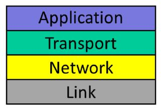

## 互联网和IP简介（The Internet and IP Introduction）

欢迎来到第一单元，这是你将学习大局以及一些细节的单元，你将学习互联网如何工作的基础知识，你甚至可以弄清楚我们中的哪个是Phil，哪个是Nick。我们希望帮助你理解为什么互联网是像现在这样设计的，它的一些优点和缺点，我们还将教你一些普遍接受的网络设计原则，例如**分层(layering)，封装(encapsulation)和分组交换(packet switching)**。

在本单元结束时，你应该能够回答诸如”什么是互联网？ 什么是互联网地址？“以及”万维网，Skype和Bit Torrent等应用”如何工作等问题，这些原则将帮助你在未来设计更好的网络。

在第一单元结束时，你应该熟悉称为四层模型的互联网，它描述了互联网如何分解为四个不同的层，你将了解这些层是什么，以及为什么它们是良好网络设计的基本原则：

你将了解互联网的四层是什么，以及它们如何协同工作，你将了解大多数应用程序使用称为**传输控制协议或TCP**的传输层以及某些应用程序如何使用该协议。你还将了解到互联网的工作原理是将数据分解成称为**分组(packet)**的小单元，例如，当你请求网页时，你的计算机向Web服务器发送一些分组，互联网决定这些数据分组如何到达正确的目的地。

本单元还详细研究了一个称为网络层的层。你可能听说过**IP，互联网协议**，它是以互联网命名的协议，因为它是让整个网络工作的粘合剂；你可以更改所有其他层，但是要使用互联网，你需要在网络层使用互联网协议。

你将了解互联网协议的作用以及它是如何做到的，你将了解**互联网协议地址(IP Address)**以及它们是如何分配的，你将了解互联网如何根据其互联网地址来决定分组应采用的路径。

最后，我们将向您展示一些软件工具，您可以使用这些工具检查计算机如何使用互联网。因此，你可以在下次浏览网页时将本单元所学的知识应用到其中！