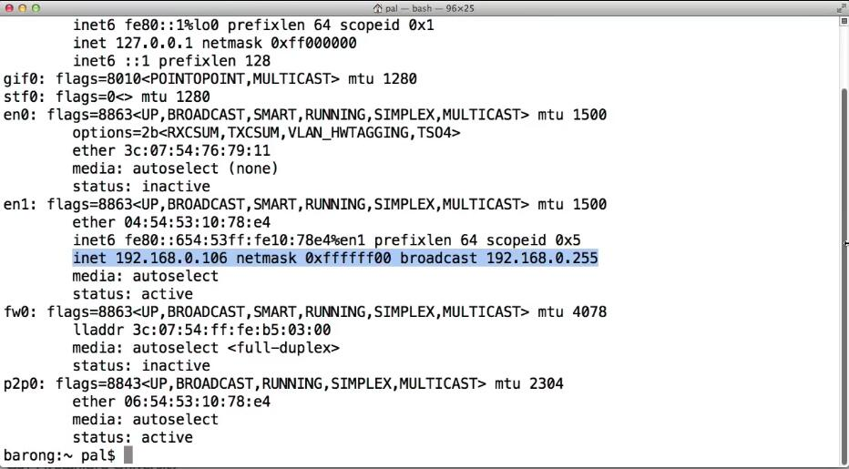
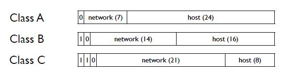

## IPv4地址(IPv4 addresses)

互联网协议(IP)允许两台计算机在一个由许多不同链路层构建的网络上交换信息，它通过地址来实现这点。一个IP分组有一个源地址和一个目的地址。路由器根据分组的目的地址决定将分组转发到哪个链路。让我们详细了解一下IPV4是什么样子的，它们是如何格式化的，以及它们是如何分配的。

### 因特网协议地址的目标

互联网协议的最初目标是将许多不同的网络拼接在一起。为了实现这一目标，协议需要一种独立于其所在网络的、独一无二的方式来指代一台计算机。因此，IBM网络上的计算机和通过串行线连接到路由器的计算机可以相互交谈，并且需要一种相互寻址的方法。

今天，IPv4地址比较复杂，由于一堆特殊情况和用途，它们不是完全唯一的，但现在让我们假设它们是唯一的。

### IPv4

一个IPv4地址可以识别互联网上的一个设备，即第三层（网络）的地址。IPv4的地址是32位长。这32位通常被写成4个8比特值，形式为a.b.c.d，例如171.64.64.64，128.30.76.82，以及12.22.58.30。每个通过IPv4连接的设备都有一个IP地址，IP层将目的地为该地址的分组传送给该设备。

除了地址，一个设备通常还有一个叫做**网络掩码**的东西。网络掩码告诉设备哪些IP地址是本地的，在同一链路上，哪些需要通过IP路由器。例如，无线网络上的一台笔记本电脑，为了向同一无线网络中的另一个设备发送分组，笔记本电脑不需要通过一个IP路由器。理论上，它可以直接将分组发送给其他设备，因为它处于同一链路上。

一个网络掩码被写成一串连续的1，从最高有效位开始。例如，一个255.255.255.0的网络掩码意味着前三个八位数都是1($$2^8-1=255$$)，最后一个八位数是0。这意味着与你的IP地址的前三个八位数，24位，相匹配的IP地址是在同一个网络中。255.255.252.0的网络掩码意味着网络掩码是22位，而255.128.0.0是9位网络掩码。

通过使用网络掩码对两台计算机的地址进行位AND运算，可以判断它们是否在同一网络中。如果所得的地址相等，它们就在同一个网络中。较小的网络掩码(较少的1)意味着较大的网络。

### 例子

让我们看看这在我的电脑上是什么样子。打开一个终端，使用ipconfig程序。我的电脑通过WiFi连接到互联网，这恰好是名为"en1"的链接。如果我们看一下"en1"里面的信息，我们可以看到我的IPv4地址是192.168.0.106，我的网络掩码是0xffffff00，这是十六进制的255.255.255.0。这意味着，如果我向以192.168.0开头的地址发送IP分组，我应该直接发送，但如果它不是以192.168.0开头，我需要通过路由器发送。

### 测验

$$
\begin{array}{llll}
\hline \text {Source} & \text {Destination} & \text {Netmask} & \text {Same Network?} \\
\hline 128.34 .1 .15 & 128.35 .1 .15 & 255.255 .0 .0 & \mathrm{False}\\
10.0 .1 .4 & 10.0 .1 .5 & 255.255 .255 .0 &\mathrm{True}  \\
10.0 .1 .4 & 10.0 .2 .5 & 255.255 .255 .0 &\mathrm{False} \\
171.64 .15 .33 & 171.64 .15 .5 & 255.255 .255 .224 & \mathrm{False} \\
171.64 .15 .33 & 171.19 .201 .2 & 255.0 .0 .0 &  \mathrm{True}\\
\hline
\end{array}
$$

这是一个测验。对于每个源、目标和网络掩码，标记目标是否与源位于同一网络中，让我们浏览一下答案：

- 第一行的答案是False，他们在不同的网络中。这两个地址的第二个八比特组不同，分别是34和35。如果我们使用网络掩码对两个地址进行位AND运算，则得到128.34.0.0和128.35.0.0，这两个地址是不同的。
- 第二行的答案是True，他们在同一个网络中。如果使用网络掩码对两个地址进行位AND运算，则在这两种情况下都得到10.0.1.0。
- 第三行的答案是False，他们在不同的网络中。因为它们的第三个八位组不同。源位于网络10.0.1.0中，而目标位于网络10.0.2.0中。
- 第四行的答案是False，它们在同一个网络中。想想最后一个字节。左边的地址是0x21。右边的地址是0x05。224是0xe0，即三位。由于源已设置此位，但目标未设置，因此它们不匹配。与网络掩码AND一起，源地址为171.64.15.32，而目标地址为171.64.15.0。
- 最后一行的答案是True。它们在第一个字节中匹配：当与网络掩码AND时，两者都是171.0.0.0。

### 地址结构(历史)

那么，IP地址是如何分配的呢？最初，它们被分成三类：A类、B类和C类。每类将IP地址分成两部分，即**网络(network)** 和**主机(host)** 。地址的网络部分表示一个管理域，如MIT、BBN或斯坦福大学。地址的主机部分表示该网络中的哪个设备。A类地址有一个前导0，7位网络(用于128个网络)和24位主机，因此可以覆盖1600万台计算机。B类地址有16位的主机，所以可以覆盖65,536台计算机。C类地址有8位的主机，所以可以覆盖256台计算机。

### 网络结构(如今)

虽然A、B、C类很简单，但我们很快发现它们不够灵活。例如，麻省理工学院和斯坦福大学都收到了第一批A类地址块之一——超过400万个地址。有一段时间，麻省理工学院会给每个宿舍提供相当于B级的服务——几百人有65000个地址！当IP地址很多的时候，这不是一个问题，但随着他们的使用增加，我们需要一个更好的分配政策。

一个有用的说明：斯坦福大学在1999年放弃了它的A类地址，麻省理工学院仍有它的。

今天，IPv4地址的结构被称为**CIDR** ，即**无类别域间路由**。CIDR允许前缀为任意位数，而不是只有8、16和24位的前缀。实际上，CIDR前缀定义的地址块的大小是2的幂。当我们谈论一个CIDR地址时，我们指的是它的网络掩码长度。因此，例如，当我们谈论一个"斜杠16"时，我们指的是一个长度为16的网络掩码。这个CIDR块描述了$$2^{32-16}=2^{16}$$个地址，即65,536。(171.64.0.0/16意味着171.64.0.0到171.64.255.255范围内的任何地址。)当我们谈论"斜杠20"时，我们指的是一个长度为20的网络掩码。这个CIDR块描述了$$2^{32-20}=2^{12}$$个地址，或者4096个地址。CIDR块是今天地址的结构、地址和管理方式。

斯坦福大学今天有5个$$\ / 16$$块，大约325,000个IPv4地址。

### IPv4地址分配

那么，IPv4地址是如何分配和管理的呢？有一个叫**IANA**的组织，表示**互联网号码分配局**。最终的权威机构是**ICANN**，即**互联网名称与数字地址分配机构**，ICANN将工作委托给IANA。

IANA将“斜杠8”描述的1600万个地址分配给**区域互联网注册管理机构(RIR)**。每个大陆都有自己的RIR。美国的RIR是ARIN，而西太平洋的RIR是APNIC。这些RIR各自有自己的政策，如何将“斜杠8”分成更小的地址块，并将它们分配给需要它们的各方。

你可能已经在新闻中读到，我们已经用完了IP地址。这并不是真的——今天有许多未使用的地址。真正发生的事情是，IANA已经没有“斜杠8”的地址可供分配了，达到了一个特殊的终点。当减少到最后5个“斜杠8”时，IANA把一个“斜杠8”给了每个RIR。现在，地址管理和分配是由RIR决定的。2012年，时任互联网架构委员会成员的Jon Peterson在斯坦福大学发表了一篇关于这引起的一些政治、经济和技术问题的演讲。该讲座不是本课程的必修材料，但我强烈推荐。

### 小结

现在你已经看到了IPv4地址的结构，它们是如何被分配的，以及终端主机是如何做出第一跳路由决定的，也就是说，是发送至本地节点还是其网关路由器。今天的地址是以CIDR块来管理和分配的，其大小由前缀长度决定。一个较短的前缀，例如/8，比一个较长的前缀，例如/10是一个更大的块。