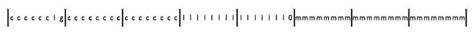

## IPv6地址(IPv6 addresses)

另一种IP地址是互联网协议版本6或IPv6。


### 互联网协议地址的目标

因此，记得IPv4地址的目的最初是允许你把多个不同的网络连接在一起，所以私人提供这种全球唯一的标识符，可以在许多不同的网络中使用。但是最近出现的一个问题是，IPv4地址空间只有32位，所以大约只有40亿($2^{32}$)个IPv4地址。在互联网只有60个节点的时候，这似乎是巨大的，但今天它实际上是一个限制因素。

一般来说，由于各种原因，任何种类的网络方案(例如看电话网络)的利用率永远不会是100%。实际上IPv4地址空间的利用率大约是35%，即我们只有35%的IPv4地址在任何时候都是活跃的。

这里的挑战是，如果你没有IPv4地址，那么你就没有办法和IPv4通信，因此你需要一个IPv4地址来进行IPv4通信；同样对等方也需要一个地址来发送IP数据包。


### 互联网协议，第6版(IPv6)

这种IPv4地址的稀缺性加上人们在IPv4上看到的一些不好的性质，使得人们在1994年开发新版本的互联网协议，称为IPv6或互联网协议版本6。

IPv6的基本协议是在1998年发布的，RFC 2460。随后第一次互联网泡沫发生，IPv4的地址空间并没有接近枯竭，所以工作沉寂了一段时间，但是人们兴趣却在增加。

然后在2003-2006年间，人们开始更好地了解IPv4网络面临的挑战：什么是重要的，什么是不重要的，我们应该如何根据目前的工作利用率和设计来使用IPv6地址。

因此，今天在互联网工程任务组(IETF)和一些政府内部实际上正在大力推动采用IPv6。你可以想象，特别是那些连接增长非常快的国家或地区，比如说在中国，IPv4地址的稀缺性可能是一个更大的问题。

所以今天有一个很大的推动力，让IPv6在整个互联网上部署和使用。那么，一个IPv6地址是什么样子的呢？


### 地址结构

IPv6的数量没有被限制为$2^{32}$，因为有128位地址，所以总数为$2^{128}$，大约是$3.4\times 10^{34}$。这意味着你可以在世界表面的每平方英寸上有21个IPv6地址。因此，至少在一个IPv6地址将命名一个设备的想法下，只要我们在每平方英寸上有少于21个设备，我们就能在地球上坚持下去。

当然，这些地址的用途很可能不止于此，但一般来说，一个IPv6地址被分成两部分，有子网前缀，比如长度为$n$的子网，以及$128-n$的接口ID(RFC 4291)：


你应该不想把128位地址写成16个小八位数，加上经常有大面积的零和重复，所以IPv6地址的写法与IPv4不同。IPv4是写成一系列简单的.分隔，IPv6地址用十六进制写成八个16位的区块，例如

```
2001:470:806d:1:0:0:0:9
```

如果你有连续的零，你可以用冒号省略，所以上面的IPv6地址可以写为：

```
2001:470:806d:1::9 prefixlen 64
```

这里的prefixlen 64，表示子网前缀长度是64，后64位表示节点的实际地址。

你也可以在http和url中使用IPv6地址，比如在你的web浏览器中，你可以通过把它放在括号中来实现：

```
http://[2001:470:806d:1::9]:80
```

如果你想把低32位写成IPv4地址也是可以的，因为这是使IPv4地址可以从IPv6寻址的一个方法：即有一个前导96位表示这是IPv4地址，然后将IPv4地址追加在后续：

```
64:ff9b::171.66.3.9
```


### IPv6地址的分配

所以我们有128位地址，这我们在互联网上添加更多的设备，那么，你该如何分配它们呢？对于IPv4有IANA，ICANN和RIR。RIR发放/8的1600万个地址块，并根据要求将它们分配给公司或组织或其他。

事实证明，随着人们获得了更好的经验和改进，分配IPv6地址的方式实际上已经经过了几次迭代。

举两个例子，RFC 3177和RFIC 6177。

RFC 3177：

一般会给/48，有时会给/64，很少给/128。即一般我们会得到48位的子网前缀，80位的接口ID；有时我们会得到64位的子网前缀，64位的接口ID；偶尔会有得到128位的子网前缀，此时只有0位接口ID。经过多年的经验，RFC 3177不是一个好主意。

RFC 6177：

RFC 6177说至少给出/64对应的接口ID数量，所以可以给/64, /60, /56，但是不能给/128。当你去一个地区的互联网注册处，向他们要一个地址块时，他们会问需要多少地址数量，假如你的数量是512，他们会决定是否给你/23。


### 示例方法(RFC 4291)

我们实际上如何获得一个IPv6地址呢？所以如果你了解DHCP，你知道你需要请求IPv4地址。但IPv6地址空间空间太大了，你可以做一些比它(DHCP)简单得多的事情。

所以，如果你有一个64位的子网，所以你的组织有/64。64位的子网标识符是网络标识符，然后，你可以仅从此子网标识符自动生成自己的IPv6地址，这需要使用以太网地址。

以太网设备有48位唯一标识符，这是它的第2层地址标识，这在制造时指定，如今如果你想的话，通常可以改变它。以太网卡看起来像这样：


c表示制造商代码，m表示分配值，对于单播MAC地址，g是0。这些代码(前24位)是组织提供的，然后当组织需要代码时，那么就可以使用较低的24位来生产1600万个代码。

所以你要做的就是把这个48位以太网地址进行转换：在前24位和后24位中间添加`0xfffe`，翻转前24位g为0的部分。



所以，现在如果我知道组织的64位子网ID为$X$，以太网地址为$Y$，那么IPv6地址为$X f(Y)$，其中$f$为之前描述的变换。

总体来说，大量的地址给了我们很多灵活性，可以简化管理，可以简化配置，这是IPv6的优势。

这部分内容在RFC 4291中被指定。

