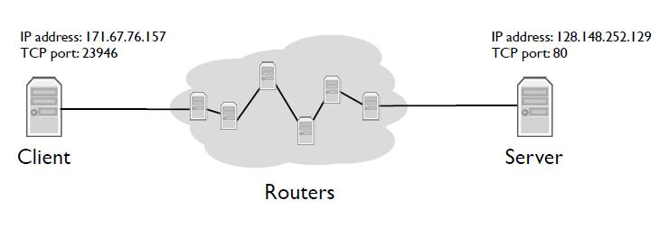
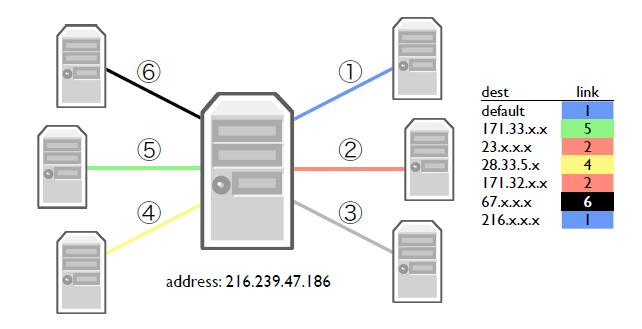
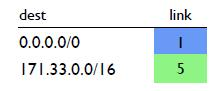
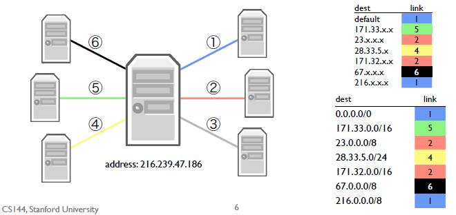
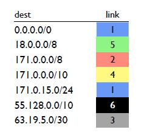

## 最长前缀匹配(Longest prefix match(LPM))

互联网路由器可以有许多链路。它们有许多选项来选择转发一个收到的分组的方向。为了选择转发分组的链路，今天的路由器通常使用一种称为**最长前缀匹配**的算法。

### 流内部

在这个例子中，客户端希望在端口80(web服务器的典型端口)上打开与服务器的TCP连接。建立连接和传输数据的分组在客户端和服务器之间需要经过很多跳。在分组的每一跳上，路由器决定通过哪个链路转发分组。

### 每一跳内部

路由器是如何做出这一决定的？它是通过一个叫做**转发表**的东西来实现的，如上图所示。一个转发表由一组部分IP地址组成。x表示这些地址是部分的，具体来说，x代表通配符。例如，第二个条目171.33.x.x表示"任何第一个字节是171，第二个字节是33的IP地址"。例如，这个特定条目包括171.33.5.245以及171.33.1.1。

当一个分组到达时，路由器会检查哪个转发表项与该分组最匹配，并沿着与该转发表项相关的链路转发该分组。我所说的"最佳"，是指最具体的。默认路由是匹配全部IP的通配符——它匹配每一个IP地址。如果当一个分组到达时，没有比默认路由更具体的路由，那么路由器将只使用默认路由。

### 最长匹配

**最长前缀匹配(LPM)**，是IP路由器用来决定如何转发分组的算法。每个路由器都有一个转发表。这个转发表的条目有两部分：描述一个地址块的CIDR条目，以及匹配该CIDR条目的分组的下一跳。一个地址可能属于多个CIDR条目。

例如，在上边这个路由表中，有两个条目，一个是默认路由，它的前缀长度为0，另一个是171.33.0.0/16。默认情况下，所有分组都会通过链路1。然而，如果分组目标地址的前16位与171.33相匹配，路由器将通过链路5发送它。这是因为16位的前缀比0位的前缀长，它更具体。

### 每一跳内部(实际)

让我们回到先前的例子，在那里我们展示了一个用x表示通配符的转发表，这里是路由器和它的转发表。

如果我们将这个转发表表示为CIDR条目，它就是这个样子。因为在这个简单的示例中，所有前缀都是以字节为单位的，所以所有前缀的长度都是0、8、16或24位。

### 测验

在下侧的转发表中，使用最长前缀的路由器将通过哪个链路发送具有以下IP目标地址的分组？

- 对于A，63.19.5.3，答案是链路3。63.19.5.3匹配两个前缀：默认路由和前缀63.19.5.0/30。前缀长度为30位，63.19.5.3仅在最后两位不同，/30是比/0长的前缀，因此路由器将选择链路3。
- 对于B，171.15.15.0，答案是链路4。171.15.15.0匹配三个条目。它与默认路由，171.0.0.0/8和171.0.0.0/10匹配。它与171.0.15.0/24不匹配，因为B的第二组八位数字是15，而不是0。第三个匹配项171.0.0.0/10是最长的前缀，因此路由器沿链路4发送分组。
- 对于C，63.19.5.32的答案是链路1。最长前缀匹配是默认路由。它与63.19.5.0/30不匹配，因为它在第26位不同。
- 对于D，44.199.230.1，答案是链路1。匹配的最长路径前缀为默认路径。
- 对于E，171.128.16.0，答案是链路2。此地址匹配两个前缀，默认路由和171.0.0.0/8。它与171.0.0.0/10不匹配，因为它在第9位不同。171.0.0.0/8是最长的前缀，因此路由器将在链路2上转发分组。

