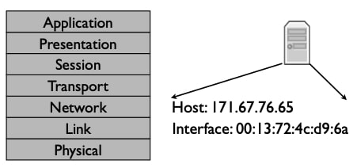
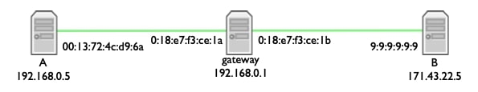
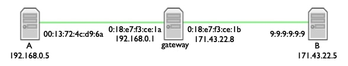
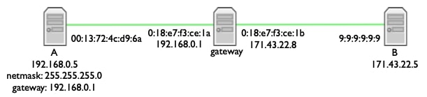
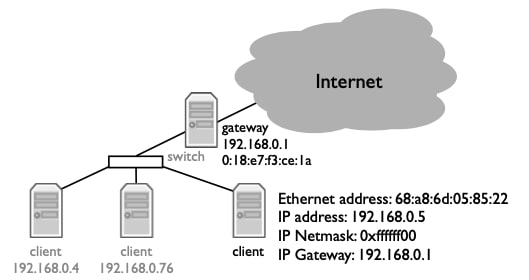
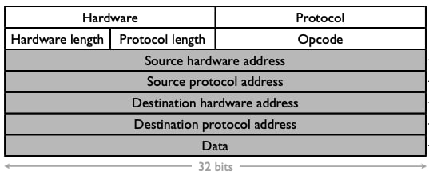

## 地址解析协议(Address Resolution Protocol)

**地址解析协议(ARP)** ，是网络层发现与它直接连接的网络地址相关的链路地址的机制。换句话说，它是一个设备如何获得如下问题的答案："我有一个IP分组，它的下一跳是这个地址——我应该把它发送到哪个链路地址？"

### 地址层

之所以需要ARP，是因为每个协议层都有自己的名称和地址。IP地址是一个网络层的地址：它描述了一个主机，一个网络层的唯一目的地。相比之下，一个链路地址描述了一个特定的网卡，一个发送和接收链路层帧的独特设备。例如，以太网有48位地址。每当你买了一块以太网卡，它就已经被预设了一个独特的以太网地址。因此，一个IP地址说的是“这个主机”，而一个以太网地址说的是“这个以太网卡”。

### 寻址问题

48位以太网地址通常写成以冒号为界的6个八位二进制数，以十六进制书写，如源地址为0:13:72:4c:d9:6a，目的地址为9:9:9:9:9:9。

有一件事可能会让人困惑，虽然这些链路层和网络层的地址在协议层方面是完全解耦的，但在分配和管理方面，它们可能不是这样。例如，一台主机拥有多个IP地址是很常见的，每个接口都有一个。因为有了网络掩码的概念，它需要这样做。例如，请看这个假想的情形。网关在中间，有单一的IP地址：192.168.0.1。它有两个网卡，一个连接到目的地171.43.22.5，一个连接到源192.168.0.5。

192.168.0.1与171.43.22.5在同一个网络中所需要的网络掩码是128.0.0.0，或者说只有一个比特的网络掩码! 但不可能所有第一位为1的IP地址都与171.43.22.5在同一个网络中——例如，192.168.0.5需要通过网关到达。

### 寻址例子

因此，我们经常看到这样的设置，即网关或路由器有多个接口，每个接口都有自己的链路层地址来识别该网卡，也有自己的网络层地址来识别该网卡所在网络中的主机。对于网关来说，左边的接口有IP地址192.168.0.1，而右边的接口有IP地址171.43.22.8。

链路层和网络层地址在逻辑上是解耦的，但在实践中是耦合的，这在某种程度上是一个历史遗留问题。当互联网的初期，有许多链路层，它(指互联网)希望能够在所有的链路层之上运行。这些链路层不会突然开始使用IP地址而不是他们自己的寻址方案。此外，事实证明，在很多情况下，拥有一个独立的链路层地址是非常有价值的。例如，当我在斯坦福大学的网络上注册一台计算机时，我注册了它的链路层地址——即网卡的地址。

### 封装

那么，这在实际中是什么意思呢？假设左边的节点A想向右边的节点B发送一个分组。它生成一个源地址为192.168.0.5、目的地址为171.43.22.5的IP分组。

节点A检查目的地址是否在同一网络中。网络掩码255.255.255.0告诉它，目的地址在一个不同的网络中。这意味着节点A需要通过网关，即192.168.0.1发送分组。为此，它发送一个分组，其网络层目的地是171.43.22.5，但其链接层目的地是网关的链路层地址。所以这个分组的网络层目的地是171.43.22.5，链路层目的地是0:18:e7:f3:ce:1a。网络层源地址是192.168.0.5，链路层源地址是0:13:72:4c:d9:6a。

所以我们有一个从A到B的IP分组，被封装在一个从A到左边网关接口的链路层帧内。当分组到达网关时，网关查找下一跳，确定它是节点B，并将IP分组放在通往B的链路层帧内。因此，从A到B的第二个IP数据包位于从右网关接口到B的链路层内。

### 示例问题

因此，在这里我们得到了ARP解决的问题。我的客户端知道它需要通过IP地址为192.168.0.1的网关发送一个分组。然而，要做到这一点，它需要有与192.168.0.1相关的链路层地址。它如何获得这个地址呢？我们需要以某种方式将第三层(网络层)地址映射到其相应的第二层(链路层)地址。我们用一个叫做ARP的协议来做这件事，也就是地址解析协议。

### 地址解析协议(ARP)

ARP是一个简单的请求—回复协议。每个节点都保留了一个从其网络上的IP地址到链路层地址的映射的缓存。如果一个节点需要向它没有映射的IP地址发送一个分组，它就会发出一个请求。"谁有网络地址X？"拥有该网络地址的节点回应说："我有网络地址X。"响应包括链路层地址。收到响应后，请求者可以生成映射并发送分组。

为了使每个节点都能听到请求，节点会向链路层广播地址发送请求。网络中的每个节点都会听到该分组。

此外，ARP的结构使其包含多余的数据。请求包含请求者的网络和链路层地址。这样，当节点听到请求时(因为它是广播的)，它们可以在其缓存中插入或刷新映射。节点**只**对自己的请求作出回应。这意味着，假设没有人错误地生成分组，你可以为另一个节点生成映射的唯一方法是响应该节点发送的分组。因此，如果该节点崩溃或断开连接，则当所有缓存映射到期时，其状态将不可避免地离开网络。这使得ARP的调试和故障排除变得更加容易。

那么，这些动态发现的映射能持续多长时间？这取决于设备：例如，某些版本的Mac OSX将它们保留20分钟，而某些思科设备使用4小时的超时时间。我们的假设是，这些映射不会非常频繁地变化。

ARP的作用小结：

- 生成第2层和第3层地址之间的映射
  - 节点缓存映射、缓存项过期
- 简单请求—应答协议
  - “谁有网络地址X？”
  - “我有网络地址X。”
- 请求发送到链路层广播地址
- 回复发送到请求地址(非广播)
- 分组格式包括冗余数据
  - 请求有足够的信息来生成映射
  - 使调试更加简单
- 无状态“共享”：坏状态最终会消失

### ARP分组格式(RFC826)

这就是ARP分组的实际样子。它有10个字段。硬件(Hardware)字段说明这个请求或响应是针对哪个链路层的。协议(Protocol)字段说明这个请求或响应是针对什么网络协议的。硬件地址/协议长度(Hardware/Protocol length)字段规定了链路层和网络层地址的字节数。操作码(Opcode)指定该分组是请求还是响应。

四个地址字段是用来请求和指定映射的，请注意，这些灰色字段的长度可变，由length字段确定。

记住，所有这些字段都是按网络顺序存储的，或者说是大端序。因此，如果我有一个15的操作码，它将在操作码字段中被存储为0x000f。

ARP的全部细节在IETF Request for Comments, RFC, 826中，这里我只介绍一个简单的请求/响应交换。

### ARP请求

因此，假设我们的客户端想通过其网关向更广泛的互联网发送一个分组。但它没有网关的以太网地址。

客户端将生成一个ARP请求包，其链路层源地址是其地址：68:a8:6d:05:82:22。目的链路层地址是广播地址：ff:ff:ff:ff:ff:ff:ff。

ARP请求将指定硬件是以太网，值为1，协议是IP，值为0x0800，硬件地址长度为6，协议长度为4。操作码是请求，其值为1。ARP源硬件字段将是请求者的以太网地址，68:a8:6d:05:85:22。源协议字段是请求者的IP地址，192.168.0.5。目的硬件地址可以设置为任何内容——它是分组试图发现的内容。目标协议地址是客户端尝试为其查找映射的地址：192.168.0.1。客户端在以太网上发送这个帧。网络中的每个节点都会收到它，并刷新其链路地址68:a8:6d:05:85:22和网络地址192.168.0.5之间的映射，如果没有映射，则插入一个映射。

### ARP响应

网关看到请求是针对其IP地址的，因此会生成回复。

与请求一样，ARP回复将指定硬件是以太网，值为1，协议是IP，值为0x0800，硬件地址长度为6，协议长度为4。操作码将是回复，其值为2。

ARP源硬件字段将是回复者的以太网地址，0:18:e7:f3:ce:1a。源协议字段是：192.168.0.1。目标硬件地址是请求的源硬件地址：68:a8:6d:05:85:22。目标协议地址是请求的源协议地址：192.168.0.5。

你把响应发给哪个链路层地址是个开放性问题。最初的ARP规范说，回复者应该把它发送到请求者的链路层地址，所以是单播。然而，现在普遍的做法是广播，因为如果映射需要改变，这样做可以更积极地替换缓存条目。节点还可以发送所谓的免费ARP数据包，请求不存在的映射，以便在网络上公布自己。

### 小结

因此，我们已经看到，为了路由分组，人们需要能够将网络层地址映射到链路层地址。地址解析协议，即ARP，通过一个简单的请求—回复交换来提供这种服务。如果一个节点需要向或通过一个它没有链路层地址的IP地址发送分组，它可以通过ARP请求该地址。