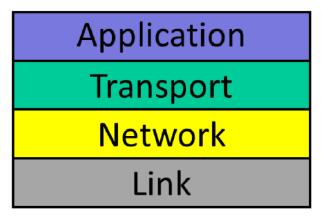

## 互联网和IP回顾(The Internet and IP Recap)

在本单元中，我们学习了一些关于互联网如何工作的基本知识。你了解了web浏览器和Skype等应用程序的工作原理、应用程序如何使用Internet以及Internet的基本结构。你了解了网络的一些基本架构原则。也许现在你已经知道我们中哪个是菲尔，哪个是尼克。

现在你已经完成了第一单元的学习，你应该非常熟悉这张互联网4层模型的图片。你现在知道互联网被分解成四个不同的层，这四个层是什么，以及它们是如何一起工作的。但比起它是如何工作的，你更希望了解它为什么这样工作，以及为什么分层在所有网络中都是一个好主意，而不仅仅是互联网。

你现在已经看到，互联网的工作方式是将数据分解成称为分组的小单元。当你请求一个网页时，你的电脑会向网络服务器发送一些分组。互联网决定了这些小数据块如何到达正确的目的地，以及web服务器如何响应包含页面的分组，并正确地发送给你。

你已经了解了在封装的体系结构原则中，分层和分组这两个体系结构原则是如何结合在一起的。封装是如何让各层以简洁的方式使用分组的方式，从而每一层对分组的使用都独立于其他层。我们将在后面的单元中再谈一些架构原则。

### 你学到了什么

在本单元中，我们主要学习了四个主题：

1. 应用程序如何使用互联网：你了解到，大多数应用程序希望在两个或多个终端之间通过可靠的双向字节流进行通信。
2. 互联网的结构：你学会了什么是4层模型，以及每层的责任。你还了解到为什么我们每次在互联网上发送分组时都使用互联网协议或"IP"，以及为什么我们称IP为互联网的"细腰"。
 3. 互联网协议(IP)：由于IP是如此重要，我们花了几个视频来描述IP为我们做了什么，以及它是如何工作的。到目前为止，我们把重点放在IPv4上，因为它是当今使用最广泛的IP版本。你了解到IP地址，路由器如何查找IP地址等等。
4. 基本架构思想和原则：你已经学习了网络的三个基本原则，它们都与我们对互联网的理解非常相关：
   1. 第一是分组交换，这是一种简单的方式，数据被分解成独立的信息包，根据报头的信息逐跳转发。
   2. 第二是分层，我们已经提到过了。
   3. 第三是封装，即把在一层处理的分组放在下面的分组内的过程。这有助于明确区分数据在层次结构中每一层的处理方式。

### 这对你有什么帮助

你现在应该对互联网的基本结构和三个基本的架构理念有了很好的了解。你了解像你的网络浏览器这样的应用程序是如何工作的，以及互联网是如何在两台计算机之间传递分组的。你以前可能听说过TCP/IP这个术语：现在你知道什么是TCP，什么是IP，以及为什么它们是相关的。乍一看，这些可能看起来像琐碎的、低层次的细节。但事实证明，它们是互联网的基石。每年，互联网的新应用和新用途都在涌现。但所有这些都使用你正在学习的这些基本原则，而且几乎所有这些都使用TCP/IP。通过从这些基本原理入手，你将学习到即使在我们进入5G无线网络、Web3.0和物联网时也会继续重要的知识。

这是令人兴奋的一部分。互联网和它所能做的总是在扩大和变化。但在整个演变过程中，有一些核心思想和原则是不变的。通过学习它们，你不仅知道互联网和网络今天是如何运作的，而且很可能知道它们在20年后将如何运作。