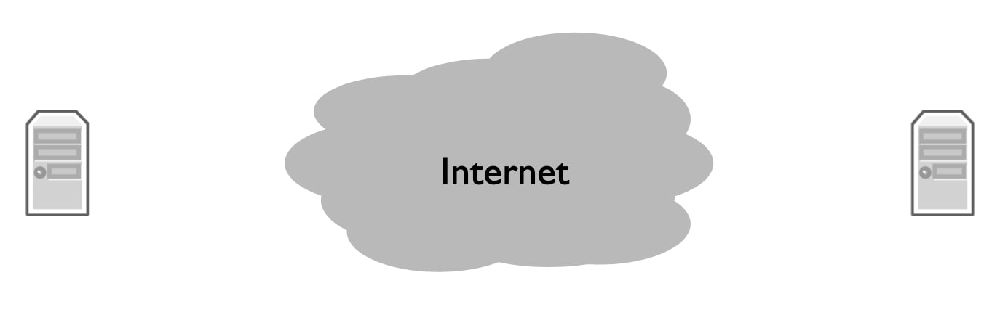
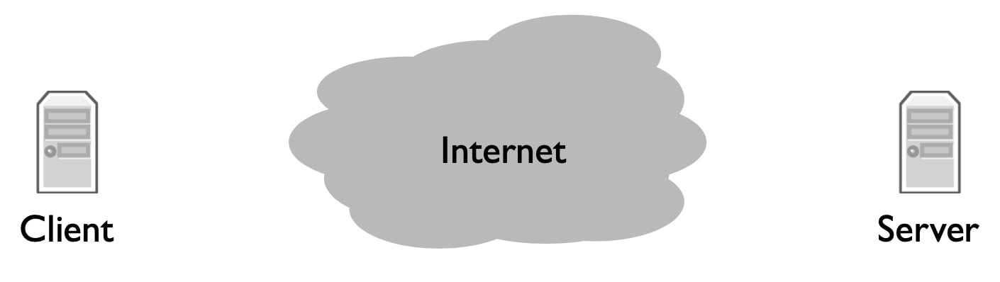
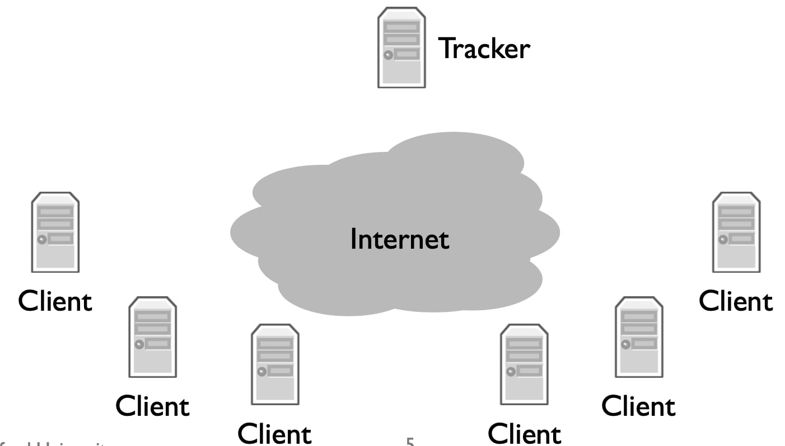
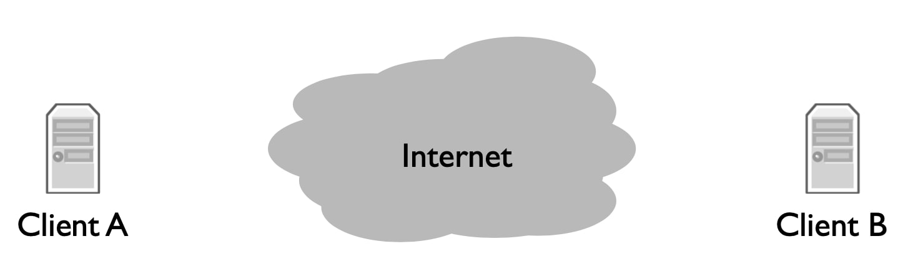
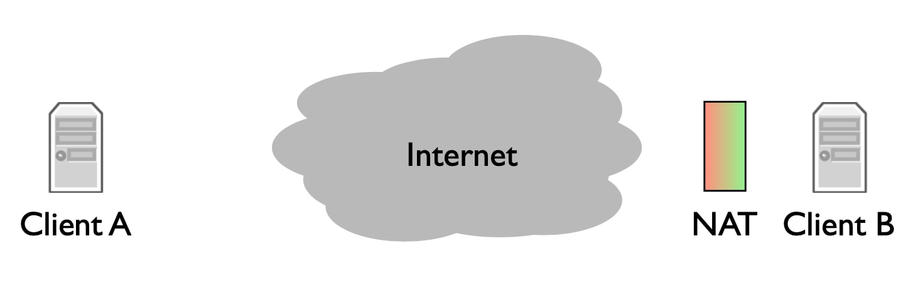
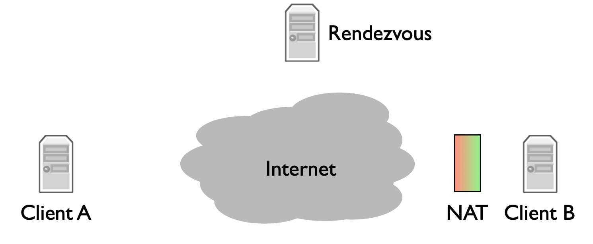
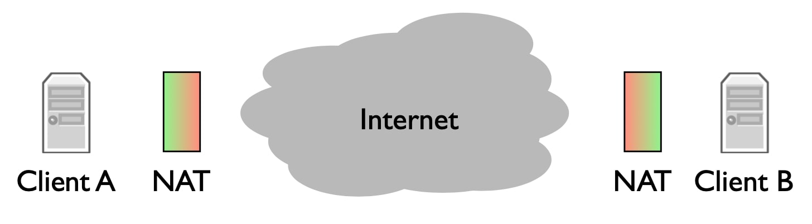
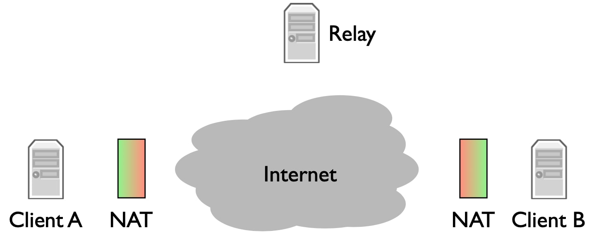

## 应用程序生命中的一天(A day in the life of an application)

最终让网络变得有趣的是使用它们的应用程序，互联网设计的主要贡献者之一大卫克拉克(Dave Clark)曾经写道，“当前网络的指数增长似乎表明，**连通性**本身就是一种回报，它比邮件或万维网等任何个人应用程序都更有价值。”**连通性**是指世界不同地区的两台计算机可以相互连接并交换数据。如果你将计算机连接到互联网，你就可以与互联网上连接的所有其他计算机通话(至少可以和那些想和你谈谈的人通话)。让我们看看这到底意味着什么，以及一些现代应用程序——万维网、Skype和BitTorrent——是如何使用它的。

### 网络应用

网络应用程序的巨大威力在于，你可以拥有多台计算机，每台计算机都有自己的私有数据，它们可能由不同的人拥有和控制，同时它们可以交换信息。本地应用程序只能访问驻留在本地系统上的数据；与此不同的是，网络应用程序可以在全球范围内交换数据。例如，考虑使用web浏览器阅读杂志。出版商运行的服务器包含所有杂志文章，也可能包含过去发行的所有文章。随着文章的更正或添加，你可以立即看到更新的版本和内容。整个后台文章目录多到无法下载，因此你可以按需加载它们。如果你没有网络，那么你需要有人给你发一张最新版本的DVD或U盘。

### 字节流模型

所以基本模型是，你有两台计算机，每台计算机在本地运行一个程序，这两个程序通过网络进行通信。最常用的通信模型是**双向、可靠的字节流**。运行在计算机A上的程序A可以写入数据，然后通过网络传输，这样运行在计算机B上的程序B就可以读取数据。类似地，程序B可以写入程序A可以读取的数据。还有其他通信模式，我们将在本课程后面讨论，但可靠的双向字节流是目前最常见的一种。

让我们看看这是什么样子。

右边的计算机B正在等待其他计算机连接到它。例如，它可能是一个web服务器。左边的计算机A想要与B通信。这个例子中，它(A)是一部运行web浏览器的手机。A和B建立了一个连接。现在，当A向连接写入数据时，它通过网络传输，B可以读取数据。类似地，如果B向连接写入数据，则该数据通过网络传输，A可以读取该数据。任何一方都可以关闭连接。例如，当web浏览器完成从web服务器请求数据时，它可以关闭连接。同样，如果服务器愿意，它也可以关闭连接。如果你曾经在web浏览器中看到一条错误消息，上面写着“由对等方重置连接”(“connection reset by peer”)，那么其含义是：web服务器在web浏览器不希望连接时关闭了连接。当然，服务器也可以拒绝连接：你可能会看到连接被拒绝的消息，或者让浏览器等待很长时间，因为服务器没有拒绝响应。

在本课程的后半部分，你将了解到这一工作的所有细节；现在，让我们只从应用的角度来考虑它，即通过网络在两个程序之间可靠地读和写数据的能力。

### 万维网(HTTP)

现在我们已经了解了网络应用程序通信的基本方式，让我们看一下我们的第一个示例：万维网(world wide web)。万维网使用一种叫做HTTP的协议工作，HTTP代表超文本传输协议。当你在浏览器中看到`http://`时，这意味着它正在使用http进行通信。我们将在本课程后面介绍应用程序时更深入地了解HTTP的细节。现在，我将给出一个非常高层次的概述。

在HTTP中，客户端打开与服务器的连接并向其发送命令。最常见的命令是GET，它请求一个页面。HTTP被设计成以文档为中心的程序通信方式。例如，如果在我的浏览器中输入入[http://www.stanford.edu/](http://www.stanford.edu/) ，浏览器打开与服务器[www.stanford.edu](www.stanford.edu)的连接，并发送站点根页面的GET请求。服务器接收请求，检查请求是否有效，用户是否可以访问该页面，并发送响应。响应有一个与之关联的数字代码。例如，如果服务器向GET发送200 OK响应，这意味着请求已被接受，响应的其余部分包含文档数据。在[www.stanford.edu](www.stanford.edu)网页的示例中，200 OK响应将包括描述斯坦福主页的超文本。还有其他类型的请求，如PUT、DELETE和INFO，以及其他响应，如400错误请求。

因为HTTP是以文档为中心的，所以客户端请求一个文件命名。HTTP都是ASCII文本：它是人类可读的。例如，Stanford的GET请求的开头如下所示：GET/HTTP/1.1。对成功请求的响应的开始如下所示：HTTP/1.1 200 OK。

但基本模型很简单：客户端通过向连接写入请求来发送请求，服务器读取请求，对其进行处理，并向连接写入响应，然后客户端读取响应。

### BitTorrent

让我们看看第二个应用程序BitTorrent。BitTorrent是一个允许人们共享和交换大型文件的程序。与客户端从服务器请求文档的web不同，在BitTorrent中，客户端从其他客户端请求文档。BitTorrent将文件分解成称为片段的数据块，这样单个客户端就可以并行地请求其他多个客户端。当一个客户端从另一个客户端下载一个完整的片段时，它会告诉其他客户端它有这个片段，这样他们也可以下载它。这些协作客户端的集合称为**文件共享组(swarm)**。所以我们总说客户端加入或离开文件共享组。

BitTorrent使用与万维网完全相同的机制：可靠的双向数据流。但使用的方式稍微复杂一些。当客户端想要下载一个文件时，它首先必须找到一个叫做torrent文件的东西。通常，你可以通过万维网找到它，然后通过HTTP下载。此torrent文件描述了有关要下载的数据文件的一些信息。它还告诉BitTorrent谁是该torrent的**跟踪器(tracker)**。跟踪器是一个节点，它跟踪(因此得名)哪些客户端是文件共享组的成员。要加入torrent，你的客户端再次通过HTTP与跟踪器联系，以请求其他客户端的列表。你的客户端打开与其中某些客户端的连接，并开始请求文件片段。反过来，这些(被连接的)客户端同样可以请求片段。此外，当一个新客户端加入文件共享组时，追踪器可能会告诉这个新客户端已连接到你的客户端。因此，你有一个密集的客户端之间的连接图，动态地交换数据，而不是一个客户端和一个服务器之间的单一连接。

### Skype

对于我们的第三个也是最后一个应用程序，让我们看看Skype，一种流行的语音、聊天和视频服务。Skype是一个专有系统，它没有任何关于其内部工作方式的官方文档。2008年，哥伦比亚大学(Columbia)的一些研究人员主要通过查看Skype客户端在何时何地发送消息来了解它的工作原理。不过，这些消息是加密的，所以它们无法查看内部。然而，2011年，Efim Bushmanov对该协议进行了反向工程，并发布了开源代码，现在我们对协议的工作原理有了更好的了解。

#### 基本情形

在最简单的模式下，当你想在Skype上呼叫某人时，它是一个简单的客户端——服务器交换，有点像HTTP。你，即呼叫方，打开与收件人的连接；如果对方接听你的电话，你将开始交换语音、视频或聊天数据。

在某些方面，这看起来像万维网的例子：一方打开与另一方的连接，然后交换数据。但与web不同，web有一个客户端和一个服务器，在Skype的情况下，你有两个客户端。因此，与其让个人计算机从专用服务器请求某些内容，不如让两台个人计算机相互请求数据。这种差异对Skype的工作方式有很大的影响。

#### NAT

这种复杂性来自一种称为**NAT**或**网络地址转换器(Network Address Translato)**的东西。今天到处都是NAT：小型家庭无线路由器是NAT；当手机连接到互联网时，它就在NAT后面。

我们将在本课程后面更详细地介绍它们，但现在你需要知道的是，如果你在NAT后面，那么你可以打开到Internet的连接，但是Internet上的其他节点无法轻松打开到你的连接。在本例中，这意味着客户端B可以自由地打开到其他节点的连接，但其他节点很难打开连接。这就是这个红绿色梯度所显示的：来自绿色端的连接可以正常工作，但来自红色端的连接不行。

因此，这里的复杂之处在于，如果客户端A想要呼叫客户端B，它就无法打开连接。Skype必须解决这个问题。

#### Rendezvous

Skype使用一种叫做**集合服务器(rendezvous server)**的东西来解决之前的问题。当你登录Skype时，你的客户端将打开与控制服务器网络的连接。在这种情况下，客户端B打开到集合服务器的连接。这很好，因为服务器不在NAT后面，客户端B可以毫无问题地打开连接。

当客户端A呼叫客户端B时，它会向集合服务器发送一条消息。由于服务器与客户端B有一个打开的连接，它告诉B有来自A的呼叫请求。呼叫对话框会在客户端B上弹出。如果客户端B接受呼叫，则会打开与客户端A的连接。客户端A试图打开与客户端B的连接，但由于B在NAT后面，因此无法打开。因此，它向客户端B已经连接到的计算机发送一条消息，然后请求客户端B打开与客户端A的连接。由于客户端A不在NAT后面，此连接可以正常打开。这称为**反向连接**，因为它反转了启动连接的预期方向：客户端A正试图连接到客户端B，但客户端B打开了到客户端A的连接。

这在Skype中发生，因为Skype客户端通常是个人计算机。公开访问的web服务器很少支持NAT：由于你希望Internet上的每个人都能访问服务器，因此将其置于NAT之后是一个坏主意。因此，打开与web服务器的连接很容易。然而，出于安全和其他原因，个人计算机往往在NAT之后。因此，Skype必须结合一些新的通信模式来解决这些问题。

#### 更复杂的情形

那么，如果两个客户端都支持NAT，Skype会怎么做？我们无法反向连接。客户端A无法打开到客户端B的连接，客户端B无法打开到客户端A的连接。

为了处理这种情况，Skype引入了第二种服务器，称为**中继(relay)**。中继服务器不能在NAT后面。如果客户端A和客户端B都在NAT后面，则通过中继进行通信。它们都打开了与中继服务器的连接。当客户端A发送数据时，中继服务器通过客户端B打开的连接将数据转发给客户端B。类似地，当客户端B发送数据时，中继服务器通过客户端A打开的连接将数据转发给客户端A。

### 总结

总的来说，我们看到了网络应用程序最常见的通信模型：可靠的双向字节流。这允许在不同计算机上运行的两个程序交换数据。它将整个网络抽象为一个简单的读/写关系。

虽然这是一个非常简单的通信模型，但它可以以非常创新和复杂的方式使用。我们看了3个例子：万维网、BitTorrent和Skype：

- 万维网是一种客户端—服务器模式：客户端打开与服务器的连接并请求文档，服务器用文档进行响应。
- BitTorrent是一种点对点模式，成群结队的客户端相互打开连接以交换数据片段，从而创建一个密集的连接网络。
- Skype是两者的混合体：当Skype客户端可以直接通信时，它们以点对点的方式进行通信；但有时客户端无法直接打开连接，因此只能通过集合服务器或中继服务器。

因此，你可以看到看起来非常简单的抽象，一个双向的、可靠的数据流，可以以许多有趣的方式使用。通过改变程序打开连接的方式以及不同程序的功能，我们可以创建复杂的应用程序，从文档检索到大量下载，再到IP电话。例如，BitTorrent中的跟踪器具有与客户端截然不同的数据和角色，正如Skype除了客户端之外还具有中继和集合服务器。

当然，互联网正在不断发展。谁知道下一个令人惊叹的新应用程序是什么？虽然它可能具有与这三种不同的通信模式，但它几乎肯定会在某些新配置中使用双向、可靠的字节流。