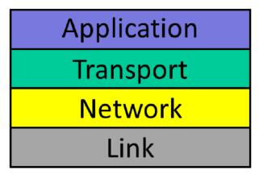
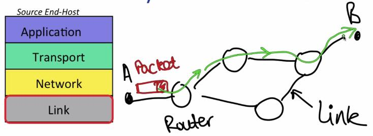
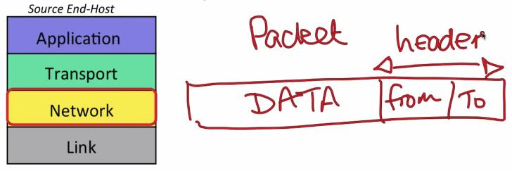
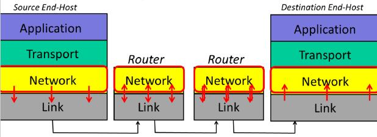
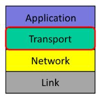
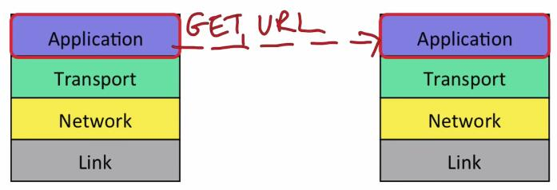
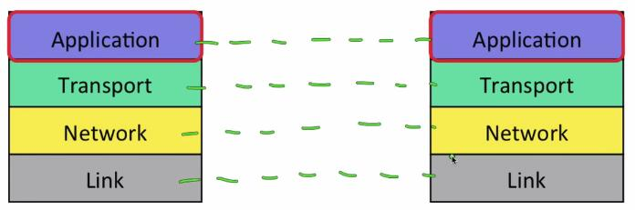
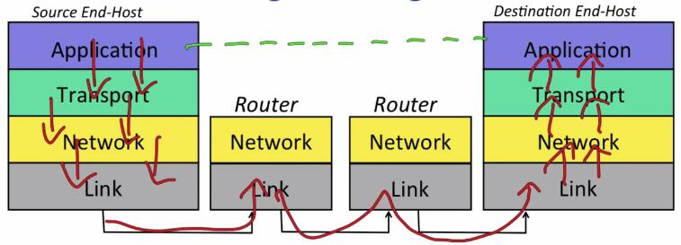
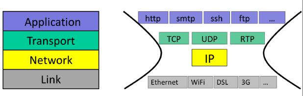
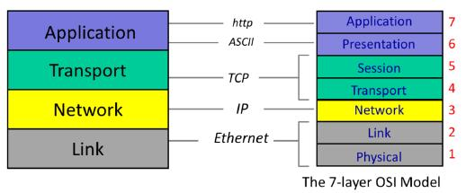

## 4层网络模型(The four layer Internet model)

在上一个视频中，你了解了不同的应用程序(如BitTorrent、Skype和万维网)如何使用双向可靠字节流在互联网上进行通信。

为我们的应用程序创建这种可靠的通信模型需要许多不同的部分共同工作。但是，尽管我们使用各种各样的互联网应用程序，并且以非常不同的速度发送多种数据，应用程序发送和接收数据的方式却有惊人的相似性。例如，应用程序希望发送和接收数据，而不必担心数据在互联网上的路径或路由。而且几乎所有的应用程序都希望确信它们的数据被正确传输，任何丢失或损坏的数据都会自动重新传输，直到正确接收为止。

### 4层网络模型

早期的互联网先驱们创建了“4层互联网模型”来描述组成互联网的操作层次结构，这样应用程序就可以一次又一次地重用相同的构建块，而不必为每个应用程序从头开始创建它们。**分层**是网络中一个重要且常用的概念，在本课程中我们将多次看到它，甚至有一段视频专门介绍分层的概念。

让我们看看4层互联网模型的每一层都做了什么，记住所有4个层都是为了使最终主机中的应用程序能够可靠地通信。

为了解释它是如何工作的，我将从底层开始。我们将看到每一层都有不同的职责，每一层都在下面的层之上构建一个服务，直到应用程序之间的双向可靠字节流通信。

#### 链路层

让我们从**链路层(Link Layer)**开始。

互联网由终端主机、链路和路由器组成。数据依次在每个链路上逐跳传送，数据以分组的形式传递。一个分组由我们想要传递的数据和一个报头组成，报头告诉网络该分组将被传递到哪里，它来自哪里，等等。

链路层的工作是一次通过一条链路传输数据，你可能听说过以太网和WiFi——这是两个不同链路层的示例。

#### 网络层

对我们来说，下一层是最重要的一层：网络层。网络层的工作是通过互联网端到端地将分组从源传输到目的地。

分组是网络中重要的基本部件。分组是我们给一个自包含的数据集合起的名字，加上一个描述数据是什么、数据去哪里以及数据来自哪里的报头。你经常会看到这样绘制的分组：

网络层分组称为数据报。它们由一些数据和一个包含“收件人”和“发件人”地址的报头组成——就像我们在信上写的“收件人”和“发件人”地址一样。

网络将数据报交给下面的链路层，告诉它通过第一条链路发送数据报。换句话说，链路层正在向网络层提供服务：链路层说：“如果你给我一个数据报来发送，我将通过一个链路为你传输。”

链路的另一端是路由器。路由器的链路层接受来自链路的数据报，并将其交给路由器中的网络层。路由器上的网络层检查数据报的目的地地址，并负责将数据报一次一跳地路由到最终目的地，它通过再次发送到链路层，并将其传送到下一个链路来实现这一点。依此类推，直到到达目的地的网络层。

注意，网络层不需要关心链路层如何通过链路发送数据报。事实上，不同的链路层以非常不同的方式工作；以太网和WiFi显然非常不同。网络层和链路层之间的这种关注点分离允许每个层专注于自己的工作，而不必担心另一层如何工作。这也意味着单个网络层有一种与许多不同链路层通信的通用方式，只需将数据报交给它们发送即可。这种关注点的分离是通过每一层的模块化和一个通用的定义良好的API实现的。

##### 网络层是“特殊的”

在互联网中，网络层是特殊的：当我们向互联网发送分组时，我们必须使用互联网协议。正是**互联网协议(IP)**将互联网连接在一起。我们将在稍后的视频中了解更多有关IP的详细信息。但就目前而言，了解一些关于IP的基本事实是件好事：

- IP尽最大努力将分组传送到另一端。但它不承诺分组一定会到达。
- IP分组可能会丢失，可能会无序传输，也可能会损坏，没有任何保证。

这可能会令人惊讶。当分组不能保证被发送时，互联网怎么能工作呢？如果一个应用程序想要保证其数据在必要时将被重新传输，并且将有序地、无损坏地交付给应用程序，那么它需要在IP之上运行另一个协议，这是传输层的工作。

#### 传输层

最常见的传输层是**TCP(传输控制协议)**。(你可能听说过TCP/IP，即应用程序同时使用TCP和IP的情况)。

TCP确保由Internet一端的应用程序发送的数据以正确的顺序正确地传递到Internet另一端的应用程序。如果网络层丢弃了一些数据报，TCP将重新传输它们(如果需要的话会多次传送)。如果网络层不按顺序发送数据，可能是因为两个分组沿着不同的路径到达目的地，TCP将再次将数据按正确的顺序发送。在以后的视频中，你将了解很多关于TCP及其工作原理的信息。目前，需要记住的主要事情是，TCP向应用程序提供了一个服务，以保证数据的正确有序传递，运行在网络层服务之上，该服务提供了不可靠的数据报传递服务。

我相信你可以想象，web客户端或电子邮件客户端等应用程序发现TCP确实非常有用。通过使用TCP确保数据正确传递，他们不必担心在应用程序中实现所有的机制。。他们可以利用开发人员为正确实现TCP所付出的巨大努力，并重用它来正确地交付数据。重用是分层的另一大优势。

但并非所有应用程序都需要正确交付数据。例如，如果视频会议应用程序正在发送分组中的视频片段，那么等待分组被多次重传可能没有意义；最好还是继续前进。所以有些应用程序不需要TCP服务。

如果应用程序不需要可靠的交付，那么它可以使用更简单的**UDP(用户数据报协议)**。UDP只是将应用程序数据捆绑起来，并将其交给网络层，以便传递到另一端。UDP不提供交付保证。

换句话说，应用程序至少可以选择两种不同的传输层服务：TCP和UDP。事实上，还有许多其他选择，但这些是最常用的传输层服务。

#### 应用层

最后，我们在层模型的顶部有应用层。当然，有成千上万的应用程序使用互联网。虽然每个应用程序都不同，但它可以通过使用从应用层到下面的TCP或UDP服务的定义良好的API重用传输层。

正如我们在上一个视频中看到的，应用程序通常希望在两个端点之间有一个双向的可靠字节流。它们可以发送它们想要的任何字节流，并且应用程序有自己的协议，该协议定义了在两个端点之间流动的数据的语法和语义，例如，正如我们在上一个视频中看到的，当web客户端从web服务器请求页面时，web客户端会发送GET请求。这是超文本传输协议(http)的命令之一。http规定GET命令以ASCII字符串的形式发送，同时发送所请求页面的URL。就应用层而言，GET请求直接发送到另一端的对等方——web服务器应用程序，应用程序不需要知道它是如何到达那里的，或者需要重新传输多少次。在web客户端上，应用程序层将GET请求交给TCP层，TCP层提供确保可靠传递请求的服务，它使用网络层的服务来实现这一点，而网络层又使用链路层的服务。

我们说每一层都与其对等层进行通信，这就好像每一层只与链路或互联网另一端的同一层通信，而不考虑下面的层如何在那里获取数据。

### 4层模型小结

那么，把这一切放在一起。

网络工程师发现将构成互联网的所有功能安排成层很方便。

顶部是应用层，如BitTorrent、Skype或万维网，它与目的地的对等层进行对话。当应用程序有数据要发送时，它将数据交给传输层，传输层负责将数据可靠地（或不可靠地）传递到另一端。传输层通过将数据交给网络层，来将数据发送到另一端，网络层的任务是将数据分成分组，每个分组都有正确的目标地址。最后，分组被交给链路层，链路层负责将分组沿着其路径从一个跃点传递到下一个跃点。数据从一个路由器跳到另一个路由器，网络层将它转发到下一个路由器，一次一个，直到它到达目的地。在那里，数据向上传递到各个层，直到到达应用程序。

各个层的作用小结：

- 应用层：两个应用程序之间的双向可靠字节流，使用特定于应用程序的语义（例如http、bit torrent）。
- 传输层：保证正确、有序地端到端传递数据，控制拥塞。
- 网络层：端到端传送数据报。尽最大努力交付，无保证。必须使用互联网协议（IP）。
- 链路层：通过终端主机和路由器之间或路由器之间的单个链路传送数据。

### 两件额外需要知道事

现在我们已经看到了4层模型是什么，我将用两件你需要知道的额外事情来结束。

#### 互联网是“细腰”

首先，IP通常被称为互联网的“细腰”。这是因为如果我们想使用互联网，我们必须使用互联网协议(IP)，因为我们别无选择。

但是对于链路层我们有很多选择：IP在许多不同的链路层上运行，例如以太网、WiFi、DSL、3G蜂窝等等。

在不可靠的IP层之上，我们可以在许多不同的传输层之间进行选择。我们已经看到了TCP和UDP。还有用于实时数据的RTP和许多其他传输层。当然，有成千上万种不同的应用程序。

#### 7层OSI模型

你应该知道的第二件事是，在20世纪80年代，国际标准组织(ISO)创建了一个7层模型来表示任何类型的网络：它被称为7层开放系统互连或OSI模型。在本课程中，我们没有花任何时间在它上面，因为它已经被4层互联网模型所取代。如果你感兴趣的话，你可以找到任何一本网络教科书，维基百科对这7层做了详细的描述。7层模型定义了结合在4层互联网模型中的层。例如，我们今天称之为链路层的被分为链路层(定义帧格式)和物理层(定义电缆上的电压水平或连接器的物理尺寸)。网络层基本相同，传输层和应用层在OSI模型中分别由两个层表示。如下是常用互联网协议的示例，以及它们如何映射到OSI编号方案。

今天，7层OSI模型的唯一真正遗产是编号系统。你经常会听到网络工程师将网络层称为“第3层”，即使它是Internet层中从底部向上的第2层。类似地，你会听到人们将以太网称为第2层协议，将应用程序称为第7层协议。