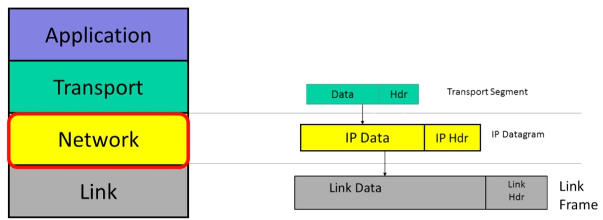
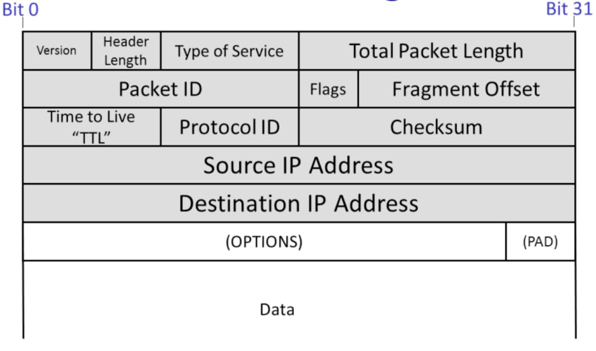

## 互联网协议模型(The IP service model)

现在，你已经了解了4层Internet模型，我们将重点介绍网络层。

这是互联网最重要的一层——事实上，对许多人来说，这就是互联网。每当我们使用互联网时，都需要使用互联网协议来发送和接收分组。

你会记得，我们说每个层都为上面的层提供“服务”。为了正确使用层，我们需要很好地理解它提供的服务。

因此，在本视频中，我将介绍互联网协议提供的服务。

### 互联网协议(IP)

IP数据报由一个报头和一些数据组成。当传输层有数据要发送时，它会将一个传输段交给下面的网络层。网络层将传输段放入新的IP数据报中。IP的工作是将数据报传送到另一端。但首先，IP数据报必须通过第一条链路到达第一个路由器。IP将数据报发送到链路层，链路层将数据报放入链路帧，如以太网分组，并将其发送到第一个路由器。

### IP服务的特点

IP服务的特点是这里列出的四个属性：
$$
\begin{array}{|l|l|}
\hline \text { 属性 } & \text { 行为 } \\
\hline \text { 数据报 } & 
\text { 独立的路由分组。逐跳路由。 } \\
\hline \text { 不可靠 } & \text { 数据包可能会被丢弃。 } \\
\hline \text { 尽力而为 } & \text { 但只有在必要的时候才会丢弃分组。 } \\
\hline \text { 无连接 } & 
\text { 没有每个流的状态。数据包可能被错误排序。 }\\
\hline
\end{array}
$$
它从终端主机向终端主机发送数据报；它是不可靠的，但尽最大努力提供数据报。网络不保持与数据报相关联的每个流状态。

让我们依次看看表中列出的每一项。

#### 数据报

首先，IP是**数据报服务**。当我们要求IP为我们发送一些数据时，它会创建一个数据报并将我们的数据放入其中。数据报是根据其报头中的信息通过网络单独路由的分组。换句话说，数据报是自包含的。

报头包含目的地的IP地址，我们在这里将IP目的地地址其缩写为“IP DA”。每个路由器的转发决策基于IP DA。数据报报头还包含一个IP源地址或“IP SA”，表示分组来自何处，因此接收方知道在何处发送任何响应。数据报通过网络从一个路由器一步一步地路由到下一个路由器，从IP源地址一直路由到IP目标地址。稍后我们将进一步了解路由器的工作原理。但就目前而言，知道每个路由器都包含一个转发表就足够了，该表告诉它在哪里发送与给定目标地址匹配的分组。路由器不知道整个路径——它只是使用目的地地址索引到其转发表中，以便它可以将分组沿着路径转发到其最终目的地的下一跳。一步一步地，分组只使用数据报中的目标地址从源到目的地。

你经常会听到IP数据报如何路由和邮政服务如何路由信件之间的类比。这是一个很好的比喻。在邮政服务中，我们把一封写有目的地地址的信放进信箱，然后从一个分拣办公室到另一个分拣办公室，一个一个地一个接一个地发送，直到到达目的地。发送者和接收者都不知道（或不可见），邮政服务中的信件或互联网中的数据报所走的路径。IP服务模型提供了一种服务，其中包括到目的地的路由。

#### 不可靠

第二，也许令人惊讶的是，IP不可靠。IP不保证分组将被传送到目的地。它们可能会延迟交付、无序交付或根本不交付。分组可能会在传输过程中被复制，例如被一个行为不正常的路由器复制。要记住的关键一点是，IP是不可靠的，不能提供任何保证。

#### 尽力而为

但它不会因为感觉可以（丢弃）就随意丢弃数据报。如果你相信网络有感情，IP确实承诺只在必要时丢弃数据报。例如，路由器中的分组队列可能因拥塞而填满，迫使路由器丢弃下一个到达的分组。IP不会尝试重新发送数据——事实上，IP不会告诉源分组已被丢弃。类似地，错误的路由表可能会导致分组被发送到错误的目的地。或者导致分组被错误地复制。IP并没有承诺这些错误不会发生，也没有在它们发生时检测到它们。但IP确实承诺只在必要时犯这些错误。

事实上，IP数据报服务与基本邮政服务非常相似。基本邮政服务没有承诺我们的信件将按时送达，或者如果我们连续发送2-3封信件，它们将按照发送顺序接收，它也没有承诺它们将被送达（除非我们支付更昂贵的端到端服务以保证送达）。

#### 无连接

事实上，归根结底，IP是一种极其简单、最低限度的服务。它完全不维护与通信相关的状态。我们说通信服务是“无连接的”，因为它不是通过建立与通信相关联的端到端状态开始的。换句话说，当我们进行一次持续几分钟的Skype呼叫，并且该呼叫由许多IP数据报组成时，IP层不知道该呼叫，只是单独地、独立地路由每个数据报。

### 为什么IP服务如此简单

你可能想知道为什么IP服务如此简单。毕竟，它是整个互联网的基础。互联网上的每一次通信都**必须使用**IP服务。考虑到互联网的重要性，让IP变得可靠不是更好吗？毕竟，我们确实说过，大多数应用程序都需要可靠的字节通信服务。

IP服务模型设计得如此简单有几个原因。

1. 使网络保持简单、愚蠢和最小化。更快、更精简、构建和维护成本更低。人们认为，如果网络保持简单的功能和要求，那么分组可以以非常低的成本非常快速地传送。当时的想法是，可以使用专用硬件使一个简单的网络运行得非常快。考虑到网络是由分散在网络中的大量路由器实现的，如果它们能够保持简单，那么它们可能会更可靠，维护成本更容易承受，并且需要升级的频率更低。
2. 端到端原则：尽可能在端主机中实现功能。在通信系统的设计中，有一个众所周知的原则称为**端到端原则**，即如果你能够正确地在端点实现功能，那么你应该在端点实现（该功能）。我们将在以后的视频中更深入地研究端到端原则，但基本思想是在端点放置尽可能多的智能——在我们的例子中，是源计算机和目标计算机。这可能有几个优点，例如确保为应用程序正确实现功能，如果功能在终端计算机上的软件中实现，而不是在Internet的硬件中实现，则更容易发展和改进功能。在互联网的情况下，人们决定可靠的通信和控制拥塞等功能应该在端点完成——由源计算机和目标计算机完成，而不是由网络完成。当时，这是一个相当激进的建议，也是一个与电话系统截然不同的设计选择。电话系统最初是建立在简单手机和功能丰富的复杂电话交换机网络的基础上的。在后面的视频中，我们将研究作为通信系统重要架构原则之一的端到端原则。我们将看到许多端到端原则的实例。例如，当我们研究传输层时，我们将看到终端主机如何在不可靠的IP网络服务上构建可靠的通信服务。
3. 允许在顶部构建各种可靠（或不可靠）的服务。如果IP是可靠的——换句话说，如果任何丢失的分组都被自动重新传输——那么对于某些服务来说，它将不是理想的。例如，在像视频聊天这样的实时应用程序中，可能没有必要重新传输丢失的数据，因为数据可能到达得太晚而没有用处。相反，应用程序可能会选择显示一些空白像素或使用前一帧中的像素。通过不提供任何可靠性保证，IP允许应用程序选择其所需的可靠性服务。
4. 适用于任何链路层：IP很少对链路层进行假设。IP对下面的链路层期望很低：链路可以是有线或无线的，并且不需要重新传输或拥塞控制。有人说IP非常简单，对底层链路层的假设很少，所以可以通过信鸽运行IP。事实上，甚至有一个互联网标准告诉你怎么做！让IP在任何链路层上运行是有意义的，因为互联网是专门为连接现有网络而创建的（这就是为什么它被称为互联网）。

### IP服务模型

除了基本的不可靠、尽力而为、无连接的数据报服务外，IP还提供一些其他精心选择的服务。IP的设计者们非常努力地在提供通信工作所需的最低限度的服务和一种根本不起作用的服务之间找到平衡。

我将在这里介绍五个功能，你将在以后的视频中了解其中的每一个功能，所以我将在这里不详细介绍。但我将简要介绍每一项，以便你了解完整IP服务的范围：

1. 试图防止分组永远循环下去。
2. 如果分组太长，会将其分段。
3. 使用报头校验以减少将数据报送到错误目的地的机会。
4. 允许新版本的IP
   - 目前有32位的IPv4
   - 和128位的IPv6
5. 允许在报头中添加新的字段。

#### 防止分组永远循

首先，IP试图防止分组永远循环。由于IP路由器在Internet上逐跳转发分组，路由器中的转发表可能出错，导致分组开始沿着同一路径循环。当转发表正在更改并且它们暂时进入不一致状态时，最有可能发生这种情况。IP使用一种非常简单的机制来捕获并删除似乎卡在循环中的分组，而不是试图阻止循环的发生（这将需要很大的复杂性）。为此，IP只需在每个数据报的报头中添加一个跃点计数字段。它被称为**生存时间(time to live) **，或**TTL字段**。它从一个像128这样的数字开始，然后由它通过的每个路由器递减。如果它达到零，IP断定它一定卡在一个循环中，路由器丢弃数据报。这是一种简单的机制，是典型的IP——它并不保证循环不会发生，它只是试图限制网络中无限循环分组泛滥所造成的损害。

#### 对分组分段

如果分组太长，IP将对其进行分段。IP设计用于在任何类型的链路上运行。大多数链路对它们可以携带的分组的大小有限制。例如，以太网只能传输长度小于1500字节的分组。如果一个应用程序要发送的字节数超过1500字节，则在发送IP数据报之前，必须将其分成1500字节的块。现在，沿着通往目的地的路径，1500字节的数据报可能需要经过只能承载较小分组（例如1000字节）的链路。连接两条链路的路由器将把数据报分成两个较小的数据报。IP提供了一些报头字段，我们将在一分钟内看到这些字段，以帮助路由器将数据报分割成两个独立的IP数据报，同时提供终端主机重新正确组装数据所需的信息。

#### 报头校验

IP使用报头校验和来减少将数据报发送到错误目的地的机会。IP在数据报报头中包含一个校验和字段，用于尝试并确保数据报传递到正确的位置。如果分组由于路由器的错误而被意外地频繁发送到错误的位置，这可能是一个相当大的安全问题。

#### 允许新版本的IP

目前使用的IP有两个版本：IPv4，目前有90%以上的终端主机使用IPv4。它使用你可能熟悉的32位地址。由于IPv4地址即将用完，互联网正逐步过渡到IPv6，而IPv6使用128位地址。你将在稍后的视频中了解IPv4和IPv6的详细信息。

#### 允许在报头中添加新的字段

最后，IP允许向数据报头添加新字段。 这是个喜忧参半的消息。一方面，它允许在标题中添加新的功能，这些功能很重要，但不在原始标准中。另一方面，这些字段需要处理，因此需要路径上路由器的额外功能，打破了简单、愚蠢、最小转发路径的目标。实际上，路由器使用或处理的选项很少。

### IPv4数据报

现在，我将向你展示IPv4报头，并解释所有字段的作用。我不需要你记住所有字段的位置（我自己也不记得它们的所有位置）。但我确实希望你了解每个字段的作用，因为它有助于你了解IP服务模型的范围。它应该有助于巩固你的理解，并让你清楚地认识到IP并没有多大作用——它是一种刻意简化的服务。下面是IPv4报头的图片，这是目前使用的最常见的报头。我在这里用32比特画了它，其中“0位”表示第一个发送到电线上的比特。

此阴影部分是IPv4报头，后面是6个数据。

IP头中最重要的字段是：

1. 目标IP地址(Source IP Address)。
2. 源IP地址(Destination IP Address)。
3. 协议ID(Protocol ID)，它告诉我们数据字段中的内容。从本质上讲，它允许目标端主机对到达的分组进行解复用，将它们发送到正确的代码以处理分组。如果协议ID的值为“6”，那么它会告诉我们分组含一个TCP段，因此我们可以安全地将数据报传递给TCP代码，它将能够正确解析该段。互联网分配号码管理局(IANA)定义了140多个不同的协议ID值，代表不同的传输协议。

版本(Version)告诉我们IP的哪个版本——目前，合法值为IPv4和IPv6。此报头是IPv4报头。我们将在稍后的视频中看到IPv6报头。

包括报头和所有数据在内的分组总长度(Total Packet Length)可达64KB。

“生存时间(Time to Live)”字段帮助我们防止分组在网络中意外循环，每个路由器都需要减少TTL字段。如果它达到零，路由器应该丢弃分组。

按照这种方式，当源发送具有固定TTL值的分组时，如果它开始以循环方式传输，则保证它会被路由器破坏。

有时分组对于即将发送的链路来说太长。如果需要，包ID(Packet ID)、标志(Flags)和段偏移(Fragment Offset)都有助于路由器将IP包分割成更小的自包含包。我们将在稍后的视频中了解拆分是如何工作的。

服务类型(Type of Service )字段向路由器提示此分组的重要性。

报头长度(Header Length)告诉我们报头有多大---有些报头有可选的额外字段来携带额外信息。

最后，在整个报头上计算校验和(Checksum)，以防报头损坏，我们不太可能错误地将分组发送到错误的目的地。

### 小结

总之，IP非常重要：我们每次在Internet上发送和接收分组时都会使用它。

IP提供了一种刻意简单的服务。它是一个简单、愚蠢、最小的服务，有四个主要功能：它通过互联网逐跳发送数据报；服务不可靠且尽力而为； 没有每个流的状态使协议无连接。

在这一点上，你应该对什么是IP协议、它的服务模型以及它如何适应Internet 4层层次结构感到满意。如果你有疑问，我建议你在4层模型上重新观看此视频和之前的视频。

你还可以找到许多关于IPv4工作原理的好参考资料。任何一本好的网络教科书都会花大量的篇幅来解释什么是IP，以及为什么它是这样设计的。例如，Kurose和Ross的第六版《计算机网络：自上而下的方法》第4章。你还可以在维基百科上找到一个简短的解释。