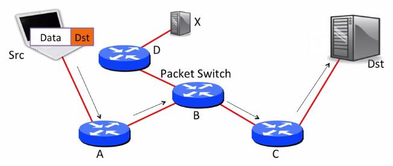

## 分组交换原则(Packet switching principle)

当互联网被设计出来时，它是基于一个有争议的、革命性的想法：**分组交换**。如今，它似乎是建立网络的直接和明显的方式，但情况并不总是如此。这是一个非常简单的想法，但当然就像简单的想法一样，一旦你把它付诸实践，就会产生许多有趣的影响。我们将用一整周的时间来讨论分组交换及其影响，但在这段视频中，我们将介绍高层次的想法和它的直接好处。

### 什么是分组交换

#### 分组

**分组**：一个独立的数据单位，携带必要的信息到达目的地。

分组交换是指我们将数据分解成离散、独立的数据块。每个块，称为一个分组，携带足够的信息，网络可以将该包发送到目的地。因此，假设我们有一个源和一个目的地，在它们之间有一个由分组交换机A、B和C组成的网络。当A收到目的地的分组时，它沿链路将其发送给B；当B收到目的地的分组时，它将其发送给C；当C收到目的地的分组时，它将其发送给目的地。

在最简单的分组交换形式中，每个分组都分别且独立地路由。例如，假设有另一个与B相连的交换机，称为D。在向C发送一个分组后，B可以立即向D发送下一个分组。或者，如果下一个分组也是到目的地，它将向C连续发送两个分组。

#### 分组交换

**分组交换**：对于每个到达的分组，独立地选择其输出链路。如果该链路是空闲的，就发送它；否则，保留该分组以备后用。

下面是分组交换工作的一个例子：每个分组都包含一个明确的路由，指定沿途每个分组交换的ID。我们把这称为"**自我路由**"或"**源路由**"，因为源指定了路由路径。当源发送一个分组时，它在分组中放入A、B、C、目的地。然后它把分组转发给A。A看了看报头，发现下一跳是B，于是它把分组转发给B。B看到下一跳是C，C看到最后一跳是目的地。事实证明，互联网支持源路由，但它通常被关闭，因为它引起了很大的安全问题。拥有路由器的人不希望你告诉他们如何发送分组，因为你可能会欺骗他们把分组发送到他们不应该去的地方。

一个简单的优化，也是今天互联网主要做的，就是在每个交换机中放置少量的状态，告诉它要把分组发送到哪个下一跳。例如，一个交换机可以有一个目标地址表和下一跳。当它收到一个分组时，它在表中查找地址，并将分组发送到适当的下一跳。在这种模式下，分组需要携带的只是目的地址。使用该地址，沿途的每个交换机都可以做出正确的决定。例如，在我们这里的网络中，A的表说到目的地的分组应该去交换机B，交换机B的表说到目的地的分组应该去交换机C，以此类推。

在分组交换中，没有专门的电路来承载我们的数据。相反，我们通过给数据块添加一个报头来发送数据，并称其为一个分组。报头包含了分组要去的地方的地址，就像一个信封告诉邮局要把一封信寄到哪里。

一个分组交换网络由终端主机、链路和分组交换机组成。当我们发送一个分组时，它被逐跳路由到其目的地。每个分组交换机在其本地转发表中查找分组头的地址。

例如，这个分组的地址是B。当我们发送它时，第一个路由器在其本地表中查找地址B，并看到交换机S2是下一跳。S2和S4做了同样的事情，分组最终被送到了B。（备注，这部分没有对应的图）在互联网上有几种不同类型的分组交换机。其中一些被称为**路由器**或**网关**，而另一些被称为**以太网交换机**。稍后我们将了解更多关于它们的信息。在这个阶段，你只需要知道它们都是分组交换机的类型，并且它们根据报头中的目标地址转发分组。

### 分组交换的两个结果

(这一部分似乎真的是基于基于电路的网络，许多学生从来没有使用过这种网络，为什么你需要每个流的状态？为什么你不能有效地共享链路？)

分组交换有两个非常好的特性。首先，交换机可以为每个分组做出单独的、本地的决定。它不需要保留关于它所看到的分组的额外状态，也不需要保留两个分组是否去往同一个目的地。即使许多分组是一些更大的传输或协议的一部分，交换机也不需要知道这点。交换机不需要知道有些分组是Skype电话，有些是网络请求，还有一些是你电脑的更新。它只是转发分组。这大大简化了交换机的工作。

第二点是它让交换机在多方之间有效地共享一个链路。例如，考虑一个家庭中的无线路由器，有两个人在他们的笔记本电脑上浏览互联网。如果一个人正在阅读一个网页，那么另一个人可以以链路的全速下载一个文件。如果第一个人开始加载一个新的网页，那么这个链路就可以在他们两个人之间共享。一旦下载完成，第一个人就可以使用该链路的全速。

这两点真的很重要，所以我们将对这两点进行一些更详细的讨论。

总结来说，分组交换有如下两个特性：

1. 简单的分组转发。
2. 高效共享链路。

#### 不需要每个流的状态

当然，当我们通信时，我们通常不会只发送一个分组，我们会发送很多；例如，一个语音电话由许多连续的分组组成，都是同一通信的一部分。我们把这种分组的序列称为流，更具体地说：

**流**是属于同一端到端通信的数据报的集合，例如，一个TCP连接。

让我们先来看看每个分组的独立路由。

因为每个分组都是独立的，所以交换机不需要知道数据包组或数据包流的情况。想象一下，如果每个交换机都必须跟踪经过它的每一个网络连接。这将需要大量的状态，难以管理。相反，独立处理每个分组意味着交换机可以更简单地建立、管理和排除故障。

交换机不需要担心添加或删除这种每个流的状态。想象一下，如果每次你想加载一个网页，你必须与路径上的每一个交换机沟通，以设置状态，使你的请求能够发挥作用。这可能会使事情变得更慢。相反，你只需发送分组，交换机就会适当地转发它们。

交换机也不需要储存这种状态。因为交换机必须是快速的，如果他们需要将这种状态存储在非常快的内存中，那么会非常昂贵。这（指不存储状态）使得交换机可以专注于做一件事，快速转发分组。

最后，这意味着交换机不需要担心故障问题。例如，想象一下，当你开始一个网络请求时，但你的平板电脑没电了，会发生什么？交换机要为请求保留每个流的状态，但如果创建该状态的一个节点发生故障，交换机需要知道如何清理它。否则，你可能会有几百万、几十亿的废弃的流在消耗你的内存。在分组交换中，交换机没有每个端点的状态。如果你的平板电脑死机了，交换机并不关心，它只是停止接收来自它的分组。通过这种方式，交换机在功能上与通过它发送流量的计算机更加独立。

总结来说：

1. 不需要添加/删除每个流的状态。
2. 不需要存储每个流的状态。
3. 失败时不需要改变每个流的状态。

#### 高效地共享链路

想想你通常如何使用互联网——你的使用是突发的。你加载一个网页，然后阅读它，然后加载另一个。你从iTunes下载几首歌曲，然后聆听它们。你从Netflix播放一个节目四十五分钟，然后停止。数据流量是突发性的：随着时间的推移，使用量不总是以固定速率发送和接收数据，而是起起落落。

虽然数据流量有大范围的变化和高峰——下午3点通常很高，晚上8点也是如此，而凌晨2点则很低，但在较小的范围内，它非常突发，而且这些突发通常是独立的。假设你和你的朋友都在咖啡店浏览网页。你和你的朋友加载一个新页面时大多是独立的。有时它们可能会(时间)重叠，但通常它们不会。通过将你的所有流量视为分组，无线路由器可以非常有效且简单地在你之间共享其容量。如果你在朋友阅读时加载页面，无线路由器可以将其所有容量分配给你的分组。同样，如果你的朋友正在加载页面而你正在阅读，则路由器可以将其所有容量分配给你朋友的分组。链路不需要因为你们中的一个人不使用它而部分闲置，并且如果你们都在使用它，那么链路可以在你们之间共享。

这种以概率或统计方式获取单个资源并在多个用户之间共享的想法称为**统计复用**。它是统计性的，因为每个用户都会根据其他人的使用量获得资源的统计份额。例如，如果你的朋友正在阅读，你可以使用所有链路。如果你们两个都在加载一个页面，你将获得一半的链路容量。

总的来说，数据流量是突发性的：
- 分组交换允许流量使用所有可用的链路容量。
- 分组交换允许流量共享链路容量。

### 小结

因此，这就是分组交换的两个主要好处：

- **分组交换是简单的**：它使交换机变得简单，因为它们不需要知道分组的流量。
- **分组交换是高效的**：它让我们在共享一条链路的许多流量之间有效地分享容量。

这种简单的构件在当时是革命性的，但它现在已被接受为构建网络的常见方式。

