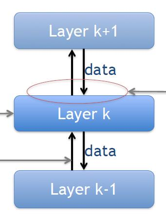
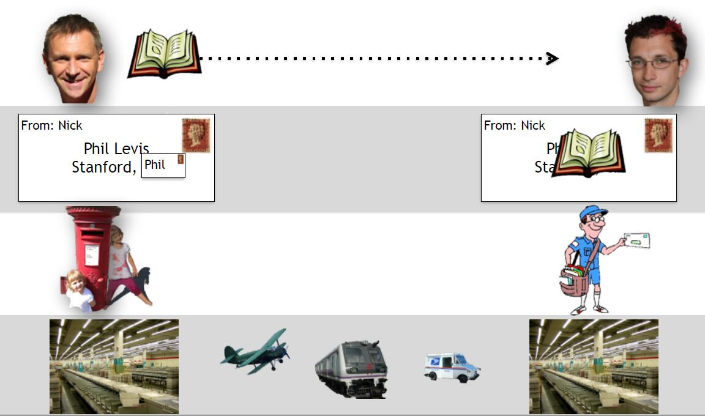
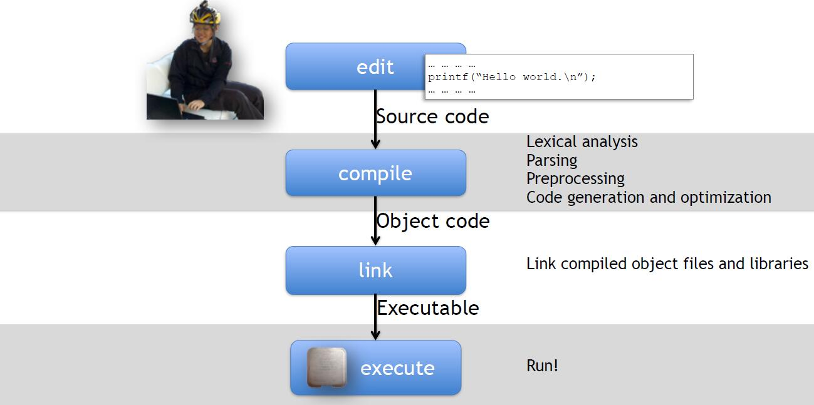

## 分层原则(Layering principle)

在过去的几个视频中，你已经看到了很多关于分层的内容，特别是在描述四层互联网模型分层的视频中。分层是非常广泛使用的原则，并且在互联网出现之前已经在网络中使用了几十年。事实上分层是一个在网络之外广泛使用的设计原则，它在许多许多类型的计算机系统中都被作为设计原则使用。

分层有很多原因，我们将探讨其中一些原因。在这段视频中，我们将探讨什么是分层，我们将看看通信和计算机系统中分层的一些简单例子，我们将解释为什么这么多系统都是分层的，要么是自然发生的，要么是故意设计的。

### 分层定义

让我们从分层的定义开始，分层是我们将一个系统组织分为一些独立的功能组件或层。各组件是分层的，它们按顺序进行通信，换句话说，每一层都有一个接口，只与上面和下面的层相通。每一层都为上一层提供一个明确定义的服务，使用下面各层所提供的服务和自己的私有处理，向上面的层提供明确的服务：

总结来说：

-每一层都向上面的层提供明确的服务，使用下面各层提供的服务和自己的私人处理。
-各层是功能组件。
-各层与上面和下面的层依次进行通信。

### 分层例子

#### 机票

在日常生活中，有许多关于分层的例子，特别是当一种服务被故意或自然地建立在另一个服务之上时。例如，如果你正在订飞机票，你可能会访问一个订票网站，如谷歌航班，Hipmunk或Kayak，这些网站让你通过与某个单一的服务沟通来寻找各种航空公司的机票，而不是去每个航空公司的网站查询他们有哪些机票。订票网站在每个航空公司之上为你提供一个服务层，为你抽象出每个航空公司网站的细节。

现在，如果我们看一下每家航空公司的细节，他们在不同的航线上驾驶不同类型的航班，航班负责提供服务的细节，并向你提供一张在两个机场之间机票的抽象。他们还隐藏了许多其他的细节，例如，他们有许多供应商提供饮食，饮料，燃料等等，这些都是自然地隐藏在我们消费者面前。

这种关注点的分离使层次结构中的每一层都能专注于做好自己的工作，并为上一层提供明确的服务。

#### 邮政服务

另一个众所周知的、更接近互联网的例子是邮政服务。想象一下，我有一本书想寄给Phil，我把书放在一个信封里，加上Phil和我的地址，然后把它交给Olive，让他把信送到邮箱里，邮政部门对邮件进行分类，然后通过各种不同的方式发送，飞机、邮车、火车等等，直到到达Phil附近的分拣处。邮递员把信交给Phil，Phil打开信，发现里面有一本书。

服务的层次很清楚，我不关心信是怎么从我这里送到Phil手里的，是坐飞机卡车还是气垫船，我也不关心这本书走的是什么路线，沿途经过多少个分拣处，我不关心Olive是走着去的还是骑着去的还是跑着去的，我不关心他把信放在哪个邮筒里。我希望下层为我抽象出细节，为我提供一个简单的服务模型：我把书放在信封里，下面的层把它送到Phil那里，反过来，Olive也不需要知道邮政服务是如何送信的，他只是通过邮寄信件与下面的层进行沟通，Phil只是想要这本书。注意，每个层只与上面和下面的层进行沟通，如果邮政部门部署了新的火车或开始使用不同的航空货运服务，Phil和我不需要知道。我们可以随着时间的推移独立地改进每一层，例如，如果我想更快地保证交货，我可以把信封交给DHL或Fedex等承运人，接口几乎是一样的，我只需给他们一个信封和钱。

#### 计算机系统

分层是许多计算机系统中有意设计的，当我们编写程序时，我们使用某种语言创建源代码，抽象出操作系统的细节，虚拟内存是如何工作的，底层的硬件是如何工作的。好吧，C语言在隐藏细节方面并不出色，但许多其他语言，如java和python，都有意让我们远离底层的工作方式。作为一个程序员，我们通过把源代码交给编译器来与编译器下面的层进行交流。编译器是一个独立的功能组件，它负责几个任务，如代码预处理、词法分析解析、代码生成和优化。编译器生成目标代码，然后将其传递给链接器，将编译后的目标文件和库链接在一起，生成一个可执行文件。最后由CPU实际或虚拟执行代码，如果你有编写计算机程序的经验，分层的好处是相当清楚的。

在这个例子中，分层将编写在硬件上执行的程序的整体问题分解为模块或功能组件，每个模块都有明确的作用，并为上面的层提供明确的服务，它还提供了明确的关注点分离，编译器可以专注于词法分析解析等，链接器可以专注于有效地将对象拼凑在一起，两者都不必担心其他的工作，并且随着技术和知识的进步，每个部分可以改进、升级和替换。例如，我们可以用gcc替换商用c语言编译器，反之亦然，而不需要改变链接器或我们使用的语言。

### 打破分层带来的问题

当Nick第一次起草这些幻灯片时，我很高兴他把编译器作为分层的一个例子，这既是分层的好处，也是有时你需要打破分层的一个很好的例子。一般来说，一段c代码可以被编译给几乎任何处理器使用，比如i++，我们可以将其编译给arm处理器，手机x86-64处理器，笔记本电脑，微控制器或超现代洗碗机使用，这样c代码是硬件独立的，因此它保持了这里的分层。但有时我们需要我们的c代码做一些只有我们的处理器才能做的特殊事情，例如x86-64处理器有微控制器没有的各种特殊指令。

c提供的分层隐藏了这个细节，所以它不允许你直接这样做，但你必须这样做来实现你的目标。还好操作系统内核包括汇编代码，但这样做意味着代码不再是独立于层的，因为为arm编写的linux上下文切换汇编只适用于arm，所以你必须为每一层编写不同版本的代码，如果linux想在一个新的处理器上运行，开发者需要为该处理器编写新的汇编代码。

所以这是一个很好的例子，因为它既显示了层的好处，即分离关注点并简化你的系统，就像C语言编程比汇编容易一样；但有时你又必须打破层的界限，这样做有一个巨大的代价，即你不再独立于下层。这大大限制了灵活性，所以只有在你真的必须这样做的时候你才应该这样做。

正如我们将看到的那样，今天互联网中的许多实际操作挑战是由人们打破分层和假设他们的服务接口上下的东西造成的。我们将看到一个很有说服力的例子，那就是被称为NAT或网络地址翻译器的东西，它是一个非常有用的设备，但不幸的是，它使互联网几乎无法增加新的传输协议。

### 小结

总之，我们使用分层和计算机系统模块化有6个主要原因：

1. 模块化：将系统分解成更小的、更容易管理的模块。
2. 定义良好的服务：一种定义明确的服务，每一层都为上面的层提供一种定义明确的服务。
3. 复用：上面的一层可以使用依靠其他人的努力实现的下面的层，这使我们在建立一个新系统时省去了编写每一层的时间。
4. 关注点分离：每一层都可以专注于自己的工作，而不必担心其他层如何做他们的工作。唯一的通信是在层与层之间，所以它有助于保持层在本地和内部处理数据，尽可能减少层之间的复杂互动。
5. 持续改进：允许对每个功能进行持续改进。
6. 点对点的沟通：这点特定于分层通信系统，例如点对点通信的互联网。在四层互联网模型中，我们看到了每一层是如何使用下面的层提供的服务与另一个系统中的对等方进行通信。同样，在邮件的例子中，菲尔和我是作为用户互相通信的，而不用担心通信服务如何工作。