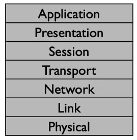

## 封装原则(Encapslation principle)

这个视频是关于我们称之为**封装**的架构原则。封装是你把分层和分组交换结合起来后的结果。我们想把数据分解成不连续的单元，称为分组。然而，每个分组都包含来自多个层的数据。例如，当你发送一个TCP段时，它在一个IP包内，而IP包又在一个以太网帧内，封装就是这样工作的。封装是一种原则，你通过它来组织分组中的信息，这样你就可以维护各层，但又让它们共享分组的内容。

### 分层

回顾一下，分层让你把一个复杂的系统分解成更小的部分。每一层都提供一种服务，一个网络到它上面的层的抽象。它通过使用它下面的层来提供这种抽象。每一层都是自包含的，所以只要它提供预期的服务，上面的层就不需要担心如何提供该服务。这种关注点的分离意味着每一层都可以独立发展。就像网络层的IP不需要担心传输层的TCP的变化一样，应用层的HTTP也不需要担心TCP的变化。例如，在过去的几年里，大多数操作系统都改变了它们使用的TCP算法，以更好地处理不断增长的网络速度，但网络浏览器使用旧的算法和新的算法都能正常工作。

请注意，这图片有7层OSI模型。

### 4层模型

让我们回到4层模型。

封装的原理是让我们采用协议层，并让它们轻松地共享分组中存储的内容。这是分层在实际数据表示中的体现方式。这种工作方式是每个协议层都有一些报头，然后是它的有效载荷，最后是一些报脚。

例如，一个IP包报头有一个源地址和一个目标地址。为了用IP发送一个TCP段，我们把TCP格式作为IP包的有效载荷。这样一来，IP包就"封装"了TCP段。IP不知道也不关心它的有效载荷是什么，它只是把分组送到终端主机。当分组到达时，主机查看有效载荷，看到它是一个TCP段，并对其进行相应的处理。

这里有一个更完整的例子。假设你正在使用一台通过WiFi、无线以太网连接的电脑浏览网页。你的网络浏览器产生了一个HTTP GET请求。这个HTTP GET请求是一个TCP段的有效载荷。封装HTTP GET的TCP段是一个IP分组的有效载荷。这个IP分组，封装了TCP段和HTTP GET，是一个WiFi帧的有效载荷。如果你要看一下你的电脑发送的字节，它们看起来像这样。最外层的封装格式是WiFi帧，里面是一个IP包，里面是一个TCP段，里面是一个HTTP GET。

### 封装顺序

菲尔：尼克是如何画出这个分组可能会带来一些你可能会觉得困惑的东西！你知道吗？事实证明，有两种方法来绘制分组。这种区别来自于背景和你所工作的系统。尼克在这里画了一个分组，报头在右边。分组的第一部分在右边，分组的最后部分在左边。

尼克：这完全说得通。当路由器或交换机发送分组时，我们分组从左到右移动。因此，第一个离开路由器或交换机的比特在最右边。

菲尔：但我画的是另一种方式的分组，即报头在左边，报脚在右边。就像这样：

菲尔：这种方法来自于软件。当你阅读IETF文件和许多其他协议规范时，你会看到这种方法。这个想法是，分组的开始是在地址零处。所以报头的第一个字节是在地址零处。由于地址从左到右增加，这意味着分组的开始在左边，分组的结束在右边。

尼克：这里没有正确的方法，也没有错误的方法。两种绘制分组的方法都很有价值，取决于你要用这种方法做什么。你应该对两种方式都感到满意。我一般会把报头画在右边。

菲尔：而我一般会把报头画在左边。尼克的背景是电气工程和交换机设计，我的背景是计算机科学和协议软件。

### 例子

现在让我们回到尼克的例子，HTTP GET在一个TCP段里，(HTTP+TCP)在一个IP包里，(HTTP+TCP+IP)在一个WiFi帧里。让我们用Wireshark看看这在实际网络中是什么样子。

在我们开始记录之前，我打开了Wireshark并记录了一个网络请求的分组追踪。让我们只看一个分组。在这里，我们可以看到Wireshark是如何告诉我们，这是一个以太网帧，里面是一个IP包，里面是一个TCP段，里面是一个HTTP GET。如果我点击这些协议头的每一个，那么Wireshark突出了它们在分组字节中的位置，下面是这些乱七八糟的东西。第一部分是WiFi，WiFi里面是IP，在IP里面是TCP。而在TCP里面，我们可以看到我们的HTTP GET的文本!

### 封装的灵活性

这种非常简单的将协议相互封装的方法给了你巨大的灵活性。到目前为止，我们一直在谈论4层模型，认为它是完全静态和不灵活的东西。在实践中，它并不是这样的。你实际上可以使用封装来递归层协议。例如，今天在办公室和企业中非常常用的东西是一个叫做**虚拟专用网络(VPN)** 的东西。通过虚拟专用网络，你打开一个安全连接到一个你信任的网络，例如在办公室使用**安全传输层协议(TLS)** 。当你与互联网通信并发送IP分组时，你不是正常发送，而是在这个VPN连接内发送。

因此，IP分组会进入你的办公室网络。在这一点上，办公室网络可以正常路由它们。这让你可以做一些事情，如访问办公室里的私人、受保护的网络资源。与其到处散布网络保护，你只需要小心使用一种服务，即让人们通过虚拟专用网络登录网络的服务。你用一个网关来做这件事，这台电脑接受来自允许的VPN客户的连接，并将其流量转发到私人网络。

那么，这看起来像什么呢？比方说，我正在访问公司内部网站：网络浏览器生成一个HTTP GET。像往常一样，浏览器把它放在一个TCP段里，然后把它放在一个IP包里，目的地是公司的内部网络服务器。但是，我的电脑并没有把这个IP包放在一个链路层的框架内，我不能直接与内部网络服务器进行通信，而是把这个IP包放在一个TLS段内。

TLS保护信息并使其保密。此TLS会话位于终止于虚拟专用网络网关的TCP流中。因此，外部TCP段位于目的地为虚拟专用网络网关的IP分组内。我们把这个外部IP包放在一个链路帧内，并把它发送到下一跳。所以它看起来像这样：

具体来说，其结构如下：

虚拟专用网络(VPN)：

- HTTP(网络)应用有效载荷，
- 在TCP传输段中，
- 在IP网络数据包中，
- 在一个安全的TLS信息中，
  - 此时进入VPN网关
- 在TCP传输段中，
- 在IP网络数据包中，
- 在以太网链路帧中，

### 小结

现在你已经听说过封装了，这是统一分层和分组交换的原则。封装是我们如何利用协议层，并以一种灵活的方式将它们组装成分组，并保持它们之间的分离。你看到了一个计算机可以封装网络请求的例子，以及一个如何以更复杂的方式使用封装的例子，如虚拟私人网络(VPN)。

总的来说，封装有效载荷：

- 帮助分离关注点
- 帮助加强边界/分层
- 简化层的实现方式

