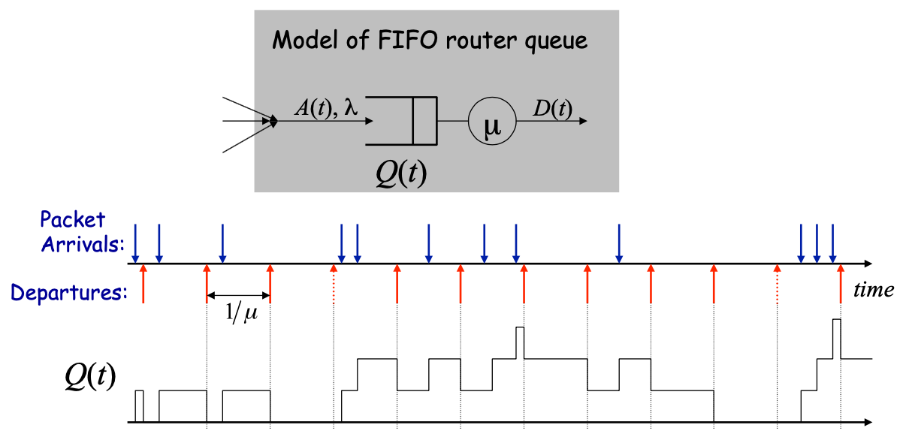

## 比特顺序(byte order)

为了让双方进行沟通，他们需要就他们交换的信息达成一致。

如果一方认为信息是西班牙语，而另一方认为是柬埔寨语，他们将无法沟通。对于计算机通信来说，这意味着同意信息有哪些字段，如何安排，格式是什么，以及如何表示它们。为了生成一个要发送的信息，软件通常要在内存中创建一个副本，然后将其传递给网卡。同样，当计算机收到一个信息时，网卡会把这个信息放在内存中，然后软件就可以访问它。如果你想了解网络协议和编写网络协议软件，了解这些工作原理和你可能遇到的一些陷阱是很重要的。


### 计算机内存



因此，让我们从计算机内存的一个简单模型开始。在今天的大多数计算机中，内存是以字节为单位组织的：8比特的内存块。程序有一个地址空间，从地址0开始。今天的大多数计算机都是64位的：这意味着内存地址是64位的，所以一台计算机最多拥有$2^{64}$个字节，或者18个六亿字节。实际上，今天的计算机没有这么多内存：它们有千兆字节，也就是$2^{30}$次方。在这个例子中，我们的计算机有8GB的内存，所以它的最大地址是上图所示的十六进制值。软件可以访问这个内存的每一个字节，也可以成组访问字节，比如用一条指令从8个连续的内存字节单元加载一个64位的整数。


### 字节序

但计算机如何表示一个多字节的值呢？比方说，我们想表示数字1,024，在十六进制中是`0x0400`，或$4\times 256$。这个值需要16位，或两个字节。哪个字节在前：0x00还是0x04？


如何在内存中布局多字节值称为字节序，有两种选择。在小端中，最低有效字节位于最低地址，所以最低有效字节在内存中排在第一位。事实证明，从计算和架构的角度来看，这是最合理的。另一个选择是大端，其中最高有效字节是最低地址。对人类读者来说，大端更有意义，因为这就是我们写数字的方式，最高位的数字在前。


### 测验

$$
\begin{array}{lrrrr}
\hline \text { Width} & \text { Decimal} & \text { Bytes}& \text { Big Endian}& \text { Little Endian} \\
\hline 16 \text { bits } & 53 & 0\mathrm x3500  &\mathrm{False} &\mathrm{True}   \\
16 \text { bits } & 4116 & 0\mathrm x 1014  &\mathrm{True} &\mathrm{False}\\
32 \text { bits } & 5 & 0\mathrm x 00000005&\mathrm{True} &\mathrm{False} \\
32 \text { bits } & 83,886,080 & 0 \mathrm x 00000005  &\mathrm{False} &\mathrm{True}\\
32 \text { bits } & 305,414,945 & 0 \mathrm x 21433412 &\mathrm{False} &\mathrm{True} \\
\hline
\end{array}
$$

这是一个测验。对于每个数字，标记十六进制表示是大端还是小端。不要使用计算器或其他工具！

- 53是小端表示。53是3乘以16加5，0x35在第一个字节中。
- 4116是大端表示。4116等于4096加20。所以这两个字节是0x10和0x14，其中0x10是表示更高有效位的字节，即4096的字节。由于十六进制是0x1014，这意味着最高有效字节排在第一位，并且是大端。
- 5是大端表示。最低有效字节是最后一个，具有最高地址。
- 83886080是小端表示。它是2的24次方的5倍，所以这意味着0x05是最高有效字节。
- 305414945是小端表示。我没有试着找出这张表上的所有数字，而是只看了最低有效位。最低有效位是0x21或0x12。如果是0x21，最低有效位是1，则该数字为奇数。如果是0x12，最低有效位为8，则该数字为偶数。由于305414945是奇数，这意味着0x21是最低有效字节，数字以小端存储。


### 网络比特顺序

那么，为什么这很重要呢？如果两台计算机要进行通信，它们需要就它们是用大端还是小端格式表示数字达成一致。由于不同的处理器使用不同的编码方式，这就很复杂了。例如，英特尔和AMD的x86处理器是小端：最低有效字节在前。相反，ARM处理器，如iPhone中的处理器，则是大端，最高有效字节在前。

我们不希望两台计算机关心或知道另一端是大端还是小端。因此，协议规范机构通常会选择一个，并坚持使用它。对于互联网来说，这意味着大端。所有作为互联网规范的协议都使用大端格式。

这里有一个C代码的例子，它可以告诉你你的计算机是大端还是小端。它需要一个16字节的值，并向其传送一个指针，让代码单独查看这些字节。如果索引0的字节是0x40，则最高有效字节排在第一位，是大端。如果索引1的字节是0x40，那么它就是小端。如果两者都不是，那就说明发生了奇怪的事情：


```c
uint16_t val = 0x400;
uint8_t* ptr = (uint8_t*)&val;

if (ptr[0] == 0x40) {
  printf(“big endian\n”)
}
else if (ptr[1] == 0x40) {
  printf(“little endian\n”);
}
else {
  printf(“unknown endianness!\n”);
}
```


### 可移植的程序代码

但是等等，这会造成一个复杂的问题。你需要一个大端格式的分组，但是如果你的处理器是小端格式呢？例如，假设你希望将TCP段的端口号设置为80，即HTTP端口。一个简单的方法是创建一个C结构，在正确的偏移上有一个端口字段。但是，如果使用值80与端口字段进行比较，它将以小端存储，第一个字节为0x50。大端要在第二个字节中存储0x50。因此，尽管段中的端口字段为80，但此测试将失败：

```c
uint16_t http_port = 80; // Host order
if (packet->port == http_port) { ... // Network vs. host order
```


为了简化此过程，C网络库提供了在主机顺序和网络顺序之间转换的实用程序函数。例如，函数htons()将主机的16位值作为参数，并按网络顺序返回值。还有用于将网络短消息转换为主机短消息的函数，以及用于长消息、32位值的函数。因此，测试分组端口是否为80的正确方法是读取分组结构的端口字段，并调用ntohs将其从网络顺序转换为主机顺序。然后，你可以将其与80进行比较，得到正确的结果。在小端结构的情况下，ntohs和htons颠倒了两个字节的顺序。对于大端体系结构，它们只返回未更改的值：

```c
#include <arpa/inet.h>

uint16_t http_port = 80; // Host order
uint16_t packet_port = ntohs(packet->port);
if (packet_port == http_port) { ... // OK
```


### 处理网络数据时要小心！

这些函数为你提供了机制，通过这些机制你可以编写独立于处理器架构的网络代码。但是要小心！我怎么强调都不过分：处理网络数据时要小心。如果你在主机和网络顺序之间转换时没有原则性和严谨性，那么你会感到非常头痛，因为你忘记转换或无意中转换了两次，突然你的协议出现错误或触发各种奇怪的错误。


----------------

### 分组格式

待补充


现在我们知道了Internet规范是如何按照网络顺序或大端排列多字节值的，我们可以看看互联网规范是如何描述其分组格式的。由于历史原因，互联网规范是以ASCII纯文本编写的。左边的文本块是从Request for Comments (RFC) 791中逐字摘录的，它规定了IP协议的第四版，即IPv4。上面显示了从0到31的位数——分组的宽度为4字节。由于IPv4有5行必填字段，这意味着一个IPv4头至少有20字节长。尼克和我经常在显示分组时使用一种更简单的可视化格式，比如右边的那个。

以此为例，IPv4分组的总长度字段为2字节，或16位长。这意味着IPv4分组的长度不能超过65535字节。分组中的该字段以大端存储。长度为1400字节的分组存储为0x0578。因此，该长度的IP分组的第三个字节是0x05。


让我们在wireshark中看到这一点。我要开始wireshark并监听分组。第一个分组是关于一个叫TLS的东西，或者叫传输层安全。这是网络浏览器用于安全连接(https)的方式。TLS对我们隐藏了分组的数据，但我们仍然可以看到它的头。使用wireshark，我们可以看到TLS的有效载荷在一个TCP段内，该TCP段为443端口，是标准的TLS端口。此TCP段位于IPv4标头内，详细查看IPv4报头，我们可以看到分组的总长度字段是1230。1230的十六进制是0x04ce:1024，或0x04乘以256加106，或0xce。在底部，Wireshark向我们显示了分组的实际字节数。这就是，04ce，在大端，或网络顺序中。

你已经看到了不同的处理器如何以不同的方式排列数字。但由于网络协议需要达成一致，协议规范决定了数字的排列方式，这可能与处理器不同。为了帮助实现这一点，C网络库提供了在主机和网络顺序之间转换的帮助函数。但要小心使用！随意使用它们很容易让你损失很多调试时间，如果你在开始并决定在代码中转换的原则性方法时非常小心，那么这是可以避免的。