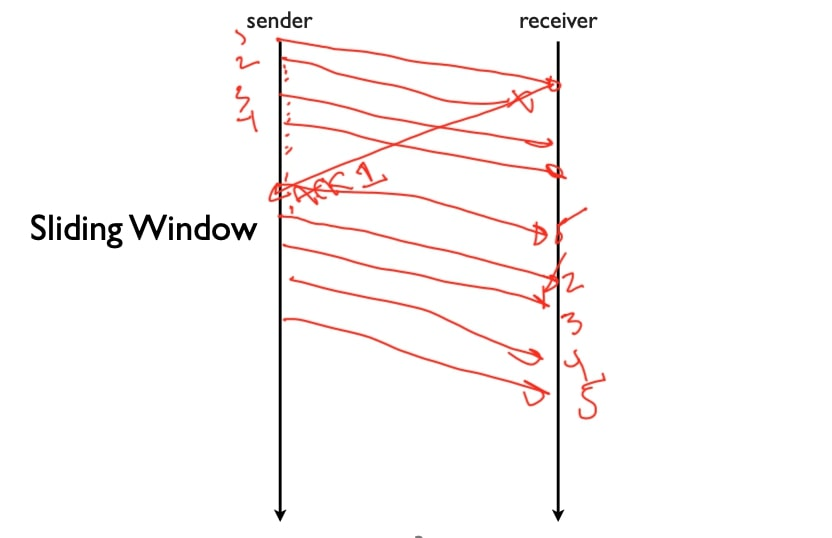
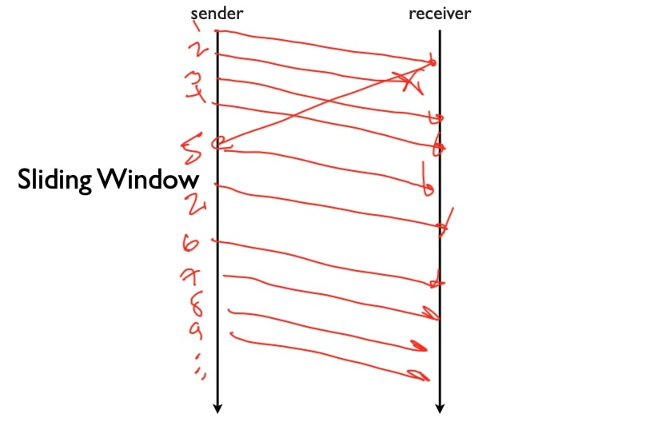
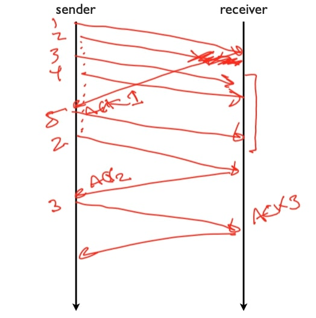
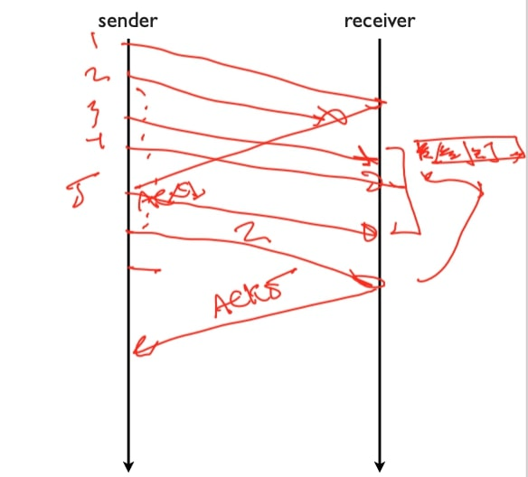

## 可靠通信——重传策略

在这段视频中，我将谈谈传输协议的重传策略，以实现可靠性，特别是对于滑动窗口协议。

### 问题

基本问题是，我们有滑动窗口的可靠传输，一个正在发送的分组的窗口，比如说1, 2, 3, 4，我们使用累积确认，所以我们得到的是一些反馈，比如说ACK 1, ACK 2，ACK 3, ACK 4，即最后被成功接收的一个分组。 我们根据这些分组的发送时间为每个分组维持一个**重新传输计时器**，并且维持一个保守的估计，如果我们在这个时候(指某个阈值)还没有收到分组的确认，那么这意味着几乎可以确定分组已经丢失，所以我们应该重新传输。

因此问题是给出了这组通常用于可靠传输的参数，协议将如何运行，其重新传输策略将是什么样子，基本上有两种策略，你最终会从不同的协议中看到：

- 第一种是**Go-Back-N**：
  - 这是一种非常保守的方法，即如果一个单一的分组丢失，那么我们将重新传输整个未完成的分组窗口。
  - 所以如果窗口大小为N，我们失去了一些分组，将返回重新传输所有的数据。
- 第二种是**选择性重复(Selective repeat)**：
  - 选择性重复假设如果一个分组丢失了，那么只有那个分组丢失了。
  - 在选择性重复中，如果我们丢失了一个分组，它没有被确认，那么将重新传输那个分组，即只有那个分组。

### Go-Back-N

所以让我们来看看Go-Back-N是什么样子的。

所以假设我们有一个大小等于4的窗口，所以发送方发送分组1,2,3,4，分组2丢失了，所以这里是我们的4次传输；接收方发送ACK 1，但没有发送ACK 2。所以在某个点上，我们将使重传计时器关闭，然后发送方要做的是它将重发整个未完成的窗口，因为接收方收到了ACK 1，所以窗口是2, 3, 4, 5，尽管发送方看到分组是2丢失了，但会认为整个窗口丢失了，我们发送整个窗口，这是非常保守的。

### 选择性重传

我们再看看选择性重传协议会怎么做，依然n等于4，发送方发送分组1,2,3,4，分组2丢失，分组1被确认，这允许我们发送分组5。在选择性重传协议中，发送方将重新发送2，然后我们将继续执行并发送6,7,8,9。

所以，一个问题是，既然选择性重复发送更少的分组，为什么需要Go-Back-N呢？有两个原因：

- 如果分组2, 3, 4, 5都丢失了，为了进行这些重传，涉及到定时器和往返时间，所以它可能会比Go-Back-N慢得多。
  - 即如果出现突发性丢失(连续丢失)，则速度会慢得多。
- 选择性重复协议的恢复速度通常会慢一些，因为它没有假设所有分组在重新传输时都丢失了，所以在发送数据的种类、发送速度、以及浪费的数据量与从重大错误中恢复的速度之间存在一个折衷。

所以让我们通过两个传输协议的例子，看看分别会发生什么。

### 例1

比如说发送方会发送1、2、3、4，假设2号分组丢失了，所以它没有到达，那么接收方会确认1号分组，这样发送方就可以发送5号分组，但是接收方不会确认2号分组，现在2号分组的定时重传定时器会启动，它会重传2号分组。但由于接收方的接收窗口大小只为1，它无法缓冲分组3、4和5，所以当它收到分组2时，它将对分组2进行确认，发送方没有收到3的确认，它将不得不重新传输3，然后接收方可以确认3，然后发送方可以再次开始使用其完整的窗口。

这里第一个2号分组丢失了，由于接收方的窗口大小为1，导致分组3、4和5无法被缓冲，这一事实将迫使发送方重新发送窗口中的每一个分组，所以我们将看到，这表现为Go-Back-N。

### 例2

让我们看看第二个例子，所以在这种情况下，发送方有一个大小为$$n$$的窗口，接收方也有一个大小为$$n$$的窗口，为了简单起见，假设$$n=4$$，所以在这种情况下，协议将是Go-Back-N还是选择性重传？

让我们看看发生了什么，我们发送了分组1,2,3,4，其中2是丢失的，所以我们得到一个ACK 1，这导致分组5被发送，然后在某一时刻，分组2的重传计时器触发，所以会重新发送分组2。

现在接收器已经能够缓冲这些分组，因为它有一个大小为$$n = 4$$的窗口，所以它有3个分组被缓冲，这里是它的缓冲区，有分组3，4和5，当分组2到了，它就可以确认分组5(发送ACK 5)。

所以，可能是发送方有点激进，也许它确实重传了分组3或分组4，但问题是，它不一定非要这样做，如果说只是等待重传计时器或执行慢速重传等，发送方将只重发分组2，即只有未被确认的分组，其余的已被缓冲给接收方，所以我们看到这表现为选择性重传。