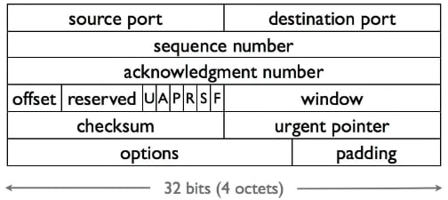

## 可靠通信——TCP报头

### 介绍

这段视频我将简要介绍TCP报头，如果你想了解更多信息，当然网上有大量的文档，但这只是一个简短的摘要来介绍报头中的字段和它们的意义。

标准的TCP报头是20字节长，所以你可以看到这里有5行，每行4个8比特，此外你在TCP报头之后还可以有**可选项(options)** ，这里我不打算讨论这些，现在你在大多数连接中看到的基本TCP头是20字节长。

TCP的前两个字段是**源端口(source port)** 和**目的端口(destination port)**，每个都是16位或2字节，所以我们谈论连接到网络端口80，表示目的端口是80。

接下来的两个字段是TCP序列号，表示从这个分组的源头到它的目的地，这个段中所包含的**数据的序列号(sequence number)** 是什么，以及来自该端点的**确认号(ACKnowledgment number)** 是什么。例如，如果我想确认收到了5000字节，然后序列号是4000，那么我将发送序列号4000和确认号5000。因此，如果我的序列号是4000，有500个字节的数据，那么这将意味着字节4000到4499。确认号为最后确认的字节号加1，因此，如果我发送4000到4499，另一方收到它，它将发送一个4500的确认号，即在TCP中，确认不是针对最后收到的序列号，而是**下一个该收到的序列号** 。

所以当我们谈论TCP ACK分组时，它们所做的是计算确认号。如果流量是单向的，在一个方向上发送大量数据，但没有数据返回；如果流量是双向的，那么这些确认号就会被添加或填充到数据段上，或者不填充，但在发送时纳入数据段。

在序列号和确认号之后，我们有一堆字段，让我们从**校验和(checksum)** 开始，所以校验和是通过TCP伪报头计算的，也就是TCP报头和IP报头。所以校验和涵盖了这个伪报头，然后是TCP段内的数据。

**窗口(window)** 字段是流量控制窗口，分组内的窗口字段告诉另一个端点，它的发送方有多少缓冲空间接收。所以如果你说有一个20000的窗口，这意味着在这个连接中不能有超过20000个未确认的字节。

这里U,A,P,R,S和F是控制位，让我们从一些不太常见的位开始：

- U是**紧急位**，意味着这个数据特别紧急，表示让我们快速到达应用程序。
- P是**推动位**，推动位说，请把这个数据推给接收应用程序。

其他四个位是ACK位，复位位，SYN位和FIN位，首先是ACK位：

- A表示ACK位，如果确认号码有效，这个位就被设置为1。
  - ACK位通常对每一个段都设置为1，除了第一个启动连接的段，因为当你启动连接时，你不知道对方的序列号是什么，所以你不能确认任何东西，所以ACK位没有设置。
  - 所以当我们谈论TCP设置时，看到第一个发送的分组没有设置ACK位，但连接中的所有其他分组都设置了。

SYN位用于建立相应的连接：

- SYN位表示，这是我的起始序列号，请同步到这个数字。所以当你第一次打开连接时，你发送一个分组，ACK位没有设置，但SYN位设置了，然后是一个序列号，你告诉终端，我想让你同步到这个序列号，这代表我的第一个数据字节。对方可以回应说，好的，我将确认这个序列号，并向你发送一个我的序列号，在这种情况下，这两个字段都是有效的。
- 然后你可以回应说，好的，我将确认你的序列号，现在我们已经同步了，你们都知道字节开始的时间。
- 所以有一个问题，尽管我总是可以在每个连接的两个方向上将我的序列号从零开始，但这样做会有真正的安全问题，这意味着人们可以猜到你的序列号是什么，他们可以开始穿插分组。这通常被视为一个坏主意，因为如果你有很多短的分组，这些序列号相似的分组可以在网络中长期存在，而你希望能够将它们过滤掉。

FIN位用于拆除相应的连接：

- F代表FIN，这是用来关闭连接的，所以当你设置FIN位时，你就告诉对方我没有数据可发了，所以他们经常在你发送FIN的时候进行交换，他们会确认FIN，然后发送带有名称或日期的FIN，不再发送数据，然后你确认对方发送的FIN。

最后一位是复位位，表示我们需要重置这个连接。

如果设置了**紧急位(urgent pointer)** ，则此紧急指针指向段中紧急数据的最终位置。

最后是**偏移字段(offset)** ，之所以需要偏移字段，因为TCP有可选项，而你不知道这个选项的报头在哪里，偏移字段告诉你，数据在这个段的哪个偏移处开始。所以，如果你有可选项，那么偏移量告诉你选项的偏移和大小。

### 小结

所以这就是基本的TCP报头，包括源端口和目的端口，数据的序列号，然后是你收到的数据的确认，偏移量字段告诉你数据在哪里开始，紧急，推送位为紧急数据或你想推送的数据。ACK位表示确认号是有效的。SYN位，用于同步序列号。 FIN，用于关闭连接，表示没有更多的数据可以发送。重置位，用于重置连接。流量控制校验窗口，用于确保数据中没有错误。最后是紧急位的紧急指针和选项。

