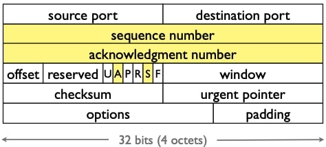
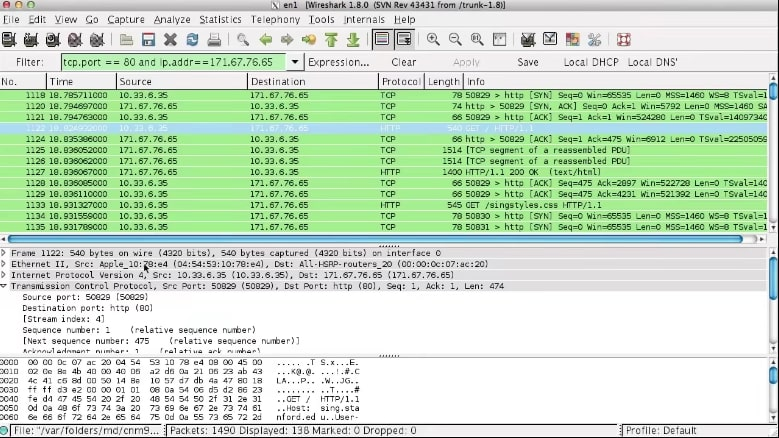
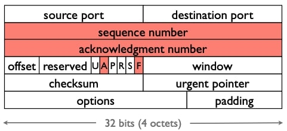
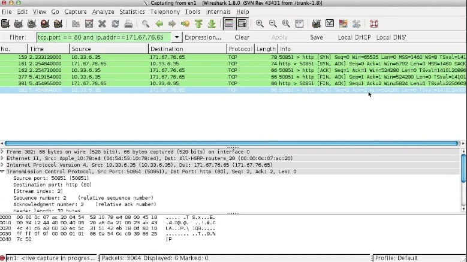
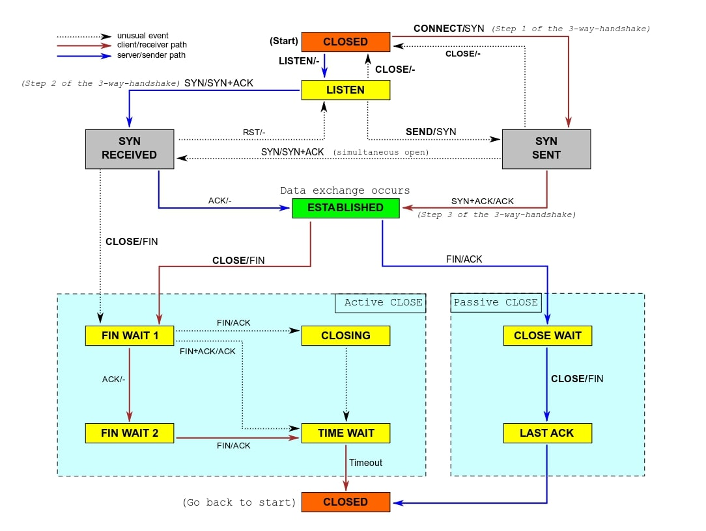

## 可靠通信——连接

这段视频我将深入探讨TCP连接的建立和拆除的细节，这比最初提出的较小的服务更深入。在一些案例和整个TCP状态图中，我们将看一个称为**三次握手**的东西，称为同步打开，这在今天的点对点应用中变得非常重要。

### 问题描述

所以这里的问题是，如果我们想可靠地通信，(事实证明)在连接的一端或两端**有状态**是非常有帮助的。你可以在一端或另一端在无状态的条件下进行来可靠地通信，但它的效率要低得多。

当然，有状态很好，会使你有更好的吞吐量等,但如果我们有状态，就会有这样的问题：

- **连接建立**：
  - 如何建立状态？
- **连接拆除**：
  - 何时拆除连接，即什么时候可以把这个状态进行清除回收并重新使用。

### TCP报头

所以这里是标准的TCP报头，黄色部分是如我们之前所见的用于连接的选项分别是**序列号、确认号、确认位和同步位**，在这里我将更详细地介绍三次握手过程，了解分组交换中发生的情况。

### 三次握手

回想一下标准的三次握手模型，我们有一个主动开启者和一个被动开启者。被动开启者坐在那里等待连接请求，比如一个网络服务器；主动开启者发起启动连接。

在第一步中，主动开启者发送一个设置了同步位(SYN)的TCP段，表示它正在将被动方同步到它的数据流的开始，同时它发送流的第一个序列号，所以让我们称它为$$S_A$$。出于安全原因随机化你的起始序列号是非常有帮助的，这意味着人们无法猜测你的流从哪里开始并尝试插入数据；如果有旧的分组在互联网上发送，这也是很有用的，有时你可能会在某个地方有巨大的延迟，如果你把你的起始序列号随机化，那么一些随机的片段或可能被破坏的段就不太可能与你自己的序列窗口重叠。

主动方发送一个SYN以及起始序列号$$S_A$$，被动方也响应一个SYN，说好的，我将会同步，我的起始序列号是$$S_B$$，尽管是被动的，但我也要设置ACK位，这意味着分组中的确认序列号是有效的，所以我将返回ACK和$$S_A +1$$，记住，节点确认的不是收到的最后一个字节，而是尚未收到的第一个字节。

通过发送ACK和$$S_A +1$$，被动方确认它收到了SYN，该SYN有效地由主动方接收，主动方响应它不需要发送SYN，因为它已同步、因此它发送一个分组序列号$$S_A + 1$$以及ACK和$$S_{B} + 1$$的确认号，表示它确认说我收到了你的SYN，现在这个初始分组的序列号是$$S_{A} + 1$$，然后是一个空段，只是为了建立连接。

事实证明TCP还支持另一种打开连接的方式，叫做“**同时打开**”。同时打开的工作方式是，对等程序都是主动的，它们都知道对方的端口号，双方同时发送SYN，所以这里左边的一个发送SYN和$$S_A$$，同时右边的发送SYN和$$S_B$$，然后左边响应并发送SYN和$$S_B +1$$，右边响应并发送SYN和$$S_A +1$$。

此时，我们现在已经建立了连接，双方都同步知道了开始的序列号，双方都是同步的，注意这需要四条信息，而不是三条。

小结：

- 主动开启者发送第一个分组
  - SYN + 序列号
- 被动开启者响应
  - SYN + 序列号
  - ACK + 主动开启者的SYN分组
- 主动开启者响应
  - ACK + 被动开启者的SYN分组
- 还支持“同时开启”
  - 两个SYN互相传递
  - 双方互相传递ACK

### TCP连接建立(无数据)

让我们看看一个标准的实际中的握手，所以这里我已经打开了Wireshark过滤80端口和某个IP地址，telnet到该主机的80端口，可以看到SYN, SYN/ACK, ACK。

这是第一个从我的主机发送到目的地的分组，我们可以看到同步序列号为0，没有发送ACK，也没有ACK位，所以确认字段无效。这个分组的序列号实际上并不是0，像Wireshark这样的工具为了使事情更容易阅读，他们使用相对序列号，显示相对于流的开始，你的序列号是什么。

现在你看到的是第二个ACK的分组，它也发送SYN，这里使用的同样是相对序列号0。

然后我的主机回应了一个ACK，所以你可以看到ACK 1，它确认了从服务器发送的SYN，然后它给出了一个序列号1，但它的长度为0，表示，你知道我这个分组包含了从字节1开始的流，但里面什么都没有，即实际上还没有数据。 

### 连接拆除

接下来我们将了解TCP是如何断开连接的，连接断开使用FIN位表示不再发送数据，使用ACK表示确认。

当TCP发送一个带有FIN位的分组时，这意味着发送方没有更多的数据要发送，即流的结束。由于TCP连接像大多数可靠连接一样是双向的，所以可能是一方完成了，但另一方有更多的东西要发送；只有双方都发送了FIN，才能完全拆除连接。

所以一个典型的交换拆除看起来像这样：

- A和B正在通信，A首先关闭，它发送一个带有FIN位的分组，序列号为$$S_A$$，确认序列号为$$S_B$$；
- B发送一个分组确认该FIN，为$$S_A+1$$；
- 然后是某刻，B决定需要关闭其连接端，所以它发送一个FIN，序列号为$$S_B$$，以及ACK和$$S_A+1$$；
- 最后A返回ACK $$S_B +1$$。

当然你也可以同时关闭，当他们并行发送FIN时，同样的交换发生得很好。

### 安全拆除

- 关闭套接字的问题 
  - 如果最终确认在网络中丢失怎么办？
  - 如果同一端口对立即重新用于新连接会怎样？
- 解决方案：“主动”关闭进入TIME WAIT 
  - 主动关闭是在接收到FIN之前发送FIN 
  - 保持套接字2MSL(“maximum segment lifetime”的两倍)的等待，大约一分钟左右
- 可能对服务器造成问题 
  - 操作系统在TIME WAIT中有太多套接字 , 减慢速度
  - HACK：可以发送RST和删除套接字，将SO_LINGER套接字选项设置为时间0 
  - 操作系统不会让你重新启动服务器，因为端口仍在使用中(SO_REUSEADDR选项可以让你重新绑定使用过的端口号)

### 连接拆除

所以让我们看看连接拆除是什么样子。

这是来自我的主机的FIN，Seq=1, ACK=1；然后服务器响应，表示它正在关闭，所以同样发送一个FIN，Seq=1, ACK=2。

### 完整的TCP FSM

