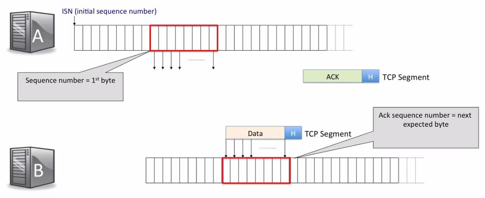

## TCP服务模型(TCP service model)

在这段视频中，你将了解到**TCP(传输控制协议)**为应用程序提供的服务，它被95%以上的互联网应用程序所使用。TCP几乎被普遍使用，因为它提供了几乎所有应用程序都需要的**可靠的**、**端到端的**、**双向的**字节流服务。

### 传输控制协议(TCP)

TCP是传输层的一个例子。当应用程序调用TCP时，它会将一些字节传递给另一端。TCP将这些字节放入一个TCP段，然后从那里取走它。TCP将该段交给IP层，IP层将其封装为IP数据报，同时IP地址被添加。接着IP数据报被交给链路层，链路层建立链路帧，添加链路地址(例如以太网地址)，然后将其发送到电线上。

### 对等TCP层通信

当两个应用程序使用TCP时，它们在两端的TCP对等体之间建立一个双向的通信通道。首先，TCP建立了一个从A到B的通信通道，然后建立了一个从B到A的通道。

我们把这种双向通信称为“连接”。在连接的两端，TCP维护一个状态机来跟踪连接的情况。我们将在另一个视频中看到状态机如何工作。

### 连接建立(3次握手)

TCP连接是通过主机A和B之间的3次握手来建立的。

首先，主机A向B发送一个消息，表明A的TCP层希望与B的TCP层建立连接。该消息被称为**SYN消息**，是同步(synchronize)的简写，A还发送了它将用于识别字节流中的字节的起始数字。如果它发送"0"，那么数字将从零开始。如果它发送“1,000”，那么数字将从1,000开始。

B以我们称之为**SYN+ACK**的方式回应。B发出ACK信号是因为B承认A的请求，并同意建立从A到B的通信。B的TCP层也向A发送SYN，表明B的TCP层想与A的TCP层建立连接。它也发送一个数字，表明字节流的起始数字。

最后，A回应一个**ACK**，表示它接受反向通信的请求。现在两个方向的连接都已建立。它们现在已经准备好开始向对方发送数据。

### TCP“字节流”服务

主机之间相互发送数据，就好像是来自一个连续的字节流。

假设时间从左到右增加，A旁边的字节流代表它要发送给B的字节。字节流可能预先存在——例如，它们是从描述静态网页的html文件中读取的。或者它可能是一个正在生成的字节流——例如从一个录像机中。无论哪种方式，TCP都将其视为一个字节流。

A和B的TCP层一起工作，以确保字节流被正确地传递给B的应用程序。

### 使用TCP“段”模拟

字节流是由TCP段传递的。A将字节流放入一个TCP段，交给IP层，由IP层将其送到B。B的TCP层提取字节，重新创建字节流，并将其送到B的应用程序。

在实际中，TCP段可能需要多次传输，以防途中有段被丢弃，或者A没有收到确认信息。

TCP段可以小到1个字节——例如，如果你在ssh会话中输入字符，每个字符都是一个一个地发送，而不是等待整个段的填充。当我们有很多数据要发送时，这不是很有效；所以我们可以一直填充TCP段直到最大IP数据报大小。

### 连接拆除

当A和B完成了向对方发送数据，他们需要关闭连接。我们说他们“拆除”连接，这意味着他们告诉对方他们正在关闭连接，两端都可以清理与状态机相关的状态。

主机A的TCP层可以通过发送**FIN消息**来关闭连接，FIN消息是FINISH的简称。

主机B确认A不再有数据要发送，并停止寻找来自A的新数据，这就关闭了从A到B的数据流。但B可能仍有新的数据要发送给A，并不准备关闭从B到A的通道。

一段时间后，B完成了对A的数据发送，现在发送自己的FIN，告诉A他们可以关闭连接。

主机A通过发送一个ACK来确认连接现在已经关闭。因为两个方向都完成了，连接现在已经完全关闭，状态可以安全地被移除。

### TCP服务模型

下面是一个总结TCP所提供服务的表格。前三个是TCP提供给应用程序的服务。正如我们刚才看到的，它在两个应用程序之间提供了可靠的字节流：
$$
\begin{array}{|r|l|}
\hline \text { 性质 } & \text { 行为 } \\
\hline \text { 字节流 } & \text { 可靠的字节传送服务。 } \\
\hline \text { 可靠的传送 } & \begin{array}{l}
\text { 1. 确认表明正确交付。 } \\
\text { 2. 校验和检测损坏的数据。 } \\
\text { 3. 序列号检测丢失的数据。 } \\
\text { 4. 流量控制可防止接收器超负荷运转。 }
\end{array} \\
\hline \text { 按序 } & \text { 数据按顺序发送到应用程序。 } \\
\hline \text { 拥塞控制 } & \text { 控制网络拥塞。 } \\
\hline
\end{array}
$$
它使用了四种机制来使通信可靠——换句话说，确保数据被正确传递：

1. 当TCP层收到数据时，它向发送方发送一个确认消息，让其知道数据正确到达。
2. 校验和检测损坏的数据。TCP报头带有一个涵盖报头和段内数据的校验和。校验和用于检测数据段在传输过程中是否被破坏，例如，由电线上的比特错误或由路由器内的内存故障造成。
3. 序列号检测丢失的数据。每个网段的报头都带有该网段中第一个字节的(在字节流中)序列号。例如，如果双方同意序列号从1,000开始，那么第一个段的序列号将是1,000。如果该段携带了500个字节的数据，那么下一个段将携带序列号1,500。如果一个网段丢失，那么序列号将是不正确的，TCP层会知道一些数据丢失了。它有可能在以后出现，也许它走了更长的路径，或者它可能已经丢失了，在这种情况下，发送方需要重新发送数据。
4. 流量控制可以防止接收器超载。如果主机A比主机B快得多，那么主机A就有可能通过快速发送数据来压倒主机B，以至于主机B无法跟上(发送速度)。TCP使用我们称之为流量控制的东西来防止这种情况的发生。在TCP中，接收方不断告诉发送方它是否可以继续发送；具体来说，它告诉发送方它的缓冲区有多少空间可以接受新数据。如果主机B落后了，空间就会下降，可能一直降到零。当它有更多的空间时，它会告诉A可以发送更多的数据。

TCP以正确的顺序向应用程序传递数据；换句话说，无论数据从应用程序发送到主机A上的TCP的顺序如何，这都与从TCP发送到主机B上的应用程序的顺序相同。如果数据段的顺序不正确，TCP层会使用序列号将其重新排序到正确的顺序。

最后，TCP通过控制拥塞为整个网络提供服务。TCP试图在使用网络的所有TCP连接之间平均分配网络容量。TCP的拥塞控制机制非常复杂，我们将用第四单元的全部内容来研究拥塞控制。

### TCP段格式

TCP段报头要比IP和以太网头长得多，也复杂得多。这是因为TCP连接是可靠的——为了使通信可靠，连接的两端需要交换更多的信息，以便他们知道哪些字节已经到达，哪些丢失，以及连接的状态。

下面是对TCP头中最重要的字段的一个快速总结。你不需要记住报头的布局，但你应该了解每个字段的作用。如果你需要参考，我推荐维基百科或Kurose和Ross的教科书。

**目标端口(Source port)** 告诉TCP层，字节应该传递给另一端的哪个应用程序。当一个新的连接启动时，应用程序告诉TCP要与哪个服务建立连接。例如，如果TCP要传输网络数据，它使用80端口，这是TCP的端口号。你将在后面了解更多关于端口号的信息，但如果你好奇，你可以在IANA网站上查找众所周知的端口号。搜索IANA端口号，你会发现数以千计的端口号被定义为不同的众所周知的服务。例如，当我们打开一个与ssh服务器的连接时，我们使用目标端口22。对于**SMTP(简单邮件传输协议)**，我们使用端口23。使用一个众所周知的端口号可以让主机B识别它应该与哪个应用程序建立连接。

**源端口(Destination port)** 告诉另一端的TCP层，它应该使用哪个端口来再次发送数据。在我们的例子中，当HostB回复HostA时，它应该把HostA的源端口号放在目标端口字段中，这样HostA的TCP层就可以把数据送到正确的应用程序中。当一个新的连接开始时，连接的发起者，在我们的例子中是主机A，会产生一个唯一的源端口号，以便将该连接与主机A和B之间到同一服务的任何其他连接区分开来。

**序列号(Sequence)** 表示TCP数据字段中第一个字节在字节流中的位置。例如，如果初始序列号为1000，并且是第一段，则序列号为1000。如果段长为500字节，则下一段中的序列号将为1500，依此类推。

**确认序列号告(Acknowledgment Sequence)** 诉另一端我们期待的下一个字节。它还表示我们已经成功地收到了直到这个字节号之前的每一个字节。例如，如果确认序列号是751，这意味着我们已经收到了直到第750个字节的每个字节(包括第750个字节)。请注意，每个段中的两个方向都有序列号。通过这种方式，TCP对向另一个方向移动的数据段进行确认。

**16位校验和(Checksum)** 是通过整个报头和数据计算出来的，并帮助接收方检测损坏的数据。例如，线路上的比特错误，或路由器中的内存故障。你将在后面的视频中了解更多关于错误检测和校验的内容。

**报头长度(HLEN)** 字段告诉我们TCP报头有多长。**TCP可选字段(TCP Options)** 是可选的。它们携带额外的、新的报头字段，这些字段是在TCP标准创建之后考虑并添加的。报头长度字段告诉我们有多少个可选字段存在，通常是没有的。

最后，有一堆标志用于从连接的一端向另一端传递信息。**ACK**标志告诉我们，确认序列号是有效的，我们确认到此为止的所有数据。**SYN**标志告诉我们，我们正在发出同步信号，这是建立连接的3次握手的一部分。而**FIN**标志表明连接的一个方向被关闭。最后，**PSH**标志告诉另一端的TCP层在数据到达后立即传送，而不是等待更多数据，这对于包含时间关键数据的短段非常有用，如按键，因为我们不希望TCP层在向应用程序传递数据之前等待积累许多按键。

### TCP连接的唯一ID

一个TCP连接是由TCP和IP头中的五条信息唯一识别的：

**IP源地址**和**目的地址**唯一地识别端点，TCP的**IP协议ID**告诉我们该连接是TCP。

**TCP的源端口**和**目的端口**确定了终端主机上的应用进程。总之，在任何时候，所有5个字段都能唯一地识别互联网上的TCP连接。

现在，这个唯一的ID只有在一些情况下才成立。首先，我们需要确保主机A，连接的发起者，选择一个唯一的源端口ID。我们需要确保它不会意外地选择它已经在主机B上与同一服务的另一个连接使用的相同的源端口号。主机A使用一种简单的方法来最小化(冲突)机会：它为每个新连接增加源端口号。该字段为16位，因此需要64k个新连接才能换行。

还有一个非常轻微的危险，如果主机A突然创建了很多与主机B的新连接，它可能仍然会绕过并尝试创建具有相同全局ID的两个连接。如果发生这种情况，来自一个连接的字节可能会与来自另一个连接的字节混淆。例如，如果某个TCP段在网络中以某种方式存在很长时间，卡在路由器缓冲区内或在临时循环中循环，则可能发生这种情况。

为了减少混淆的机会，TCP连接初始化时使用一个随机的初始序列号来指代字节流中的字节。虽然不是完全防骗，但它确实减少了混淆的机会。当主机A启动与B的连接时，它包括初始序列号，如果将在从A到B的字节流中使用。当B回复并启动从B到A的连接时，它为从B到A的字节流提供自己的初始序列号。

### 序列号

所以总结一下序列号是如何工作的。

从A到B段中的序列号包括第一个字节的序列号，偏移量为初始序列号。

从B返回A的段中的确认序列号告诉我们下一个字节B是哪个，偏移量为A的初始序列号。

### TCP：端口解复用

让我们总结一下TCP端口号的工作原理。

想象一下，右边的主机B提供两种服务。一个网络服务器和一个邮件服务器。

当Web客户端，例如主机A上的Chrome浏览器，想从B上的Web服务器请求一个页面时，它将数据发送给TCP。

我们假设TCP已经与B建立了连接，所以现在它只需要发送数据。它创建一个段，并使用目的端口80来告诉B它要求将数据发送到网络服务器。

主机A使用本地生成的源端口号，以便B在再次发送数据和确认时使用。

像往常一样，TCP段被封装成一个IP数据报并发送给B。IP+TCP报头带有TCP连接的唯一ID。

当IP数据报到达B时，TCP段被移除。TCP层看到该段是用于80端口的，并将数据发送到网络服务器。

### TCP滑动窗口

在接下来的视频中，你将了解TCP的其他功能。

你将学习基于窗口的流量控制，并阻止我们压倒接收方。你会了解到超时重传以及完成重传的不同方法。你将在第四单元中学习拥塞控制。

### 小结

总之，TCP在应用进程之间提供有序、可靠的字节流传输。

