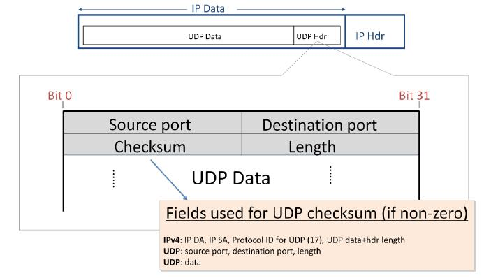
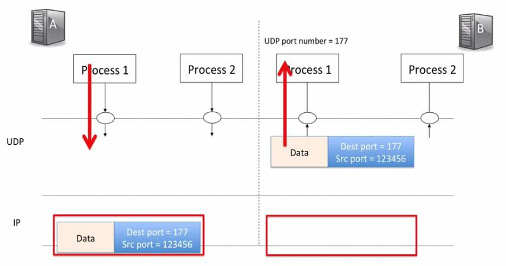

## UDP服务模型(UDP service model)

在本视频中，你将了解传输层的**UDP(用户数据报协议)** 。UDP被那些不需要TCP的保证交付服务的应用所使用，因为应用以其自己的专用方式处理重传，或者因为应用不需要可靠的传递。UDP比TCP简单得多，这就是为什么这个视频要短得多。UDP所做的只是获取应用数据并创建一个UDP数据报，然后把它交给网络层。UDP数据报确定了数据应该被发送到另一端的应用程序。

### UDP数据报格式

正如我们所期望的那样，UDP数据报被封装在IP数据报的数据域内。

UDP提供了非常简单的服务，这一点从UDP头中的少量字段就可以看出：不像TCP有十多个报头字段，UDP只有四个。

1. **源端口(Source port)**表示数据来自哪个应用。如果远端回复，它将发送一个以这个端口号为目的地的数据报，以便找到返回正确应用程序的路径。
2. **目的端口(Destination port)**表示数据应该传递给另一端主机的哪个应用。UDP中的端口号与TCP中的目的相同——它们将传入的数据包引导到正确的应用进程。
3. 16位**长度字段(Length)**指定整个UDP数据报的长度，报头加数据，以字节为单位。该值必须至少为8字节，因为这是UDP报头的长度。
4. 使用IPv4时，**UDP校验和(Checksum)**是可选的。如果发件人不包括校验和，则该字段将用全零填充。如果使用UDP校验和，则通过UDP报头和数据计算校验和。
   - 事实上，UDP校验和的计算也包括IPv4报头的一部分，如这里所示。计算包括IP源和目标地址以及协议ID(值为17)并告诉我们IP数据报携带UDP数据。你可能想知道为什么UDP校验和包括IP头的一部分——这不是违反了分层原则吗？是的，确实如此。违反分层原则，使用下面一层的信息的理由是，它允许UDP层检测到被送到错误目的地的数据报。

总之，UDP报头很小，因为它为应用程序提供的服务非常简单。它提供了一个简单的消息协议，用于从一台主机上的应用程序发送数据，这些数据可能会传递到远程主机上的应用程序，也可能不会传递到远程主机上的应用程序。

### UDP：端口解复用

如果主机A上的进程1有数据要发送给使用177端口的主机B上的进程1，该数据被放入一个新的UDP数据报中，目标端口为177。主机A添加自己的源端口号，这样任何回复都可以发送到主机A的进程1。

该数据报被封装在一个IP数据报中，并被发送到主机B。

主机B删除UDP数据报，并将数据指向进程1。

将UDP视为仅仅是一种解复用机制是很有用的，因为它做的仅仅是将UDP数据报流分割开来，并将其发送到正确的进程。事实上，有些人因为这个原因把它称为**用户解复用协议(User Demultiplexing Protcol)**——这基本上就是UDP的全部工作。

### 用户数据报协议(UDP)

总结一下UDP的服务模式，我们说它有以下三个属性，如表所示：
$$
\begin{array}{|r|l|}
\hline \text { 性质 } & \text { 行为 } \\
\hline \text { 无连接的数据报服务 } & \text { 没有建立连接。数据包可能以任何顺序出现。 } \\
\hline \text { 自包含的数据报 } &  \\
\hline \text { 不可靠的传递 } & \begin{array}{l}
\text { 1. 没有确认。 } \\
\text { 2. 没有机制来检测丢失或错误排序的数据报。 } \\
\text { 3. 没有流量控制。 } 
\end{array} \\
\hline
\end{array}
$$
首先，它提供了一个无连接的数据报服务。没有建立连接，因为不需要连接，所有的信息都是包含在数据报中的。这意味着数据包可能以任何顺序出现，所以如果应用程序关心顺序交付，它将需要自己重新排列数据的顺序。

UDP是一种不可靠的交付服务。它不发送任何确认来让我们知道数据到达了另一端。它没有机制来检测丢失的数据报。如果整个数据报在途中被丢弃，UDP不会通知应用程序，也不会要求来源方重新发送数据报。然而，应用程序可能会选择自己再次询问数据，本质上是在UDP之上建立一个重传机制。早期版本的NFS，网络文件系统正是这样做的。他们决定不使用TCP使用的滑动窗口，所以他们在应用程序中创建了自己的滑动窗口。

UDP听起来应该很像IP层所提供的服务。这是因为UDP只是在IP层的基础上提供了一个简单的包装，它可以将到达的数据引导到另一端的正确的应用程序。

那么，我们为什么要有UDP呢？它被那些不需要可靠传输的应用所使用，如简单的**请求——响应**应用。互联网用于将主机名变成IP地址的**DNS(域名系统)**使用UDP，因为请求完全包含在一个UDP数据报中。你将在后面学习DNS的工作原理，但现在你只需要知道，如果我们发送一个包含主机名的DNS请求，DNS服务器将响应一个IP地址，我们可以用它来向主机发送IP数据报。如果请求成功，那么使用UDP是轻量级和快速的，因为在进行查询之前不需要建立连接。如果请求不成功，它只是超时并重新发送。这使得DNS在大多数情况下简单而快速。**DHCP(动态主机配置协议)**也使用UDP。DHCP帮助新的主机在加入网络时找到它的IP地址。你的笔记本电脑在连接到WiFi时可能使用DHCP。我们稍后将了解更多关于DHCP的信息，但在此只需知道DHCP也是一个请求——响应应用程序，在一个UDP数据报中提出一个单一的、自包含的请求。**NTP(网络时间协议)**也出于同样的原因使用UDP。

一些应用使用UDP是因为它们对重传、拥塞控制、顺序传送有自己的特殊需要。一些实时流媒体音频和视频服务使用UDP。这种情况比以前要少得多，因为今天大多数视频和音频流的HTTP，使用TCP而不是UDP。

### 小结

总之，UDP在应用程序进程之间提供了一种更简单的数据报传输服务。

