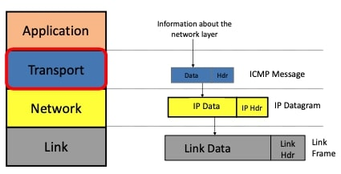
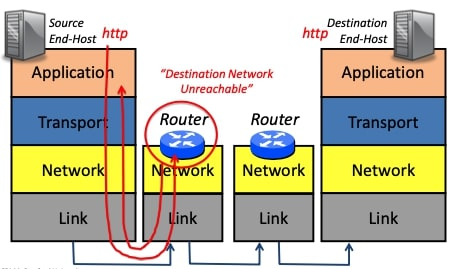
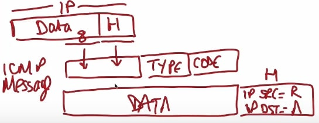
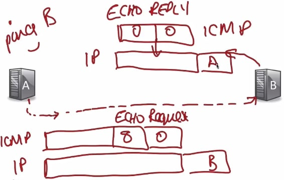
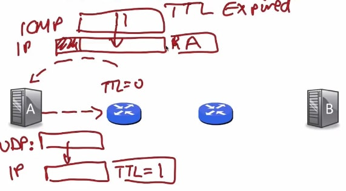
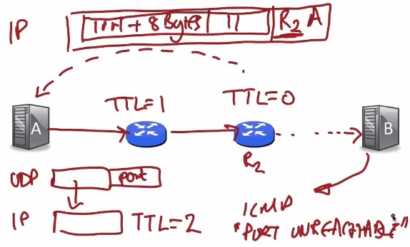

##  ICMP服务模型(ICMP service model)

在这段视频中，我将继续讲述四层互联网模型的主题，特别的，我将介绍**ICMP服务模型** 。


### 让网络层发挥作用

**ICMP**是**互联网控制信息协议**，它被用来报告错误和诊断网络层的问题。你会记得，IP并不提供任何关于交付的保证，但它确实有帮助，而且它将被证明是是一个非常有价值的工具，可以从网络层得到一些提示和信息，告诉我们什么时候出了问题。

我们用三种机制来使网络层在互联网上工作

1. 第一个我们已经看到的是互联网协议或IP：
   - 它创建IP数据报；
   - 然后将它们一跳一跳地从一端传递到另一端。
2. 第二是路由器内的路由表：
   - 在路由器内部，有一些算法运行来填充这些路由器转发表，以便路由器知道如何将它们一跳一跳地送到另一端。
3. 第三种机制，也是本视频的目的，是**ICMP(互联网控制信息协议)** ：
   - ICMP有助于在终端主机和路由器之间沟通网络层的信息。
   - 报告错误情况。
   - 帮助我们诊断问题，找出分组的路径等等。


### ICMP运行在网络层之上



ICMP运行在网络层之上，所以严格来说，它是一个传输层协议。

当一个终端主机或路由器想用ICMP报告一个错误时，它会将要发送回源的信息放入ICMP有效载荷中，并把它交给IP，作为数据报发送。

正如我所说，ICMP通常被用作报告错误的方法，事实上，如果你曾经看到目标网络无法访问的消息，你就会看到它。


### 例子



让我们看一个例子。想象一下，我有一个网络客户端(一个http或web客户端)作为应用程序在A运行，它将会访问在B的http服务器。因此，正如我们之前所看到的，应用层数据被放入http，进入TCP，然后进入网络层，沿着链路到达路由器。

这里的地址实际上是一个网络，而路由器在其转发表中没有关于这个网络的任何信息。现在这将是一个非常糟糕的情况，因为路由器不知道如何转发分组，但如果发生这种情况，那么路由器将发回一个信息，因此这将通过网络返回到A，它会说初始化目的地。这只是表示它没有办法把分组传送到B，所以它通过发回这个消息来提醒A，我们马上就会看到它使用的格式。


### ICMP服务模型

所以基本上ICMP服务模型是非常简单的，它会发送一个(自包含的)报告消息，来记录错误。它是不可靠的，因为它发送的是一个简单的数据报，不会试图重新发送，也不维护它所发送的信息的任何状态，它只是简单地发回一个摘要，说明问题是什么。

ICMP的性质总结如下：
$$
\begin{array}{|r|l|}
\hline \text { 性质 } & \text { 行为 } \\
\hline \text { 报告信息 } & \text { 报告错误的自包含信息。 } \\
\hline  \text { 不可靠 } & \text { 简单的数据报服务，不会重试。 }\\

\hline
\end{array}
$$
那么，当消息传入时，它是如何工作的？



这里是我的IP数据报，这里是报头，这里是我的IP数据报的有效载荷或数据部分，假设它刚刚到达。在之前的例子中，如果路由器想要发回一个ICMP消息，那么它需要一个报头，现在这个报头有源地址A和目标地址B，它将其填充到ICMP消息中，因此它将获取此报头并将其放入ICMP消息中；它还将获取A有效载荷的前八个字节，同样将其放入ICMP消息中；然后其标记一个类型和代码，我们稍后会看到这些类型和代码的一些例子。最后整个批次被放入一个新的IP数据报中，所以这是新IP数据报的数据，这将被发回，IP源将是路由器。


### ICMP消息类型

这是六个最重要的ICMP消息类型，你不需要记住类型或代码，这些可以在互联RFC 792中找到：
$$
\begin{array}{|c|c|c|}
\hline \text { ICMP类型 } & \text { ICMP代码 } & \text { 描述 } \\
\hline 0 & 0 & \text { Echo回复 (由ping使用) } \\
\hline 3 & 0 & \text { 目的地网络不可访问 } \\
\hline 3 & 1 & \text { 目的地主机不可访问 } \\
\hline 3 & 3 & \text { 目的地端口不可访问 } \\
\hline 8 & 0 & \text { Echo请求 (由ping使用) } \\
\hline 11 & 0 & \text { TTL过期 (由traceroute使用) } \\
\hline
\end{array}
$$
我们已经看到网络不可访问是类型3代码0，还有两个目的地不可访问：

- 主机不可访问这是指IP数据报到达最后一个路由器，但最后一个路由器不知道主机在哪里。
- 端口不可意味着IP数据报中包含的端口或协议id不知道如何处理，在另一端无法识别。

稍后我们将了解如何使用echo reply, echo request和TTL expired。


### “ping”如何使用ICMP

我们将看到如何使用echo reply, echo request和TTL expired。你之前可能已经使用过ping命令，而ping仅用于测试另一个主机的活跃度以及我们是否已连接到那个主机。

所以想象一下我们正在从A向B发送一条ping消息，所以我们在A处，运行命令`ping B`。



像[www.stanford.edu](www.stanford.edu)这样的主机，只需输入`ping www.stanford.edu`。

应用程序直接调用它发送一个ICMP Echo请求，这将是一条进入网络的消息。实际上，这是一个类型为8，代码为0的ICMP消息，表格中对Echo请求。然后它被封装到一个IP数据报，所以这是A的数据报，它将通过网络发送到B，我们希望最终它会到达B。

B将看到这个信息，B需要做的是发送一个Echo回复，以便它向A发送ICMP，A认为它是类型0代码0，这是IP数据报中的Echo Reply，这就是ping的工作原理。


#### 示例

```bash
╰─± ping www.stanford.edu
PING pantheon-systems.map.fastly.net (151.101.110.133): 56 data bytes
64 bytes from 151.101.110.133: icmp_seq=0 ttl=52 time=79.219 ms
64 bytes from 151.101.110.133: icmp_seq=1 ttl=52 time=82.476 ms
64 bytes from 151.101.110.133: icmp_seq=2 ttl=52 time=88.052 ms
Request timeout for icmp_seq 3
64 bytes from 151.101.110.133: icmp_seq=4 ttl=52 time=76.850 ms
64 bytes from 151.101.110.133: icmp_seq=5 ttl=52 time=73.548 ms
^C
--- pantheon-systems.map.fastly.net ping statistics ---
6 packets transmitted, 5 packets received, 16.7% packet loss
round-trip min/avg/max/stddev = 73.548/80.029/88.052/4.962 ms
```


### “traceroute”如何使用ICMP

现在让我们看看traceroute是如何工作的。

traceroute是一个应用程序，它告诉我们分组通过网络的路径以及它沿途访问的路由器，你可以通过简单地输入traceroute，然后输入web服务器的名称来尝试此操作。

traceroute不仅会告诉我们分组所采用的路径，还会告诉我们沿路径每个路由器的往返延迟。traceroute以相当巧妙的方式使用ICMP，其目标是找到A到B的路径上的路由器，所以它试图识别路径上的两个路由器，并测量从A到每个路由器的分组的往返时间，traceroute通过发送UDP消息来做到这一点。

我首先要描述它做了什么，然后我们再看看为什么它能起作用。

因此，A将发送一个UDP消息，它包含什么并不重要，但它将被封装成一个IP数据报，IP报头中的TTL(生存时间)字段被设置为1。路由器需要做的一件事是发回一个ICMP消息，所以一个类型11的消息发回给A，这是ICMP的TTL过期消息。为了使该数据包到达A，路由器将像以前一样采取IP报头，它将采取IP有效载荷的前8个字节，将与该ICMP一起填充到一个消息中。



如上图所示，这里是ICMP消息，这将是原始IP消息的摘要，我将把它放入一个IP数据报，在源地址会记录R(表示当前路由器)，在目标地址会记录A，最终它会被送回A。因此，当消息到达A时，A将从这个消息中知道有一个过期的TTL，从数据，ICMP消息的有效载荷部分，A将知道这来自最初从自己发送的消息。并且A知道第一跳路由器是R，通过测量它从发送原始IP消息到收到这个ICMP回复所花的时间，它现在知道到那个路由器的往返时间。



下一步可能是非常明显的，接下来A将发送一个UDP消息，并将其放入一个IP数据报中，该数据报的TTL为2。这是发送的IP数据报，当它通过第一个路由器，将TTL减为1，通过第二个路由器，将其减为0，然后这个路由器将发回一个ICMP消息。所以数据报将看起来像这样，我现在将画出带有整个ICMP消息的IP数据报。

这就是IP数据报，它将被送到一个我们称之为R2的地方，里面将是ICMP消息，类型为11，这表示TTL过期，然后它将有原始的IP报头加8个字节。所以当消息返回时，A知道这是来自于路由器R2的消息，并且可以测量往返时间。

A将这样做，直到最终消息找到B，A发送的UDP消息会故意选择一个B不知道的端口号，所以B会发回一个端口不可达的ICMP消息；所以当B发回端口不可达的消息时，A知道traceroute消息到达了B，并且知道traceroute已经完成。


#### 示例

```bash
╰─± traceroute www.stanford.edu
traceroute to pantheon-systems.map.fastly.net (151.101.110.133), 64 hops max, 52 byte packets
 1  10.159.5.254 (10.159.5.254)  15.463 ms  13.876 ms  15.066 ms
 2  10.159.0.2 (10.159.0.2)  12.338 ms  18.073 ms  16.765 ms
 3  58.40.160.245 (58.40.160.245)  20.324 ms *  26.383 ms
 4  * 58.40.160.245 (58.40.160.245)  23.423 ms *
 5  61.152.6.85 (61.152.6.85)  14.765 ms  14.795 ms
    61.152.50.133 (61.152.50.133)  12.058 ms
 6  101.95.89.82 (101.95.89.82)  24.283 ms  14.254 ms
    101.95.89.66 (101.95.89.66)  22.649 ms
 7  61.152.24.114 (61.152.24.114)  10.247 ms
    61.152.24.242 (61.152.24.242)  9.586 ms
    101.95.88.114 (101.95.88.114)  14.409 ms
 8  202.97.50.222 (202.97.50.222)  13.451 ms
    202.97.24.218 (202.97.24.218)  12.525 ms *
 9  202.97.90.33 (202.97.90.33)  8.406 ms  20.886 ms
    202.97.83.38 (202.97.83.38)  18.323 ms
10  202.97.94.10 (202.97.94.10)  76.119 ms  73.456 ms *
11  ae-3.r31.tokyjp05.jp.bb.gin.ntt.net (129.250.3.29)  98.023 ms  78.329 ms *
12  ae-2.r01.tokyjp08.jp.bb.gin.ntt.net (129.250.6.131)  79.241 ms  81.039 ms *
13  * * *
14  * * *
15  * * *
16  * * *
17  * * *
18  * * *
19  * * *
20  * * *
21  * * *
22  * * *
23  * * *
```


### 小结

- 总之，ICMP，互联网控制信息协议，向终端主机和路由器提供网络层的信息。
- 它位于IP层之上，因此严格地说，它是一种传输层机制，尽管它实际上是为网络层服务的。
- 常用的工具ping和traceroute都依赖于ICMP，我鼓励你试试这两个工具，玩玩它们，它们会给你提供大量关于可达性和互联网路径的信息。 

