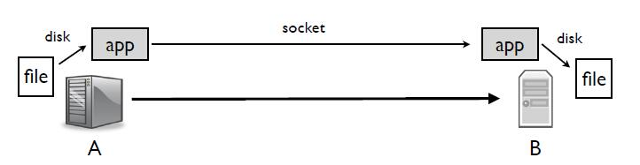
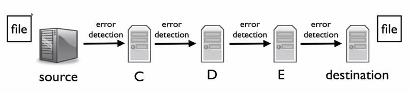
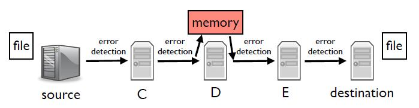

## 端到端原则(The End-to-End Principle)

端到端原则在互联网的设计中占有非常特殊的地位。这是因为它实际上指的是两个不同的原则：

- 第一个是关于正确性的：
  - 如果在设计网络系统时没有遵循端到端原则，那么很有可能它有缺陷，并且可能会错误地传输数据。
- 第二个，我们称之为“强”端到端原则，是更广泛和一般的。

### 应用程序的世界观

假设我们想从一台计算机向另一台计算机传输一个文件。我们的应用程序在A和B之间打开一个连接，它在计算机A上读取一个文件并将其写入TCP连接。B从套接字中读取数据并将数据写入计算机B上的一个文件。

在这种情况下，网络的作用很小，它只是将分组从A转发到B，A和B建立了连接，而应用程序则读写数据。

### 为什么网络不帮助(应用程序)呢？

为什么网络不做更多事情？事实证明，它可以做很多事情来加快文件传输速度。

- 网络可以自动压缩A和B之间的分组，如果文件是纯英文文本，这可以将传输大小减少10倍。
- 网络可以重新格式化或改进请求，比方说，A想向B传输两个文件。网络可以看到这一点，并将两个传输合并为一个请求。
- 可能是A的文件已经存储在另一台计算机上，即C，它比A离B更近更快，网络可以从C而不是A传输文件。
- 或者网络可以自动增加安全性，对数据进行加密，使坏人无法读取文件。如果网络为我们做了这些，那么我们就不必在我们的应用中担心这个问题。
- 网络可以增加移动性支持，这样，当计算机A在网络中移动时，路由会自动更新，分组会继续流向网络。有了这种支持，我们甚至可以在网络上迁移连接，将Skype视频流从我们的手机转移到我们的笔记本电脑上。

事实证明，网络可以做很多事情来改善我们的应用程序，使其设计更容易。但一般来说，它并没有这样做，为什么呢？

### 端到端原则

原因是**端到端原则**。端到端原则是由Saltzer、Reed和Clark在1984年的论文中首次描述的。在课程的后期，当David Clark做客座讲座时，你会见到他。他们描述的端到端原则是：

> “只有在通信系统端点处的应用程序的知识和帮助下，才能完全正确地实现相关功能。因此，将该功能作为通信系统本身的特征是不可能的。(有时，通信系统提供的功能的不完整版本可能是有用的，是一种性能的提升)。我们称这种推理方式为“端到端论证"。

换句话说，网络有可能做各种各样的事情来帮助，但这就是它所能做的也只是帮助。如果系统要正确工作，那么端点需要负责确保它的工作。除了端点，没有人有必要的信息来正确地做到这一点。网络可以帮助你，但你不能依赖它。例如，如果你想确保你的应用程序是安全的，你需要在应用程序中实现端到端的安全。网络可能会增加额外的安全性，但端到端的安全性只能由应用程序本身正确完成。因此，让安全成为网络的一个特征，从而使应用程序不必担心这个问题是不可能的。

### 例子：文件传输

让我们回到我们的例子：在两台计算机之间传输一个文件。正是这个问题，以及其他问题，导致Saltzer、Clark和Reed提出了端到端的论点。

你想确保文件完全无损地到达。文件数据将在源头和目的地之间经过几台计算机。因此，来自源的文件在到达目的地之前经过计算机C、D和E。

每个链路——源到C，C到D，D到E，E到目标——都有错误检测。如果一个分组在传输过程中被破坏，那么收件人可以检测到这一点并拒绝该分组。发送方会发现分组没有成功到达，例如通过TCP确认，并重新发送。

现在，人们可以说：“看，我知道这个分组不会在任何链路上被破坏，因为我有我的检查。既然它不会在任何链路上被破坏，它就不会被破坏。因此，如果它成功到达目的地，就不会损坏，表明文件成功到达。”这正是麻省理工学院的一些程序员所做的。由于网络提供了错误检测，他们认为它能检测到所有的错误。

这个假设被证明是错误的，由于这个错误，开发人员最终丢失了很多源代码。

事情是这样发生的，传输路径中的一台计算机，比如说计算机D，内存有问题，有时一些位会被翻转。D收到分组，检查它们，发现它们是正确的。然后它将把它们移到主内存中，这时它们会被损坏。接着它将转发分组，但由于错误检测发生在链路上，从链路的角度来看，分组看起来没有问题，它将通过E的检查。链路错误检测是为**传输中**的错误而设计的，而不是**存储中**的错误。

确保文件正确到达的唯一方法是进行端对端检查。当源端发送文件时，它包括一些错误检测信息。当目的地重新组装文件时，它将检查该文件的全部内容是否有任何错误。这是唯一可以确保文件正确到达的方法。网络可以提供帮助，但它不可能对正确性负责。

### 例子：TCP

作为另一个具体的例子，想想TCP。TCP提供了一个可靠的字节流服务。但这种可靠性并不完美。TCP有可能向你传送一些不好的数据，例如，因为你的TCP堆栈中有一个错误，或者一些错误在某处悄悄出现。所以，虽然TCP不太可能给您提供损坏的数据，但它也是有可能的，所以你需要对它发送的数据进行端对端检查。因此，如果您使用TCP传输文件，请进行端到端检查，确保文件成功到达。例如，BitTorrent就是这样做的。它使用TCP传输数据块，在每个数据块完成后，用哈希值检查它是否成功到达。

### 例子：链路可靠性

那么让我们回到TCP和可靠性上。如果你想要端到端的可靠数据传输，那么你就需要一个像TCP这样的端到端可靠协议。但按照端到端的说法，虽然你必须有端到端的功能以保证正确性，但网络可以包括一个不完整的功能版本作为性能增强。

无线链路层提供了这样一种性能增强。今天，有线链路层非常可靠(除非你的电线或连接器坏了)。但是，由于很多原因，无线设备并非如此。因此，虽然在有线链路上发送的分组通常有99.999%成功到达下一跳，但无线链路有时可能更接近50%或80%。

事实证明，TCP在可靠性低的情况下无法正常工作。因此，无线链路层通过在链路层进行重传来提高其可靠性。当你的笔记本电脑向接入点发送分组时，如果接入点收到分组，它会在几微秒后发送链路层确认，告诉你的笔记本电脑分组被成功接收。如果笔记本电脑没有收到链路层的确认，它就会重传，它会这样做好几次。使用这些链路层确认可以将一个可靠性只有80%的不良链路提高到99%或更高，这让TCP工作得更好。

如果没有链路层的帮助，TCP将正常工作——它将可靠地传输数据。但链路层的帮助大大改善了TCP的性能。

所以这就是端到端的原则。要想正确地工作，必须端对端地进行。你可以在中间做一些事情来帮助提高性能，但如果你不依靠端到端，那么在某些时候它就会崩溃。

### “强”端到端

端到端原则还有第二个版本，在IETF第1958号征求意见稿“互联网的架构原则”中有所描述。我们称它为“强”端到端原则：

> “网络的工作是尽可能有效和灵活地传输数据报。其他的事情都应该在边缘完成......”

这个端到端原则比第一个原则更强。第一个原则说，你必须在边缘实现一些东西，但你也可以在中间实现它，以提高性能。这个原则说的是不要在中间实现它，只在边缘实现。

强原则的理由是灵活性和简单性。如果网络实现了一项功能来尝试帮助端点，那么它就是在假设端点做了什么。例如，当无线链路层使用重传来提高可靠性，以便TCP能够更好地工作时，它就假设重传所增加的延迟是值得信赖的。这并不总是真的。除了TCP之外，还有一些协议，在可靠性并不重要的情况下，它们可能宁愿发送一个新的、不同的分组，也不愿重试发送一个旧的。但是，由于链路层包含了改进的可靠性，这些其他协议都被它卡住了。这可能而且确实是对创新和进步的一种阻碍。当层开始添加优化时需要假设上下层都做了什么，重新设计层就变得越来越困难。在WiFi的例子中，它是一个链路层，假定网络层和传输层的某些行为。如果你发明了一个新的传输层或网络层，它很可能会假设WiFi的行为方式，这样它就能很好地工作。这样，网络设计变得僵化，很难改变。

在长期设计和网络演进方面，强端到端论证是非常有价值的。紧张的是，在短期设计和性能方面，网络工程师和运营商往往不遵循它。因此，随着时间的推移，网络的性能越来越好，但变得越来越难改变。
