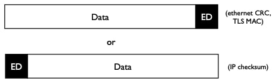
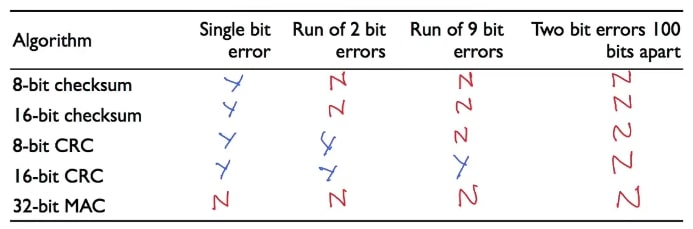

## 错误检测(Error detection)

网络并不完美，在其上运行的主机也是如此。它们会引入错误，而为了使网络能够正常运行，它需要能够检测到这些错误。例如，假设我们路径上的一个路由器有一个坏的存储单元，比如有时会在分组中翻转一个位。想象一下，如果被翻转的位是信用卡收费金额的最高有效位，我们需要能够检测到该错误的发生，这样我们就不会把损坏的数据当作正确的数据来接受。

今天的网络通常使用三种不同的错误检测算法：**校验和**、**循环冗余码(CRC)**和**消息认证码(MAC)**。它们中的每一个都有非常不同的特点。了解它们的差异是很重要的。实际上，我参加过IETF的会议，有几个人没有意识到其中的差异！如果你不知道(差异)，你可能会做出一个错误的协议决策或分析。

### 错误检测

在高层次上，错误检测看起来像这样：

我们有一个数据的有效载荷。我们在该数据上计算一些错误检测位，并将其附加或预附加到有效载荷上。例如，以太网附加一个循环冗余码(CRC)，TLS附加一个消息认证码(MAC)，而IP则预加一个校验码，放在IP报头中。TLS和以太网有一个报脚，即在有效载荷之后的协议信息，这里就是他们放置CRC和MAC的地方。

### 三种错误检测方案

三种常用的错误检测算法中的第一种是**校验和**：你只需要把分组中的所有数据加在一起。这就是TCP和IP使用的方法。校验和很好，因为即使是在软件中，它们计算起来也非常快速和便宜。当互联网开始时，一切都在软件中，所以这很有价值。校验和的主要缺点是错误检测保证非常弱。虽然它们可以捕捉到很多随机的错误，但如果两个比特的错误相互抵消，就很容易骗过只有两个比特的校验和。例如，如果一个比特错误增加了32，而另一个比特错误减少了32，那么校验和就不会发现这个错误。因此，校验和可以捕捉到很多错误，但它对将捕获哪些错误的保证非常弱。

三种常用的错误检测算法中的第二种是**循环冗余码(CRC)** 。CRC的计算成本比校验和高得多，但也更稳健。它计算多项式的余数——我将在几分钟内展示这意味着什么以及它是如何工作的。在今天的处理器中，这很容易做到，而且在硬件中也很容易做到。这就是以太网和许多链路层所使用的。在某些方面，TCP和IP可以不使用校验和，因为链路层使用CRC。如果你有一个长为c比特的CRC，CRC可以检测任何1比特的错误，任何2比特的错误，以及小于等于c比特的单次突发错误，以及任何奇数数量的错误。因此，它可以提供比校验和更强大的保证。

最后一种算法称为**消息认证码(MAC)**。消息认证码将分组与一些加密信息结合起来，生成一个值。从理论上讲，只有当某人拥有密码时才能生成或检查MAC。因此，如果你收到一个分组，而且它的MAC是正确的，那么你就非常肯定计算MAC的计算机拥有这个密码。除非我有这个密码，否则要为一个分组生成正确的MAC是非常困难的。因此，一个坏人不可能轻易生成一个新的分组。事实上，如果你有一个强大的MAC算法，那么给定一个分组和它的MAC，我没有任何关于如果我翻转一个位，MAC会是什么样子的信息。因此，消息认证码对恶意修改是很强大的。消息认证码用于传输层安全性协议(TLS)，这是安全浏览网页时使用的https。

但是，它们(MAC)实际上并不能很好地捕捉错误。如果我在一个分组中翻转一个位，那么改变后的分组将有1/2的机会具有相同的MAC！我看到人们在谈论纠错时犯了这个错误，认为MAC和CRC一样好。其实不然! 如果我有一个16位的CRC，我可以保证我可以检测到16位长或更短的错误序列。如果我有一个16位的MAC，我只能保证以非常高的概率检测到比特错误，即99.998%，或65,536分之一。这个概率很高，但想想你光看这个视频就收到了多少个分组。

现在我将更详细地介绍这些算法中的每一种。

### IP检验和

让我们从校验和开始。IP、UDP和TCP使用的是**补码校验和**。这意味着他们使用补码算法来计算分组，这是一些老式计算机使用的二进制算法的一个版本。今天大多数人使用二进制补码。

该算法非常简单。你首先将分组的校验字段设置为零。然后，你把分组中的每个16位字都加上去。任何时候总和大于65535时，你必须循环进位。所以60,000加8,000就是68,000-65,535+1，或者2,466。

一旦你把整个分组加起来，翻转你的总和中的位，使之成为分组的校验和。然后，如果你把整个分组加起来，包括校验和值，你应该得到0xffff。有一个特殊情况：如果计算出的校验和是0xffff，你不要让校验和字段为0，而是让它为0xffff。在IP、UDP和TCP中，校验和字段为0意味着没有校验和。

你只需用几行C语言代码就可以写出这些。它很快，很容易计算，也很容易检查。你所需要做的就是把一个分组的字节数加起来。鉴于大多数早期的互联网实现是在软件中进行的，这真的很有帮助。

缺点是，它真的不是那么强大。虽然它肯定能检测到大量随机错误，但它对检测到的错误所能提供的保证真的很弱。实际上，它只能保证捕获单比特错误。但它工作得很好，而且链路层为我们做了很多繁重的工作。

### 循环冗余码(CRC)

链路层用**循环冗余校验(CRC)** 来完成繁重的工作。CRC的思想是，我想把$$n$$比特的源数据，以某种方式提取成$$c$$比特的错误检测数据，其中$$c$$比$$n$$小得多。例如，我可能有一个1500字节的以太网帧，有一个4字节、32比特的CRC。USB和蓝牙使用16位的CRC。

当然，我们不可能检测到所有的错误。例如，如果我使用8位的CRC，那么在所有分组的空间中，有0.4%的概率，与任何给定分组的CRC相同。实际吃，对于长度为$$c$$位的CRC，有$$2^{-c}$$概率和其他分组的CRC相同。

但CRC比校验和更强大，它可以检测到任何具有奇数错误、2位错误或任何少于或等于$$c$$位长度的单一突发错误，单不能保证检测到除这些以外的错误。例如，一个16位的CRC不能保证它能检测到分组中间隔很远的两组3位错误，但它很可能会检测到错误。

链路层通常使用CRC。它相当健壮，可以增量计算，而且由于许多链路层容易受到突发错误的影响，CRC的突发检测能力很有用。在硬件中快速计算它们并不难，而且你可以在读或写分组时逐步计算它们。

#### Diversion：CRC的数学基础

CRC是如何工作的？它使用一种叫做多项式长除法将这$$n$$位提取成$$c$$位。你获取消息的位，用它们来描述一个多项式$$M$$。一个分组中的每个比特都是多项式项的系数。如果该位是零，该项就不存在。如果该位是$$1$$，则该项存在。

因此，例如，信息$$10011101$$是$$x^7+x^4+x^3+x^2+1$$，因为消息中设置了第7位、第4位、第3位、第2位和第0位。

当我们计算CRC时，我们有一个叫做**生成多项式**的东西。这是由CRC算法定义的。例如，USB使用的CRC-16算法的生成器多项式是$$x^{16}+x^{15}+x^{2}+1$$。由于令人沮丧的历史原因，生成多项式比它的比特数多一项：第一项总是1。所以CRC-16生成多项式被写成0x8005，尽管它有$$x^{16}$$。

要计算CRC，你需要获取信息$$M$$，然后用等于CRC长度的零来填充最低位，接着用填充后的值除以$$G$$(生成多项式)，剩下的就是CRC，最后它附加到信息上。

为了检查CRC，你用信息和CRC除以生成器多项式G。如果余数为零，则CRC通过。

我不会去研究数学上的细节，但事实证明，它可以在硬件上非常快速和有效地实现。你的CRC算法的强度取决于你选择的生成器多项式G：在这方面已经有很多研究，并且有很多好的选项具有我前面提到的错误检测特性。但是，如果你选择自己的生成器多项式，你可能不会得到同样的错误检测强度。

### MAC

你在网络中常见的第三种也是最后一种错误检测算法是消息认证码(MAC)。和CRC一样，消息认证码的工作原理也有深刻而丰富的数学背景：有好的，也有坏的。因此，你通常想使用一个现有的方案，而不是发明你自己的方案。值得庆幸的是，标准通常规定使用什么MAC，尽管在90年代末标准选择了糟糕的算法时出现了一些错误，但如今安全性已经足够重要，以至于每个人都依赖于少数真正经过充分研究的方法。

信息验证码使用密码学，这是一个处理秘密的数学分支。大多数信息验证码背后的想法是，双方共享一个密码$$s$$。这个密码只是一组随机生成的比特(随机的，所以很难猜到)。要计算一个消息认证码$$c$$，需要将MAC算法应用于消息$$M$$和密码$$s$$。MAC算法有一个特性，即如果你没有$$s$$，那么就很难为一个消息$$M$$生成正确的$$c$$。此外，要创建一个消息认证码为$$c$$的消息$$M$$非常困难。这意味着，如果你收到一个具有正确消息认证码的消息$$M$$，这意味着生成该消息的计算机可能拥有密码(或者有人重播了该计算机生成的消息)。

由于目标是保密，因此身份验证码具有有趣的特性。如果你改变了$$M$$中的一个比特，那么这将导致一个全新的$$c$$，其中$$c$$中任何比特为$$0$$或$$1$$的概率似乎是随机的。如果不是这样的话，那么有人就有可能拿着一个信息，翻转一个比特(例如，改变一个美元值)，产生正确的$$c$$也不会那么难。如果你翻转一个位，你可能最终会得到相同的MAC！这意味着信息验证码实际上没有错误检测保证。

消息认证码非常有用，但它们首先是一种安全机制。能够用一种机制同时获得错误检测和安全性是高效和很好的，但是它们的安全特性意味着它们的错误检测不如其他方法好。

### 测验

这是一个测验。对于每个错误检测算法，标记它可以保证捕获的错误(如果有)。CRC使用良好的生成器多项式，MAC算法具有很强的加密能力。

我们来看看答案。

两种校验和都能检测到一个单比特错误——记住这是校验和保证检测的错误之一。

两个CRC也都能检测到单比特错误。

一个MAC不能保证它能检测到单比特的错误。出于安全原因，可能新的MAC和旧的MAC是一样的。所以不能保证检测到它。事实上，MAC不能保证检测到任何错误！因此，我们可以为MAC的所有列标记No。

两位数错误如何？校验和不能保证检测到两个比特的错误。所以这两个都是N。不过，CRC可以保证检测长度小于或等于CRC长度的比特错误运行。由于2比特比8比特和16比特都短，所以这两种CRC都能检测到2比特的错误运行。相应地，8位CRC不能保证检测到9位的错误，但16位CRC可以。所以8位CRC为N，16位CRC为Y。

相隔100比特的两个比特错误如何？事实证明，这些算法都不能保证检测到这个错误，所以它们都是N。

看着这个矩阵，你可能会认为错误检测是一种浪费——这些算法的承诺非常少！但担保是一个非常有力的声明。虽然一个16位的校验和不能保证它能抓到9位的错误，但它有很大的可能会抓到。同样，一个16位的CRC有很大的概率可以检测到相隔100位的两个比特错误。而在实际中，很高概率往往是足够好的。如果故障很少，那么你只需要有时做一些更昂贵的事情来恢复。但这意味着在实践中你往往有多层错误检测：链路层用CRC检测，IP用校验和检测，TCP用校验和检测，然后往往应用程序有自己的错误检测。因此，所有这些加在一起，错误的概率是非常非常低的。

### 小结

所以我们已经看到了三种错误检测方案：校验和、CRC和消息验证码(MAC)。

- 校验和是快速和便宜的，但不是很强大，它们被用于IP和TCP。
- 循环冗余码要强大得多。今天，在硬件中计算它们是很容易的，而且它们可以检测到广泛的错误。链路层，如以太网，通常使用CRCs。
- 第三种算法是消息认证码，或MAC。消息认证码是为安全而设计的，但你也可以用它们来检测错误。然而，由于它们首先是为安全而设计的，这意味着它们对恶意修改确实很好，但对检测错误来说却不是那么强大。

数据错误检测是端到端原则的一个好例子。这实际上是该原则的最初动机——一个层能够确保它正确地进行数据通信的唯一方法是进行端到端检查：

- 以太网需要确保它的帧没有错误，这样它才能正确地解析它们，所以它有一个CRC。
- IP需要确保它的分组没有错误，以便它能正确地解析它们。IP不能依赖以太网为它做检查：以太网卡或驱动程序在检查分组后可能会引入一个错误。所以它必须在网络层做自己的端到端检查。
- 使用消息认证码(MAC)的TLS是另一个例子。它特别有趣，因为TLS的错误检测要求与IP或以太网非常不同：它想要安全。所以它必须提供自己的、端到端的错误检测方案，因为这是它能确保其要求得到满足的唯一方法。

