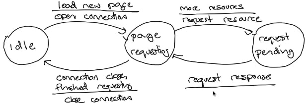

## 有限状态自动机(Finite state machines)

我将解释有限状态机，这是指定网络协议和系统时非常常用的东西。我还将解释它们在网络协议中的常见绘制方式。最后，我将向你展示作为TCP规范一部分的有限状态机，它定义了TCP连接的建立和关闭方式。因此，你会看到如何用有限状态机来描述像TCP的三次握手这样的事情。

### 有限状态自动机

如名称所示的那样，有限状态机是由有限数量的**状态**组成的。一个状态是系统的一个特定配置。我将从一个抽象的例子开始。在这个例子中，我们有三个状态：状态1、状态2和状态3。所以我们的系统可以处于这三种状态中之一。

状态之间的边定义了我们如何在它们之间转换。当我们画一条边的时候，我们首先指定**导致转换发生的事件**。在这下面，我们可以说明**发生转换时系统将采取的操作**。这一部分是可选的，因为不是所有转换都有与之相关的操作。但是如果有操作，你就应该指定它。否则你就有一个不完整的规范，人们可能无法正确地测试或实现它。如果系统处于一个状态，并且有一个没有描述转换的事件到来，那么FSM的行为就没有定义。

从一个状态可以有多个转换。所以这里我们有从状态1到状态3的第二个转换，这是一个不同的事件，它将使系统进入状态3。对于任何给定的状态，事件的转换必须是唯一的。在这个例子中，一个事件可以使状态1过渡到状态2，或者过渡到状态3。但是你不能让同一个事件与两个转换相关联，否则转换就会变得有歧义。如果事件发生，你是在状态2还是状态3？注意系统只能处于一个状态。

### FSM例子：HTTP请求

因此，让我们通过一个HTTP请求的例子来介绍FSM。实际上，HTTP请求比这要复杂一些，有各种各样的选项，所以在这个例子中，我们只用一个非常简单的形式。

让我们这样来描述我们的系统。在我们的起始状态下，我们正在查看页面或以其他方式处于**空闲状态(idle)** 。当我们想加载一个新的页面时，我们转换到**页面请求状态(page requesting)**。因此，事件是加载新页面，动作是打开一个与网络服务器的连接。一旦我们打开了连接，我们现在就处于页面请求的状态。当连接关闭时，或者当我们完成对页面上所有资源的请求时，我们将转换到空闲状态。

我们还需要一个状态，它描述了我们在请求页面中的位置。在有更多资源需要请求的情况下，我们采取HTTP GET请求资源的行动。这使我们处于请求**等待状态(request pending)** 。在收到响应的情况下，我们的系统又转换到请求页面的状态。

所以在这里我们有一个3个状态的系统：空闲状态、页面请求状态和请求等待状态。

一方面，这是一个不错的、简单的FSM。但如果你想实现它，它有很多地方没有说。具体来说，我们在系统中有4个事件：页面请求，更多请求，接收响应，以及连接关闭。那么，如果当我们处于请求等待状态时，连接关闭了，会发生什么？或者当我们在页面请求状态下收到一个页面请求时？或者在空闲状态下收到响应？

如果你想完全明确每个情形，你应该指定每个事件在每个状态下发生什么。但是这可能会导致复杂的FSM，它有大量的边。所以通常你只写下常见的情况，以方便理解，并有一些关于其他转换的支持文本。或者，在某些情况下，甚至可以接受不定义某些东西。例如，互联网工程任务组通常不会完全指定每一个FSM。其思想是，通过只指定互操作所必需的部分，你可以为未来的探索留下灵活的规范。当人们使用该协议时，他们会发现某些东西是否重要，如果是的话，可以在以后指定该额外的部分。

### FSM例子：TCP连接

图片来源：[https://en.wikipedia.org/wiki/File:Tcp_state_diagram_fixed.svg](https://en.wikipedia.org/wiki/File:Tcp_state_diagram_fixed.svg)

因此，让我们来看一个FSM的真实例子，可能是互联网中最著名的有限状态机。这张图描述了TCP的有限状态机。我知道它看起来很复杂，它有12个状态，但我会一点一点地浏览它，你会看到它是如何组合起来的。

首先，这张图实际上有四个部分，我们可以分别看一下。前面的4个状态是描述你如何打开一个TCP连接的。中间的状态，ESTABLISHED是TCP发送和接收数据的时候，它是在连接建立后但在连接关闭前。这6个状态描述了连接如何关闭。底部的这个状态，CLOSED，表示连接已经关闭，节点可以忽略它。请注意，顶部的状态也是关闭状态——在我们打开连接之前。

#### 简单介绍

回想一下，你开始一个TCP连接时要进行三次握手——SYN, SYN/ACK, ACK。客户端，或主动打开者，向监听连接请求的程序发送一个SYN，即同步消息。当服务器收到SYN时，它以SYN/ACK回应，同步并确认原始同步。主动打开者在收到SYN/ACK后，以ACK的方式作出回应。

这里的状态图描述了TCP三次握手双方的行为方式。一个被动的打开者是一个服务器。它监听来自主动打开者即客户端的连接请求。因此，当一个程序调用LISTEN()时，套接字从橙色的关闭状态过渡到黄色的监听状态。当这种情况发生时，协议不采取任何行动——它不发送任何消息。如果服务器在套接字处于监听状态时调用关闭，它将立即转换为CLOSED状态。

让我们从第一步开始了解三次握手，当客户端尝试打开连接并向服务器发送SYN分组时。我们可以看到连接客户端的第一次转换，即橙色箭头从CLOSED状态转换为SYN SENT状态。当客户端程序调用CONNECT(事件)并发送SYN消息时，就会发生这种情况。

因此，一旦发送了第一个SYN，客户端就处于SYN SENT状态，服务器处于LISTEN状态。当SYN到达服务器时，这导致了这个蓝色的转换。你可以看到该事件正在接收一个SYN消息。其动作是发送一个SYN/ACK消息作为回应。现在服务器处于SYN RECEIVED状态。

让我们跳回到客户端。记住，它处于SYN SENT阶段。现在，当它收到服务器的SYN/ACK时，它转移到到ESTABLISHED状态。它的动作是发送一个ACK消息，即SYN、SYN/ACK、ACK握手的第三个消息。现在客户端可以开始向服务器发送数据了。

最后，让我们回到服务器上，它处于SYN RECEIVED状态。当它收到来自客户端的ACK时，它过渡到ESTABLISHED状态，可以发送数据。

在连接开放过程中还有一些转移——现在不用担心，我将在连接建立和拆除连接的视频中详细讨论这些转移。

### 测验

这里有一个小测验。在这个测验中，假设没有其他关于TCP有限状态机的文档，所以没有支持性的文字描述来定义其他状态转换。

在第一个问题中，假设有限状态机开始时处于CLOSED状态。然后一个用户程序在套接字上调用LISTEN。套接字收到一个SYN消息，但在任何其他事件到来之前，用户程序调用关闭。该套接字将处于什么状态？

在第二个问题中，假设有限状态机开始处于CLOSED状态。然后一个用户程序调用CONNECT，在任何其他事件到来之前，用户程序调用CLOSE。套接字将处于什么状态？

第一个问题的答案是FIN WAIT 1。让我们来解释下原因。我们在CLOSED状态开始。然后用户程序调用LISTEN。我们过渡到LISTEN状态。然后套接字收到一个SYN，我们过渡到SYN RECEIVED状态。当处于SYN RECEIVED状态时，用户程序调用CLOSE。所以我们以CLOSE()为事件穿越边缘，进入FIN WAIT 1状态。

第二个问题的答案是CLOSED。我们在CLOSED状态下开始。然后用户程序调用CONNECT，我们过渡到SYN SENT状态。在SYN SENT状态下，用户程序调用CLOSE。在关闭事件上有一条从SYN SENT的边，回到CLOSED状态。

### FSM例子：TCP连接(续)

所以现在我们的套接字处于ESTABLISHED状态。他们正在交换数据。蓝框中的六个状态是TCP如何“断开”一个连接，或如何关闭它。谈论“关闭”一个连接有时是有用的，因为“关闭”这个词在系统调用方面有某种含义。正如我们将看到的，一个连接在一方“关闭”它之后仍然存在。

TCP建立连接的方式和关闭连接的方式之间是对称的。当连接建立使用同步或SYN分组时，连接断开使用的是finish或FIN分组。如果连接中的一方调用关闭，它就会沿着左侧的右边边缘转移到到FIN WAIT 1状态。这导致它向连接的另一方发送一个FIN包，这被称为“主动关闭”，因为它启动了这个操作。另一方收到FIN后，将右边的蓝色边沿转到CLOSE WAIT状态。它一直处于这个状态，直到它那边的程序调用CLOSE，这时它会发送一个FIN。

这里有点复杂。一个TCP连接是双向的，主动关闭者已经关闭了它的连接方向，所以它不能再写任何数据。但也可能是被动连接者有更多的数据要发送，所以它可以继续发送数据，由主动关闭者接收并确认。或者它可以关闭自己这边的连接，或者它甚至可以决定同时关闭连接，这样我们就有两个FIN分组在网络中相互交叉。

从主动关闭者所在的FIN WAIT 1状态来看，有三种可能的结果。首先，被动关闭者可能会确认FIN，但不发送FIN。在这种情况下，被动关闭者处于CLOSE WAIT状态，可以继续发送数据。这是最下层的边缘，主动关闭者进入FIN WAIT 2状态。其次，被动关闭者可能也会关闭它的一侧，确认FIN并发送自己的FIN。这就是中间的边缘，进入TIME WAIT状态。最后，可能是双方几乎在同一时间主动关闭，并相互发送了FIN。在这种情况下，双方都处于FIN WAIT 1状态。每一方都会看到另一方发出的FIN，但没有ACK自己的FIN。在这种情况下，我们过渡到CLOSING状态，当我们的FIN被确认后，我们转移到TIME WAIT状态，就像中间的边缘一样。

当我们收到对方的FIN时，TCP从FIN WAIT 2转移到TIME WAIT。然后它在TIME WAIT中停留一段时间，直到它可以安全地转移到到CLOSED。最后的蓝边，从LAST ACK到CLOSED，发生在被动关闭者的FIN被确认时。

### 小结

一方面，这里有很多细节。有12个状态，涵盖很多情况。但是你可以看到这个FSM是如何将之前的一些口语化描述转换成细节和精确的描述，试图在这些(口语化)描述的基础上实现一个正确的互操作的TCP将是很难的。这张图精确地规定了TCP的行为方式，因此非常有用。
