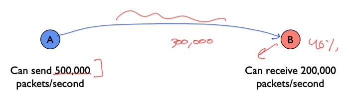
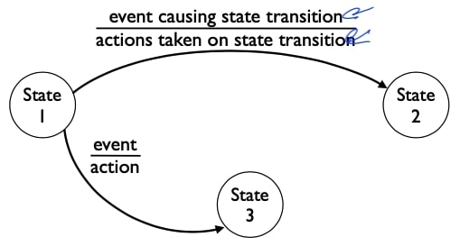
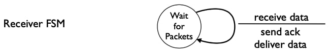
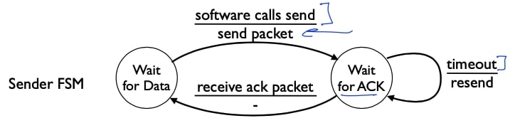
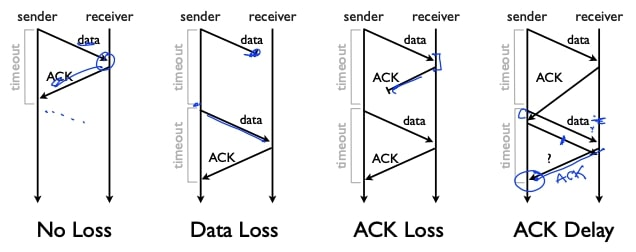
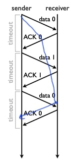

## 流量控制1——Stop and wait

这段视频是关于流量控制的，它是可靠高效通信的基本构件之一，描述了流量控制的基本原理及其最简单的实现，称为**停等协议**。

### 问题

流量控制试图解决的基本问题是，当发送方发送数据的速度超过接收方的处理速度该如何处理？这里我们有例子，发送方A每秒可以发送50万个分组，但接收方B每秒只能接收20万个分组，这可能是因为B有一个较慢的处理器，它的网卡没有那么好，或者其他什么原因。问题是，如果A以每秒50万个分组的速度发送数据，那么其中的30万个分组将不得不在B处被丢弃，即B无法处理它们，因此只有40%的分组会通过，A的努力被大量浪费，网络中的努力也被大量浪费，A没有理由以比B能接收的速度更快的速度发送数据。

### 流量控制

所以流量控制的基本方法是使发送方发送分组的速度不超过接收方处理分组的速度，这种方法通常是接收方给发送方某种反馈，不管是隐性反馈还是显性反馈，不管是放慢还是加快还是设定一个速率，今天大多数协议中使用两种基本方法：

- 第一种是视频中谈到的**停止等待**，这是一个非常容易实现的的有限状态机。
- 第二种是所谓的**滑动窗口**，将在后面的视频中谈到，滑动窗口有点复杂，但可以提供更好的性能。

### 有限状态自动机回顾

我们来复习一下有限状态自动机：上图是某个协议的有限状态机，显示了它可以进入的状态，这里是状态1，2，3，然后状态之间的边有两个信息，首先是可以导致状态转换的事件在上面，然后是协议在进行状态转换时采取的行动。

### 停止等待

停止等待算法非常简单：

- 在任何时候，从发送方到接收方最多只有一个分组在传送；
- 基本算法是发送方发送一个分组，然后等待接收方的确认；
- 当它收到确认时，如果它有更多的数据要发送，则发送另一个分组；如果它等待一段时间后达到超时(并且没有得到确认)，那么它认为分组已经丢失，要么被丢在路由器上，或者被丢到接收方，这时它再试发送一次原分组；

### 停止等待的FSM

#### 接收方

接收方有一个等待分组的单状态有限状态机，当它接收到新数据时，它发送确认；当接收到数据时，它发送该数据的确认，如果该数据是新的，它将该数据发送到应用程序：

#### 发送方

发送器的有限状态机有两个状态：

- 第一个状态是它在**等待应用程序的数据(Wait for Data)** ，这时它已经准备好发送，但应用程序还没有提供数据来发送。
- 当应用程序调用发送时，协议将发送一个或尽可能多的分组，然后进入**等待确认(Wait for ACK)** 状态，在这个状态下有两个转换：
  - 第一是如果它收到一个确认，那么它什么也不做，回到**等待数据(Wait for Data)** 状态，如果有更多的数据要发送，它将发送新的数据，或者如果没有更多的数据，它将等待直到软件调用发送；
  - 对于已经发送了一个分组但还没有收到确认的情况，它一直在等待，然后就超时了，所以要选择一个时间节点，(在该时间点之后)它非常确定数据或随后的确认已经丢失，所以它在任何时候都只有一个分组在网络中；

### 例子

这就是基本的停止等待算法，这里有四个执行示例。

- 第一种情况是没有数据丢失(No Loss)，一切工作都很完美。发送方发送数据，接收方收到后发出确认，现在发送方如果有更多的数据，就可以发送更多的数据。
- 第二种情况是数据丢失(Data Loss)。现在发送方发送的数据在网络中丢失了，因此，发送方超时并试图重新发送数据，所以它一直处于等待确认的状态，当任务超时了，它就重新发送。
- 第三种情况是数据被成功发送，但确认被丢失(ACK Loss)。现在发送方处于等待确认状态，超时后重新发送数据，然后导致接收方发送新的确认，此时发送方得到确认，并继续像第一种情况一样。
- 第四种情况有点复杂，它实际上显示了我之前描述的基本算法的失败，即发送方发送一些数据，接收方发送确认，但假设网络中发生了一些事情，突然链路变得非常慢，或者网络中某个地方出现了大队列，确认被延迟了(ACK Delay)。即发送方发送了一些数据，确认也返回了，但发送方在确认到达之前重新发送了数据，然后确认很快就到达了。所以现在发送方知道数据被确认了，然后它又发送了一个分组，但我们假设这个分组实际上丢失了：因为现在这个第一次重发，发送方不知道这个确认是针对旧数据的重新传输，还是针对新的分组，所以在这里我们会出现一个错误：
  - 如果它认为这是针对旧数据的重新传输，那么它只是为了跟踪那些有限状态机要跟踪的东西；
  - 如果它认为这是为了新数据，那么旧数据可能还没有到达，但它可能认为数据已经到达了；

### 重复

这是流量控制中出现的任何可靠协议中都会的一个基本问题，如何检测重复，即如何知道何时确认来自分组的重新传输是旧数据还是新数据。

在停止等待的情况下，我们可以用一位计数器来解决这个问题，想法是在所有数据确认和确认分组上使用这一位计数器：发送方发送data 0，接收方接收data 0，返回ACK 0，然后发送方发送data 1，接收方接收data 1，返回ACK1，以此类推。

现在接收器可以判断这是否是新数据或者是一个旧数据，所以你将能够区分data 0的重传确认和data 1的第一次传输确认。

这种方法做了简化的假设：

- 第一，网络本身没有复制分组；
- 第二，分组没有延迟多个超时；

