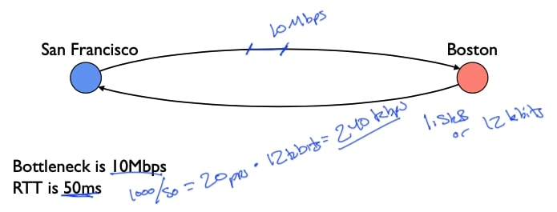
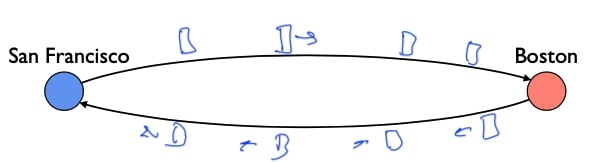
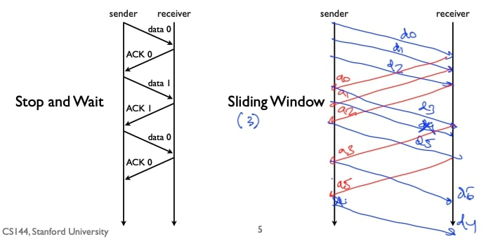
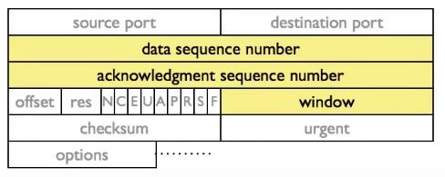
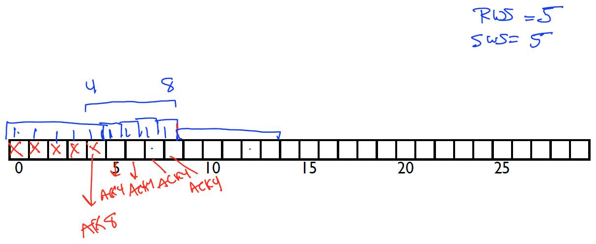

## 流量控制2——Sliding window

### 停止等待

这段视频中我要讲的是一种稍微高级的流量控制算法，叫做**滑动窗口**，今天在大多数高性能协议中使用。

所以请回忆一下之前介绍的简单流量控制算法，叫做停止等待：

- 任何时候最多有一个分组在发送；
- 发送方发送一个分组；
- 接收方接收数据时发送确认分组；
- 接收确认时，发送方发送新数据；
- 超时时，发送方重新发送当前数据；
- 使用1位计数器检测重复数据；

### 停止等待的问题

停止等待有一个主要问题，假设你想在波士顿和旧金山之间进行通信，瓶颈是10Mbps。所以这里有一个每秒10兆的链路，或者说波士顿节点以每秒10兆的速度接收，基本上这就是处理数据的速度。你的往返时间(RTT)是50毫秒，为了简单起见，假设我们在发送以太网帧，数据大小是1.5千字节或12千比特，让我们来计算一下每秒发送的数据大小：

- 现在(RTT)为50毫秒，这意味着旧金山可以发送一个，如果该分组成功接收，50毫秒后，它将得到确认。
- 每秒有1000毫秒，这意味着我们每秒最多可以发送1000/50=20个分组。
- 每秒20个分组乘以每个分组12千比特等于每秒240千比特。

所以旧金山和波士顿之间的这条路径使用停等协议每秒最多可以发送240千比特，假设没有分组丢失，恒定速率为50毫秒，那么瓶颈是10兆比特。

这意味着停等协议使用的是通信能力的2%，说明停止等待虽然有效，但效率却低得惊人，旧金山发送数据的速度可能比停止等待所允许的要快得多。

### 滑动窗口

所以大多数协议今天对这个问题使用的基本解决方案是一个叫做**滑动窗口**的方法，滑动窗口是停止等待的推广，停止等待在任何时候都允许一个分组在发送，滑动窗口协议最多允许$n$个分组在送，所以当$n$等于$1$的时候，滑动窗口协议的行为就像停止等待。

假设我们有一个滑动窗口协议，$n$等于$5$，这意味着旧金山可以有5个分组在发送，同时可以有5个确认，也许有5个确认从波士顿回来。这里的想法是，如果你能设置$n$为正确的值，那么你就能保持管道满载。

在这个特定情况下，RTT为50毫秒，瓶颈为每秒10兆比特，假设我们发送以太网帧，每个分组12千比特。我们每秒有有20个RTT，这基本上意味着滑动窗口将是每秒10兆比特除以20个RTT，基本上等于500千比特/RTT，所以我们看到的滑动窗口大约是41个分组：

计算过程补充：

- 1兆 = $10^6$；
- 每秒有20个RTT，所以如果要使得管道满载，每个RTT需要$10\times 10 ^6 / 20 = 500\times 1000$，即500千比特；
- 因为每个分组有12千比特，所以窗口大小为$[500/ 12]=41$；
  - $41\times 12 = 492$

### 例子

可以利用画图来比较区别：

左边是停止等待；右边是滑动窗口，假设滑动窗口的大小为3。

发送方将发送三个分组，我们称它们为$d_0, d_1,d_2$，然后接收方可以确认它们，即$a_0,a_1,a_2$，一旦$a_0$到达，发送方就可以发送数据$d_3$，一旦$a_1$到达，发送方就可以发送$d_4$，一旦$a_2$到达，发送方就可以发送$d_5$。

这是基本的想法，你可以有很多分组而不是只有一个分组，所以在有一个40大小的发送窗口的情况下，你可以想象可以传送多少数据。

所以让我们更具体地看看这个算法对发送方和接收方来说是什么样子的，就像我们对停止等待所做的那样。

### 滑动窗口发送方

- 在滑动窗口协议中，每段都有一个序列号，所以在像TCP这样的例子中，这通常是以字节为单位的，因为它们可以是可变大小的，为了简单起见，我们就以分组的编号为单位。
- 发送方保持着三个变量：发送窗口的大小(SWS)、从接收方收到的最后一次确认(LAR)以及发送的最后一个片段(LSS)，发送方的工作是保持这一不变性，即发送的最后一个片段减去收到的最后一次确认必须小于或等于发送窗口的大小，这意味着如果它收到了分组$n$，那么发送方不能发送超过$n$加SWS的分组。
  - 假设发送窗口大小等于5，最后收到的确认等于11，这意味着发送方不能发送超过16的分组，即在收到12的确认之前，不允许发送17。
- 当你得到一个新的确认时，你会根据需要提前发送，并缓冲到发送窗口大小的片段，以防突然得到一个确认。你想发送一大堆新的数据，让我们假设发送窗口大小等于3，分组为0, 1, 2, 3，并且0已经被发送并确认，所以LAR等于0，SWS等于3，这意味着最后发送的片段等于3，所以现在当确认到达时，比如说1，那么发送窗口可以前进，现在协议可以发送第4个分组，假设第4个分组的确认到达，那么窗口可以前进，它可以发送5、6和7。发送方不能将窗口推进到5，直到5被确认。
- 虽然窗口中的大部分数据已经被送达，但它不能超越第一个未被确认的数据，所以它不能将窗口推进到这个位置。

小结：

- 每个段都有一个序列号(SeqNo)
- 维护3个变量
  - 发送窗口大小(SWS)
  - 收到的最后确认(LAR)
  - 发送的最后一段(LSS)
- 维持不变量：(LSS - LAR) ≤ SWS
- 新确认到达时推进LAR
- 缓冲至SWS段

### 滑动窗口接收方

- 接收方同样维持3个变量
  - 接收窗口大小(RWS)
  - 最后可接受段(LAS)
  - 最后接收段(LSR)
- 维护不变量：(LAS - LSR) ≤ RWS
- 如果收到的分组 < LAS，则发送确认
  - 发送累积确认：如果收到1、2、3、5，则确认3
  - 注意：TCP ACK是下一个预期数据(例如，上例中的ACK 4)

### RWS, SWS和序列空间

接收窗口(RWS)和发送窗口(SWS)总是大于等于1，接收窗口(RWS)小于等于发送窗口(SWS)，这是因为如果接收窗口大于发送窗口，那就是在发送方永远没有分组的情况下浪费了发送空间，所以有这个额外的缓冲空间永远不会被使用。但是在有些情况下接收窗口可以小于发送窗口，而协议仍然有效。

因此，这里有一个有趣的基本情况，叫做"go back N"。让我们保存一个大小为1的接收窗口和大于1的发送窗口，在这种情况下，我们将需要发送窗口大小加一个序列号，那么这个协议是什么样子的呢？发送方说，让我们假设发送窗口大小等于3，所以发送方发送0, 1和2，让我们说这些都被确认，所以接收方确认0, 1和2。但当它确认0时，发送方将发送3个窗口向前滑动，当它确认1时，将发送4，当它确认2时，将发送5。如果3被丢弃了，发送方将超时并重新发送3，所以这被称为**"go back N"协议**，因为接收窗口的大小为1，接收方无法缓冲4或5，所以当单个分组丢失时，例如在这种情况下为3，发送方必须重新传输整个发送窗口的分组，它必须重新传输3, 4, 5，相反，如果接收窗口的大小是3，那么接收方可以缓冲4和5，发送方只需要重新3即可。

所以在**"go back N"协议**协议的情况下，你需要发送窗口大小加1个序列号，因为如果你只有发送窗口大小个序列号，例如0, 1, 2，然后回忆在**停等协议**中发生了什么，当有一个分组延迟时，假设0的确认被延迟，有一个超时，你重新发送0，现在你不能区分延迟的确认是否是为重新传输的 。如果两个窗口的大小相同(RWS = SWS)，则需要2WS序列号；一般情况下需要RWS + SWS个序列号，即需要的序列空间至少要和窗口大小的总和一样大。

这就是基本的滑动窗口算法和发送方和接收方使用的算法。

小结：

- RWS ≥ 1, SWS ≥ 1, RWS ≤ SWS；
 - 如果RWS = 1，"go back N"协议，需要SWS + 1个序列号；
 - 如果RWS = SWS，需要2SWS序列号 ；
- 一般来说，需要RWS + SWS序列号 ；
  - RWS分组处于未知状态(ACK可能/可能不丢失)；
  - 发送中的SWS分组不能溢出序列号空间；

### TCP流量控制

TCP是一个滑动窗口协议，(滑动窗口)用于流量控制，这里是TCP的报头，所以TCP的工作方式是设置接收方使用窗口(window)字段指定的流量控制窗口(以字节为单位)，基本规则是：

- 这里有数据序列号和确认序列号，TCP接收方只处理等于确认序列号加窗口的数据；
- 发送方不允许发送超过ACK加窗口大小序号的数据，以确保它不会发送接收方无法缓冲的数据，这是一种接收方设置发送窗口大小的方法；

### 滑动窗口例子

所以让我们通过一个例子来理解这点，在这里，我将再次以分组而不是像TCP中的字节来讨论。假设分组的序列号空间是0到29，接收窗口大小等于2，发送窗口大小等于3。

通信开始了，发送方将发送0、1和2，假设这三个分组都到达了，因此接收方收到了0，它将确认0，然后接收1，确认1，接收2，确认2。当发送方接收到0的确认时，它将推进窗口，并发送3，当它听到1的确认时，它将推进窗口并发送4，当它听到2的确认时，它就会推进窗口并发送5。

现在我们说，分组3成功到达并被确认，但现在我们有这样的情况，确认3已经被发送了，第4个分组丢失了，然后第5个分组到达了接收方，现在接收方将再次发送确认3，因为累积确认，现在发送方接收确认3，然后另一个确认3超时，因此它将重新发送分组4，假设分组4到达，现在接收方可以确认，所以它可以处理，但是因为它的接收窗口的大小是2，它实际上也缓冲了分组5，所以它也可以确认5，所以它会发回5。

### 滑动窗口流量控制

因此，滑动窗口流量控制算法允许未被确认的分组在发送中，如果你能适当地设置窗口大小，该协议允许发送方能够实际地充分利用接收方的容量，不像停止等待协议，当确认到达新数据时，你最多只能有一个分组在发送。发送方推进窗口，一般来说，滑动窗口协议使用累积确认，你使用的确切序列号空间取决于窗口大小，所以事实证明，TCP使用一个很大的序列号空间。如果你想真正稳健地应对严重延迟的分组，可以试试更小的值。

