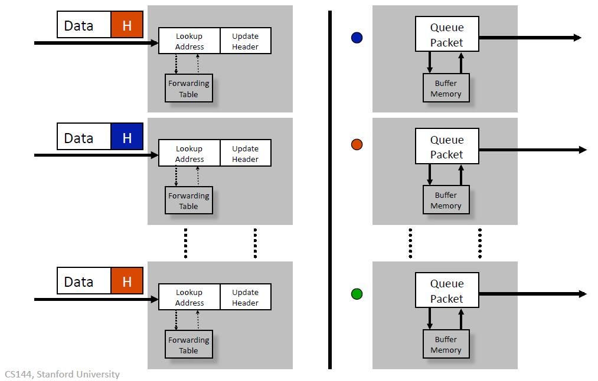
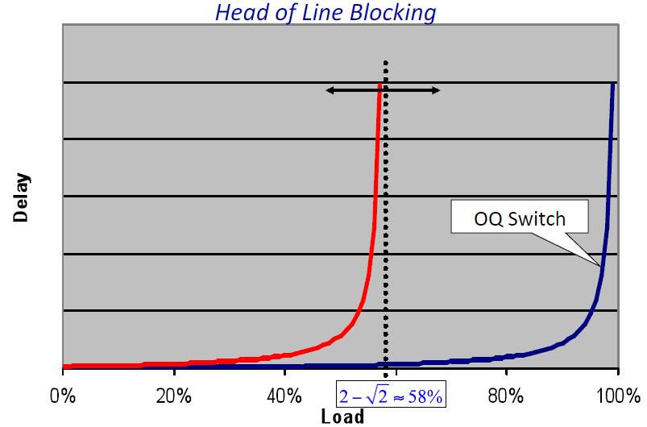

## 分组交换的工作原理(2)

这段视频是我们关于分组交换的第一段视频的延续。我们在第一段视频中看到，分组交换有两个基本操作，在转发表中查找分组地址，然后分组必须被交换或转移到正确的输出端口，以便在正确的条件下发送。

在上一个视频中，我们看到了如何在以太网交换机和互联网路由器的表中查找地址；在这段视频中，我将解释分组是如何被切换到正确的出口端口的，看看一些不同的技术，例如：

- 输出队列和共享内存；
- 输入队列和行首阻塞；
- 虚拟输出队列；

我们将看到并了解这些分组交换是如何实际构建的。

### 输出队列分组交换机

我将从基本的交换开始，也就是我之前给你看的那个，左边是地址查询，然后在这里是转发表，我们查询地址，然后我们有分组排队逻辑，最后是缓冲存储器，在拥堵的时候分组被保存在那里。

这里有三个分组到达，不同的出口端口由不同的颜色表示，所以顶部的红色分组会被送到这里的红色端口，也就是中间的端口。另一个红色分组在输出队列中等待，直到轮到它。

让我们来看看，当我们有分组到达时，在最坏的情况下，所有的分组在同一时间从外面进来，都想进入同一个输出队列，比方说这个队列，所以如果我们有$$n$$个端口，每个端口都以$$r$$的速率运行，在最坏的情况下，在这个输出$$Q$$中的写入率是$$r$$的$$n$$倍，而我们从这个队列中的读取率始终是$$r$$。在输出$$Q$$中，这个内存运行的总速率是$$(n+1)r$$，但令人沮丧的事情是，长期来看，这是不可能的，因为系统无法维持。只有有当某种机制像拥塞控制一样，将写入这个队列的平均速度控制在不超过$$r$$的时，这才会真正起作用。

所以感觉上，我们应该需要的最大速度是$$2r$$，这是我们要争取的，不幸的是你要付出$$n$$份惩罚，而$$n$$可能是一个很大的数字，可能是数百甚至数千。输出队列受到这个问题的限制，它们必须有运行速度非常快的存储器。在建立可扩展的输出队列时，寻找或使用存储器或创建一个运行速度足够快的存储器层，成为一个相当大的挑战。

### 输入队列分组交换机

解决这个问题的一个显而易见的方法是把队列从输出端移到输入端，让我们看看当我们这样做的时候会发生什么。

现在，现在分组的队列在交换机的输入端，这样做的好处也许一会儿就会显现出来。如果我们考虑到到达交换机的分组与之前的模式一样，两红一蓝，在这种情况下，我们要做的是，所有的分组都会通过交换机，只有一个需要保留，因为它的输出线很忙，而且输出端没有队列可以缓存它，所以我们在输入端进行缓存，然后等轮到它的时候，它就可以出发了，就像它从一个输出队列中出发一样。

从表面上看，好消息是，事情看起来是一样的，更好的消息是，这里的缓冲存储器现在只需要接受一个分组，最多是一个来自入口的分组，并且在一个分组时间内只需要向交换机发送一个分组，所以它的速度从$(n+1)r$下降到我们的最小目标$2r$，几乎减少了$n$倍，这造成了巨大的差异，由于这个原因，人们经常说，输入队列的交换机有更多的可扩展性。

### Head of Line Blocking

事实上，相当多的交换机都是这样做的，但有一个叫做“线路阻塞”的问题，这个问题你会在很多情况下看到，我想在这里解释一下。

让我举个例子，这是三个输入，代表交换机的输入，这些是输入缓冲器，我把交换机上的其他东西都拿掉了，只是为了让它更清楚一点。我们将看到分组到达这些地方：红色的到红色的输出口，黑色的到黑色的输出口，绿色的到绿色的输出口。想象一下，你有一个任务，决定哪个交换机发送哪个分组，你看这行的最前面的分组，发现它们都是红色的，问题是，你一次只能发送其中一个，所以在这个特殊情况下，我们只能发送红色的分组，尽管系统中还有绿色和黑色的分组可以发送到这些未使用的输出。但因为我们把所有的东西都安排成一个队列，所以我们得到了这种“线路阻塞”的效果。

### 虚拟输出队列

在这种情况下，我们有三乘三的输入队列，所以这里的队列是等待一个输出分组的FIFO队列，队列一输出红色，队列二输出黑色，队列三输出绿色。所以当分组到达这里时和以前一样，但现在它们被预先分类并放入对应的队列，这就是为什么我们称它们为虚拟输出队列。由于每个队列中的分组都去往同一个输出端，所以分组不会因为前面的分组去往不同的输出端而被延迟，即不会因为它的队首被挡住而阻塞。现在我们可以一次性传送所有三个分组，从而获得更高的瞬时吞吐量。

总的来说，好消息是我们把队列的速度降到了2倍，因为我们一次只能有一个分组进入和离开，我们能够维持和以前一样的吞吐量性能。

### 输出队列分组交换机

我们经常看到这样的图——分组的(平均)延迟图。这是一个分组所经(平均)延迟作为负载函数的关系图，基本上是入口队列的繁忙程度，任何排队系统能达到的最佳状态是这条曲线。上图对应于一个系统，当负载接近100%时，(平均)延迟增加，并趋近于100%。事实上，这就是我们将看到的输出队列，输出队列是完美的，因为你不能实现更高的吞吐量，也不能实现更低的平均延迟 。

#### 输出队列交换机的性质

让我们来看看输出型队列交换机的主要特性：

- 首先，我们说它们是工作保护型的，工作保护型是指当系统中有分组等待进入时，输出线路不会空闲，内部就没有阻塞来阻止分组进入该线路，这意味着只要该线路空闲，系统中就没有分组在等待。
- 因此，吞吐量是最大化的，因为你不可能有比保持所有线路繁忙更高的吞吐量。
- 预期延迟就会降到最低，因为我们总是在做有用的工作，把分组送到传出线路上。 

### 输入队列分组交换(线阻塞)

来看看在线阻塞情况下，输入队列分组交换负载和延迟的关系。这是一个众所周知的结果，吞吐量会减少，当崩溃时，这个渐近线趋近$$2-\sqrt 2$$或者大约58%，所以我们失去了几乎一半的系统性能，作为这个线阻塞的后果，实际数字会根据特定的到达模式而变化，但一般来说，这是一个非常糟糕的消息。

### 输入队列分组交换(虚拟输出分组)

但如果我们使用虚拟输出队列，这个58%的位置会向右平移，渐近线仍然是100%。

### 几句最后的话

我最后想说几句关于虚拟输出队列的话，虚拟输出队列实际上被广泛使用，你甚至可能在街上开车时注意到它们。

在美国，我们靠右行驶，有一个左转车道是很常见的，例如像这里显示的转弯车道，这是用来容纳即将到达的车辆，因为有另一条路来的车辆，所以这些车辆被挡住了，不能左转，直到没有另一条路来的车辆。然而，在这条车道上的汽车可以继续直行或向右转，它们不会因为前面的分组进入一个输出口而被耽搁或阻塞。在那些靠左行驶的国家里，右转车道也是很常见的。如果你看到了，请记住这是虚拟输出队列。

### 小结

- 我们已经看到了分组交换执行两个基本操作：
  - 他们在转发表中查找地址，我们在上一个视频中看到了以太网交换机和互联网路由器的例子；
  - 一旦他们决定一个分组要去哪里，他们必须交换到出口；
- 最简单和最慢的交换机使用**输出队列**，因为这可以最大限度地提高吞吐量，并最大限度地减少分组的预期延迟；
- 而更多可扩展的交换机通常使用带有虚拟输出队列的输入队列来最大限度地提高吞吐量；

