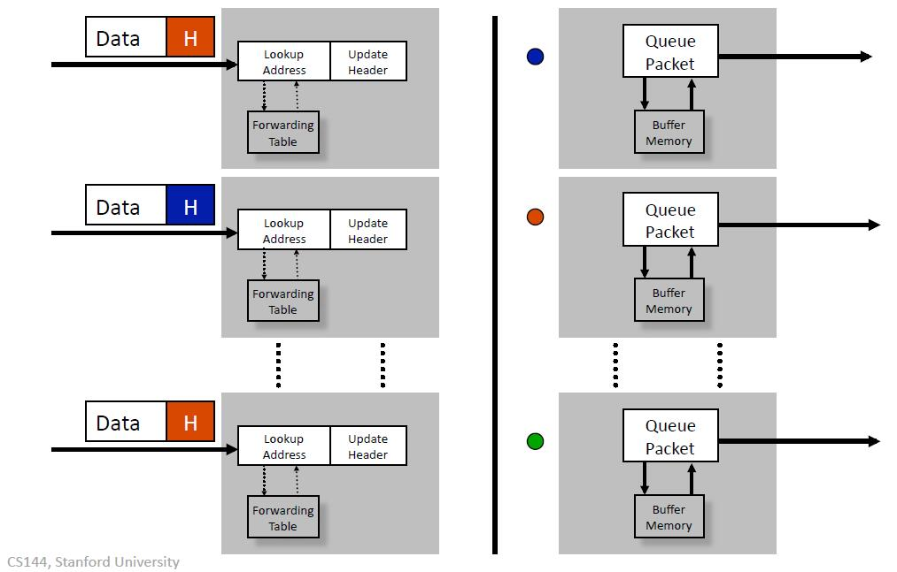
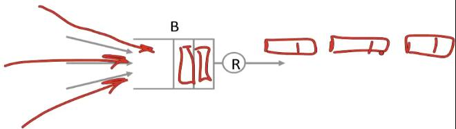
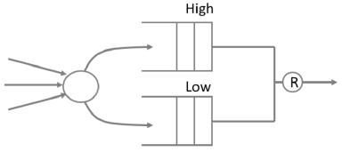
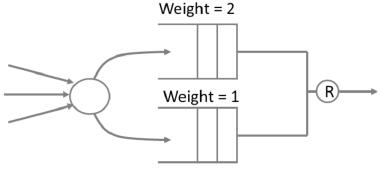
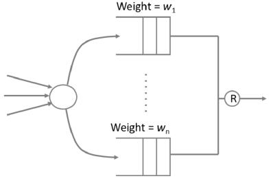
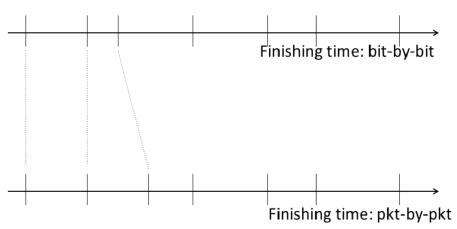

## 分组交换：严格的优先级和流速保证

在这段视频中，我将首先告诉你FIFO输出队列的一些缺点和它引起的一些问题，我将描述两种替代的交换机，它们提供严格的优先级，将流量分为高优先级和低优先级，并且能够为每个流经它的流量提供速率保证。

### 回顾

让我们开始回顾分组交换机的样子。这是我们之前看到的一个例子，在这个例子中，我们有三个分组到达，它们的地址将被查找，然后被切换到正确的输出。在这个特殊的情况下，两个红色的分组意味着它们将进入中间的红色输出，其中一个红色分组会排队，等待链路空闲，然后继续传输；蓝色的分组会被送到最上面，等待链路空闲，然后传输。

所以这里隐含的假设是输出队列是先进先出(FIFO)，是一个非常合理的假设，对于大多数路由器来说都非常合理，但是在我们接下来要看的内容中，我们要关注一个输出队列，看看先进先出的后果是什么。

### FIFO对所有分组都公平

FIFO队列的性质是Free For All。如果有许多流量通过队列，他们将按先进先出的顺序出发。谁发送的最多，谁就能得到最高的速率。如果有一个真正的大流量，那么小流量可能会被完全挤出。这会鼓励不良行为，因为流最好的做法是尝试通过尽可能快的发送将其他流挤出。

现在想象一下，有些流量是非常紧急的——例如控制流量，或一些重要的视频流量。FIFO没有任何方法来区分重要性。它只是说：如果你先到这里，而且队列里还有空间，你就是最重要的分组。

对于共享队列的每个流的速率，我们不能说任何有意义的事情。

请注意，如果一个分组确实进入了队列，它需要等待的最大时间是$$B/R$$。我们以后会用到这个观察结果。

### 概要

在这段视频中，我们将看看我们如何能给予某些流比其他流更高的优先级；以及我们如何为每个流提供不同的服务速率。

### 严格优先级

想象一下，我们用两个优先级队列取代输出端的单一FIFO队列：一个高优先级队列和一个低优先级队列。

当一个分组到达时，我们根据它的重要性来决定把它放在哪个队列中。

然后，因为有严格的优先级：规则是我们总是先服务于高优先级队列。只有当高优先级队列是空的，我们才为低优先级队列服务。

其结果是，高优先级流量不会看到低优先级流量——它不受影响。这就像高优先级流量有自己的私人网络一样。

严格的优先级是很常用的，现在大多数交换机和路由器都支持它们。

确定一个分组将被放入哪个队列的一个常见方法是在分组报头标记其优先级。例如，IP头有一个叫ToS或TYPE of SERVICE的字段，我们可以在这里标记分组的优先级。

比如说，它可以被用来表示视频流量>电子邮件，或者控制>数据，或黄金用户>白银用户。

严格优先级对某些事情来说是可以的。但它让低优先级等待太久，所以你只能在有合理的少量高优先级流量时使用它。如果高优先级流量可能完全占用链路，我们就不想使用它。

### 加权优先级

取而代之的，我们可能希望这样做，一个队列中的流量比另一个队列中的流量权重更多；例如，上层队列中的流量可以以下层队列中流量的两倍速率提供。

我们可以把它推广到有$$n$$个队列的情况，每个队列有自己的速率。

我们在实际中如何才能做到这一点？

如果所有的分组都是相同的长度，那么这就很容易了。我们将服务第一个队列中$$w_1/\sum w_i$$个分组，然后是第二个队列中$$w_2/\sum w_i$$个分组，以此类推，然后重复。

这一切都很好，但真正的分组是可变长度的。它们可能短到64字节，也可能长到几千字节，也就是说，有2-3个数量级的变化。显然，如果我们想防止长分组挤掉短分组，我们必须考虑到分组的长度。

我们可以按轮为每一队服务，每轮给每个队列最多可提供$$w_i$$的服务。这样一来，他们就能得到正确的加权服务。然后，我们可以使用队列从所有的片段中构建完整的分组并将其发送出去。

### 实际可行的方案

"假设"我们逐位提供每个分组，需要弄清楚如果我们逐位提供服务，它将在什么时间完成。然后，按照他们会完成的顺序，逐位地提供所有的分组。

这是很简单的方法，非常聪明：

* 定义ROUND，作为访问和服务每个队列的时间。

* 在每一轮中，用队列$$i$$服务$$w_i $$比特。

* 以ROUND NUMBER为单位进行以下计算($$L_k$$为分组比特数，$$F_k$$表示完成的时间)：
  $$
  F_k= \mathrm{Max}( F_{k-1}, \mathrm{now} ) + L_k/w_k
  $$

现在按照$$F_k$$的大小顺序提供分组，也就是FINISHING ROUND。

有三个不错的特性：

1. 完成时间可以在分组到达时间$$T$$时确定。
2. 分组按照完成时间的顺序被送达。

这种方法被称为加权公平排队(WFQ)或分组通用处理器共享(PGPS)。

补充资料：

- https://blog.csdn.net/hopegrace/article/details/104551023

#### 完成时间

画出FINISHIN GROUND->FINISHING TIME的时间线。

在上面画出用ROUNDS计算的完成时间和系统中每个分组的实际完成时间之间的差额DELTA $$< L_{\max}/R$$。

勾画出使用ROUNDS计算的完成时间与系统中每个数据包的实际完成时间($$<L_{\max}/R$$)之间的差异，即DELTA。

这意味着从长远来看，DELTA被摊销了，而每个流量的速率只是：$$w_i/(\sum w_i) \times R$$

### 小结

- FIFO的队列是一种公平的方式：没有优先级，也没有保证率。
- 严格的优先级：高优先级流量"看到"一个没有低优先级流量的网络。如果我们有数量有限的高优先级流量，这很有用。
- 加权公平排队(WFQ)让我们给每个流量一个有保障的服务率，通过按逐位完成时间的顺序来调度它们。