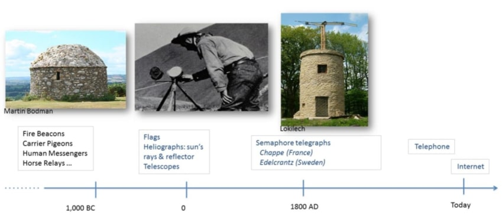
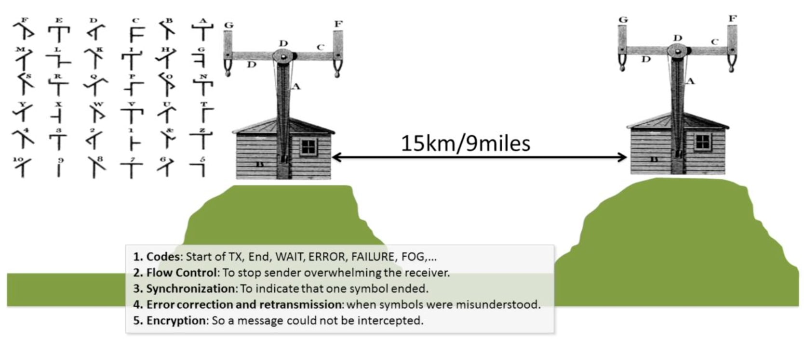
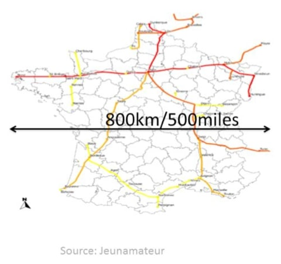
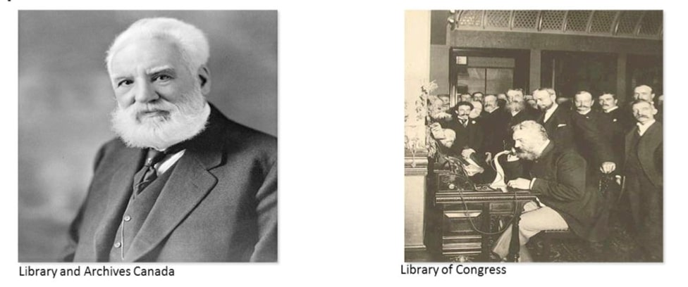
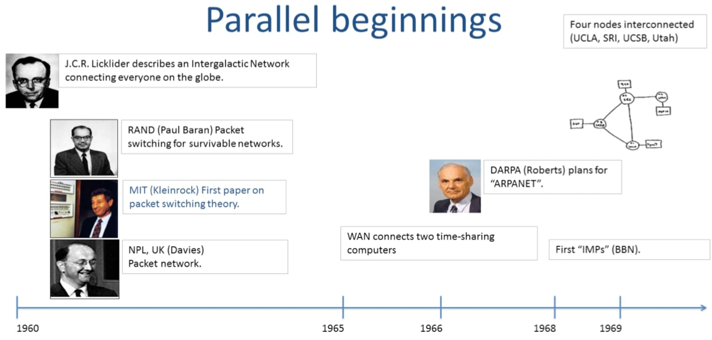
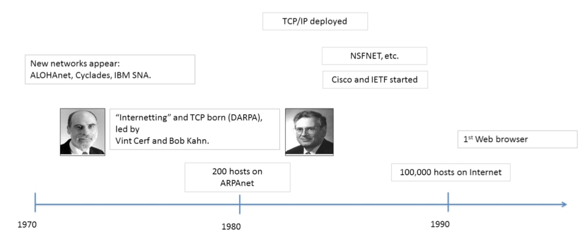

## 网络和互联网简史(A very brief history of networking and the Internet)

你会多次听到人们说，互联网深刻地改变了社会，这是自印刷机发明以来从未见过的。在这段视频中，我将向大家简要介绍20世纪60年代互联网发明之前的网络历史背景。

### 网络简介

让我们从简短的历史开始，了解信息是如何在远距离进行沟通的。

虽然今天我们对向世界的另一端发送电子邮件不以为然，但在3000年前，长距离的通信是非常困难的。

最早有记录的长距离通信是在公元前1000年左右，主要是为了军事进攻和防御的目的而设置的。火焰信标被用来发出敌人到来的信号，或使攻击同步进行。这是英国南部的一个火焰信标的例子。火焰信标传递信息的速度很快，在夜间危险最大的时候效果特别好，但它们传递的信息很少，一般来说，它们是开启或关闭，发出危险信号。

信鸽、人类信使和接力马已经在世界各地使用了数千年，因为它们可以携带更多的信息。但是，信息的传播速度比火焰信标慢，信使在传播过程中容易被拦截，该消息可能被读取、篡改或完全阻止。

有记录的最早的接力系统是两千到三千年前埃及和中国的马。它们在整个历史上都很常见。13世纪，马可·波罗描述了伟大的蒙古统治者忽必烈如何使用马接力。他的军队每40公里就有一个接力站，有400匹马等待接力骑手。直到19世纪，在美国著名的Pony Express中，接力马一直被用于邮件递送。这些早期的系统在传递信息(火)或传递速度(马、人、鸽子)方面受到限制。

大约2000年前，人们开始使用光学方法，如旗帜和日射仪，对字母、单词和数字等数字信息进行编码。这些系统以光速、有限的距离、有限的信息传输数据——它们基本上是简单的编码。

光通信的最大进步可能发生在1793年法国大革命前后，当时克劳德·查普(Claude Chappe)发明并开始建造信号电报网。

#### 电报

克劳德·查普(Claude Chappe)建造的塔楼有一个大的横向横梁(调节器)，有两个较小的手臂，称为指示器。它看起来像一个人在用他们的手臂发出不同的信号，手臂的位置表示一个符号。

1793年，法国政府建造了15个站点，覆盖190公里，每个站点间距13公里。到1804年，一个370公里的网络从巴黎延伸到第戎。该系统被用来发送各种信息，包括军事信息和突发新闻。大多数信息都是向巴黎发送的，以报告来自法国的各省的信息。操作员们变得相当熟练。最快可以以每10-20秒从站发出信号，并且可以在30分钟内穿越法国！他们每天可以发送大约3000个信号，相当于几百条信息。

为了使网络正常运行，法国和瑞典的光学电报系统发展了许多概念，这些概念至今仍在网络中使用，他们特别需要发展五个概念：

1. 第一是编码(**CODES**)：这些是表示字符以及控制信号的符号，如：开始发送，结束发送，"等待"或"冲突(当两个信号同时到达时)"，错误(取消最后一个代码)，优先级(在冲突的信息之间)，塔台故障，确认(来自远端的加密文本)，雨/雾表示"我们看不到你！"。
2. 第二是流量控制(**FLOW CONTROL**)，以阻止发送方压倒接收方。接收方告诉发送方放慢速度，因为它无法跟上。
3. 第三是同步(**SYNCHRONIZATION**)，以分辨一个符号何时结束，下一个符号何时开始，这有助于划分由几个符号组成的单词。
4. 第四个是纠错和重传(**ERROR CORRECTION AND RETRANSMISSION**)，当符号被误解时告诉发送方，这使发送方能够再次尝试发送符号。
5. 最后，他们使用加密(**ENCRYPTION**)，使信息不能被截获。

上图是克劳德·查普的电报网情况，到1830年，查普光电电报网非常广泛，覆盖了法国大部分地区。

#### 发明的四个步骤

我们可以描述一下直到1700年代通信网络发明的四个主要步骤：

1. 从大约公元前2000年开始，人类使用系统来发出一小套预先定义的信息，例如使用火焰信标。
2. 从16世纪开始，人们通过对整个字母表进行编码，开发了传输任意信息的系统。
3. 到17世纪初，数字编码开始被用于普通的单词和短语。这是最早的压缩形式，因为它需要在链路上发送更少的信息。
4. 在17世纪，编码被开发出来用于控制信号。他们可以传达何时开始和停止发送，何时放慢速度，如何重新传输等等。这就是我们今天所说的"协议"的诞生——关于两方或多方如何通信的规则。

#### 1800年的协议信号

到1800年，欧洲各地部署了许多不同的光学电报系统，使用各种不同的协议信号，比如说：

1. 初始化：表明我们即将开始通信。
2. 错误控制：删除，重新发送，停止/等待，选择性重复。这些都是用来重传沿途被破坏的数据，你已经在关于不同重传策略的视频中看到。
3. 流量控制："更快/更慢”，告诉发送方我们能不能跟上。

#### 1900年的电话网络

显然，当电话在19世纪末被发明出来时，通信方面有了巨大的进步。

一段时间以来，人们曾多次尝试提高现在连接美国许多城镇的电报网络的容量。

1876年，出生于苏格兰的发明亚历山大·格雷姆·贝尔(Alexander Graeme Bell)在与他的同事托马斯-沃森(Thomas Watson)进行的非常著名的电话通话中传输了第一个语音电话。

虽然他的专利被多次质疑，最明显的是被其他发明家埃利沙-格雷(Elisha Gray)质疑，但该专利经受住了法律的挑战，我们通常将这项发明归功于贝尔。

在10年内，超过15万人拥有了电话，到1915年，第一个横跨大陆的电话从纽约打到了旧金山。

### 互联网简介

最终导致互联网出现的一系列事件和发明始于1960年。

#### 并行的开始

1962年，麻省理工学院的J.C.R.Licklider开始写备忘录，并就他的Intergalactic网络概念发表演讲，在这个网络中，全球的每个人都是相互联系的，可以从任何地方访问任何网站的程序和数据。他谈到能够与他自己的"Intergalactic网络"的全国各地的研究人员沟通。这被广泛认为是对大型通信网络可能促成的社会互动的首次记录描述——非常像今天的互联网。Licklider从1962年起成为DARPA(国防高级研究计划局)计算机研究项目的第一个负责人。在DARPA期间，他说服了伊万·萨瑟兰(Ivan Sutherland)、鲍勃·泰勒(Bob Taylor)和麻省理工学院(MIT)研究员劳伦斯·罗伯茨(Lawrence G.Roberts)认识到他新的网络概念的重要性，他们在DARPA接替了他的职务。

1964年，研究员保罗-巴兰(Paul Baran)写了一篇现在被认为是关于大规模通信网络的第一篇学术论文。这篇论文的标题是："On Data Communication networks(论数据通信网络)"。大约在同一时间，伦纳德·克莱诺克(Leonard Kleinrock)发表了关于排队理论的文章。唐纳德·戴维斯(Donald Davies)在英国的国家物理实验室也在研究非常类似的观点。

1965年，拉里-罗伯茨(Larry Roberts)与托马斯-梅里尔(Thomas Merrill)合作，用一条低速拨号电话线将马萨诸塞州的TX-2计算机与加利福尼亚州的Q-32计算机连接起来，建立了有史以来第一个广域计算机网络。

拉里-罗伯茨于1966年加入DARPA，帮助制定第一个ARPANET计划，该计划于1967年公布。

1969年，第一批四个节点被安装在UCLA、SRI、UCSB和犹他大学，并发送了第一批信息。

这就是互联网在1969年的样子——它被称为ARPANET，是一个单一的封闭的、专有的网络。

到70年代初，一些不同的分组交换数据网络开始出现。

1971年，第一个分组无线网络在夏威夷群岛之间建成，称为AlohaNet。为ALOHA协议开发的机制影响了此后几乎所有的无线网络。

同样在1971年，Cyclades研究网络在法国建成。这是第一个将可靠通信的责任交给终端主机的网络，并深刻影响了互联网的设计。

1974年，IBM推出了整个数据网络堆栈，称为SNA，即系统网络架构(Systems Network Architecture)。它的目标是降低建立具有许多电传终端的大型时间共享计算机的成本，而不是使用穿孔卡进行批量处理。

DARPA赞助了"Internetting"的工作，以创建第一个"网络的网络"，将世界各地的网络连接起来。1974年，文特-瑟夫(Vint Cerf)(斯坦福大学)和鲍勃-卡恩(Bob Kahn)在一篇著名的论文中首次描述了Internetting所需的协议，标题是："A Protocol for Packet Network Intercommunication(分组网络互连协议)”。

TCP要求可靠的、按顺序的数据传输，并包括我们今天所说的网络层的大部分内容。在早期，没有拥塞控制的概念；大约15年后，它被添加到互联网中。

到20世纪70年代末，TCP和IP被分开，为UDP作为一种不可靠的传输服务增加了空间，最初是用于语音分组。

当时，文特-瑟夫(Vint Cerf)是斯坦福大学的助理教授。他于1976年调到DARPA，帮助指导新的互联网项目。他现在是谷歌的首席互联网传道者。论文撰写时，鲍勃·卡恩已经在DARPA了，他们一起被认为是互联网之父。

1983年，TCP/IP首次在ARPAnet上部署，当时每个人都升级并使用了新协议。

到1986年，美国国家科学基金会创建了NSFNET，使用56kb/s的链接将美国各地大学的超级计算机互联起来。其他小型网络开始在各地涌现，连接到互联网。

到20世纪80年代末，大约有10万个连接的主机。

然后，1990年左右，欧洲核子研究中心的蒂姆.伯纳斯.李(Tim Berners Lee)发明了万维网，1993年出现了第一批浏览器——最引人注目的是马克.安德森编写的Mosaic浏览器。

我仍然记得1993年我第一次看到网络浏览器的那一天，当时我还是个研究生。我们立即知道它将改变一切，但我们没有意识到这种改变会有多么巨大。对许多人来说，这是互联网的曙光，尽管我们当然都知道它比万维网还要早。但在一年之内，全世界有超过一百万人在使用网络。而在20世纪90年代末之前，雅虎、谷歌、亚马逊和eBay都将成为家喻户晓的名字。

#### 有用的参考

如果你想了解更多关于网络和互联网早期的情况，这里有三份我非常喜欢的优秀参考资料，我强烈建议你阅读它们，以了解更多关于导致现代社会惊人转变的原因。

1. The Early History of Data Networks G. J. Holzmann, B. Pehrson, IEEE Press 1994.​
2. The Design Philosophy of the DARPA Internet Protocols. D. Clark, ACM Sigcomm 1988.
3. Brief History of the Internet. B. M. Leiner, V. Cerf, D. D. Clark et al.
   1. [https://www.internetsociety.org/internet/history-internet/brief-history-internet/](https://www.internetsociety.org/internet/history-internet/brief-history-internet/)

