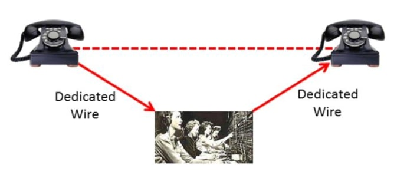
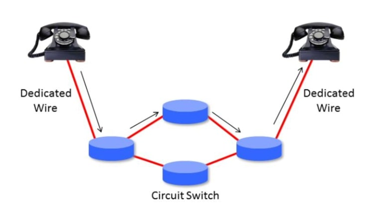
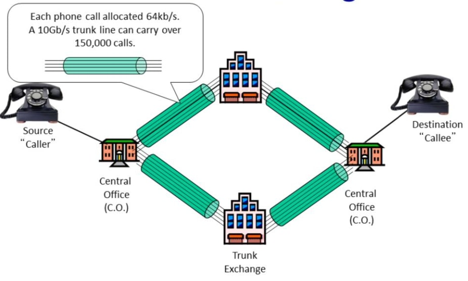
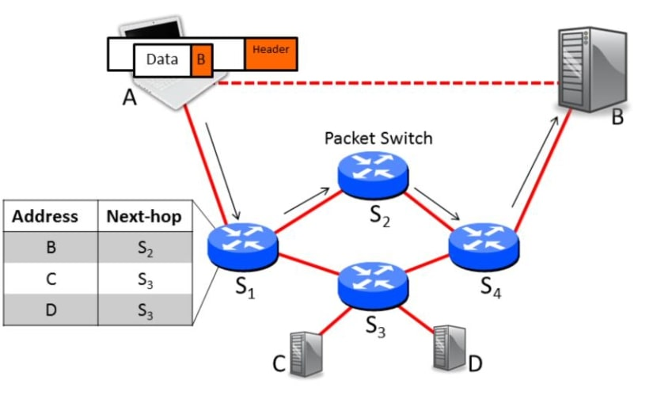
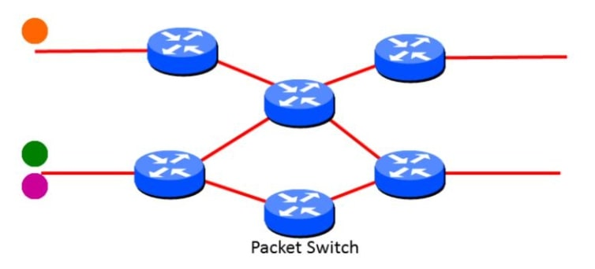
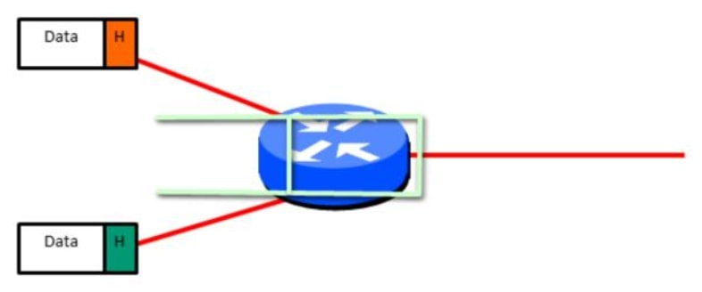
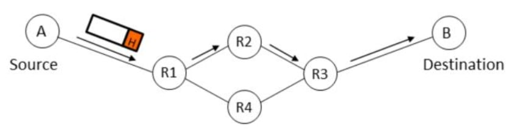

## 什么是分组交换？(What is packet switching)

在这个视频中，我将告诉你什么是分组交换，以及为什么互联网使用分组交换。

分组交换最早是由Paul Baran在20世纪60年代初描述的，分组交换描述了单个信息包在互联网上从源到目的地逐一路由的方式，就像信件由邮局递送一样。

分组交换真的很重要，因为当我们选择使用分组交换时，就决定了网络的许多属性。

### 什么是电路交换

我将解释什么是分组交换，以及为什么它被选择用于互联网。但首先，我需要告诉你关于分组交换的前身，即**电路交换** 。

#### 电路交换

电路交换最常见的用途是在传统的有线电话网络中。让我们来看看当我们从左边的电话打到右边的电话时会发生什么。

这些电话通过一条专用线连接到本地交换机。在早期，一屋子的总机操作员用一个大的跳线板来手动连接一部电话的专用线和另一部电话的专用线。重要的是，这条电线从电话的开始到结束都是专用于电话通话的。

如今，我们当然没有满屋子的接线员。相反，这些自动电路开关为我们设置了从我们的电话到另一端的朋友的电话的电路。意识到电话有三个阶段是有帮助的：

1. 首先，我们拿起听筒，拨出一个号码，在两部电话之间建立一个专用电路。每个开关都保持状态，将传入的电路映射到正确的传出电路。
2. 在第二阶段，我们进行通话。在数字电话系统中，我们的声音被采样和数字化，并通过专用电路发送，通常是64kb/s的语音。我们的电话谈话在整个路径上都有一个专用的电路或通道，而且这个电路不与其他人共享。
3. 最后，当我们挂断电话时，电路被移除，任何在路径开关上的状态都被移除。

在实际中，交换中心之间的主干线是非常快的，换句话说，它们的数据传输速率非常高。即使是慢速的主干线也能以2.4Gb/s的速度运行，而今天最快的主干线能以40甚至100Gb/s的速度运行。有时你会听到人们把这些主干线称为"大胖子管道"，因为它们可以发送大量的数据。但这些大胖子管道实际上是比你的一根头发还细的瘦小光纤。成千上万的电话在城市之间共享同一条主干线，每一个都有自己的线路。要记住的是，每个电话都有自己专用的64kb/s电路，不与其他人共享。

#### 小结

- 每个电话都有自己的私人的、有保障的、隔离的端到端的数据速率。
- 一个呼叫有三个阶段：
  - 端到端建立电路("拨号")。
  - 沟通。
  - 关闭电路("拆线")。
- 最初，电路是一条端到端的物理线路。
- 如今，电路就像一个虚拟的私人线路。

#### 问题

电路交换有以下几个问题：

1. **效率低下**：计算机通信往往是非常突发性的。例如，通过ssh连接打字，或查看一连串的网页。如果每次通信都有一个专用电路，那么它的使用效率就会很低。
2. **多样的速率**：计算机以许多不同的速率进行通信。例如，一个网络服务器以6Mb/s的速度传输视频，或者我以每秒1个字符的速度打字，所以一个固定速率的电路不会有什么用处。
3. **状态管理**：电路开关保持着每个通信的状态，这必须被管理。

### 什么是分组交换

#### 分组交换

在分组交换中，没有专门的电路来承载我们的数据。相反，我们通过添加报头来发送一个数据块，并将其称为一个**分组** 。头部包含了分组要去的地方的地址，就像一个信封告诉邮局要把一封信送到哪里一样。

一个分组交换网络由**终端主机**、**链路**和**分组交换**组成。当我们发送一个分组时，它被逐跳路由到其目的地，每个分组交换在其本地转发表中查找分组头的地址。

例如，这个分组的地址是B。当我们发送它时，第一个路由器在其本地表中查找地址B，并看到S2是下一跳。S2和S4做了同样的事情，分组最终被送到B。在互联网上有几种不同类型的分组交换，其中一些被称为**路由器**或**网关**，而另一些被称为**以太网交换机**。稍后我们将了解更多关于它们的信息。在这个阶段，你只需要知道它们都是分组交换的类型，并且它们根据报头中的目标地址转发分组。

当然，在任何时候都有许多分组在互联网上流动，所有分组都被逐跳地单独路由，它们都与其他去往不同目的地的分组共享路径上的所有链路。

#### 带有缓存的分组交换

我们将快速浏览一下分组交换内部的一些相关功能。

所以我们已经告诉你，分组交换有一个转发表，告诉它分组的下一步去向，它们还必须有缓冲区，让我解释一下为什么。

所以在这里我们有一个分组交换，它将接收我这里的两个分组，让我们看看这些分组在通过分组交换时发生了什么？如果它们同时到达，假设它们是以出站链路的全线速率到达的，那么分组交换在发送另一个分组时必须保留其中一个，不能同时发送，所以它将一次发送一个，由于它可能有许多传入链路，分组交换必须有一个缓冲区来容纳许多分组。我们将看到，这些这些缓冲区在实际中可以是相当大的，为了缓冲整个分组。在拥堵时期，当有大量的分组进来，这些输入链路都试图到达同一个输出端时，实际上可能有相当大的缓冲区来容纳分组。

所以总的来说，

- 分组是通过在路由器的本地转发表中查找地址来单独路由的；
- 所有分组都共享链路的全部容量；
- 我们不维护转发表以外的任何东西，没有与通信相关的每个流状态；

图示：

### 为什么互联网使用分组交换

为什么互联网使用分组交换，现在可能已经很明显了，但我真的想把它说出来，有三个原始原因，前两个原因非常非常明显，来自我刚刚描述的内容：

- 第一个原因是有效地利用昂贵的链路
  - 链路被认为是昂贵和稀缺的，第一批连接互联网骨干网的分组交换的链接以每秒几千比特的速度运行，所以它们是昂贵的，每个人都知道它们将成为稀缺的资源。
  - 分组交换允许许多突发流量非常有效地分享这些相同的链接，因为在任何一个瞬间，分组可以使用整个链路，但它(整个链路)可以立即被另一个分组使用，用于不同的通信。 
  - 因此，正如一本著名的教科书所言，电路交换很少用于数据网络，因为它对链路的使用效率很低。
- 使用分组交换的第二个重要原因是，人们普遍认为，分组交换允许更有弹性的网络，可以抵御链路和路由器的故障
  - 其原因是，因为每个分组都是沿着路径单独路由的，如果发生什么事情，如果链路断裂或路由器断裂，我们可以简单地将分组发送到不同的路径上，我们可以将它通过不同的链路发送到不同的路由器上，它最终会找到自己的路径。
  - 因此，由于这个原因，Tannenbaum和另一本著名的教科书说，为了实现高可靠性，互联网是一个数据报子网，所以如果一些线路和路由器被破坏，信息可以很容易地被重新路由。
- 互联网使用分组交换的第三个主要原因是互联网最初设计为现有网络的互连，当时几乎所有广泛使用的通信网络和计算机网络是分组交换的，所以如果互联网要连接所有现有的网络，那么它也需要进行分组交换。

除此之外，将信息分解成分组，可以在所有链路上并行传输，减少网络延迟。

综上所述，分组交换网络的好处可以概括为以下几点：

- 有效地使用带宽，这意味着一条主干链路使用的资源少于其支流的总和，因为它们复用并节约带宽；
- 在中间节点的状态很少；
- 鲁棒性很好，有些人声称它们的设计可以抵御核攻击；
- 没有一个我们需要得到许可才能进行实验的中央机构；

### 小结

好的，这是关于分组交换的第一个视频的结尾。现在，你应该能够很容易地回答这三个问题：

1. 什么是电路交换？
2. 什么是分组交换？
3. 互联网为什么使用分组交换？

在接下来的几段视频中，我们将学习更多关于分组交换的知识。一些基本定义，一些分组交换建模的方法，以及多年来发展起来的分组交换的一些特性。