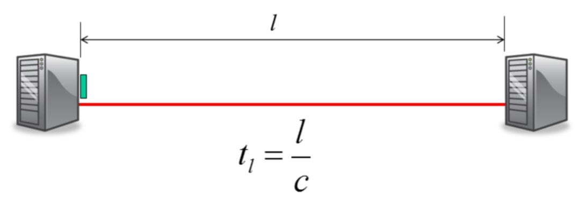
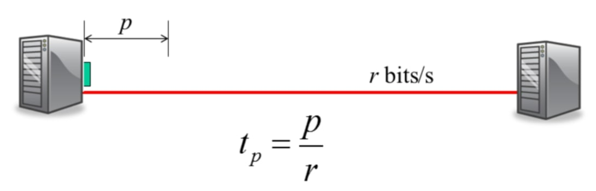
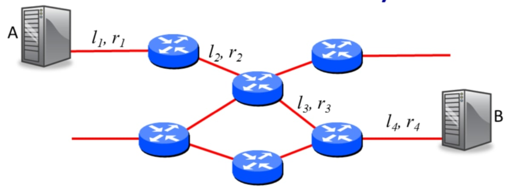
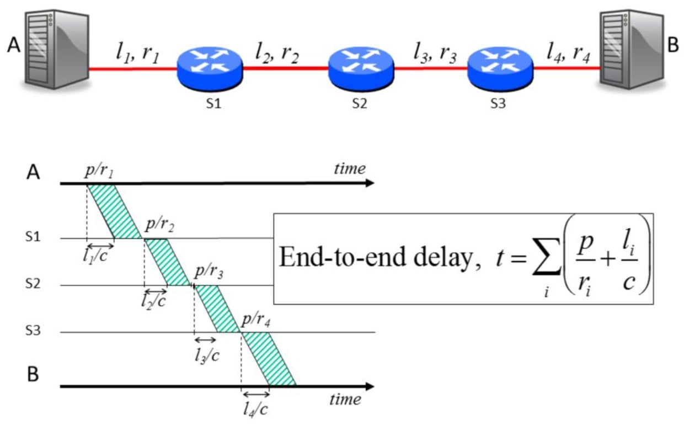
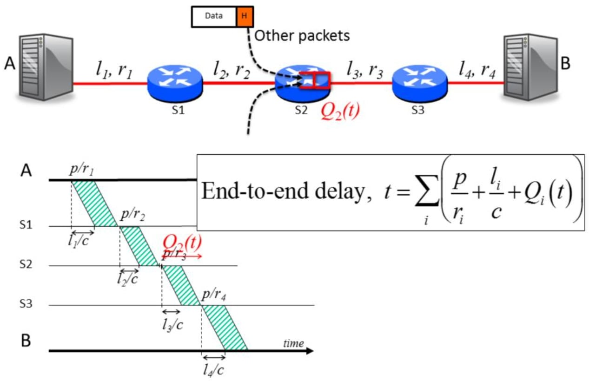
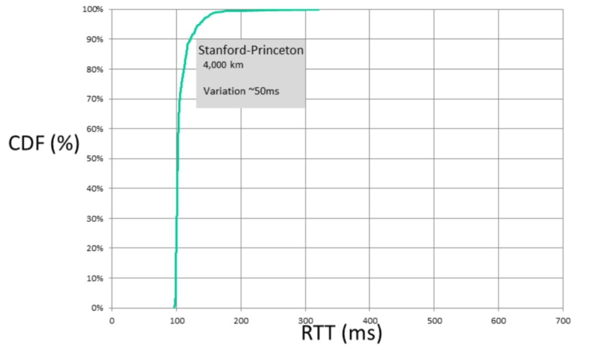

## 端到端延迟(End to End Delay)

在第一个关于分组交换的视频中，我将告诉你什么是分组交换，以及为什么互联网使用它。在本课程中，分组交换将占据重要地位——互联网的许多特性都源于分组交换的选择。


### 有用的定义 

在这段视频中，我将给你一些关于**传播延迟**和**分组延迟**的有用定义，我们将使用这些定义来得出一个关于分组端到端延迟的表达式。我还将告诉你排队延迟以及它是如何使端到端延迟变得不可预测的。最后，我将解释为什么不可预测的端到端延迟意味着像Youtube和Skypen这样的应用需要使用播放缓冲区。


#### 传播延迟



我们将从传播延迟的定义开始。传播时延是指一个信息位在传播速度为$$c$$的链路上所需的时间。传播时延是由链路的长度(在我们的例子中为$$l$$)和比特的传播速度$$c$$决定的。我们使用变量$$c$$是因为在我们感兴趣的大多数链路中，传播速度接近光速。例如，在一对双绞线中，比特的传播速度约为光速的70%，而在光纤中，传播速度稍慢一些。在我们大多数的例子中，我们将假设比特以$$2 \times 10^8 m/s$$的速度传播，这已经很接近光速了。

请注意，传播延迟并不取决于链路的数据速率，链路是以1kb/s还是10Gb/s的速度运行并不重要，传播延迟只是每个比特的传播速度和电缆长度的函数。


#### 分组延迟



另一个有用的定义是数据分组延迟。这是从一个分组的第一个比特被放到链路上到最后一个比特被放到链路上的时间。分组延迟是由我们能把比特放到链路上的速度决定的，或者说是数据速率$$r$$。如果一条链路以1kb/s的速度运行，我们每秒可以把1000个新比特放到链路上。如果它以10Gb/s的速度运行，那么我们每秒钟可以放100亿个比特。

一个链路的数据速率由我们能把比特打包得多紧密决定。例如，如果一个链接以1Gb/s的速度运行，那么我们每纳秒就可以把一个比特放到链路上。我们将在稍后关于物理链路的视频中看到是什么限制了一个链路的数据速率。

请注意，数据分组延迟只是一个分组长度和数据速率的函数。链路有多长，或者比特在链路上传播的速度有多快，都没有区别。


### 端到端延迟 



接下来，我们将看到如何使用这两种不同类型的延迟来确定端到端延迟，也就是一个分组从源到目的地的网络传输时间。

端到端延迟是指从我们发送第一个比特到第一个链路，直到分组的最后一个比特到达目的地的时间。我们可以通过将路径上每条链路的传播延迟和分组延迟相加来计算端到端延迟。

在这里的例子中，分组要穿越4个链路。首先，我们计算第一个比特到达第一个交换机的时间，然后我们计算最后一个比特到达第一个交换机的时间。我们对路径上的每个环节重复这一过程。

下面是整个端到端延迟的表达式：
$$
t=\sum_{i}\left(\frac{p}{r_{i}}+\frac{l_{i}}{c}\right)
$$
现在让我们更详细地了解一下发生了什么，把链路和交换拉长为一条路径，并把网络的其他部分删除：



这是一条时间线，显示了比特和分组如何沿着链路移动。第一个比特从$$A$$到$$S_1$$需要$$l_1/c$$。分组的最后一位是在第一比特之后的$$p/r_1$$时间到达，因此整个分组通过$$l_1/c+p/r_1$$时间到达了$$S_1$$。

互联网路由器就是我们所说的"存储和转发"的分组交换机。这意味着它们要等到整个分组到达后，才会查找地址并决定下一步将其发送到哪里。尽管它们可以在看到报头后开始转发，而不等待整个分组的到达，这就是所谓的"cut through"交换，但互联网路由器通常不会这样做。在后面的视频和一些练习中，我们将看到一些cut through分组交换的例子。

回到我们的例子，我们的路由器存储并转发分组。在从$$S_1$$到$$S_2$$的链路上，第一个比特花费$$l_2/c$$到达$$S_2$$，最后一个比特在$$p/r_2$$秒后到达。这种情况一直持续到分组到达$$B$$。

我们的端到端延迟表达式是路径上的所有延迟成分加起来的总和。


### 排队延迟

好吧，所以我还没有告诉你整个故事。关于分组交换的事情是，你的分组与其他用户的分组共享链路。当几个分组同时出现在$$S_2$$到$$S_3$$的链路上时，一些分组必须在路由器的队列或分组缓冲器中等待。我们说从$$S_2$$到$$S_3$$的链路是拥挤的，因为有很多分组排队等待沿着它传输。分组缓冲区有助于防止我们放弃分组——缓冲区越大，我们就越不可能放弃等待穿越链路的分组。

分组缓冲器是分组交换的基础，如果我们没有分组缓冲区，那么每次有两个分组同时出现想穿越同一链路时，我们就会丢失一个分组。分组缓冲器改变了我们对端到端延迟的表达。如果我们的分组到达时，并且队列中有分组，那么该分组必须在缓冲区中等待它前面的其他分组。默认情况下，互联网路由器中的分组缓冲区是FCFS，这意味着分组是按照它们到达的顺序传输的。因此，如果有三个分组在我们前面，我们必须在轮到我们出发之前等待三个分组化延迟。

下面是我们改进后的端到端延迟表达式，考虑到了沿途每个分组交换的排队延迟。
$$
t=\sum_{i}\left(\frac{p}{r_{i}}+\frac{l_{i}}{c}+Q_{i}(t)\right)
$$
重要的是记住，排队延迟是不可预测的，它取决于网络中其他用户发送的流量。就我们而言，排队延迟是一个随机变量，它是我们端到端延迟表达式中唯一的随机变量，其他都是确定的。




#### ping

如果你不相信我说端到端延迟是不可预测的，让我们来测量一下。我将使用一个非常广泛使用的工具"ping "来测量我的计算机和互联网上其他计算机之间的端到端延迟。ping实际上测量的是RTT，也就是两个方向的端到端延迟。你会在你的电脑上找到ping命令，可以用它来重复我在自己的电脑上要做的测量。

测试1：

```bash
╰─± ping www.princeton.edu
PING www.princeton.edu.cdn.cloudflare.net (104.18.5.101): 56 data bytes
Request timeout for icmp_seq 0
Request timeout for icmp_seq 1
64 bytes from 104.18.5.101: icmp_seq=2 ttl=53 time=201.210 ms
64 bytes from 104.18.5.101: icmp_seq=3 ttl=53 time=196.764 ms
64 bytes from 104.18.5.101: icmp_seq=4 ttl=53 time=301.467 ms
64 bytes from 104.18.5.101: icmp_seq=5 ttl=53 time=203.626 ms
64 bytes from 104.18.5.101: icmp_seq=6 ttl=53 time=202.839 ms
64 bytes from 104.18.5.101: icmp_seq=7 ttl=53 time=204.782 ms
Request timeout for icmp_seq 8
64 bytes from 104.18.5.101: icmp_seq=9 ttl=53 time=205.046 ms
64 bytes from 104.18.5.101: icmp_seq=10 ttl=53 time=196.142 ms
Request timeout for icmp_seq 11
64 bytes from 104.18.5.101: icmp_seq=12 ttl=53 time=202.065 ms
64 bytes from 104.18.5.101: icmp_seq=13 ttl=53 time=208.711 ms
```

测试2：

```bash
╰─± ping www.tsinghua.edu.cn
PING www.tsinghua.edu.cn (166.111.4.100): 56 data bytes
64 bytes from 166.111.4.100: icmp_seq=0 ttl=49 time=33.437 ms
64 bytes from 166.111.4.100: icmp_seq=1 ttl=49 time=35.798 ms
64 bytes from 166.111.4.100: icmp_seq=2 ttl=49 time=34.650 ms
64 bytes from 166.111.4.100: icmp_seq=3 ttl=49 time=41.966 ms
64 bytes from 166.111.4.100: icmp_seq=4 ttl=49 time=40.824 ms
64 bytes from 166.111.4.100: icmp_seq=5 ttl=49 time=36.524 ms
64 bytes from 166.111.4.100: icmp_seq=6 ttl=49 time=34.560 ms
64 bytes from 166.111.4.100: icmp_seq=7 ttl=49 time=36.569 ms
64 bytes from 166.111.4.100: icmp_seq=8 ttl=49 time=34.964 ms
64 bytes from 166.111.4.100: icmp_seq=9 ttl=49 time=35.383 ms
64 bytes from 166.111.4.100: icmp_seq=10 ttl=49 time=36.875 ms
64 bytes from 166.111.4.100: icmp_seq=11 ttl=49 time=41.197 ms
```


#### 分组延迟变换



我在斯坦福大学的计算机上测量了几百个从斯坦福大学到普林斯顿的RTT值。该图显示了我测量的RTT的CDF，即累积分布函数。整体变化约为50ms，其中90%的样本在100至120ms之间。

我重复了从斯坦福大学到中国清华大学的实验，大约10,000公里远。正如我所期望的，RTT值要大得多，因为传播延迟要高得多。但是请注意，RTT样本有更大的差异：他们的范围从大约320ms到超过500ms。这种差异来自于我的ping分组遇到了网络中其他用户的分组，我的分组沿途在路由器缓冲区遇到他们的分组。我的分组需要等待多长时间，取决于我的分组到达时有多少其他分组碰巧在那里等待。在大约200ms的范围内，可变的排队延迟几乎占了整个端到端延迟的一半。


### 小结

端到端延迟是由三个主要部分组成的：

- 沿着链路的传播延迟(固定)。
- 将分组放到链路上的打包延迟(固定)。
- 路由器的分组缓冲区的排队延迟(可变)。

