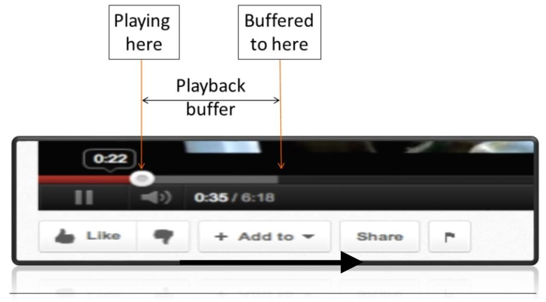
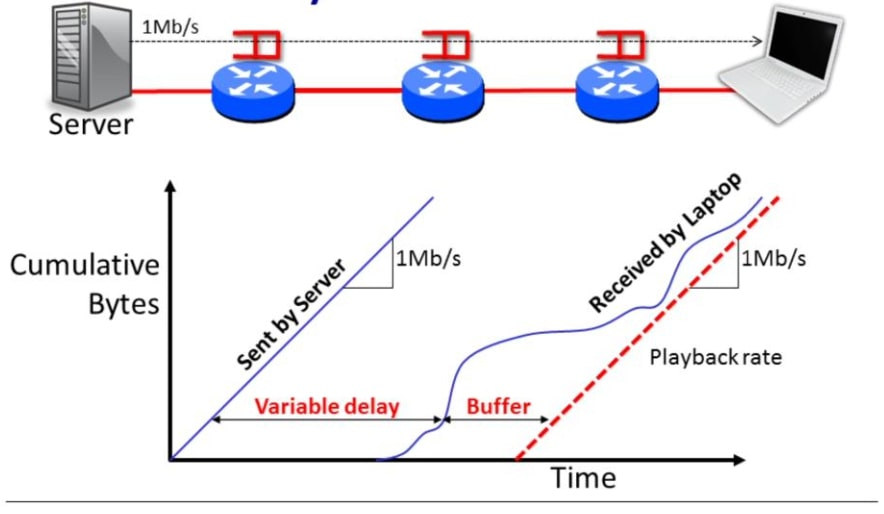
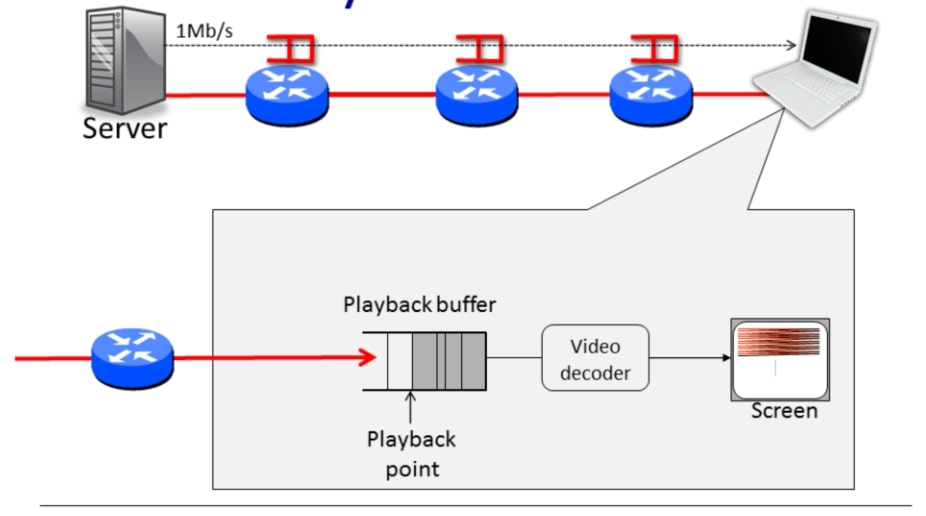
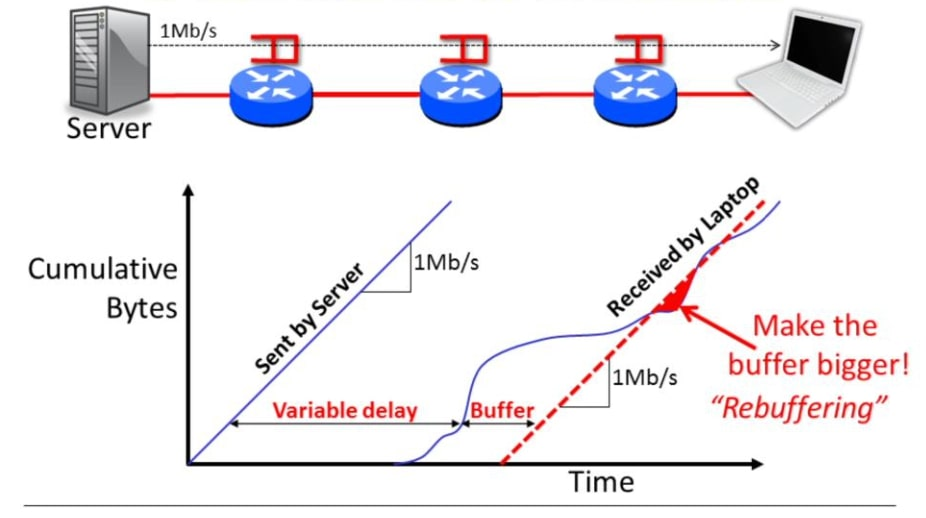

## 播放缓冲区(Playback Buffers)

现在你已经知道如何计算一个分组在网络上的端到端延迟了，你也知道排队延迟使端到端延迟可变。

我们使用的许多应用程序并不特别关心端到端延迟的变化。例如，当我们下载一个网页或发送一封电子邮件时，我们希望它能快速完成，但我们并不特别介意单个分组需要10或12ms才能到达另一端。

### 实时应用需要处理可变的排队延迟

对于我们使用的许多应用程序来说，可变的排队时间并不是一个问题。当我们浏览网页或发送电子邮件时，我们并不特别关心分组的精确到达时间，我们关心的是网页是否能快速加载，或者我们的电子邮件是否能及时发送，但是我们并不特别介意我们的分组在100ms或120ms后到达。

但有些应用必须关心排队延迟，特别是实时应用，如流媒体视频和音频，让我们看一个例子。在接下来的几分钟里，我将解释为什么排队延时会让这些应用的使用变得艰难，这是对排队延迟的一个很好的说明，以及我们在实际中如何缓解这个问题。基本上，因为应用程序不知道分组何时出现，所以无法确保及时获得音频或视频样本，以便将其发送给用户。因此，他们在被称为"**播放缓冲区**"的地方建立了一个分组储备。

#### 播放缓冲区1

你们以前都见过播放缓冲区。这是一张来自YouTube客户端的屏幕截图。左边的红线显示我们到目前为止已经看了多少视频，圆点显示我们到目前为止的位置，灰色区域显示客户端已经收到但尚未播放的视频。客户端故意尝试提前播放，以防止一些分组被延迟而不能及时到达，或者出现临时中断。在设计播放缓冲区时，我们必须考虑我们要提前多长时间进行缓冲，以及在开始向用户播放视频之前，我们要在缓冲区中积累多少数据，让我们仔细看一下。

#### 播放缓冲区2

想象一下，我们正在右边的笔记本电脑上观看一个YouTube视频。在我们的例子中，视频从左边的服务器以1Mb/s的速度传输，沿路经过几个路由器。

该图显示了服务器发送的累计字节数。因为服务器以恒定的1Mb/s的速度发送，所以直线的斜率为1Mb/s。即1s后它发送了1Mbits的数据，10秒后它发送了10Mbits。

由于网络中的排队延时是可变的，笔记本电脑的累计到达量可能是这样的。延迟的最大组成部分是传播和分组延迟；延迟的可变部分是分组缓冲区的排队延迟。到达图的实际形状可能与此大不相同，我只是编造了这个形状。然而，我们确实知道一些关于它的事情。首先，整体端到端延迟不能小于分组和传播延迟——它有一个下限。它也有一个上限，排队延迟不能大于路径上所有路由器的排队延迟之和。因为路由器有有限的缓冲区，而且它们按先进先出的顺序提供分组，所以有一个最大延迟。不幸的是，这个延迟可能是巨大的——缓冲区经常使分组延迟半秒或更多。我们还知道，累积到达量是不递减的，该值只能增加。最后，瞬时到达率不能超过最后一条链路的速度。

好了，有了所有这些注意事项，让我们看看客户端需要做什么。

这条红线显示了客户端需要向用户播放视频的速率，它与服务器发送的速率完全相同，即1Mb/s。客户端需要BUFFER足够多的数据字节，这样它就不会被清空。播放缓冲区被清空意味着用户没有更多的视频，会屏幕卡住。我们以前都见过这种情况，在我这里的例子中，缓冲区没有变空，视频也很好。

如果我们看一下客户端内部，我们可以看到播放缓冲区和它在视频中所到达的位置。这就是YouTube视频客户端上的大圆点。在数据出发播放缓冲区后，它进入视频解码器并被放置在屏幕上。

### 如果缓冲区太小

如果我们把缓冲区做得太小，或者过早地开始播放视频，那么播放缓冲区就会变空，屏幕就会卡住。我们必须暂停，再次建立缓冲区，然后再次以1Mb/s的速度恢复播放视频。这通常被称为重新缓冲事件，可能会非常恼人。如果你通过一个缓慢的链接观看这个视频，或者从很远的地方观看，你可能会经历一个缓冲事件。你可以通过以较慢的速度播放，或提前下载视频来解决这个问题。

### 小结

- 通过分组交换，端到端的延迟是可变的。
- 我们使用一个回放缓冲器来吸收这种变化。
- 我们可以把播放缓冲区做得很大，但这样一来，视频在开始时就会出现延迟。
- 因此，应用程序估计延迟，设置播放缓冲区，并在延迟变化时调整缓冲区的大小。

这就是关于端到端延迟的视频的结束。我将在下一个视频中再次见到你，届时我将告诉你关于播放缓冲区的情况，在那里我将告诉你一个简单的确定性模型来理解可变的分组延迟。

