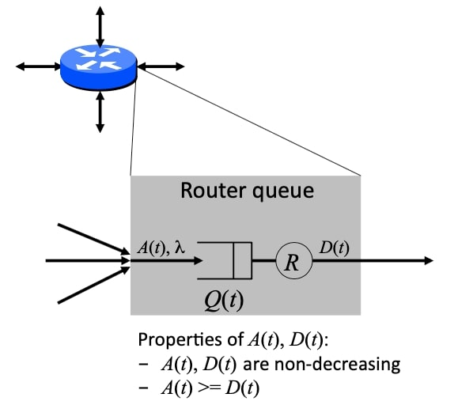
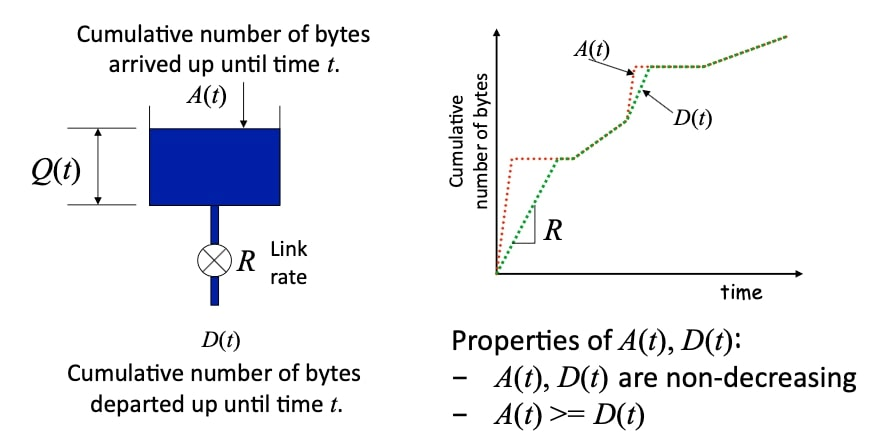
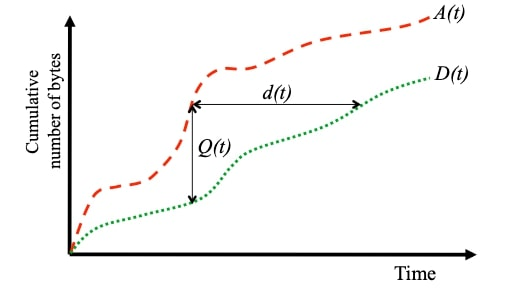
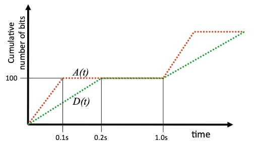
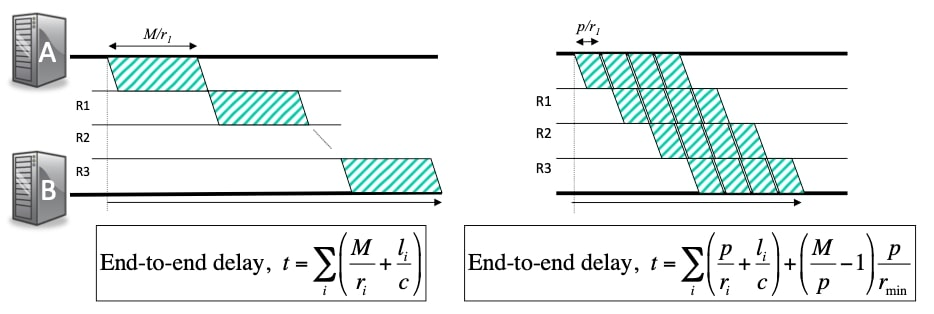
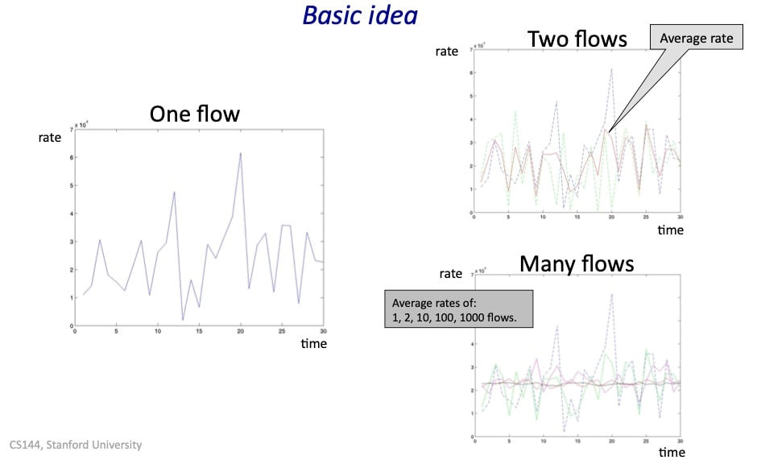
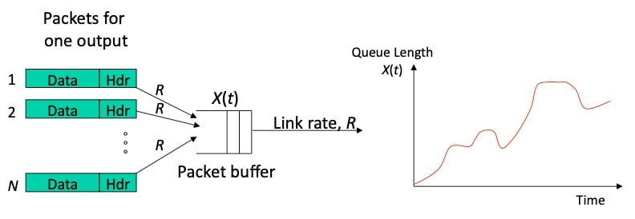
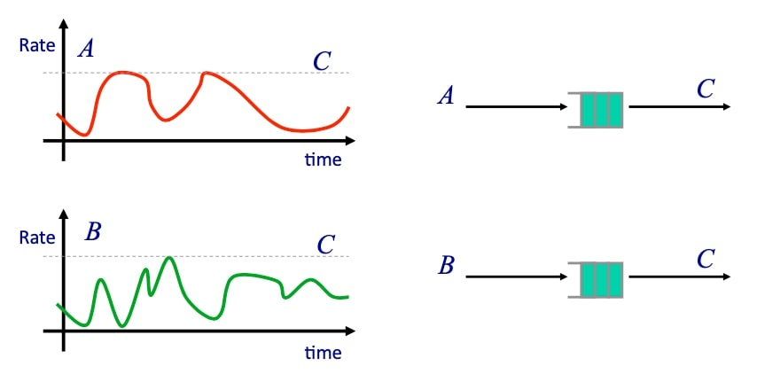
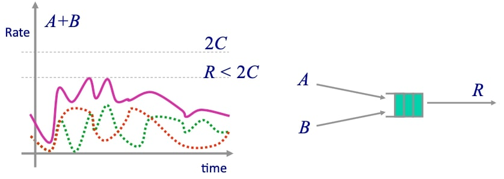

## 排队模型(Queue models)

### 简单的确定性排队模型 

这段视频是关于分组交换的继续，在这段视频中，我将讨论一些不同的排队模型，我将从一个简单的确定性排队模型开始，这将帮助我们理解许多简单排队系统的动态特性，它通常是理解网络中发生的事情的一个好方法。

#### 路由器队列的简单模型

这里是一个路由器，正如我们所知，路由器必须在接口上有提示，以便在拥堵时保留分组。这就是队列延迟的变化之处，所以如果我们能够理解动态特性，甚至只是粗略了解队列的动态特性，都有助于我们理解端到端排队延迟和网络的动态特性。

这是一个四端口的路由器，分组可以从任何接口进入队列，然后从传出链路上出发，我们说队列的占用率为$$Q(t)$$，所以在时间$$t$$，它有$$Q(t)$$个分组或字节。同样，考虑累计到达量也很有用，即到时间$$t$$为止到达的分组总数，因为出站链路通常有一个确定的、固定的速率，我们将说有一个固定的速率$$R$$，它们将是我们模型的主要参数。

这里有一个简单的例子，$$A(t)$$是截止到时间$$t$$的累积到达字节数，$$D(t)$$是截止到时间$$t$$的累积出发字节数，在这个例子中，它们将以固定的速率$$R$$出发。在任何时候都可能有一些已经到达但尚未出发的字节，它们在队列里，这就是我们的简单排队模型。

#### 一些定义

队列占用率为：
$$
Q(t)=A(t)- D(t)
$$
排队延迟，$$d(t)$$，是指在时间$$t$$到达的字节在队列中花费的时间，这只是这两条线之间的水平距离，这里假设队列是先到先得(FCFS)。

图示：

#### 例子

让我们继续看一个例子，看看我们如何使用它。我们将假设每秒有一个100比特的分组以每秒1000比特的速度到达队列，我们将假设最大出发率$$r$$是每秒500比特，问题是队列的平均占用率是多少？

如果我们按照我之前的方法来画图就不那么明显了，所以我不打算画草图，因为我想让这些数字非常清楚。这里用红色显示的是分组到达的过程，100比特的分组以每秒1000比特的速度到达，因此需要0.1秒的时间。最大的出发速率是每秒500比特，它比较慢，所以100比特的分组要花0.2秒时间出发。所以我们现在可以看到占用率关于时间$$t$$的变化，这是这两条线的垂直垂直差异，以及单个分组的延迟。但问题是，队列的平均占用率是多少？好吧，让我们看看如何解决这个问题，我打算把这个写出来，以便你有一个清晰的记录。在前0.2秒内，平均占用率是红色曲线和绿色曲线围成的面积，即$$0.5\times 0.1\times (1000-500)=25$$，在后$$0.8$$秒时，队列是空的，所以队列平均占用率是
$$
\bar{Q}(t)=(0.2 \times 25)+(0.8 \times 0)=5
$$

### 小分组减少端到端的延迟 

继续我们简单的确定性排队模型的主题，我想解释为什么小分组可以减少端到端的延迟，你可能已经想知道为什么我们不能为什么我们不能简单地用一个分组来发送整个信息，为什么我们要把信息分解成更小的分组。

这有一个非常好的理由，我想用端到端的延迟来解释这个问题。左边是一个大小为$$M$$的信息从端到端传递的例子，这个信息要经过三个路由器$$R_1,R_2,R_3$$，我只是像之前那样显示每个链路上的延迟，即分组的延迟和它在网络上传播的延迟。我们已经知道端到端延迟的表达式，它是分组延迟，和所有传播延迟在链路上的总和：
$$
t=\sum_{i}\left(\frac{M}{r_{i}}+\frac{l_{i}}{c}\right)
$$
如果你看一下右边的情形，我们可以看到，信息已经被分解成长度为$$p$$的分组，即我已经把信息分解了，它的长度总和和之前一样，所以现在端到端延迟是这个表达式：
$$
t=\sum_{i}\left(\frac{p}{r_{i}}+\frac{l_{i}}{c}\right)+\left(\frac{M}{p}-1\right) \frac{p}{r_{\min }}
$$
$$p/{r_i}$$表示每个链路上的分组延迟，然后$$l_i /c$$表示传播延迟，最后一项是简单的额外时间，表示最后第一个和最后一个分组的时间之差。

你可以看到在这种情况下，左边的整个信息必须在第一条链路上传输，然后才能在第二条链路上开始传输，而在这里，第一个分组在第一条链路上传输，然后在第二条链路上传输，此时第一条链路正在传输第二个分组，所以我们有一个流水线效应，我们在链路上有并行性，因此端到端的延迟会减少。

在一个长的网络中，如果有非常大的信息，这将产生一个非常显著的差异，因此，端到端的延迟可以通过分组来减少。 

### 统计性复用

#### 基本想法

让我们看一下这个简单的例子：我在$$n$$个外部链路上有$$n$$个分组，它们都以速度$$R$$运行，出发速度也为$$R$$。显然，如果所有这些入口链路都以全速率$$R$$运行，那么输出链路就会不堪重负，我们会很快开始丢弃分组，事实上，会有$$nR$$的速率进入，所以我们会以$$(n-1)R$$的速率丢弃它们，但由于统计复用和到达的突发性，如果平均速率足够低，我们有可能摆脱这种情况，所以一般来说，与入口相比，我们需要在出口处降低速率，这是因为统计复用，我们把这种好处称为统计复用增益。

如果输出链路出现暂时性的超额负载，缓冲区可在短时间内起作用。因此，当总速率恰好超过$$R$$时，更大的缓冲区将吸收更大更长的时间，但由于缓冲区的大小有限，总是有可能发生损失，这只是分组交换中的一个事实，我们对此无能为力。

统计复用意味着出口链路不需要以$$N R $$的速率运行；当总速率超过$$R$$时，缓冲器会吸收短暂的时间；因为缓冲区的大小是有限的，所以会出现损失。

#### 例子

在上面的例子中，出发速度为$$C$$，一个分组以速度$$A$$进入这个路由器的缓冲区，另外一个分组以$$B$$的速率到达，左边显示了速率与时间的函数，你可以看到这里的峰值和谷值并不完全一致，所以如果我们取两个流量之和，那么我们可以预期这将是一些统计学上的复用增益，让我们看看这可能是什么。

如果我们在这里取$$A+B$$的速率(粉红色的线)，这你可以看到合并的速率，合并的流量速率$$R$$比$$2C$$小很多，换句话说，小于两个峰值的总和，所以在这种情况下，我们会说统计复用增益等于$$2C/R$$，这是我们从它们两个相加得到的好处。

有些人对统计多路复用增益使用不同的定义，因为在这个例子中，你可以看到我们没有使用缓冲区来缓冲任何超过$$R$$的临时速率，所以一个定义可以是，对于一个给定的缓冲区大小$$B$$，我们需要的速率的比率。所以在这个例子中，设想我们以这个速率$$R'$$来提供服务，其中$$R'$$比$$R$$小一点，当这里缓冲的速率超过$$R'$$时，可以由缓冲区来容纳。

所以统计复用增益的有两个定义，一个是我们不考虑缓冲区的，一个是我们考虑缓冲区。我们通常可以使用一个简单的排队模型来理解网络中的分组动态，我鼓励你这样做，它能让你对网络中发生的事情有一个非常直观的了解，我自己也经常使用这个模型。 最后，统计多路复用让我们在一条链路上有效地传输许多流量，这也是我们使用分组交换的主要原因之一。

### 小结

- 通常，我们可以使用一个简单的队列确定模型来理解网络中的分组动态。
- 我们把信息分成组，因为它可以让我们进行流水线传输，并减少端到端的延迟。
- 统计多路复用让我们在一条链路上有效地承载许多流量。