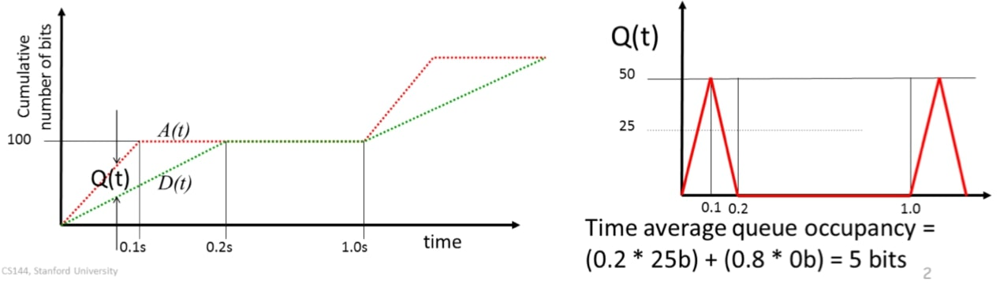
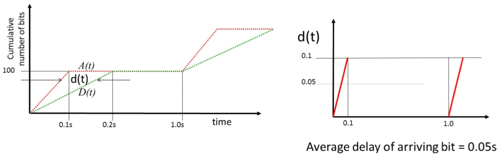
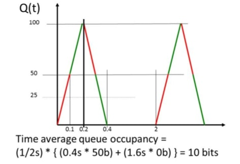

## 排队模型示例

### 问题

该视频包括之前视频的例子。如果你觉得这个例子难以理解，在这个简短的视频中，我将更详细地解释同一个例子，并就该例子提出一些问题。

在每秒的开始，100比特的分组以1000比特/秒的速度到达一个队列。从队列中出发的速度是500比特/秒。该队列是逐位服务的，你可以假设缓冲区的大小是无限的。

#### 问题(a)

**平均队列占用率是多少？**

累积到达和出发的过程会是这样的。首先，看一下累计到达量，$$A(t)$$显示为红色。在最初的$$0.1$$秒，100比特将以1000比特/秒的速度到达。在1秒之前没有更多的到达，然后(第2秒)又有新的100比特到达。现在让我们看一下绿色显示的出发过程$$D(t)$$。一旦第一个比特开始以1000比特/秒的速度到达，比特就会开始出发，因为题目说的是他们是逐位提供的。这些比特需要0.2秒才能出发，因为他们以500比特/秒的速度出发，这是新比特到达速度的一半。因此，队列不断增加，在0.1秒后达到峰值。

为了回答这个问题，让我们看看队列的占用率$$Q(t)$$与时间的关系。队列占用率是$$A(t)$$和$$D(t)$$之间的垂直距离——它是到此为止已经到达的比特数减去已经出发的比特数。

在最初的0.1秒，队列随着新比特的到来而增加，达到50比特的峰值；在最初的0.2秒内，平均占用率为25比特。从0.1s到0.2，队列不断消耗，直到它是空的，所有的比特都出发了。队列在0.8s(0.2到1)内是空的，然后同样的过程重复。

我们可以立即计算出队列的平均时间占用率。它花了0.2s，平均占用25比特，然后花了0.8s，占用率为0比特。因此，平均占用率为
$$
0.2\times 25+ 0.8 \times 0 = 5
$$

#### 问题(b)

**队列中一个比特的平均延迟是多少？**

让我们再看看$$A(t)$$和$$D(t)$$的变化。

在时间$$t$$到达的比特看到的延迟是$$d(t)$$，即两条线之间的水平距离。第一个到达时间为零的比特没有经历任何延迟。而在0.1s到达的比特则经历了0.1s的延迟。注意，0.1s后没有更多的比特到达，所以考虑0.1s和1.0s之间到达的比特的延迟是没有意义的。我们将概率限制在比特到达上，这只发生在每秒钟的前0.1处。

因此，一个比特到达队列所看到的平均延迟是0.05s。

#### 问题(c)

保持同一队列，第三个问题是：**如果100比特的分组以随机间隔到达，平均每秒钟一个分组，平均队列占用率将与(a)部分相同，更低还是更高？**

时间平均占用率会更高。当(a)部分中两个分组确定性地到达时，它们从未重叠，因此在队列中从未有个分组的比特同时出现。但如果它们随机到达，我们可能会有来自两个或更多分组的比特同时在队列中，推高占用率，从而推高平均占用率。

#### 例子

这可能是令人惊讶的。让我们看一个例子，看看为什么这是真的。

考虑两种情况。

情形1：假设分组随机到达，但没有两个分组重叠。平均队列占用率将和以前一样，也就是5bits。

情形2：分组重叠。

只要有两个分组重叠，哪怕是一次，平均占用率就会增加。为了了解原因，请考虑这里的例子。红线显示的是单个分组占用率，我们假设它在时间0到达。假设第二个分组在0.1秒到达，此时队列中仍有第一个分组的50比特。分组将继续增长，因为比特到达的速度是它们出发的速度的两倍。队列直到0.4秒时才会耗尽。如果这种情况每两秒钟发生一次，到达率将和以前一样，但现在的时间平均队列占用率将如下：

对于前0.4s，平均占用率是50b，然后在1.6s时是空的。为了得到时间平均数，我们除以2秒。时间平均占有率是10bits，是以前的两倍：
$$
\frac 1 2 \times \left(0.4\times 50 + 1.6\times 0\right)=10
$$

这是为什么呢？这是因为队列只以500比特/秒的速度出发，所以它不仅填充到以前的2倍，还需要2倍的时间来出发。当队列非空时，显示的三角形的面积是以前的4倍。

