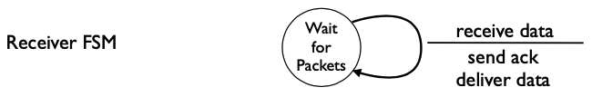
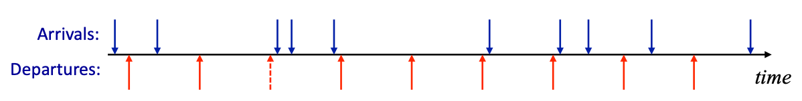
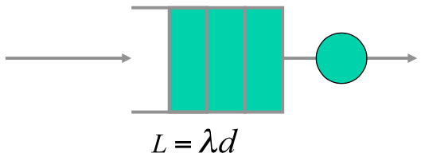
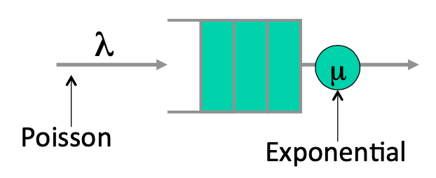
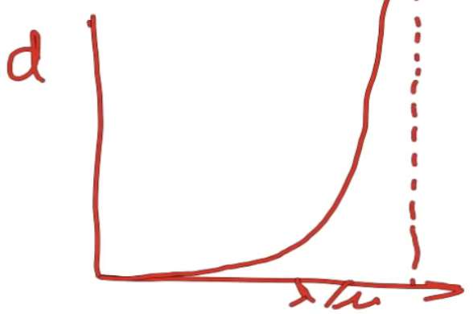

## 有用的队列性质

在这段视频中，我将继续介绍一些有用的队列属性，这些属性在我们考虑队列如何演变、分组缓冲区如何变化，从而影响分组在网络中的排队延迟时都会派上用场。

### 随机到达过程的队列

我们可以把网络看作是一组由一些链路相互连接的队列，这些链路承载着来自许多不同用户的流量或分组，当统计学上复用在一起时，分组到达的整个过程是非常复杂的，所以我们通常认为到达过程是随机事件：尽管每一个都是确定产生的，但总的来说，我们可以认为这是一个随机过程。

所以我们要了解随机到达过程的队列是如何工作的，这将是我今天要讨论的主题。通常，在网络系统中，到达过程是很复杂的，我们通常用随机过程对其进行建模，这种对随机到达过程的队列的研究被称为**排队论**，而排队论你可能已经听说过了，它以有非常多的数学知识而闻名，但尽管如此，随机到达过程有一些非常有趣的特性，对我们来说是可以有助于理解，将真正帮助我们理解网络的动态。

所以我将通过一组特性开始今天的内容：

1. 突发性增加延迟。
2. 确定性最小化延迟。
3. 利特尔结果。
4. M/M/1队列。

### 引子

我将从这个开始，即突发性倾向于增加延迟，希望你能记住这些参数，细节，数学。

#### 队列分组的时间演化

一切都归结为队列的演变方式，所以我在这里再次画出队列，这是到达队列的分组。你也会听到有人说是顾客，因为排队论也适用于其他很多系统，所以我说的顾客是指这里的分组，这是我们的到达量，这是我们的出发量。我们要考虑的是占用量$$Q$$关于$$t$$的函数，在这个时间轴上，我画了一串到达和出发的分组，这些蓝色的向下箭头代表了到达的时间；然后这些红色的向上箭头是出发的时间，即队列被服务的时间，就像在许多网络的队列一样，我们要把它看成是代表一个固定速率$$\mu $$的链路，这意味着间隔时间为$$1/\mu$$。 

#### 队列的时间演化

现在让我们看看队列的演变。

队列的第一个蓝色到达，把它带到了1，然后我们有服务，向上的红色箭头，会把我们带到0；有一个新的到达，会把我们带回到1，然后是出发，会把我们带到0，然后再回到1，然后是0，所以这将是队列的演变过程。

现在让我们看看出发的机会，这里我画了一条虚线，这就是有时人们所说的**影子出发**：即这是一个出发的机会，我们可以设置一个分组，但队列是空的，因此我们实际上没有发送分组，这是因为我们实际上不可能下降到负的队列占用率，所以队列保持为空。

尽管我们错过了这个机会，但事实证明，这些错过的机会是非常重要的，你不能有负的队列占用率。

### 队列性质1：突发性增加延迟

让我们继续，现在看一看我想解释的第一个属性，即**突发性到达往往会增加延迟**。

#### 周期性单次到达

我将从一个非常简单的例子开始。在没有突发性的情况下，我们有一个最简单的到达过程，就是一连串的到达，每秒一个分组，完全没有随机性，蓝色代表到达(每秒一个)，红色表示出发。

这里要注意的是$$Q(t)$$，即队列占用率是要么是0，要么是1，所以我们可以说它总是小于或等于1，平均队列占用率将介于0和1之间，周期性到达有助于对队列演化有一个很好的简单理解。

#### 周期性突发到达

现在让我们看一个不同的例子，当事情更加突发时，就像以前一样，到达的速度是每秒一个，但它们会以突发的方式到达，事实上，每$$n$$秒就有$$n$$个分组，但它们会以$$n$$个分组的形式突然出现。

在这种特殊情况下，每隔5秒就有5个分组，离开的情况将与之前一样，我们将有每秒一个分组。因此就速率而言，到达率和离开率都与之前完全一样，每秒一个分组，只是到达的突发性会改变事情，让我们看看它们的方式。

所以在这里，我们有突发的5个到达。占用量取决于我们是否对它进行采样，当我们对它进行采样时，$$Q(t)$$等于0, 5, 4, 3, 2, 1, 0，然后在这里的某个时候，它会再次上升到5，然后是4，等等。

所以之前我们的队列占用率是0或1，但现在，即使是相同的到达率和相同的离开率，我们的队列占用率也会在0到5之间。我们的平均占用率更高，队列占用率的方差也更高，因为它在0到5之间一路变化(所以平均值和方差都增加了)，尽管速率没有变化。

一般来说，我们说突发性会增加延迟，这个简单的例子说明了这一点，尽管它并不能证明，但希望它能让你直观地理解为什么突变会增加延迟。

### 队列性质2：确定性最小化延迟

第二个属性与第一个属性非常相似，几乎是第一个属性的反面，即确定性倾向于最小化延迟，换句话说，随机到达的平均等待时间比简单的周期到达等待的时间更长。

### 队列性质3：利特尔法则

参考资料：

https://baike.baidu.com/item/%E5%88%A9%E7%89%B9%E5%B0%94%E6%B3%95%E5%88%99/10340863?fr=aladdin

好吧，让我来谈谈我想让你们知道的第三个性质，这是一个众所周知的结果，叫**利特尔法则**。

队列非常复杂，正如我已经给你的指示，数学往往会变得非常多，但有一些简单的结果对我们很重要，因为在我们理解队列的基本属性时，它们会派上用场，这个队列的基本属性和利特尔法则令人惊讶的简单。

在任何排队系统中，都有一个如下令人惊讶的属性。

首先定义了如下参数：

- $$L$$是系统中顾客的平均人数(排队人数+服务人数)；
- $$\lambda$$是到达率，以顾客每秒为单位；
- $$d$$是顾客在系统中等待的平均时间(排队时间+服务时间)；

那么利特尔法则告诉我们，一般情况下，系统中的客户数量等于平均到达率乘以客户通过队列的平均延迟：
$$
L=\lambda d
$$
就是这样，这个看似简单的结果适用于任何没有客户丢失或掉队的排队系统。

所以如果没有客户丢失或掉队，那么到达过程是什么并不重要，不管有多突发，也不管有多不突发，只要它有一个明确的到达率$$\lambda$$，我们就可以进行这个计算。我们一会儿会看一些例子，你可以计算出队列中的平均人数，作为到达率和平均延迟的函数，当然，如果你知道$$L$$和$$\lambda$$，你可以算出一个客户通过这个队列看到的平均延迟。

### 泊松过程

在告诉你们队列的这三个属性之后和进入第四个属性之前，我需要告诉你们一些事情，那就是泊松过程。首先我们要告诉你什么是泊松过程，我还要告诉你为什么它很有趣，以及使用它的一些注意事项。

泊松过程在我们这里是一个到达过程，我们说一个到达过程是泊松的，当且仅当在$$t$$秒的间隔内有$$k$$个到达的概率是由这个表达式给出的：
$$
P_{k}(t)=\frac{(\lambda t)^{k}}{k !} e^{-\lambda t}
$$
这个表达式有点吓人，但是重要的是，在该假设下，在一个间隔$$t$$内到达的预期数量是简单的$$\lambda t$$，其中$$\lambda$$是到达率。

此外，连续的到达时间是独立，这意味着一旦我们从这个表达式中选择了一个到达时间，这将导致一个到达事件发生，然后下一个到达时间独立于第一个到达时间。事实上，如果我们采取一个滑动窗口，在任何一个时期的抵达过程中移动这个窗口，一个时期内的抵达时间与下一个时期无关，这意味着一个到达与另一个到达之间不存在突发性或耦合性。

这就是泊松过程，如果你拿起任何一本关于概率的书，那么你可以找到更详细的描述；如果这对你来说是新的东西，那么为什么我们对泊松过程感兴趣呢？泊松过程恰好可以很好地模拟许多独立随机事件的集合，例如，它被用于电话到达交换机的模型中；或者许多独立的核粒子的衰变，我们有大量的粒子独立运行，它们会在某些时间衰变，衰变是许多随机事件的集合；你可能也熟悉电路中的射出噪声，它也被建模为泊松过程。

最后，尽管上一张幻灯片上的方程很复杂，但它实际上使数学变得非常简单，这是它被广泛使用的一个重要原因，以及在这一点上，我应该给你一些警告：

1. 网络流量非常大。
2. 分组到达不是泊松的。
3. 但它很好地模拟了新流量的到来。

具体来说：

网络流量是非常突发的，没有什么独立的东西，正如我们稍后看到的那样，分组经常以突发的方式到达，网络中的许多东西实际上帮助它们保持这种方式，使它们非常突发。但尽管网络流量不是泊松的，已经有一些经典的论文研究表明了这一点，但当你把许多用户的网络流量聚集到网络上时，实际上可以用一个泊松过程很好地模拟。

### 队列性质4：M/M/1队列

有时，我们可以使用一些适用于具有泊松到达的队列的结果，让我们直观地了解可能在分组级别发生了什么，但我们必须非常仔细地做这件事。

让我们看看一个非常常见的例子，我们使用泊松过程，这就是所谓的M/M/1队列。M/M/1队列是通常分析的最简单的队列类型：代表到达过程满足马尔科夫性质；服务过程服从指数分布，并且每个分组的服务时间与其他分组无关。

有一个服务器，即一条出站线为这个队列服务，这种情形经常被使用，因为假设了一个很简单的到达，即一个数据包到下一个数据包之间的独立到达，但它经常被使用，因为数学很简单，结果也很直观。

如果我们要分析它，我们可以用连续时间马尔可夫链来分析，我们会发现，一个分组通过这个队列的平均延迟是由简单的表达式$$1/(\mu -\lambda)$$得出的。所以随着负载的增加和负载越来越接近服务率，那么这个数字将迅速增长。

如果我们在图表上绘制这个，如果$$\lambda /\mu$$越来越接近1，换句话说，当它们相等时，一个分组通过这个队列的平均延迟将非常非常陡峭地增加，这几乎是任何排队系统的情况，而不仅仅是M/M/1队列。

我们有时使用M/M/1队列作为一个更复杂的系统的代替品，原因只是数学更简单，但你看到几乎所有排队系统的情形都非常相似，我们可以使用利特尔法则来计算平均值，我们知道$$L=\lambda d$$，在这种情况下就是
$$
L=\lambda d = \frac{\lambda / \mu}{1- \lambda / \mu}
$$
之所以用$$\lambda/ \mu$$来写，只是因为$$\lambda/ \mu$$代表强度，就像我在图上画的那样。当$$\lambda$$接近$$\mu$$时，$$\lambda /\mu$$接近1，分母变成0，队列占用率和平均延迟会爆炸。

所以M/M/1队列为我们提供了一个很好的直觉，它通常有助于直观地了解网络中正在发生的情况。

### 小结

所以总的来说，我希望你从这个视频中得到的主要关键特性是：

- 突发性往往会增加延迟，所以突发性到达往往会使排队延迟延长。
- 利特尔结果给我们提供了一个队列的平均占用率$$L$$，到达率$$\lambda$$和平均延迟$$d$$之间的良好关系。
- poisson过程也形成了M/M/1队列的基础，这是一个简单的队列模型，通常可以给我们一些关于网络延迟特性的直觉。

这就是本视频的结束。

