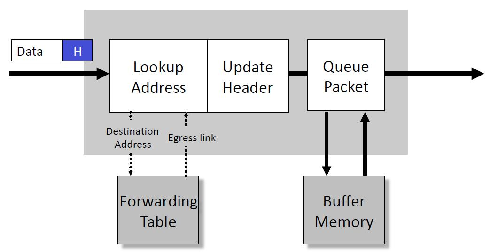
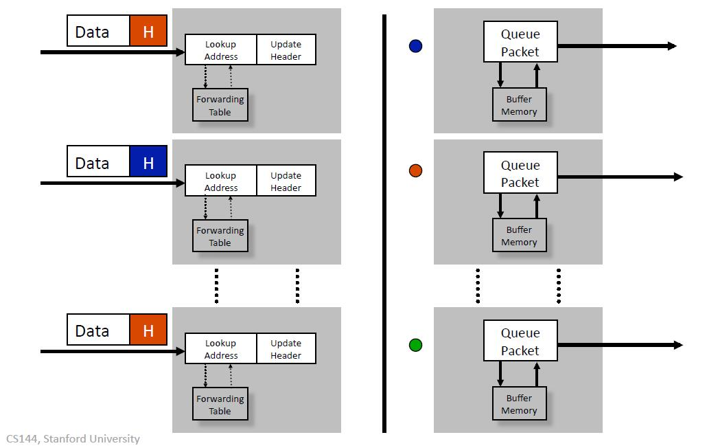
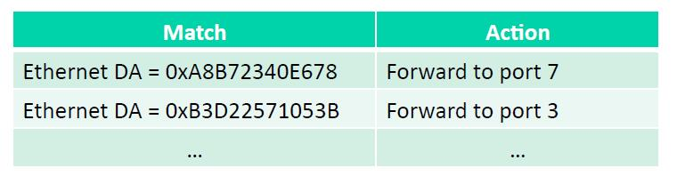
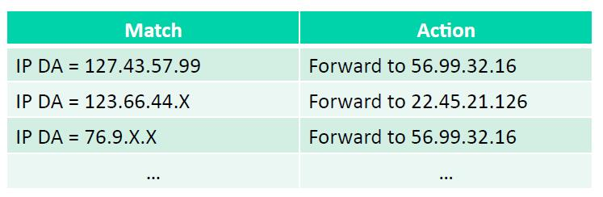
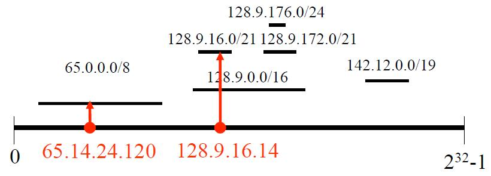
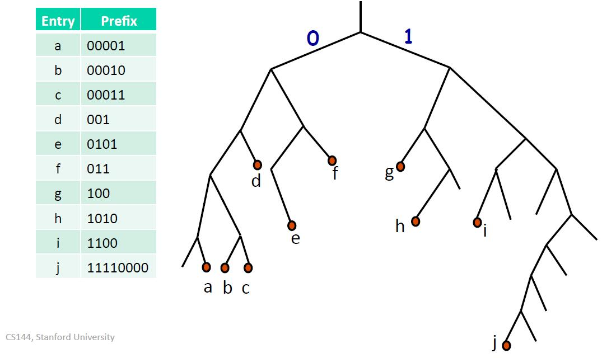
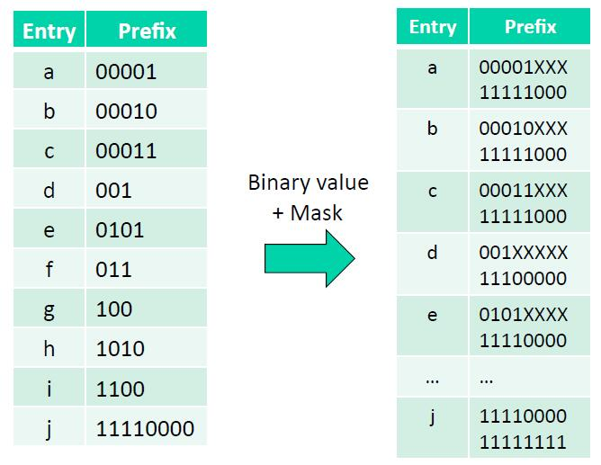
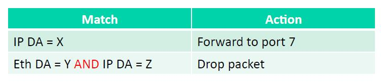

## 分组交换的工作原理(1)

在这段视频参数我将告诉你分组交换是如何工作的，比如以太网交换、互联网路由器等等。在本视频中，我们将学习分组交换的形式、分组交换的功能，无论是以太网交换还是互联网路由器，以及地址查询是如何进行的，具体来说，我们会了解：

- 分组交换是什么样子？
- 分组交换做什么？
  - 以太网交换
  - 互联网路由器
- 地址查找工作原理
  - 以太网交换
  - 互联网路由器

### 分组交换是什么样子？

#### 一般的分组交换

分组交换的三个主要阶段是：

- 当一个分组到达时，我们做的第一件事是查找地址，这意味着查看目标地址，以找出它接下来要去的地方，我们通过在转发表中查找来做到这一点：我们在转发表中发送查找，将目标地址发送到转发表，这将告诉我们的出口链路或端口。
- 下一步，我们可能需要做的是更新报头，例如，如果它是一个互联网路由器，我们必须减少TTL和更新校验和。
- 接下来我们要做的是对分组进行排队，这是因为可能会有一些拥塞，可能会有很多分组试图同时进入这个出口链路，所以我们用一个缓冲存储器来保存一些分组，这些分组在出口等待，直到到它们出发。

当然这种一进一出的分组交换不是很有趣，一般来说，分组有多个输入和多个输出。 我对这些分组进行了颜色编码，红色的分组将被送到这里的红色输出口，蓝色的将被送到这里的蓝色输出口。

所以就像以前一样，分组将被处理，地址将被查询，如果我们需要的话，将更新报头，然后我们将把它传送到平面后(平面代表一个共享总线)，所有这些分组都将通过它，然后它们将在该总线中找到到输出队列的路径。

在这种情况下，我们有两个红色分组要争夺相同的输出，所以我们需要做的是，把蓝色的分组发送到它的输出，把其中一个红色的分组发送到它的输出，但由于我们一次只能发送一个分组，另一个红色分组将不得不在缓冲存储器中等待，直到前一个红色分组消失后，这个分组才可以继续前进。

#### 以太网交换

更具体地说，有一种非常常见的分组交换是以太网交换，这是以太网交换必须执行的四个基本操作：

第一件事是检查每个到达的帧的报头。

由于以太网的目的地址是48位的，如果它在转发表中找到这个地址，它就会把帧转发到正确的出站端口，或者选择一些端口，如果它是一个群发(multicast)分组；

如果它发现以太网的目的地址不在以太网交换的表中，它就会把帧广播到所有的端口，除了帧到达的那个端口，换句话说，不知道该把它送到哪里。它将向所有人传播，希望它能到达目的地。

那么它首先是如何填充表的呢？当分组第一次到达时，目标地址并不在表中，它会广播给所有人，希望另一端会响应并发送一个分组回来，此时我们会看到它的源地址(SA)，因此我们会了解到，将来我们必须通过这个特定的端口发送分组，才能到达这个特定的地址。

这就是以太网交换的四个基本操作。

小结：

1. 检查每个到达的帧的报头。
2. 如果以太网DA在转发表中，将帧转发到正确的输出端口。
3. 如果以太网DA不在表中，将帧广播到所有端口(除了帧到达的那个端口)。
4. 表中的条目是通过检查到达的分组的以太网SA来了解的。

#### 因特网路由器

让我们把以太网交换与另一种类型的分组交换(互联网路由器)进行对比，后者处理互联网上的IP目标地址，有七项基本操作，因为它要处理封装在以太网分组中的IP数据报：

首先，它要检查到达的以太网目标地址是否属于路由器，换句话说，它是否专门针对这个路由器：如果是，则接受它；如果不是，则放弃它，因为它显然不是以我们为目的地。

接下来，如果是IPv4路由器，它会检查IP版本号是否为4，并检查数据报的长度。

接下来，它将递减TTL并更新IP报头的校验和，因为校验和包括TTL，它将检查TTL是否等于0：如果等于0，将丢弃分组；如果不等于0，可以继续转发。

接下来，它将在转发表中查找，如果IP目标地址在转发表中，则将其转发到正确的出口端口；如果是群发，则转发到群发端口，这是到达下一跳的正确端口，因为IP正在进行逐跳路由。

现在它已经决定从哪个端口出发，它将IP数据报封装成以太网帧，它必须找出正确的以太网目标地址，用于下一个顶级路由器，我们稍后将学习这个过程：该操作把IP数据封装到以太网帧中，以创建新的以太网帧，然后将其发送到电线上。

小结：

1. 如果到达帧的以太网DA属于路由器，则接受该帧，否则丢弃它。
2. 检查数据报的IP版本号和长度。
3. 减少TTL，更新IP头的校验。
4. 检查TTL是否等于0。
5. 如果IP DA在转发表中，则转发到下一跳的正确出口端口。
6. 找到下一跳路由器的以太网DA。
7. 创建一个新的以太网帧并发送。

### 基本操作

所以分组交换的基本操作是查找地址，所以我要问一个问题，这个地址是如何在转发表中查找的，我稍后会给你们展示一些例子。第二个操作是交换，一旦它确定了它需要去哪个出口端口，它现在必须将它传送到正确的输出端口，这样它就可以出发正确的输出链路。我将从查找地址开始，然后在下一个视频中，我们将学习交换。

小结：

1. 查询地址：如何在转发表中查找地址？
2. 交换：分组如何被发送到正确的输出端口？

#### 查询地址：以太网

对于以太网交换来说，查找地址是非常直接的。它有一个转发表，我在这里画了一个非常简化的形式，这是它将要执行的匹配，这是它将要执行的操作。

如果传入以太网帧的目标地址与此处的匹配，则它将转发到端口7；如果它与这里的地址匹配，那么它将转发到端口3。我刚刚在这里把48位地址画成了16进制的数字，一个地址一行，每个地址它会告诉它需要转发到哪个端口；如果没有对应的地址，就会广播，这就是以太网交换在不知道要发送地址时的做法。

通常将这些地址存储在一个哈希表中，这些是48位地址，可能有100万个条目，但一般远远小于$2^{48}$个条目，所以它是一个非常稀疏的表；可能是一个2-way哈希，以增加第一次尝试时命中的概率，然后通过在哈希表中查找精确匹配，这就是在以太网交换中进行地址查询的方式。

#### 查询地址：IP

现在我们来看看在IP路由器和互联网路由器中是如何进行地址查询的。

IP地址有点复杂，我们不在精确匹配上进行查询，而是在所谓的最长前缀匹配上进行查询，我们将在以后学习IP地址时了解为什么会这样。

现在我们执行的是最长前缀匹配，所以就像以前一样，在这里有一些IP匹配的前缀，我一会儿会告诉你这些是什么，然后这是我们要执行的操作。

如果我们在这个IP目标地址(127.43.57.99)上有一个匹配，所以这将是一个32位的地址，我们要把它转发到这个IP地址(56.99.32.16)，这实际上是下一个路由器接口的IP地址。在它做出这个决定后，它要把这个IP地址变成那个接口的等效以太网目标地址，这样它就知道要把分组封装成什么；但无论如何，在转发表中，它将其作为IP地址进行维护。

##### 最长前缀匹配

所以让我们看看什么是最长的前缀匹配，在这里，我已经得到了IPv4地址号码线，换句话说，所有可能的$2^{32}$个不同的地址。

在这里有一些线段，它们是前缀，它们总是以如下形式表示，

第一个线段对应于所有以65开头的地址。所以如果一个传入的目标地址前八位是65，那么它就会在这个线段上匹配，这个线段代表所有前八位以65开头的IP地址。同样，这个线段对应所有前16位是128.9的IP地址，把这个前缀表示为128.9.00/16，16表示前16位。最后还有一个例子，这个是一个很短的线段，是所有那些共享前24位的地址，这意味着有$2^8$个不同的地址，都以128.9.176开头。

地址65.14.24.120将匹配65.0.0.0/8；地址128.9.16.14可以匹配128.9.16/21和128.9.0.0/16，但是由于前者的前缀匹配较长，所以匹配128.9.16/21。

##### 最长前缀匹配查找(Binary tries)

所以在路由查询中，我们要做的是在所有与目标地址相匹配的前缀中找到最长的匹配前缀，也被称为最具体的路由。

让我们看看我们如何在表中实现这一点，一种常见的实现方式是使用所谓的Binary tries，这里有很多变化，但这是最常见的一种。

假设我们有一个前缀表，看起来像这样。这个前缀表有点奇怪，因为所有的前缀都很短，我这样做只是为了让它们能在这个表中清楚地表示出来，所以我在表中有10个不同的条目，我要在这里尝试填充它们。

因为传入地址的匹配会有不同的长度，我们需要一个数据结构来容纳不同长度的条目，这个数据结构容纳这些条目的方法是，把左边的分支作为0，右边的分支作为1，所以我们把这个条目a存储在这个特定的叶子上。

一旦我们得到这个数据结构用于存储条目，当一个分组带着特定的目标地址进来时，我们就可以逐位比较，遍历这个树，它会告诉我们哪个条目是最长前缀匹配；如果我们到了一个叶子，发现那里什么都没有，我们就回到与该地址有共同前缀的最近匹配条目，你可能想用表中这些其他条目做实验。

##### 最长前缀匹配查找(TCAM)

另一种机制也很常用，那就是使用一种特殊类型的内存设备，叫做"Ternary Content Addressable Memory"或"TCAM"。

这是我们之前的那个表，我们把它以稍微不同的方式存储在表中，所以条目A会被存储为4个0和1个1，在这里我们把所有东西都四舍五入为8个比特，对应的有一个掩码，这个掩码告诉我们上面的值中哪些位是有效的：当值是有效的，掩码对应位置为1；当值无效(对应的值为x)，掩码位置为0。所以也可以将编码看成三元组`(0, 1, x)`构成的。

执行查找的过程是一种蛮力搜索，我们同时将传入的地址与表中的每个屏蔽条目进行比较，所以这些专用内存消耗了相当多的能量，因为它们同时执行所有这些操作，但它们可以非常快，因此它们通常用于路由器中进行最长前缀匹配。

##### 最长前缀匹配：通用查询

我想指出的最后一件事是，现在人们对我们可以称之为通用查询的东西越来越感兴趣。我之前观察到这些表包含一个匹配字段和一个动作字段，所以我们可以对其进行概括或抽象，并说几乎所有的分组交换都在进行查找是一个匹配，后跟一个动作，这个匹配可以是任何字段，比如IP地址或者以太网目标地址(如果我们需要)，我们可能有转发，丢弃或封装等动作，或者做其他事情。

所以我们可以概括一下分组交换的规范，现在的分组交换是一种设计，可以同时为第二层，第三层做各种不同类型的转发，也可以为交换，路由器，防火墙等各种设备提供转发。

### 小结

- 所以总的来说，分组交换执行两个基本操作：
  - 在转发表中查找地址地址；
  - 交换数据，切换到正确的出站端口；
- 在高层次上，以太网交换和互联网路由器执行非常类似的操作，它们基本上以非常类似的方式处理这些分组；
- 地址查询在以太网交换和路由器中是不同的，我们看到了一些以太网地址和IP地址的例子；