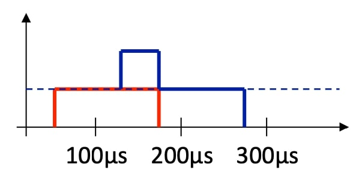
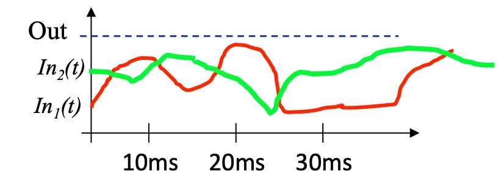
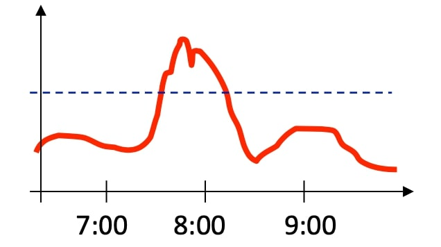
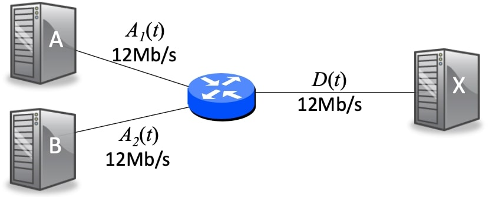
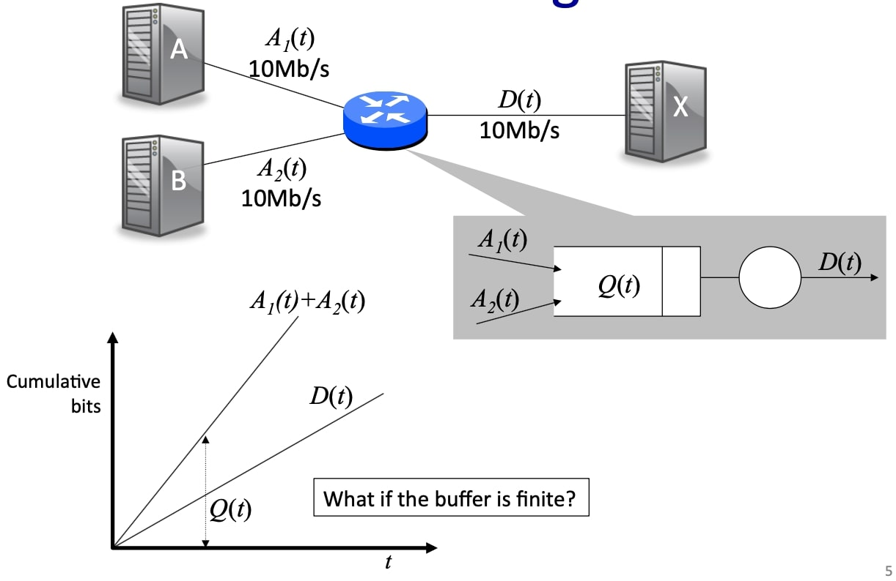
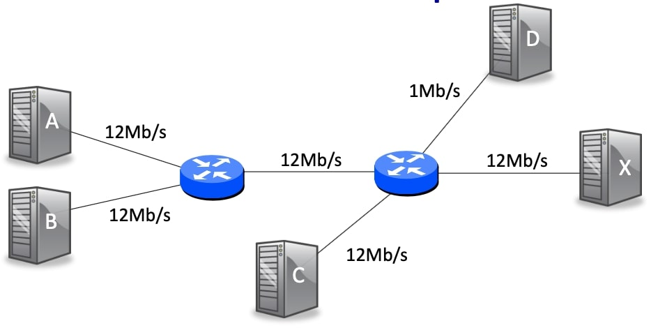
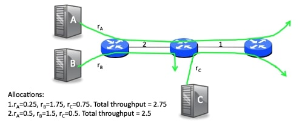
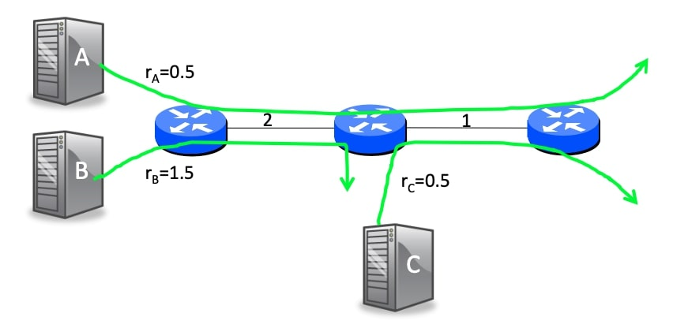
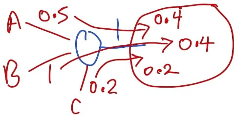

## 拥塞控制：基本想法基础1(Congestion Control - Basics 1)

### 概要

在接下来的几个视频中，我们将讨论拥塞控制问题。拥塞控制对于网络来说是一个非常重要的话题，因为每当我们有一个网络，特别是像互联网这样的分组交换网络，它总是会遇到拥塞，无论是短时间还是长时间，进行控制拥塞以阻止网络崩溃是非常重要的。

我们将学习什么是拥塞以及如何控制拥塞的基本方法，然后我们将具体看看在互联网上会发生什么。拥塞控制发生在TCP里面，TCP协议对拥塞控制有明确的支持，我们将看看它是如何做到这一点的，以及随着时间的推移它是如何演变的，然后这些决定的后果是什么。

总的来说，后续几个视频将介绍如下内容：

- 什么是拥塞控制？
- 拥塞控制的基本方法
  - 在网络中；
  - 从终端主机；
- TCP拥塞控制
  - TCP Tahoe；
  - TCP Reno；
  - TCP RTT 估计；
  - 实际性能；

### 拥塞的时间尺度

让我们开始思考什么是拥塞，拥塞可以发生在多个时间尺度上，我给大家举三个例子：

第一个例子是在很短的时间尺度，当分组在路由器上发生碰撞时。例如，想象一下，我们有两个分组，第一个(红色)到达这里，第二个(蓝色)在不久之后到达，它们都被放在同一个输出端，因为它们都在同一时间到达。其中一个分组将离开，另一个分组会排队，路由器中的队列会有一个暂时的积累。

第二种形式的拥塞，时间尺度稍长；它在流量层面上，在多个往返时间的时间尺度上运行。我在这里显示了一个红色的和一个绿色的曲线，这些可能都是通过路由器的缓冲区，试图到达同一个出站链路。如果它们的速率之和超过了出站链路的速率，就像这里的情况一样，那么缓冲区就会增加，最终会溢出。所以我们需要做一些事情来防止这些流量继续淹没该链路，否则我们就会丢掉一大堆分组，网络性能就会崩溃。

第三种类型是在一个更长的时间尺度，这是一种人类的时间尺度。在早上当人们正在喝咖啡时，都想访问同一个链路，这可能使它不堪重负，所以这将是在一个更长的时间尺度。

当我们谈论拥塞控制时，我们最感兴趣的是第二种类型，我们要看一下如何控制拥塞，特别是持续多个往返时间的TCP流量，我们有机会与发送方沟通或将信息送回发送方，或者发送方只是了解到它应该改变投入网络的数据量，以防止持续的拥塞发生。

### 什么导致了拥塞

让我们通过一个例子再进一步思考一下什么是拥塞。我们看一下这个例子，源A和源B试图发送至同一个目的地X，他们都想以每秒12兆比特的速度持续发送，但从路由器到X的链路只能以每秒12兆比特的速度发送，顺便说一句，这里的数字12并没有什么神奇之处，只是这会使计算变得更容易。

所以，如果我们看一下我们的一个确定性的队列模型，到达比特为$$A_1(t)+A_2(t)$$，到达速率为$$12\times 2 =24$$，离开比特为$$D(t)$$，离开速率为$$12$$，那么我们可以看到，队列比特$$Q(t)=A_1(t)+A_2(t)-D(t)$$，速率为$$24-12=12$$，因为到达率超过了离开率，所以最终分组将被丢弃和重传。

注意到这些传输会增加网络中的流量，因为会有更多的流量发送到这里，这些重新传输会使它更加拥挤。所以拥挤实际上有一个反馈效应，使事情变得更糟，导致更多的流量被送入网络，这也意味着，这里的到达率必须在某种意义上被截断，因为离开率显然不能超过每秒12兆比特。假设到达速率为$$r_1,r_2$$，离开速率为$$r$$。如果$$r_1,r_2$$都大于$$\frac r2$$，那么给$$r_1,r_2$$赋值为$$\frac  r2$$，即如果他们都想要超过一半的出站速率，那么他们都得到$$\frac r2$$的速率这是合理的。

### 另一个例子

让我们看看一个稍微复杂的例子。源A和B再次想以每秒12兆比特的速度发送，第三个源现在想以每秒12兆比特的速度发送。

首先注意到，如果来自A和B的流量以12兆比特每秒的速度运行，肯定会有分组丢失。很明显，网络中存在拥塞。 

第二，注意任何来自A和B的分组，如果通过第一个路由器，然后在第二个路由器上被丢弃，那么将是对网络流量的浪费。因为如果它们在这里被丢弃，那么发送它们就没有任何意义了，所以值得考虑的是，我们如何将信息传回源头，以便它不会通过网络发送不必要的流量，而在下游路由器处被丢弃。 

第三，如果路由器在每个分叉处简单地划分流量，那么最后一条链路的划分并不明显。换句话说，我们在这个链路$$X_1$$上对半分，我们将看到来自A的6兆比特和来自B的每秒6兆比特。然后如果我们在$$X_2$$同样对半分，那么我们将看到来自C的每秒6兆比特，来自A的每秒3兆比特和来自B的每秒3兆比特，加起来就是12。我们不清楚这是否是我们想要的，可能我们实际上希望他们每个人都得到每秒4兆比特，这可能是一个更合理的事情，这样他们每个人都能平等地获得输出，所以考虑我们如何分配可用的容量将是很重要的。

想象一下，我们有一个额外的发件人D想以每秒1兆比特的速度发送，即D想以低于其他发件人的速率发送，那么应该允许它以什么速率发送？

### 拥塞是不可避免的

需要注意的是，在分组交换网络中，拥塞是不可避免的。我的意思是，我们使用分组交换实际上是一件好事，因为它可以有效地利用链路，因为有统计复用，所以路由器中的缓冲区经常被占用，并且很可能会溢出。事实上，如果缓冲区总是空的，那么链路大部分时间都是安静的，所以延迟会很低，但我们对网络的使用也会很低；如果缓冲区总是被占用而延迟很高，我们就会发现网络的使用效率很高，因为它一直都很繁忙。

小结：

1. 我们使用分组交换，因为它能有效地利用链路。因此，路由器中的缓冲区经常被占用。
2. 如果缓冲区总是空的，则延迟很低，但我们对网络的使用率很低。
3. 如果缓冲区总是被占用，则延迟很高，但我们正在更有效地使用网络。

### 观察

所以我们会看到拥塞是网络的一个真正不可避免的属性，有一点拥塞是件好事，因为它可以保持网络的高使用率，我们只是需要能够控制它，阻止我们延迟太高，以至于网络无法使用。对于拥塞，我们有如下观察：

1. 拥塞是不可避免的，而且可以说是有价值的。
2. 拥塞发生在不同的时间尺度上，从两个单独的分组碰撞，到一些数据流发送过快，再到网络中出现的集中使用。
3. 如果分组被丢弃，那么重传会使拥塞更加严重。
4. 当分组被丢弃时，它们会在丢弃之前浪费上游的资源。
5. 我们需要一个公平的定义，来定义我们希望流如何共享瓶颈链路。

### 公平性和吞吐量

让我们考虑一个例子，当我在一个网络中有三个路由器，这里有三个由链路连接的路由器，第一个链路的速率为2，第二个的速率为1。然后我将有三个源A、B和C都连接起来，他们将通过网络发送流量。现在的问题是，如果他们都想以最大的速率通过网络发送，那么什么才是公平的速率分配？

让我们考虑一下我们要分配给每个流量的速率，方案1为：

- $$r_{A}=0.25, r_{B}=1.75, r_{C}=0.75 $$

总流量为$$2.75$$。

方案2为：

- $$r_{A}=0.5, r_{B}=1.5, r_{C}=0.5$$

总流量为$$2.5$$，比第一种方案低。

如果你看一下这里的链路，它是网络的瓶颈链路，我给了C和A一样的流量，所以我们可以说这个更公平，因此这里有一个公平性的权衡，我们想给了瓶颈链路的平等使用权，但同时我们试图最大化总体吞吐量。

因此，我们可以看到，公平性和吞吐量可能是相互矛盾的。

### 最大-最小公平

所以在我们开始设计或比较控制拥塞的方法之前，我们可以对我们想要实现的公平性进行定义，所以我们要使用的定义被称为最大最小公平性，它是一个广泛使用的公平性定义，虽然它不是我们可以使用的唯一定义，但它是有意义的，因为它试图最大化小流量的速率，同时确保每一个想使用它的流量都能平等地分享它的瓶颈链路。

正式的定义如下：

如果你不能在增加一个流量的速率的同时，不减少另一个速率较低的流量的速率，那么分配就是最大最小公平。

### 最大最小公平分配

让我们看看在我之前的例子中这意味着什么，实际上我给你看的第二个分配实际上是最大最小公平，因为如果我们增加B的速率$$1.5$$，我们将不得不减少A的速率，而这是较低的速率，因此，这是最大的最小公平分配。

其本质的意思是，共享一个瓶颈的链路。例如，如果他们想要使用所有链路，或者超过他们的公平份额，他们将被削减为了他们的公平份额。

### 最大最小公平分配：单一链路

让我给你看一个单一链路的例子，这将更容易理解，这是一个非常简单和直观的定义，在单一链路上，如果我们有一个路由器，A和B想以每秒兆比特的速度连接到该路由器，分别为$$0.5$$和$$1$$，有一个速率为1的链路，然后让我们考虑C想以$$0.2$$连接到该链路。所以我们想从A、B和C那里发送的综合速率是$$1.7$$，但我们只有1的速率，那么什么是公平的份额呢？C是最小的，所以我们要从分配最小的开始，C想要的比它的公平份额少，换句话说，公平份额是三分之一，它想要0.2，这比三分之一少，所以我们要分配给它0.2。这将留下0.8，另外两个人的公平份额现在是0.4，是0.8的一半，A想要的比这个多，所以它将被削减到0.4，B也想要的比0.4多，所以它也将得到0.4，所以总数将达到1。如果我们增加任何一个人的速率，那么它将以牺牲一个较慢的流量为代价，所以这是最大最小的公平分配。

### 拥塞控制的目标

拥塞控制有一些目标是值得考虑的，这样我们在设计算法和比较算法时就能牢记这些目标，我这里有一份清单，其中有些是我们见过的，有些是新的，但也很明显：

- 第一点是我们想要高吞吐量，我们想要保持链路繁忙，因为我们想要让你高效地使用网络，我们想要流速度快。
- 第二点是我们希望它是公平的，我们将通常使用我们的最大公平目标，因为它在网络的良好吞吐量之间提供了一个很好的平衡，但也确保所有争夺瓶颈链路的流量得到公平对待，特别的，小流量得到一个很好的访问该链路的机会。
- 第三点是我们希望拥塞控制机制能够快速响应不断变化的网络条件。如果其他流量到达和拥塞增加，我们需要能够改变速率，这样我们就不会在网络中造成过多的拥塞；如果其他流量离开并结束，更多的容量变得可用，我们希望能够快速使用这些容量，这样我们就可以有效地利用网络。
- 最后我们希望控制是分布式的，我们不能依靠某个中央仲裁者来决定整个网络的速率，我们需要以分布式的方式运作，以便它能够扩展。

