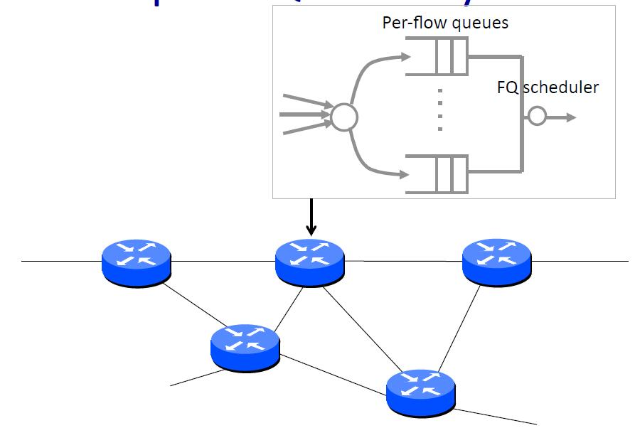
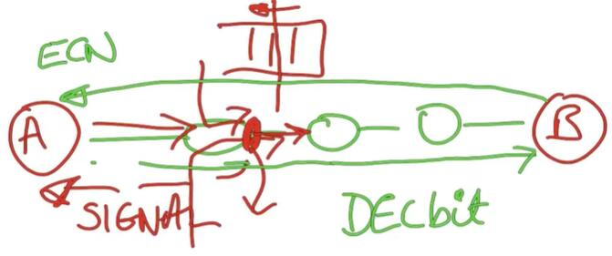
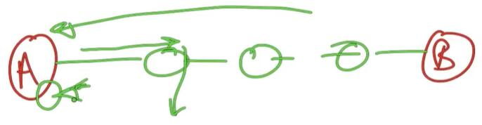
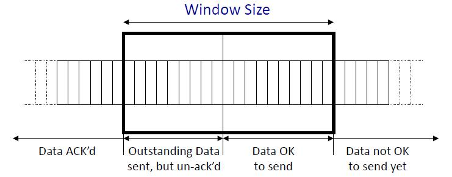
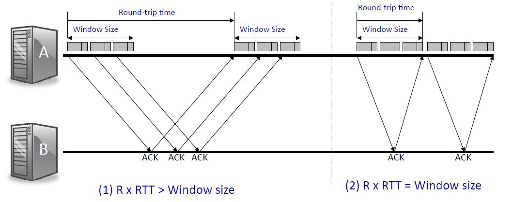
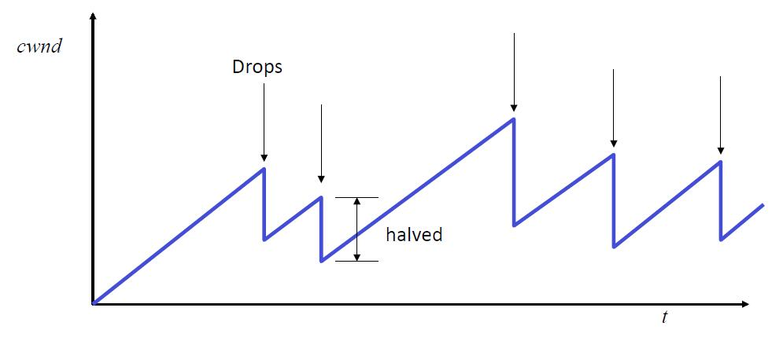

## 拥塞控制：基本应用-基础2(Congestion Control - Basics 2)

在上一个视频中，我告诉你不同类型的拥塞，它可能发生在不同的时间尺度，以及一些可能的后果，然后我们看了一点关于我们可能想尝试和设计的拥塞控制算法的特点：我们希望有高的吞吐量，希望它们在争夺瓶颈链路的流量之间是公平的，希望对拥塞的控制是分布式的，这样它就可以扩展。

### 概要

在这段视频中，我们将开始关注控制拥塞的基本方法，我们将考虑拥塞控制是否应该在网络中进行，并在路由器上提供支持；或者是否应该在终端主机上进行控制；然后我将告诉你一些关于TCP如何进行控制的信息，特别的，我将介绍滑动窗口和AIMD。

### 例子：在每个路由器设置FQ(公平队列)

事实上，你可能已经在想，为什么我们不能简单地使用公平队列，因为我们已经看到了一种方法，通过简单地将输出缓冲区分解，使每个人都能公平地分享到出站链路。如果我有多个流通过网络，那么每个流都会被放在自己的队列中，然后我们使用公平排队调度器将出口速率分配给所有争夺它的流，这实际上会给我们每个流量链路的最大最小公平分配，会给我们提供良好的吞吐量。

那么，这个基本机制有什么问题呢？首先，它没有反馈，它只是简单地划分了链路，但这里没有任何东西会告诉源他们应该发送的速率，或给他们任何指示他们应该发送多少个分组。假设这些分组都试图以全速发送，如果有分组从各个方向进来，试图使用这些链路，那么当缓冲区溢出时，分组将被丢弃，我们最终将使用大量的上行带宽通过链路传送分组，这些分组最终会在下游被丢弃。因此，我们需要一种方法来向源发出信号，让他们知道他们应该发送的速率或他们在网络中可能拥有的未完成分组数量。 

### 基于网络

因此在基于网络的拥塞控制中，有来自路由器的明确反馈来指示网络中的拥塞。

例如，如果有源A和目的地B以及一些路由器之间的一些链路。让我们想象一下，网络中存在一些流量，它们从不同的方向进入，通过这个路由器，导致一些拥塞发生。我们可以做的一件事是，如果有拥塞，就尝试并发出一些信号，说网络中存在拥塞，你需要减少你的分组数量，或者减少你发送分组的速度，然后再发送。

所以问题是我们要发送什么，我们如何把它反馈给源。比如说我正在丢弃一个分组，或者它可能是一个缓冲区占用的指示，或者它可能标志着我们刚刚突破了某个阈值，因此我们变得更加拥塞，这些都是例子。

另一个例子是，出站链路有一定数量的剩余容量，当容量被用完时，我们发送一个信号，说明该容量有多少可用，或者它可能是我刚才提到的所有信号的一个函数，所以下一个问题是我们如何获得该信号，我们用多少位来表示它。所以如果我们想发回整个队列占用率，我们希望能够发送一个相当大的整数值来指示当前占用率是多少，这需要很多位，而且可能很复杂。因此在实际中，人们通常会寻找使用一个或几个比特来向源发出信号的方案。

然后下一个问题是你如何把它们送回源。如果我们能从已经在进行的分组上搭便车，那么创建一个完整的分组来把它送回源是没有意义的，所以使用分组是相当普遍的。有一种特别的技术，叫做ECN或者明确的拥塞通知，在这种情况下，路由器表明他们是否有某种程度的拥塞，比如说越过一个阈值，然后在前往目的地的分组中标记位，把这些比特复制到另一个方向的确认中。

最初的方案是这样设计的，叫做"deck bit"，是20多年前提出来的单比特机制，用来向源发送信号来减慢速度。这样的方案很好的优点是很容易理解，我们可以看到信号将直接控制源的行为，对变化的反应应该非常灵敏，因为我们可以检测到网络中的拥塞情况，并能够告诉信号源。它是分布式的，即信号从网络中的所有路由器传回来，它只影响到源，所以源可以决定它将如何处理这个信号，它可以做到最大程度的公平，例如测量每个流经路由器的速率，并传回每个流的最大公平分配。

### 基于终端

另一方面，值得提出的问题是，我们是否真的需要网络提供任何拥塞通知，换句话说，我们是否可以在没有任何网络支持的情况下支持拥塞控制，例如仅仅通过在终端主机上实施一种机制来简单地观察网络行为。

在我之前的例子中，如果我有终端主机A和B，然后中间有路由器，如果我能够观察到网络的行为，足以决定我以何种速率发送或在网络中有多少未处理的分组，那么也许我们可以实现一个拥塞控制机制。这很好，因为如果它不依赖于路由器的行为，或者它不依赖于他们发送特定的信息，我们可以随着时间的推移而发展和适应它，而不必改变网络。

### TCP拥塞控制

我们将看到TCP是这样做的：TCP实际上纯粹是在终端主机上通过观察网络行为来进行拥塞控制，它所做的是，如果分组在途中被丢弃，它将通过超时来观察，或者它将看到一连串相同的确认回来。

因此，如果有数据丢失，A可以将其解释为拥塞，然后放慢速率或减少未处理分组的数量，从而减少网络中的拥塞。所以基本上A要观察网络中的行为，观察超时和重复确认以及任何指示，它还可以看到延迟的增加，以及任何向它表明拥塞正在发生的事情，以便它可以相应地改变其行为。

在TCP的情况下，它实际上必须这样做，因为IP默认不提供支持。IP没有提供网络拥塞的指示，所以当TCP最初被构想出来的时候，它实际上是以这种方式来控制拥塞的。

因此，让我给你一个关于TCP拥塞控制的快速介绍，TCP在终端主机上实现了拥塞控制，因为网络没有提供支持，它对终端主机上可观察到的事件作出反应，特别如果它认为有分组被丢弃，它将利用TCP的滑动窗口用于流量控制和重新传输，它将利用这一事实，用一种控制拥塞的方法使其过载。我很快就会解释，它要做的事情是，它将尝试并计算出在任何时候在网络中可以安全地有多少个未完成的分组，这是一个重要的概念。

小结：

- 对终端主机上可观察到的事件做出反应(如分组丢失)。
- 利用TCP的滑动窗口进行流量控制。
- 试图计算出在一个时间段内，网络中可以安全地有多少个分组未完成。

### 滑动窗口

现在我们已经熟悉了在TCP中使用的滑动窗口，让我们回忆一下这是如何工作的。

记得窗口是在字节流上滑动的，所以这是我们正在发送的基本字节流，正在向右增加，字节0在这里的某个地方，窗口告诉我们已经被确认的数据，总体来说，有四种数据：

- 已经被完全确认的早期数据；
- 已经发送但尚未确认的未处理数据；
- 可以发送的数据，尽管它们还没有被发送，但因为它在窗口内，所以如果我们想发送的话，我们可以发送它；
- 然后还有一些数据还不能发送，因为它在窗口的前面，窗口还没有滑到该位置；

滑动窗口不仅告诉我们哪些字节可以是未完成的，而且还告诉我们窗口的大小是多少字节。你会记得，接收器将发送关于所谓的接收窗口的信息，告诉我们可以有多少字节未完成，这样我们就不会超过接收器。稍后我们将看到，我们将以不同的方式在发送方重用这一机制。

### TCP滑动窗口

为了给一个关于TCP滑动窗口的大致概念，这里是一个关于分组发送和接收时发生的情况的时间轴视图，它将给我们一个关于这将如何工作的感觉。

A被允许发送最多一个窗口大小的数据。这里是数据窗口，当这些分组被发送时，他们中的每一个都将导致一个确认，所以在某个时候我们将得到确认，然后我们将发送下一个窗口的数据。

如果往返时间比窗口大得多，换句话说，时间比填充窗口所需的数据量大得多，那么中间就会有很大的延迟。TCP基本上会通过发送一个窗口，暂停并等待确认来前进，然后就这样重复下去。

当往返时间等于窗口大小时，换句话说，窗口正好能够填满管道。在这种特殊情况下，第一个确认将在最后一个分组完成后回来，所以我们能够连续发送，即没有停顿。因此我们比前一种情况更充分地使用网络。

### TCP拥塞控制

所以这给了我们一个提示，关于我们保持网络完整的能力，一些人会把它解释为一个速率，因为它是窗口大小除以往返时间，我们将在稍后考虑这个问题。

这里是基本概念：TCP拥塞控制将通过改变窗口大小来改变网络中未完成分组的数量，它将设置窗口大小，而不仅仅是Advertised窗口，这是它以前使用的，来自接收器的窗口，以阻止接收器不堪重负；它还将考虑到拥塞窗口，这在源计算。

所以Advertised窗口来自接收器；在源或发射器它将计算拥塞窗口，通常缩写为cwnd，代表拥塞窗口，然后它将采取较小的值：
$$
\text { Window size}=\min \{\underbrace{\text { Advertised window }}_{\text {Receiver }}, \underbrace{\text {Congestion Window }}_{\text {Transmitter ("cwnd") }} \}
$$
换句话说，如果网络拥塞，它就会使用cwnd；如果网络不拥塞，它就会以接收窗口为主，也就是接收方公布的窗口。

### AIMD

所以，下一个问题是，我们如何决定cwnd的值？我们如何使用cwnd来改变窗口大小，以控制网络的拥塞。我们将要使用的方案称为AIMD，这是网络中的一种经典技术，用于控制TCP网络的拥塞，它可以用于任何使用滑动窗口的网络：

- 如果分组成功接收：$$W\leftarrow W +\frac 1 W$$
- 如果分组丢失：$$W\leftarrow \frac{W}{2}$$

AIMD代表加法增加和乘法减少，让我们从加法增加开始。如果每次发件人正确收到一个分组，就会增加窗口大小。这意味着，每当一个完整的窗口数据被正确接收和确认，那么发送方就会将其窗口大小$$W$$增加$$1/ W$$，所以这是加法增加。

当事情进展顺利时，它会慢慢增加，如果事情进展不顺利，分组被丢弃，那么它将把这作为一个拥塞的信号，如果发生这种情况，它将把cwnd降低2倍，将其减半。

### 导致AIMD“锯齿形”

因此，这导致了通常被称为AIMD锯齿或TCP锯齿的现象，它看起来像这样，这是cwnd的演变：

你可以看到，可用的窗口大小，换句话说，由于网络条件在不断变化，源可以在网络中获得的数据量也在不断变化，网络中还有其他流量，甚至可能链路的容量也在变化，比如无线链路。

### 小结

所以综上所述，当我们实施拥塞控制算法时，我们可以选择在网络中实施拥塞控制算法，或者在终端主机上实施拥塞控制算法。TCP从终端主机上控制拥塞，因为IP默认不支持拥塞，所以除了丢弃分组外，它不提供拥塞的信号或指示，它只对终端主机上可观察到的事件做出反应，特别是分组丢失。TCP利用滑动窗口进行流量控制，并通过改变窗口大小来尝试控制拥塞，从而使滑动窗口超载；TCP试图计算出网络中一次能有多少个安全的分组，并根据加法增加乘法减少(AIMD)算法来改变窗口大小，我们将在接下来的两个视频中进一步研究这个问题。

