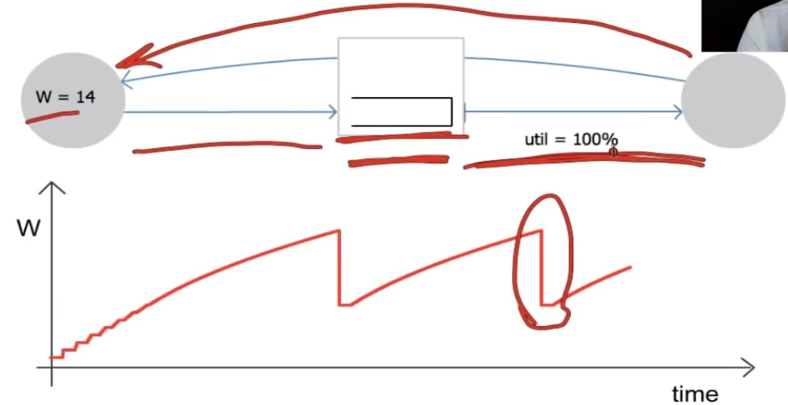
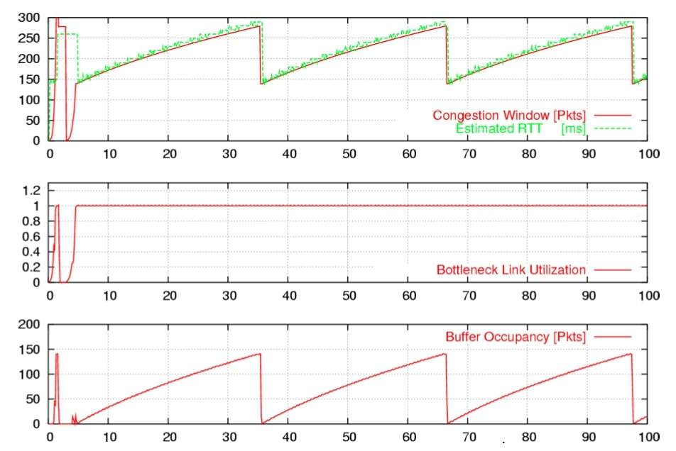
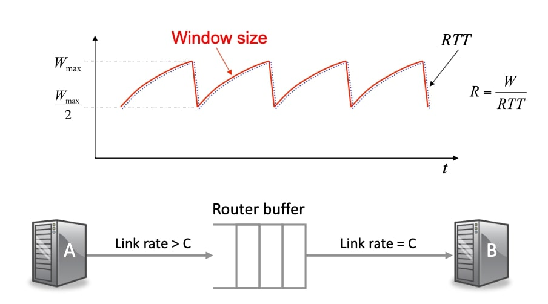
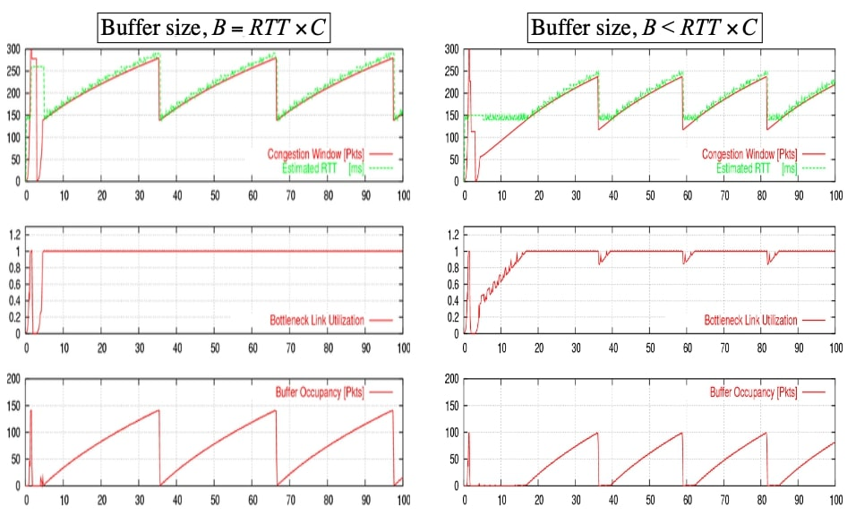

## 单流的AIMD

在上一个视频中，我告诉过你如何使用AIMD方法来调节TCP滑动窗口的大小，从而控制网络中未完成的字节数。如果我们想增加未处理的字节数，我们可能会造成更多的拥堵；如果有拥堵，我们想减少它，方法是减少窗口大小。所以使用这种窗口大小的调制，我们可以改变未处理的字节数，从而影响或控制拥堵量。注意这只是由终端主机完成的，没有任何来自网络的明确支持。

### 回顾

为了理解AIMD是如何工作的，以及随后的TCP拥塞控制是如何工作的，我们将开始详细了解AIMD在单流下是如何工作的，如果我们能理解它在单流下是如何工作的，那么我们就有机会理解它在一个更复杂的网络中是如何工作的。我们之前看到AIMD的工作原理如下：每收到一个数据包，我们就在$$W$$的基础上增加$$1/W$$，每当一个数据包被丢弃时，我们将以乘法方式减少窗口大小，我们将它减少到$$W/2$$。

### 动画模拟

现在让我们看看AIMD过程的动画，我们将仔细看看这个动画：一个AIMD流通过单个瓶颈链路。让我解释一下图中的拥塞窗口发生了什么，在下面的图中，拥塞窗口大小$$W$$随着时间的变化而变化，所以这是cwnd；这是源，这是目的地，中间是路由器，路由器有一个缓冲区，它将缓冲等待进入出口链路的数据包，这里是出口链路，这是源和目标之间的瓶颈链路。左侧的链路运行速度比右侧的链路快，这就是为什么缓冲区中不时出现数据包堆积的原因，因为数据包到达的速度比离开的速度快。数据包在左边看起来比在右边看起来要小的原因，正是为了说明这样一个事实：左边的链路比右边的链路运行得快。换句话说，这是一个更高的数据速率，数据包的延迟更短，所以数据包在左边看起来更短一点。

数据包从源流向目的地，它们是蓝色的，然后每个数据包都会有一个确认信息传回源。你可以看到，确认的到来为下一个数据包的传输提供了传输记时，所以我们经常说，这样的算法是自计时的，稍后我们会看到TCP是自计时的。

我们可以看到，这里的窗口大小告诉我们网络中可以有多少数据包，我喜欢把它想成是一个代表整个网络的袋子，我们试图弄清楚这个袋子有多大，在它们溢出之前，我们可以把多少数据包放进这个袋子里，我发现这是一个思考AIMD的有用方法。

所以我们基本上是想弄清楚这些数据包可以在哪里，在链路中可以有多少，实际上只有两三个不同的地方。

首先，数据包可以在这个链路上，在这个固定容量的管道上，我们可以容纳一定数量的数据包，在这个管道的那一端，我们可以把一定数量的数据包放在这里，还有一定数量的数据包是由来自相反方向的确认表示的。这些都是固定的，唯一可变的部分是我们目前在中间的缓冲区里有多少数据。我们把数据包放入网络，然后当我们把链路填满后，它们唯一能去的地方就是缓冲区。

所以最初当窗口处于最小值时，所有的链路都是满的，但缓冲区是空的，如果我们将窗口增加1，因为链路是满的，所以它不能被放置到链路中，唯一可以放置的地方是缓冲区，所以缓冲区将增加1。 如果我们再将窗口增加1，它将进入缓冲区。最终缓冲区溢出，我们放弃一个数据包，然后AIMD规则是我们将未完成的窗口大小减少一半。因此，我们通过改变窗口大小所做的一切实际上是调节瓶颈处缓冲区的占用率。

现在我要重新启动它，这样我们就可以看到一些动态，动画url如下：

- [http://guido.appenzeller.net/anims/](http://guido.appenzeller.net/anims/)

### 单流动态

让我们来看看单流的动态，这是在一个著名的网络模拟器NS中对一个瓶颈链路上的单一TCP流量进行的模拟，这里顶部的图表告诉我们拥堵窗口或cwnd的演变，就像我们之前的那样，绿色的是RTT，往返时间，这里的红线是瓶颈链路的利用率，换句话说，这个瓶颈链路有多忙，下面是缓冲区的占用率，我们可以看到它在不断变化。

这与我们刚才看到的模拟动画非常相似，注意到拥塞窗口在这个美丽的锯齿形中移动，但因为每当我们把更多的数据包放入网络，我们就会增加缓冲区的占用率。所以每次我们增加$$W$$，额外的数据包就只能在缓冲区内，所以它将与cwnd完美地同步移动，但由于我们增加了缓冲区的占用率，我们也增加了数据包通过网络时的延迟，因此，往返时间也将遵循同样的形状。

### 单流的发送率

这样做的结果是，单流的发送速率，我们可以定义为我们在一个窗口中发送的字节数除以往返时间RTT：
$$
R=\frac{W}{RTT}
$$
尽管往返时间随窗口大小而变化，但$$W/RTT$$实际上是一个常数，是常数的原因是$$W$$和$$RTT$$是同步移动的，它们基本上是一样的，我们看到在动画中，出口链路一直保持繁忙。因此，我们并没有真正地调节速率，事实上，当一切都保持不变并且只有一个流时，我们并不想调节速率。

我们希望保持出站链路的繁忙，窗口所做的是探测，看看窗口有多大，我们可以在不溢出的情况下向网络多放多少字节，它不断探测和改变窗口大小，以防条件改变，容量增加，因此窗口里有更多空间。

### 缓存应该多大

我们还可以从这个观察中得出另一个结论，那就是缓冲区应该有多大，这样整个系统才会表现得正确。

左边的图和我们之前看到的一样，在这种情况下，缓冲区大小等于RTT乘以C，换句话说，它只够容纳足够的数据包，以适应往返的需要。

当缓冲区是空的时候，如果我们把缓冲区变小一点，这就是我们在这里做的。当窗口大小减少并根据AIMD规则减半时，缓冲区将下降。 因此，源将停止发送数据包，它将在一段时间内耗尽并清空。

如果路由器的缓冲区是空的，这意味着我们的宝贵资源实际上没有被使用，所以在这段时间内利用率将从1下降。

如果我们想防止这种情况发生，并在任何时候都有百分之百的利用率，我们需要确保缓冲区永远不会空，我们需要$$RTT\times C$$的缓冲区。基本的直觉是，缓冲区的大小必须与从高峰到低谷的距离相同，以便能够度过窗口大小减半的时间。

### 小结

让我们总结一下我们所学到的：

- 对于一个单流，窗口根据AIMD要扩大和减少。
- 它将调节TCP滑动窗口的大小，以确定网络中可以有多少未完成的字节。本质上，我们正在探测管道从头到尾可以容纳多少字节，我们将不断通过改变该窗口的大小进行探测。我们将小心翼翼地增加它，看看有多少空间，如果我们发现我们填得过满，我们将再次下降，然后我们将继续尝试探测它，看看是否有更多可用的容量，所以我们将试探性地增加，然后如果我们发现我们已经陷入困境，我们将非常迅速地以一种非常敏感的方式再次下降，以便能够尽快减少网络中的未处理字节数。
- 锯齿形实际上是TCP的稳定工作点，没有什么失控的，只不过它在振荡。
- 这正是我们在稳定的工作条件下想要的行为，只要我们在网络中有足够的缓冲区，发送率实际上是恒定的，即$$RTT\times C$$。

所有这些都是对单流的观察，在下一个视频中，我们将看到当我们在网络中有许多流量时，事情会有点不同。