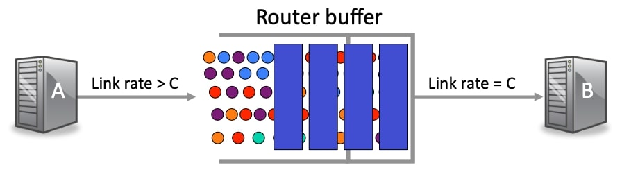
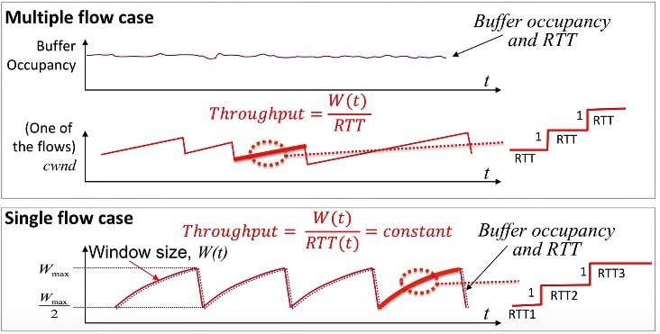

## 多流的AIMD

### 回顾

在上一段视频中，我解释了在网络中只有一个流的特殊情况下，AIMD算法是如何控制拥堵的，正如你所记得的，AIMD是加法增加乘法减少的简称，它通过控制窗口大小来控制拥堵，因此它控制了网络中未处理分组的数量。虽然经常听到有人说AIMD控制了分组的发送速度，但严格来说并不是这样的，你会经常听到这个错误，但AIMD所做的就是控制网络中未处理分组的数量。这一点真的很重要，要记住当网络是空闲，不拥挤的时候，网络中有空间让流量发送更多的分组，有更多未处理的未确认的分组。但当网络中的分组满了，而且很拥挤时，我们必须减少流量中未处理的分组的数量，这样我们就不会使缓冲区过满，因为缓冲区是保存数据的地方，如果我们过载，当然就会丢弃分组，因为这是它唯一能控制的东西。

单一流量案例帮助我们理解了AIMD的基本原理，特别是帮助我们理解了网络中只有一个主导流量的情况，例如在你的家庭网络中，当你正在播放流媒体视频时。但在互联网的疯狂荒野中，一个路由器在同一时间有数千个甚至一百万个流量通过是非常常见的，这种情况与单一主导流量的简单情况相去甚远，你会认为当有这么多流量时，AIMD的动态变化会非常不同，你是对的，当一个网络同时承载许多流量时，网络动态是非常不同的。因此，在这段视频中，我将解释AIMD在一个有多个流量的网络中是如何工作的。

### 单流 vs 多流

在图片中，我用不同的颜色表示来自不同流量的分组，Powerpoint中没有足够的颜色来显示所有不同的流量，但你可以立即看到，属于任何一个单独流量的分组只占缓冲区中所有分组的一小部分，偶尔有一个分组到达时发现缓冲区满了，分组被丢弃，流将把窗口大小减半。系统中有这么多流，你可以看到流将经历分组丢弃，这几乎是随机的，只是取决于一个流的分组何时碰巧到达并发现缓冲区满了，大多数时候缓冲区不会满，但只是偶尔一个流不走运，其分组到达时缓冲区已满。

请记住，每个流都遵循自己独立的AIMD锯齿过程，当一个流的分组被丢掉时，该流将把它的窗口大小减半，但所有其他流都不受影响，它们将继续愉快地增加它们的窗口大小，直到它们也被丢掉为止，流越多，队列的占用就越平滑，每个流都会经历偶尔的随机丢弃，如果我们放大任何一个单独的流，正如我在这里用红色做的，那么你可以看到，它仍然遵循AIMD锯齿形，但掉包会在随机的时间发生，因为它真的取决于流何时碰巧遇到掉包，并将其窗口大小减半。

这是一个非常重要的观点，要记住，当有许多流量时，认为往返时间基本不变是非常合理的，当一个分组掉包时，会有小的波动，但其余时间，拥挤的缓冲区是满的。

因此，我们可以假设通过拥堵路由器的分组的RTT保持不变，这意味着一个流的吞吐量在每个周期都等于其窗口大小除以RTT，将与窗口大小成正比。我们可以准确地说，吞吐量等于窗口大小除以RTT，但在单流情况下，窗口大小与RTT同步移动，而在多流情况下，窗口大小不同，但RTT保持不变。还有一件事我要指出，在图片中，你可能已经注意到我在这段视频中画的锯齿有点不同，当我在单流情况下画它时，上边缘是弯曲的，因为RTT随着窗口大小增加；当我们有多个流时，我们可以假设RTT是恒定的，所以每个水平步长是相同的，锯齿是一个有直边的三角形。

### 简单几何直觉

我现在要向大家展示吞吐量和RTT以及丢包概率之间简单直观的几何关系。 这里是我们熟悉的AIMD模型，显示了锯齿状的加法增加和乘法减少。

假设我们已经进入了AIMD阶段，每次窗口大小达到$$W_{\max}$$时，缓冲区就会填满，一个分组被丢掉，窗口大小变成$$W_{\max}/2$$，记住在锯齿状的每个峰值都有一个分组丢弃，导致窗口大小减半。

第一个观察结果是，这里显示的阴影区域告诉我们在两个连续丢包之间的一个周期内我们发送了多少个分组，这条线实际上是一个窗口大小的阶梯函数，窗口大小每增加一步，阴影区域的宽度是RTT乘以$$W_{\max}/2$$，因为窗口大小从$$W_{\max}/2$$回到$$W_{\max}$$需要两个步骤。

再次记住，我们假设RTT是一个常数，因为网络中有大量的流，阴影区域的高度是$$W_{\max}$$，因此面积A是$$\frac 3 8 W_{\max}^2$$倍，考虑它的一种方法是利用梯形面积计算公式(见计算说明)。

现在我们知道$$A$$，我们可以写一个吞吐量的表达式，因为我们知道，在每$$\frac {W_{\max}} 2 \times  RTT$$秒(梯形的高)发送一个字节，吞吐量等于$$R=\frac{A}{\left(\frac{W_{\max }}{2}\right) R T T}=\sqrt{\frac{3}{2}} \frac{1}{R T T \sqrt{p}}$$。

计算说明：

梯形的上底为$$W_{\max}/2$$，下底为$$W_{\max}$$，由于每RTT窗口增加$$1$$，所以梯形的高为$$h=\frac{W_{\max}-W_{\max}/2}{1}=W_{\max}/2$$(单位为RTT)，所以梯形面积为：
$$
S=  \frac{(W_{\max}/2 + W_{\max})W_{\max}/2}{2}=\frac{3}{8}W_{\max}^2
$$

### 解释公式

在实际中，我们不知道$$W_{\max}$$是什么，但因为我们知道$$A$$是$$P$$的函数，我们可以把$$P$$代入方程，最后我们得到一个速率方程，看起来像这样：
$$
R=\sqrt{\frac{3}{2}} \frac{1}{R T T \sqrt{p}}
$$
所以看一下这个公式，它不仅仅是一个方程，它告诉我们一些关于AIMD的特性，当我们有大量的流量时，它告诉我们：

首先，一个流所经历的速率与它的RTT成反比，换句话说，RTT越大，速率越低，这意味着当我们与一个更远的服务器通信时，我们可以期待一个更低的速率，这不是我们希望从一个拥塞控制算法中得到的属性，我们不一定希望惩罚更远的流，所以这通常被认为是AIMD的一个弱点。

关于吞吐量方程，需要注意的第二件事是吞吐量对掉线概率也非常敏感，是$$\frac 1 {\sqrt p}$$。这也可能看起来有点矛盾，如果掉线率为0，这是否意味着速率为无穷大？但是这正是AIMD所做的，如果没有掉线，窗口大小将一直不断增长，将趋于无穷大，换句话说，发送方不会中断，它将始终以尽可能快的速度发送。

这证实了我们已经知道的事实，即丢包是AIMD拥堵控制工作的一个重要部分，丢包向发送方表明窗口大小开得太大，网络中有太多未处理的分组，我们需要将其减少。

### 小结

这就是拥塞控制的全部内容，所以综上所述，我们目前对AIMD有什么了解？

到目前为止，我们已经了解到AIMD流的吞吐量对掉包概率很敏感，对RTT也非常敏感。我们已经了解到，当网络承载许多流时，每个流都遵循AIMD规则，就像单个流一样，窗口会根据AIMD方程收缩和扩展，而发送方则探测它能安全地将多少字节放入管道中。我们还了解到，如果瓶颈包含属于许多不同流量的分组，那么缓冲区将一直保持高度占用，这意味着分组看到的RTT是差不多的，我们可以安全地假设在这种情况下RTT是恒定的。

现在你已经了解了AIMD，在接下来的几个视频中，你将看到它是TCP拥塞控制算法的主要机制之一。在接下来的几个视频中，我们还将学习其他一些机制，AIMD是其中之一，你将了解到TCP工具箱中还有很多其他的技巧，这些技巧多年来一直被引入，使其成为一个非常有效的拥塞控制机制。

小结：

1.  窗口根据AIMD进行扩展/收缩。
2.  探测管道可以容纳多少个字节。
3.  瓶颈将包含来自许多流量的分组。
4.  发送率随窗口大小而变化。
5.  AIMD对丢失率非常敏感。
6.  AIMD对具有长RTT的流量进行惩罚。