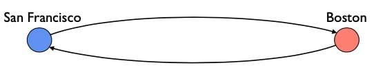
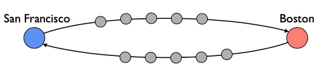
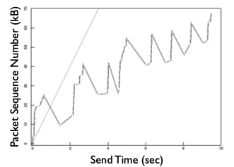
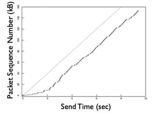
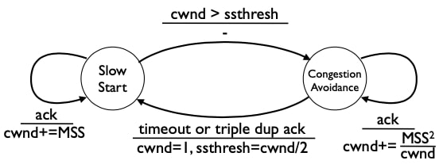
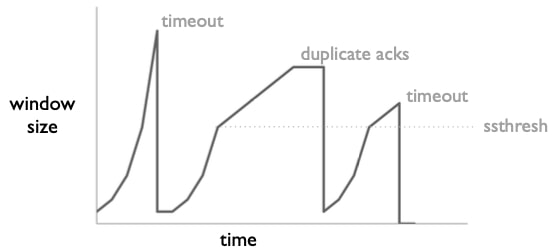

## TCP拥塞控制 I

在接下来的三个视频中，我将解释TCP的拥塞控制是如何工作的。基本的总结是，TCP使用加法增加，乘法减少(AIMD)。但关于如何实现这一点，有很多细节。TCP被认为是网络领域的一个巨大成就：它是一个可靠的、高性能的传输层，可以在巨大的网络环境中良好地运行。当然，它并不完美，但你可以从许多应用对它的依赖程度上看到它的优势。在这段视频中，我将解释TCP如何使用一个简单的有限状态机来控制它在网络中的分组数量，这个有限状态机实现了AIMD，以及处理启动连接和重大网络中断。

### 拥塞控制动机

因此，回顾一下，拥塞控制是指网络协议或系统如何在两个端点之间避免网络过载。假设我们正在旧金山和波士顿之间传输数据，这两个端点之间有许多路由器，每个都有自己的队列和流量负载。

如果我们发送的分组低于路由所能支持的速率，我们可以期望看到相当低的分组丢弃速率：从旧金山到波士顿的大部分分组会到达，从波士顿到旧金山的大部分分组会到达。但是，如果我们发送的分组超过了路由所能支持的数量，那么它们就会被从队列中丢弃。发送方需要以某种方式检测这个分组是否丢失，并重新传输它，这需要时间并降低性能。

因此，拥塞控制的目的是控制发送方在网络上有多少个未完成的分组。目标是尽可能多地发送网络支持的分组，但不能发送更多：发送更多的分组会导致队列填满并丢弃分组。在高层次上，这似乎很简单。正如我们将看到的，使其变得困难的是，在TCP的情况下，发送方对网络的内部状态的信息非常有限，因此必须从这些有限的信号中推断出损失。

所以拥塞控制的作用是：限制未完成的数据，使其不会阻塞网络，提高整体性能。

### TCP和AIMD

基本的总结是，在其稳定状态下，TCP使用AIMD，它维护一个称为拥塞窗口的变量，拥塞窗口规定了该连接在网络中可以有多少个未被确认的段。当发送方收到确认信息时，这些信息表明段已经离开了网络，因此它可以发送更多：每一个往返时间(RTT)，TCP将拥塞窗口的大小增加1，这就是AIMD的加法增加。当TCP检测到分组丢失时，它将拥塞窗口减半，或者在某些情况下将其设置为1段。

到目前为止，我们已经解释了拥塞控制是一个清晰而明显的问题，而AIMD是一个简单而高效的算法来管理拥塞。但这并不是从一开始就实现的。我将介绍一下TCP如何演变为使用AIMD的历史。这是一个伟大的故事——互联网崩溃了，变得无法使用了! 为了应对这次崩溃，一些研究人员想出了AIMD。我将确切地解释它是如何工作的。

概要：

- TCP使用加法增加，乘法减少(AIMD) ；
  - 保持一个拥塞窗口，即对可以发送多少个未确认的分段的估计；
  - 每一个RTT增加一段的拥塞窗口；
  - 检测到丢失时将拥塞窗口减半(或更多) ；
- 关于为什么(互联网崩溃)的一点历史；
- 解释它如何实现和实施AIMD；

### TCP历史

这是TCP的早期简史。在70年代中后期，Vint Cerf和其他人开发了用于建立连接的三次握手，并将TCP分成了我们今天所知的两层，网络层的IP和传输层的TCP。1983年1月1日，整个APRAnet转为TCP/IP。三年后，即1986年，互联网开始遭受"拥塞崩溃"的困扰。随着TCP流开始使链路饱和，路由器丢弃分组。但是，TCP对这些丢弃的分组没有很好的响应，TCP大部分时间都在重传已经成功到达的分组，继续浪费这些饱和链接的容量。这使得分组丢失率居高不下，新的数据段经常被丢弃，因此应用程序看到的数据率非常低。网络正在疯狂地努力工作，发送浪费的数据段，这就创造了"拥塞崩溃"这个术语：网络被严重拥塞，但应用程序看不到任何有用的工作正在进行。

在1987-8年，Van Jacobson研究了发生的情况并修复了TCP，发表了具有开创性的TCP论文，其算法是今天所有TCP实现的基础。这个版本的TCP被称为TCP Tahoe，以其打包时使用的BSD UNIX的特定版本命名。两年后，一些进一步的改进被添加到TCP中，其版本称为TCP Reno。现代TCP层在TCP Reno的基础上增加了一些复杂性，以适应现代网络速度，但其核心是TCP Reno。

小结：

- 1974年：3次握手；
- 1978年：TCP和IP分为TCP/IP；
- 1983年：1月1日，ARPAnet切换到TCP/IP；
- 1986年：互联网开始遭受拥塞崩溃；
- 1987-8年：Van Jacobson修复了TCP，发表了开创性的TCP论文(Tahoe) ；
- 1990年：增加了快速恢复功能(Reno)；

### 三个问题

我们可以把TCP归结为三个问题：

- 什么时候发送新数据？
- 什么时候应该发送数据重传？
- 什么时候应该发送确认信息？

#### 什么时候发送新数据？

在本视频中，我将解释第一个问题的答案：TCP何时应该发送新数据？我将在下一个视频中解释后两个问题的答案，关于RTT估计和自时钟。

#### Tahoe前的TCP

请记住，TCP在其报头有一个"窗口"字段，连接的一端用它来告诉另一端其流控窗口的大小。TCP规范规定，TCP发送方不应该发送超过最后一个确认字节加上流量控制窗口大小的数据。流量控制确保发送方不会发送接收方无法处理的数据。

原始版本的TCP一旦完成三次握手，就会发送一个完整的分段窗口。因此，如果一个发送方收到一个40千字节的流量控制窗口，并且有40千字节要发送，它将立即发送价值40千字节的分段。然后，它将为每个分组启动一个重传计时器。如果定时器启动，而该段还没有被确认，TCP将重新发送它。随着确认的到来，当确认数和窗口字段的总和表明接收方可以处理更多的数据时，它们可以推进发送方的窗口。

如果窗口比网络所能支持的大得多，这就变成了一个问题。例如，假设两个端点之间的瓶颈链路只能排入几个分组。握手完成后，发送方立即发送了30个或更多的分组。在前几个填满瓶颈队列后，其余的将被丢弃。

#### 1986年的TCP

这正是观察到的情况。这张图来自建立TCP拥塞控制机制的重要论文，X轴显示时间，以秒为单位，Y轴显示的是段序号，即TCP传输的段数。一条向右上的线意味着TCP正在发送更多的数据，而一条向右下的线意味着有一个重传，因为TCP正在发送一个较旧的序列号。

两个Y值相同但X值不同的点表示重传。斜线表示可用的带宽，大约是每秒20k比特，那时的网络要慢得多。如果TCP表现良好，我们会看到暗线跟着这条亮线，填补可用带宽。

但这不是我们所看到的。相反，我们在这幅图中看到的是，TCP立即发送了大量的分段，远远超过了网络能够处理的范围。然后，它等待了将近一秒钟，直到超时导致它重传一个分组，之后又重传一个分组。然后，随着窗口的扩大，它又发送了一连串的数据段，其中一些又被丢失。这种参差不齐的模式意味着TCP几乎从它发送的每一次突然发送中都会丢失分组，而且线的整体斜率远远低于20kbps的容量。

#### 三大改进

因此，TCP Tahoe增加了三项改进，以正确控制拥塞：拥塞窗口、更好的超时估计和自时钟。在本视频的其余部分，我将一一介绍：

##### 拥塞窗口(TCP Tahoe)

TCP Tahoe增加的第一个改进是称为拥塞窗口。

回顾一下，流量控制是关于一个端点可以处理的内容：TCP不会发送超过流控窗口所规定的数据。但是，如果端点能够处理的数据比网络能够处理的多呢？流量控制窗口只是发送应该发送多少数据的一个上限，为了获得良好的性能，它可能应该发送更少的数据。

因此，TCP Tahoe为网络估计了一个叫做拥塞窗口的东西。它的发送窗口是流量窗口和拥塞窗口的最小值。不要发送超过对方可以处理的数量，也不要发送超过网络可以处理的数量。为了管理这个拥塞窗口，TCP将拥塞控制分为两种状态，称为慢速启动和拥塞避免。在稳定状态下，TCP处于拥塞避免状态，在这种状态下，遵循AIMD策略。当一个连接启动或有一个分组超时时，TCP处于慢速启动状态，它不遵循AIMD策略。

小结：

- 流量控制窗口只与端点有关；
- 让TCP为网络估计一个拥塞窗口；
- 发送方窗口=min(flow window, congestion window) ；
- 将拥塞控制分为两种状态
  - 缓慢启动：在连接启动或分组超时时
  - 拥塞避免：稳定运行

##### 慢速启动的好处

思考避免拥塞和缓慢启动的工作方式是以它们增加拥塞窗口的程度为标准。当TCP进入慢启动状态时，它的拥塞窗口是最大段大小，MSS，或一个分组。每次它接收到一个新的确认，即一个确认段，该确认段确认以前未确认的数据，TCP就会将拥塞窗口增加一个MSS。

这种慢速启动的策略意味着拥塞窗口以指数方式增长。它发送了一个段。当它收到一个确认时，它将拥塞窗口增加到两个MSS，并发送两个新段。当它收到这些段的确认时，它将拥塞窗口增加到四个MSS(每个确认一个)并发送四个新段。

"慢速启动"这个名字似乎有点误导性，指数式增长比加法式增长快得多。但它之所以被称为慢速启动，是因为与TCP使用的旧方法(立即发送整个窗口)相比，它的速度很慢。

小结：

- 慢速启动
  - 窗口从最大段大小(MSS)开始；
  - 对每个确认的分组按MSS增加窗口；
- 按指数增长拥塞窗口以感知网络容量 ；
- 比之前的方法"慢"；

##### 拥塞避免

- 慢速启动
  - 每次确认时按MSS增加拥塞窗口
  - 指数增加
- 拥塞避免
  - 每次确认时按MSS^2/拥塞窗口增加
  - 行为：每次往返时间按MSS增加 
  - 线性(加法)增加

在避免拥塞状态下，TCP增加窗口的速度要慢得多，与AIMD相似。它以MSS的平方除以每次确认的拥塞窗口来增加窗口。假设没有分组被丢弃，这导致TCP在每个往返时间增加一个MSS的拥塞窗口。

如果有$$N$$个未完成的段，每个确认应该增加我们所期望的拥塞窗口的$$1/N$$，以字节为单位，这意味着MSS/拥塞窗口。由于我们希望增加的是MSS，这意味着每次确认都会使窗口增加MSS倍(MSS除以拥塞窗口)。

所以这就是AIMD的加法增加部分。

#### 状态转换

所以我们有这两种状态。第一种，缓慢启动，允许TCP快速找到可用的网络容量。例如，假设网络可以支持40个分组的拥塞窗口：等待40个往返时间来达到这个值会花费太长时间。

但是，当我们接近网络容量时，我们希望使用拥塞回避来更仔细地探测，使用加法增加。

那么，我们如何选择在这两种状态之间转换呢？TCP有三种信号可供选择。递增的确认意味着传输进展顺利。由于TCP使用累积的确认，重复的确认意味着一个网段丢失或延迟，但其他网段正在成功到达。最后，如果出现了超时，那就说明出了大问题。

#### TCP Tahoe FSM

所以这就是TCP状态机的样子。一个连接开始时处于慢速启动状态。从那里开始，每当它收到一个确认，它都会将拥塞窗口cwnd增加一个MSS。它会如此增加拥塞窗口，直到它通过一个叫做ssthresh的阈值，即慢启动阈值。当拥塞窗口增长超过这个阈值时，TCP就会转入避免拥塞状态。在避免拥塞状态下，它更保守地增加拥塞窗口，每个往返时间增加一个MSS。

在超时或出现三次重复确认时，TCP会过渡到慢速启动状态。TCP推断，三个重复的确认(因此有4个相同的确认)是下一个网段丢失的有力证据。接收方继续接收段，但不能转发确认数，因为它缺少一段。当TCP过渡到慢启动状态时，它将ssthresh变量设置为拥塞窗口的一半。因此，在分组丢失时，TCP进入慢速启动状态，然后是AIMD。

#### TCP Tahoe 行为

该图显示了一个TCP Tahoe拥塞窗口随时间变化的例子。它从一个MSS的大小开始，并以指数形式增加。第一次下降是对超时的反应。因此，窗口被返回到MSS，并再次开始以指数形式爬升，直到它达到其原始值的一半，在这一点上它开始加法增长。它一直在增长，直到一个网段丢失，并且有三个重复的确认(窗口不会因为这些重复的ACKS而增加)。然后，它再次下降到一个MSS，在缓慢启动后呈指数级增长，直到它达到ssthresh，然后再次开始加法增长。

如果你仔细观察，ssthresh在TCP返回慢速启动时都是相同的值，因为它在相同的窗口大小下过渡到拥塞避免。对于这个简单的图，出现这种情况是因为我以MSS的整数倍计算ssthresh，在这两种情况下它都四舍五入到同一个值。

请注意，TCP Tahoe并没有严格使用AIMD来管理拥塞。虽然AIMD是一种管理稳定状态或稳定网络的优秀算法，但在实际中，TCP必须处理更广泛的条件，如启动、丢失突发分组的瞬时网络故障，以及可用带宽的突然变化。

因此，回顾这三个问题：TCP何时发送新数据，何时重传数据，以及何时确认数据。这就是对第一个问题的回答。TCP在其发送方窗口(定义为其拥塞窗口和流量控制窗口的最小值)允许时发送新数据。拥塞窗口是发送方根据其观察到的确认和超时而保持的一个值。