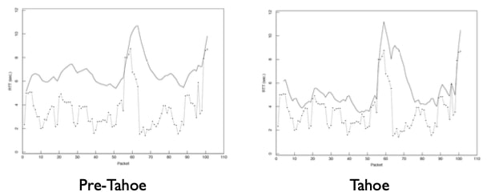

## TCP拥塞控制 II

记得TCP Tahoe做了三个主要改进，解决了互联网遇到的拥塞崩溃问题。在之前的视频中，我谈到了它如何将拥塞窗口纳入其两种运行状态，即慢速启动和拥塞避免。在这段视频中，我将解释另外两种机制，即RTT估计和自时钟。

### 你应该何时发送数据重传？

回顾一下，一个TCP的实现可以归结为三个问题。第一个问题是你应该何时发送新的数据？TCP的答案是在网络拥塞时使用拥塞窗口来限制其传输。接下来，我们来回答第二个问题：TCP何时应该重传数据？

### 超时估计

事实证明，很好地估计重传超时会对TCP的行为产生重大影响。选择过长的超时将导致TCP停滞，等待确认。选择太短的超时将导致TCP过于激进地退出，进入慢速启动状态。因此，TCP Tahoe对超时估计进行了一些改进。这些改进被证明是网络系统中估计噪声信号的一种很好的方法，所以学习它们可以为设计其他协议提供指导。

### 超时

由于TCP过渡到慢速启动状态并在超时时进行重传，因此有一个好的超时值是至关重要的。如果往返时间是一个常数，那么最佳的重传超时只比往返时间大一点点，因为一个成功收到的分组的确认应该在分组传输后花费一个RTT。但往返时间不是恒定的，它们可以是高度动态的。此外，它们可以随着负载的变化而显著变化。当一个流量更快地发送片段时，它可能开始填补沿途的队列，从而增加RTT。来自其他源的突发流量也会改变排队延迟。在所有这些噪音中，我们需要一种稳健的方法来估计分组丢失之前的时间。

小结：

- 往返时间(RTT)的估计对超时至关重要
  - 太短：因重新传输而浪费容量，引发缓慢启动
  - 太长：浪费空闲时间容量
- 挑战：RTT是高度动态的
- 挑战：RTT可以随负载的变化而显著变化

### Tahoe之前的超时

在TCP Tahoe之前，TCP一直跟踪一个单一的变量$$r$$，即它的RTT估计。每次它收到一个新的确认，它将根据RTT的测量值$$m$$估计出$$r$$，估计方式为$$r = \alpha r + (1-\alpha )m$$。如果在$$2r$$之后没有确认，TCP就认为该段丢失，并触发重传。

那么，这种方法有什么问题呢？

基本问题是，它假设RTT测量值的方差是其值的常数因子。例如，想象一下，你有一个具有高、低方差延迟的路径。例如，你有一条横跨海底的未被充分利用的链路。即使RTT是80ms，99.99%的RTT在80到81ms之间，TCP也会在触发重传定时器之前等待160ms，这几乎是浪费了一整个RTT。

或者想象一下相反的情况，平均RTT是20ms，但它的方差非常大，这样的RTT有时高达80ms。尽管有相当一部分分组的RTT很高，但TCP会认为这些分组是丢失的，将其拥塞窗口缩小到1，并重新传输。

### TCP Tahoe超时

所以TCP Tahoe在其重传超时中加入了对RTT变化的估计。它像以前一样保持着RTT估计值的指数加权移动平均值。它还测量测量值与估计值的差异程度，也就是估计值与最近的测量值之间的误差$$e=m-r$$，其中$$m$$是最近一次接受的分组的RTT测量值。它也对这一差异应用指数加权平均，即$$v$$，更新方式为$$v = v + g(|e| - v)$$。它计算出的超时是RTT估计值加上四倍的方差($$=r+\beta v, \beta=4$$)。因此，如果连接有一个非常稳定的RTT，超时将只比平均RTT略大。但如果RTT有很大的变化，TCP将选择一个大得多的超时。

如果重传失败，也就是没有被确认，那么就用一个指数级增长的定时器再次重传。TCP认为这意味着有巨大的拥塞，所以通过增加段之间的时间间隔继续其乘性减少。

这两个值，$$g$$和$$\beta$$，是经过一番实验后选定的。这种方法对它们的轻微变化具有相当的稳定性。它们背后没有任何特殊的魔力，它们只是在实际中倾向于良好的工作。

### RTT估算的改进

这里有两张取自TCP拥塞控制论文的图。这两张图显示了TCP观察到的RTT，即底部带有数据点的浅色线，以及TCP保持的超时估计值，即顶部的暗线。TCP在Tahoe之前是非常保守的：测量值和超时值之间的巨大差距代表了TCP在重传时花费的时间太长而浪费的时间。另外，在分组60左右，当RTT向上飙升时，pre-Tahoe会不必要地重传并进入慢速启动。

相比之下，右图所示的TCP Tahoe的RTT估计更接近RTT值。所以现在我们已经回答了第二个问题：TCP何时重传数据？

从中得到的教训是，当人们需要估计网络协议中的重传或重试计时器时，不仅要考虑观察到的往返时间，还要考虑它的变化。

### 你应该何时发送确认？

所以现在我们来到了第三个问题：TCP应该何时发送确认？

### 自时钟

事实证明，答案通常是"尽可能地减少延迟"。如果TCP遵循这一策略，它就会导致一个非常重要和强大的行为，即自时钟。

自时钟意味着，如果TCP积极地发送确认，那么它们将根据瓶颈链路的吞吐量在时间上留出空间。发送方将收到随时间间隔的确认。由于发送方将在其发送方窗口前进时立即发送新数据，这意味着它将以瓶颈链路可以支持的速率发送段。

该图直观地显示了这种行为。网络的吞吐量显示为路径的宽度，而时间显示为路径在时间上的长度。在肥胖的高带宽链路上发送的分组需要少量时间。这些相同的分组，在低带宽链路上发送，有较长的传输和排队延迟，因此需要更多时间。当它们从瓶颈链路中出发，它们又会很快，但在时间上的间隔是根据它们离开瓶颈的速度而定的。由于确认分组很小，并且假设瓶颈不在反向路径上，这意味着确认将以大约它们穿越瓶颈链路的速度到达发送方。

这种策略还有一个好处：TCP只有在收到确认时才会将新的分组放入网络，也就是说，当其现有的一个分组离开网络时，才会将其放入网络。从拥塞的角度来看，这意味着TCP在保持未处理分组的数量，也就是它对网络中队列和容量的利用率稳定。

### 自时钟原则

因此，自时钟原理意味着TCP在收到分组后立即主动发送确认。这是为了向发送方发出信号，表明数据已离开网络，并为其提供RTT估计，并允许其自时钟传输。

### 小结

总之，TCP Tahoe引入了三种主要机制，使其能够有效地管理拥塞，并在繁忙的网络中获得良好的性能：

- 首先，它引入了一个拥塞窗口，并维护一个类似AIMD的状态机，在慢启动和拥塞避免状态之间进行转换，此状态机控制拥塞窗口的更新方式。
- 第二，它使用指数加权移动平均和方差计算重传计时器，从而减少误报和误报。
- 最后，通过积极地发送确认，它会对数据传输进行自动计时，以匹配瓶颈链路的速度。