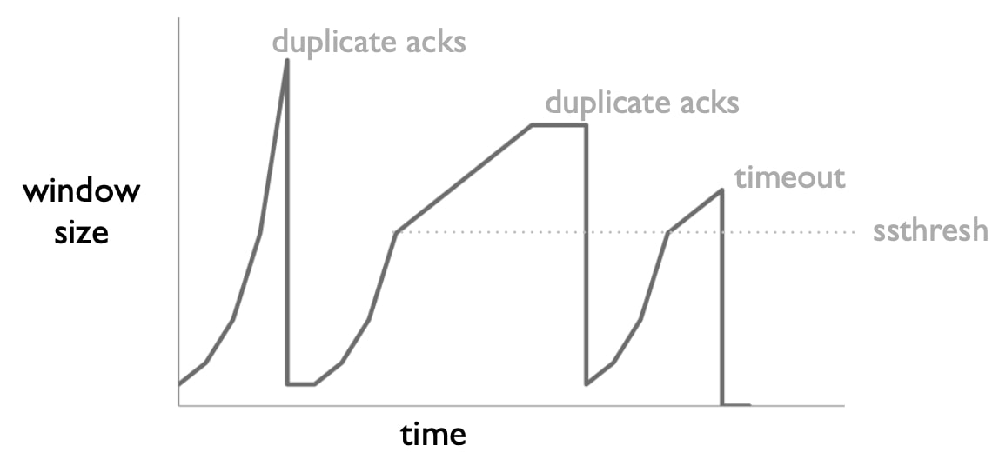
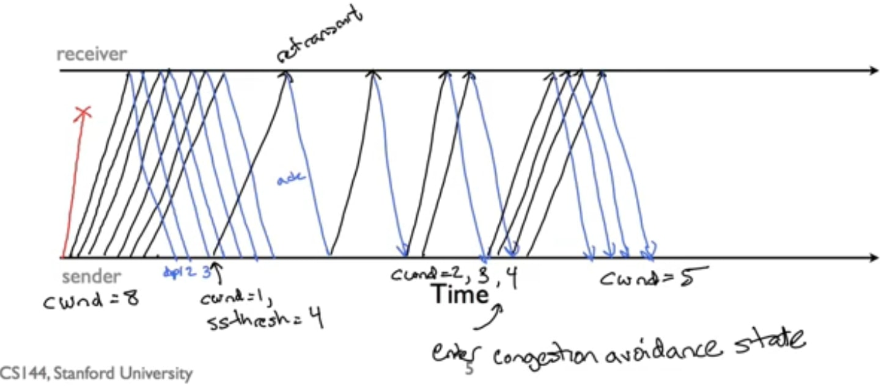
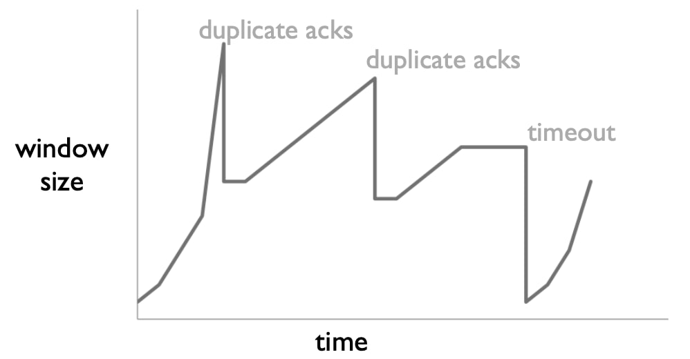
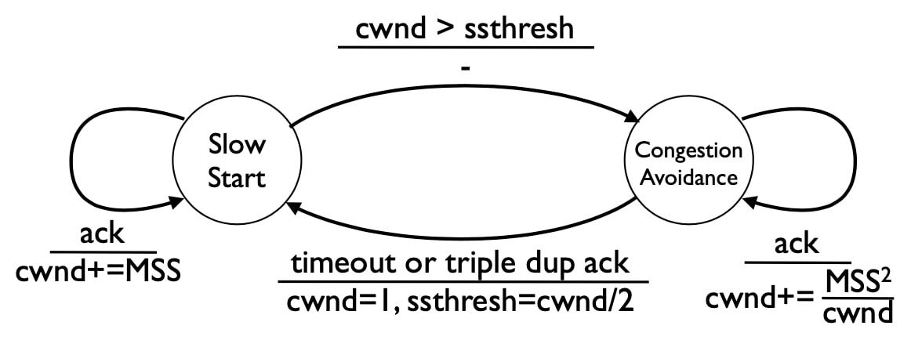
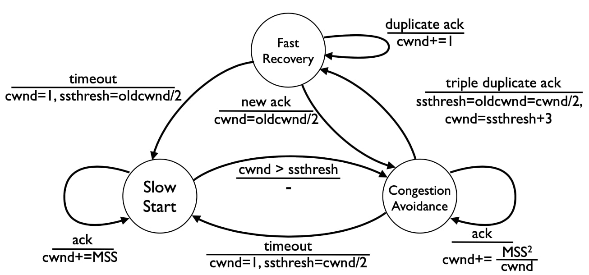
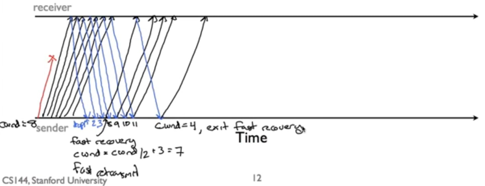

## TCP拥塞控制 III

在这个视频中，我将谈论TCP的两个性能改进：快速重传和快速恢复。

### 三种机制 

除了拥塞避免状态、改进的RTT估计和自计时，TCP还使用了另外三种机制。这些机制通过软化其对丢包的反应来提高TCP的性能。回顾一下，TCP Tahoe的机制导致它的行为比AIMD更保守。如果一个分组丢失了，TCP Tahoe会下降到慢速启动状态，这时它会以指数形式增加拥塞窗口，直到ssthresh。在这一点上，它进入了加法增加的状态。

第一种机制，称为快速重传，是TCP Tahoe的一部分。如果一个TCP Tahoe发送方收到3个重复的确认(所以4个相同序列号的确认)，它假定下一段丢失，并立即重传，而不等待超时。假设这次重传成功，这就减少了发送方收到确认之前的延迟，并可以将发送窗口向前移动以发送新数据。TCP Tahoe将这些3次重复的确认视为损失，并将拥塞窗口设置为1，下降到慢速启动状态。

TCP Reno增加了第二种算法，称为快速恢复，它有两种机制。第一个机制是，当通过3次重复确认检测到丢失时，TCP Reno不会将拥塞窗口设置为1并进入慢启动状态。相反，它将拥塞窗口减半。由于ssthresh被设置为拥塞窗口的一半，这意味着TCP Reno不会退出拥塞避免状态。使用这种算法，TCP Reno在没有超时的稳定状态下，遵循AIMD策略。在丢失时，它的拥塞窗口减半，乘法减少，并使用加法增加。在超时时，TCP Reno的行为与TCP Tahoe一样，将拥塞窗口设置为1。

TCP Reno增加的第二个机制是，当处于快速恢复状态时，它为每个重复的确认"膨胀"拥塞窗口1。这是为了防止出现这样的问题：在发生单一损失的情况下，TCP无法在一个完整的往返时间内发送数据，因为它在等待确认以推进其发送窗口。由于每个重复的确认意味着一个网段已经成功离开了网络，因此理论上TCP可以在不阻塞网络的情况下发送一个新网段。

假设旧的拥塞窗口大小为$$c$$。通过为每个重复的确认增加1个拥塞窗口，拥塞窗口从$$c/2$$快速恢复，增长到$$c+c/2$$，或$$3c/2$$。这意味着对于$$c/2$$到c的确认，TCP可以发送一个新的网段，因为拥塞窗口已经进一步向前推进。一旦TCP收到一个新的确认，它就会将拥塞窗口重置为正确的值，即$$c/2$$。

小结：

- 快速重传(TCP Tahoe)：如果收到3个重复的确认，不要等待超时来重新传输丢失的段。
  - 只有在超时时才回落到慢速启动状态。 
- 快速恢复(TCP Reno)：在3次重复确认时将拥塞窗口减半(不要设置为1)。
- 快速恢复(TCP Reno)：在快速恢复状态下，随着确认的到来，增加拥塞窗口，以保持数据流动 
  - 每个重复的确认会增加拥塞窗口1
  - 如果旧窗口是$$c$$，那么新窗口是$$c/2$$
  - 收到$$c$$个确认会将窗口大小增加到$$3c/2$$
    - 可以发送$$c/2$$个新片段

### TCP Tahoe

因此，让我们把这些放在一起。

TCP Tahoe，当它有一个超时或三次重复确认时，采取3个步骤。首先，它将ssthresh设置为拥塞窗口的一半。第二，它将拥塞窗口设为1。第三，它重传丢失的段。

这前两个步骤意味着它进入慢速启动状态，并以指数形式增加其拥塞窗口，直到它遇到另一个损失或达到ssthresh。

具体流程如下：

- 在超时或三次重复确认(意味着丢失分组)时 
  - 设置阈值为拥塞窗口/2
  - 设置拥塞窗口为1
  - 重发丢失的段(三次重复ACK时快速重发)
  - 进入慢速启动状态

### TCP Tahoe行为

该图显示了一个TCP Tahoe拥塞窗口随时间变化的例子。它从一个MSS的大小开始，并以指数形式增加。它观察到了一个3次的重复ACK。因此，窗口被返回到MSS，并开始以指数形式再次攀升，直到它达到其原始值的一半，在这一点上它开始加法增长。它一直在增长，直到有一个网段丢失，并且有3次重复的确认(窗口不会因为这些重复的ACK而增加)。然后，它再次下降到一个MSS，在缓慢启动后呈指数级增长，直到它达到ssthresh，然后再次开始加法增长。

如果你仔细观察，ssthresh在TCP返回慢速启动时都是相同的值，因为它在相同的窗口大小下过渡到拥塞避免。对于这个简单的图，出现这种情况是因为我以MSS的整数计算ssthresh，在这两种情况下它都四舍五入到同一个值。

请注意，TCP Tahoe并没有严格使用AIMD来管理拥塞。虽然AIMD是一种管理稳定状态或稳定网络的优秀算法，但在实践中，TCP必须处理更广泛的条件，如启动、丢失突发分组的瞬时网络故障，以及可用带宽的突然变化。

因此，回顾这三个问题：TCP何时发送新数据，何时重传数据，以及何时确认数据。这就是对第一个问题的回答。TCP在其发送方窗口(定义为其拥塞窗口和流量控制窗口的最小值)允许时发送新数据。拥塞窗口是发送方根据其观察到的确认和超时而保持的一个值。

### TCP Tahoe演示

现在让我们来看看TCP Tahoe在遇到三次重复确认时做了什么。假设拥塞窗口是8MSS，并且有一个网段丢失。TCP将收到总共7个重复的确认。在第三个重复确认后，它重传丢失的网段，将拥塞窗口设置为1MSS，ssthresh设置为4。 当它收到重传的ACK时，它发送一个新网段。当它收到该段的ACK时，它将其拥塞窗口增加到2。当它收到这两个段的ACK时，它将其拥塞窗口增加到3，然后是4。当达到4时，它就进入了拥塞避免状态。因此，接下来的4个ACK将使拥塞窗口只增加一个MSS。

这就是TCP Tahoe。

### TCP Reno

TCP Reno的行为与TCP Tahoe在超时时的行为相同。在出现三次重复ACK时，它执行快速重传，立即发送该段。它没有将拥塞窗口的大小设置为1，而是将其减半，从而保持在避免拥塞的状态。对于每个重复的确认，它将拥塞窗口扩大1，以便在重传段被确认之前发送新的段。

Reno和Tahoe的主要区别在于快速恢复。

这是一个显示TCP Reno行为的图。它从慢速启动状态开始，直到它看到一个三次重复ACKs。它将拥塞窗口减半，保持在避免拥塞状态，并执行快速重传。然后它开始使用AIMD增加拥塞窗口。在AIMD之前的平坦地带，它使用拥塞窗口膨胀来发送新的段，这里我没有显示窗口大小的膨胀。在第二个三次重复的ACK中，同样的情况发生了。它执行快速重传，将窗口减半，并保持在拥塞避免状态。在超时时，它将拥塞窗口设置为1，并重新进入慢启动状态。

小结：

- 与超时时的Tahoe相同
- 在三次重复ACK时
  - 将阈值设置为拥塞窗口/2 
  - 将拥塞窗口设置为拥塞窗口/2(快速恢复)
  - 在快速恢复时增加拥塞窗口大小(快速恢复) 
  - 重传丢失的段(快速重传)
  - 保持拥塞避免状态

### 拥塞窗口膨胀

拥塞窗口膨胀是快速恢复的一部分。以下是其工作原理的细节。当TCP Reno进入快速恢复时，它对每个重复的确认将拥塞窗口膨胀1。由于拥塞窗口被减半，这意味着拥塞窗口可以比原来的大，最多是旧值的3/2倍。这意味着发送方将发送旧的拥塞窗口除以2个新段，减去丢失段的1，几乎正好是服从AIMD所要求的数量。

小结：

- 问题：快速重传的分组需要一个完整的RTT来推进拥塞窗口
- 可能会把更多的分组放入网络
- 拥塞窗口膨胀的解决方案
  - 当处于快速恢复状态时(没有收到新的确认)，为每个重复的确认增加拥塞窗口大小1，包括最初的3 
  - 这发生在拥塞窗口大小减半之后(cwndnew = cwndold/2) 
  - 最终结果：在一个RTT之后，cwndnew是3*cwndold/2，但由于还没有新的ACK，这导致发送cwndold/2个新包

### TCP Tahoe FSM

回想一下，这是TCP Tahoe FSM，具有两种状态：慢启动和拥塞避免。

而这是完整的TCP Reno FSM。它增加了第三个状态，快速恢复。在一个三次重复的确认中，它不是过渡到慢速启动，而是过渡到快速恢复。在快速恢复状态下，当它收到一个新的确认时，它又过渡到拥塞避免状态，将拥塞窗口重置为它过渡到快速恢复状态时拥塞窗口大小的一半。在超时时，它就像在拥塞避免中一样返回到慢速启动。在收到一个重复的确认时，它将拥塞窗口增加1。

### TCP Reno演示

让我们来看看TCP Reno的行为。假设我们开始时的拥塞窗口大小为8MSS，并且一个网段被丢弃。发送方将收到7个重复的ACKs。在前三次之后，它将把拥塞窗口缩小到4，保持在避免拥塞的状态。它将把拥塞窗口扩大3，达到7MSS。在接下来的第四次重复确认中，拥塞窗口会增长到8MSS。接下来的三个确认将其增加到9，10，然后是11MSS，这样发送方就可以发送三个新的段。大约在这个时候，发送方将确认重传，其确认号码使发送窗口上升到包括所有触发重复确认的段。

在这一点上，TCP Reno将拥塞窗口放空到正确的值，即其旧值的一半。这允许TCP Reno发送一个新的网段，此时它将等待快速恢复期间发送的网段的确认。

### 拥塞控制

拥塞控制是一个非常困难的问题。回顾一下，这并不是任何人所期望的：它是早期互联网开发者和用户观察到的一种新出现的行为，为了使互联网重新运作，他们必须解决这个问题。今天TCP使用的基本方法是加法增加，乘法减少，即AIMD。但是，这其中有很多细节，比如TCP如何以及何时发送数据、重传数据和发送确认。要使AIMD在实践中良好而稳定地工作，需要解决一堆边缘情况。

今天使用的几乎所有TCP变体都以TCP Reno为核心。为了更好地应对现代网络速度，还增加了一些功能，但是当你打开一个连接到你最喜欢的网站时，你的操作系统正在使用TCP Reno，具有慢速启动、拥塞避免、快速重传和快速恢复的功能。

小结：

- 拥塞控制是稳健网络系统中最难的问题之一 
- 基本方法：加法增加，乘法减少 
- 保持管道满负荷，提高吞吐量的技巧
  - 快速重传(不要等待超时来发送丢失的数据) 
  - 拥塞窗口膨胀(不要在发送更多数据前等待一个RTT)。

