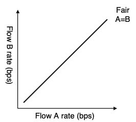
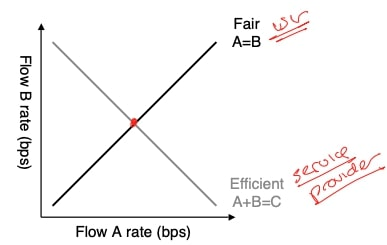
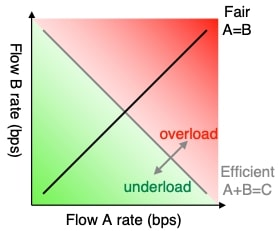
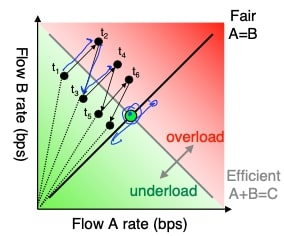

## TCP拥塞控制 IV

在关于TCP RENO的视频中，我说过加法增加乘法减少是一个非常强大和非常有效的拥塞控制机制，这个视频我试图给你一些直觉，为什么它工作得这么好，为什么它在互联网上被普遍使用。

### 拥塞控制

拥塞控制的问题是，在网络中有两个相互冲突的要求：第一个是服务提供商，他们想做的是他们想最大限度地提高他们的链路利用率，即他们希望他们的网络被完全利用，他们不希望有闲置的容量；但用户希望得到公平的额度，如果某一个用户得到了整个管道，其他用户会不高兴，然后你会失去大量客户。所以我们的想法是，你希望有一个拥塞控制的算法，使链路的运行接近利用率，但会收敛到一个点，在这个点上，每个用户(假设其他条件相同)将得到大约$$1/N$$流量。如果有终端用户的话，这样做是为了避免拥塞崩溃，使得他们仍然在传送有用的数据。

### 拥塞窗口大小

所以这些是问题的基本参数，我们希望最大限度地提高链路利用率，同时每个人都能得到公平的链路利用率，我们要确保网络不会自相争抢，那么你的拥塞窗口大小应该是多少呢？ 事实证明，最佳的拥塞窗口大小，是带宽和延迟乘积。

基本情形是这样的：假设我在旧金山和波士顿之间的带宽是每秒10兆字节，延迟是100毫秒，这意味着如果我可以支持每秒10兆字节，拥塞窗口持续100毫秒，那么我的拥塞窗口基本上应该是1兆字节，就是每秒10兆字节乘以100毫秒的乘积。 那么我应该发送大约540千字节的拥塞窗口，这是从这些值中得出的。

### Chiu Jain图

因此，现在有一种方法可以思考拥塞窗口是如何随着时间的推移而工作的，或者说拥塞是如何随着时间的推移而工作的，这就是所谓的Chiu Jain图，某篇论文第一个提出了这个想法，解释为什么AIMD是一个好的想法。

这是一个非常好的图形方法，所以我们要做的是绘制我们有两个正在竞争网络的流量，我们要绘制流量A和B的速率，这是一个散点图。现在如果网络是公平的，A将等于B，即A得到的速率将等于B得到的速率，所以散点的点应该落在这条线上。

现在，如果我们保持服务提供者的要求，因为我们实际上是以(满)容量运行网络，那么它应该是A加B，这两个流量的总和等于网络的容量。在这个设计中，我们选择一些随机的点会导致流A和流B向中心的理想点倾斜，在那里我们是公平和有效的，我们充分地利用了链路。

所以你可以显示这一点，如果我们在这条效率线的右边，这意味着我们的网络已经过载，所以分组有可能会被丢弃；如果我们在绿色区域，那么我们的网络已经欠载，所以我们希望达到这样的程度，即我们在网络容量上运行，但我们有公平的容量。

现在，我将向你展示$$t_1$$到$$t_6$$等一系列的加法增加和乘法减少的行为。因此，让我们选择这个任意点$$t_1$$，其中流B以远高于其公平份额的方式运行，而流A以远低于其公平份额的方式运行。那么将会发生什么呢？ 如果它们都处于加法增加模式，那么它们都会加法增加它们的拥塞窗口大小和流量，直到在某个时刻网络变得过载，这时它们会乘法减少它们的窗口大小，回到加法增加模式，所以这里是乘法减少，然后它们加法增加，现在因为乘法减少使B的流量比A的流量减少得多。

这使得A和B的对比图更接近公平，你可以看到$$t_3$$使这对流量更接近公平线。这就是我们所看到的，因为我们随着时间的推移通过乘法因子减少每个流量，然后随着时间的推移通过加法因子增加，它们在过载和欠载之间摇摆。

点终沿着这条线路移动，最终会接近绿色的点，总之，加法增加和乘法减少会使流量汇聚到这一点，即网络的理想平衡点。
